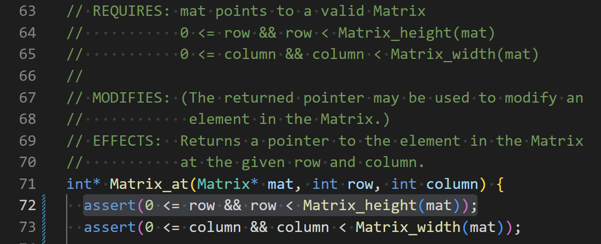
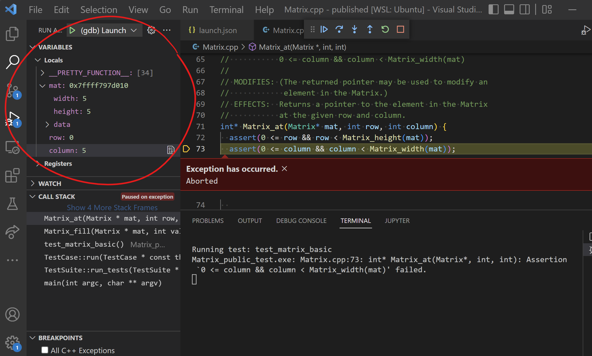
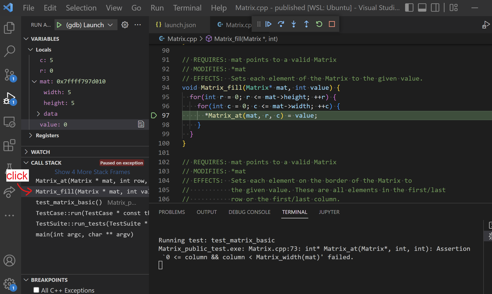

Assertions Guide
==========================
{: .primer-spec-toc-ignore }

Assertions are a preemptive debugging tool. Add them to your code to detect bugs before they cause difficult-to-debug problems later in your code. (Note that this is distinct from using assertions for unit testing.)

## Use `assert()` in your code

The `<cassert>` header defines an `assert()` macro that checks a boolean condition:
- If the condition is true, nothing happens.
- If the condition is false, the program crashes immediately.

For example:
```c++
#include <cassert>

int main() {
  int x = 2;
  int y = 5;
  assert(x + 3 == y); // true, all good :)
  assert(x > y); // false, crash!! (╯°□°)╯︵ ┻━┻
}
```
{: data-title="test.cpp" data-highlight="1,6,7" }

We might see this output when running the above:

```
test.exe: test.cpp:7: int main(): Assertion `x > y' failed.
Aborted
```
{: data-variant="no-line-numbers" }

For debugging purposes, we use `assert()` to verify our program is behaving as intended and "fail fast" otherwise so that we can get to fixing the bug.

<div class="primer-spec-callout info" markdown="1">
Assertions are intended for debugging, but you don't have manually remove them before shipping production code. They can be turned off automatically by compiling with the `-DNDEBUG` flag.
</div>

### Sanity Check

You might run into situations in your code where you think "this could
never happen" - and you're often right, unless there's a bug somewhere!
Adding assertions to "prevent the impossible" will expose such bugs.

For example, you might find that certain paths through the code are unreachable if
everything is working as expected, and you can encode this as an assertion.
Here's an example, pulled from the project 3 specification.

```c++
Player * Player_factory(const std::string &name, 
                        const std::string &strategy) {
  // We need to check the value of strategy and return 
  // the corresponding player type.
  if (strategy == "Simple") {
    // The "new" keyword dynamically allocates an object.
    return new SimplePlayer(name);
  }

  // Repeat for each other type of Player
  ...

  // Assuming we've checked for each kind of Player
  // above, the code should never get here. If we do...
  // something is very wrong and the assert lets us know!
  assert(false);
}
```
{: data-highlight="13-16" }

The `assert(false)` here is also helpful to suppress a warning the
compiler might otherwise give because it's worried our code could reach
the end of the function without returning anything. (But, with the assertion,
the end of the function can literally never be reached.)

Or, you might write code to ensure some property, like forcing a
user to enter a non-negative number. You could add an assertion
to verify the code has actually achieved that. Consider this example code:

```c++
int get_order_quantity() {
  cout << "How many items would you like to order?" << endl;

  // Get user input
  int quantity;
  cin >> quantity;

  // Prompt them again if the input was invalid
  if (quantity < 0) {
    cout << "Invalid input. Please enter a non-negative number." << endl;
    cin >> quantity;
  }

  // We should have a valid quantity after the user interaction above.
  // (Unless there's a bug somewhere - this will sanity check!)
  assert(quantity >= 0);
  return quantity;
}
```
{: data-highlight="13-15" }

That assertion proves worthwhile, since there is a bug in the code! Because
the `if` statement only checks the first input for validity, an invalid
negative input for the second `cin >> quantity` could sneak through. But,
it would be immediately caught by the assertion and is easily debugged.

### Verify Preconditions

Use assertions to verify the `REQUIRES` clause for each
function whenever possible. These are the *preconditions* that are required
for the function to have a chance of working correctly, so verifying them
up front is a good idea.


#### Example: `Matrix_at()` Preconditions
{: .primer-spec-toc-ignore }

Here's an example of assertions you could use in function that
provides access to data at a given row/column within a `Matrix` struct:

```c++
// REQUIRES: mat points to a valid Matrix
//           0 <= row && row < Matrix_height(mat)
//           0 <= column && column < Matrix_width(mat)
// EFFECTS:  Returns a pointer to the element in
//           the Matrix at the given row and column.
int* Matrix_at(Matrix* mat, int row, int column) {
  assert(0 <= row && row < mat->height);
  assert(0 <= column && column < mat->width);
  // Implementation
  // ...
}
```
{: data-highlight="1-3,7-8" }

If we were to call `Matrix_at` with parameters that are outside the
bounds of the `Matrix`, we get a failed `assert` right away and can debug
the issue. These assertions are also invaluable while debugging other code
that uses `Matrix_at` - if the assertions aren't failing, you can safely
rule out any out-of-bounds bugs and focus your attention elsewhere.

Of course, you can't assert every single thing in every `REQUIRES` clause.
Some of them can't possibly be checked. Here's another example:

```c++
// REQUIRES: mat points to a valid Matrix
//           the destination array is large enough
// EFFECTS:  Copies all data from the matrix to
//           the given destination array
void copy_matrix_to_array(const Matrix* mat, int dest[]) {
  // Verify REQUIRES clause???
  // Implementation
  // ...
}
```
{: data-highlight="2,6" }

In this case, we can't use an `assert` to verify that the destination
array is large enough, because the `int[]` array parameter decays to
an `int *` type that doesn't contain information about the size of
the original array.

### Check Invariants

The _representation invariants_ of an abstract data type (ADT) express the
conditions required for its present state to be valid. In other words,
do the member variables of a given `struct` or `class` object make sense
in terms of what it's trying to represent? For example, Some examples:
 - In a `Matrix` struct, the `width` and `height` members should be positive numbers
 - In a Euchre `Card` class, the `suit` member must be `"spades"`, `"hearts"`, `"diamonds"`, or `"clubs"`

We try to write code carefully so that the representation invariants are
set up correctly when an ADT object is created and preserved throughout
any operations on it. And we'll also rely on assuming they are true when
we write code to work with the object. We can add assertions to verify
those assumptions and fail fast if they're ever broken.

#### Example: `Matrix` ADT
{: .primer-spec-toc-ignore }

In a C-style ADT implemented with a `struct`, you can create a general helper to check invariants. For example, consider a `Matrix` ADT and a corresponding function to check its invariants:

```c++
struct Matrix {
  int width;
  int height;
  int data[MAX_MATRIX_WIDTH * MAX_MATRIX_HEIGHT];
};

// EFFECTS: Uses assertions to verify the representation invariants
//          for the given Matrix.
void Matrix_check_invariants(const Matrix* mat) {
  assert(mat); // Shouldn't be nullptr
  assert(0 < mat->width && mat->width <= MAX_MATRIX_WIDTH);
  assert(0 < mat->height && mat->height <= MAX_MATRIX_HEIGHT);
}
```

Then, call it at as needed to proactively sanity check:

```c++
// REQUIRES: mat points to a valid Matrix
// EFFECTS:  Returns a pointer to the last element (at the
//           highest possible row/column) in the Matrix.
int * Matrix_last(Matrix* mat) {
  Matrix_check_invariants(mat);
  return &mat->data[mat->height * mat->width - 1];
}
```
{: data-highlight="5" }

In the example above, you could think of this as a check on the REQUIRES
clause that specifies `mat` must point to a _valid_ `Matrix`. This keeps
us from wasting time if, for example, `Matrix_last()` appears to be broken
but the problem was really that we forgot to call `Matrix_init()` previously.

#### Project 4 Example: `List` ADT
{: .primer-spec-toc-ignore }

In a C++ style class, implement `check_invariants()` as a private member function. Call it after initializing member variables in the constructor and any time you make changes to your data representation (i.e. the member variables).


Here's an example for a complex data structure called a linked list, similar to one you implement on project 4:

```c++
class List {
private:
  // Lists contain nodes, connected in a chain using pointers
  struct Node {
    Node *next;
    Node *prev;
    int datum;
  };

  // Member variables
  Node *first;
  Node *last;
  int num_nodes;

  // Check represenation invariants with assert
  void check_invariants() {
    // Either it's empty with null first/last pointers,
    // or it's not empty and neither should be null
    assert(!first && !last || first && last);

    // There's nothing before the first node
    // and nothing after the last node.
    assert(first->prev == nullptr);
    assert(last->next == nullptr);

    // Manually counting the number of nodes matches
    // the number we're tracking in num_nodes
    int count = 0;
    for(Node *n = first; n; n = n->next) {
      ++count;
    }
    assert(count == num_nodes);
  }

public:

  // Default constructor. Creates an empty list.
  List : first(nullptr), last(nullptr), num_nodes(0) {
    check_invariants(); // ensure our list is set up
  }

  //EFFECTS:  inserts datum into the front of the list
  void push_front(const T &datum) {

    // A bunch of complicated code that rearranges
    // pointers to add a node to the list
    // ...

    check_invariants(); // make sure we didn't screw up the pointers
  }
};
```
{: data-highlight="16,39,49" }

## How to debug when an `assert()` fails

Let's say you're running `Image_public_test.exe` on project 2 and
one of your `Matrix_at()` assertions fails:

```console
$ ./Image_public_tests
Running test: test_image_basic
Image_public_test.exe: Matrix.cpp:72: int* Matrix_at(Matrix*, int, int): Assertion `0 <= row && row < Matrix_height(mat)' failed.
Aborted
```
{: data-highlight="16,39,49" data-variant="legacy" }

That's nice, but just a line number doesn't really give us much to go on:



We need more information. Let's run the code in our **visual debugger** instead. (You don't need to add breakpoints, just run it.)

It should pause when the `assert` fails so that we can inspect the state of the program and figure out why the assertion is failing. First, check the local variables:



It looks like the problem is that the `column` parameter is too large (given width 5, only 0-4 column indices are allowed). We can figure out where this is coming from by clicking on the the stack frame for the calling context, which is the `Matrix_fill()` function:



Now we can actually see the call to `Matrix_at()` that broke its REQUIRES clause. In this implementation of `Matrix_fill()`, the `c` variable is allowed to reach value `5`, which is one too large. We need to adjust the conditions on the loops to fix this.

Because we had assertions in `Matrix_at()`, it warned us right away that `Matrix_fill()` was up to no good!

