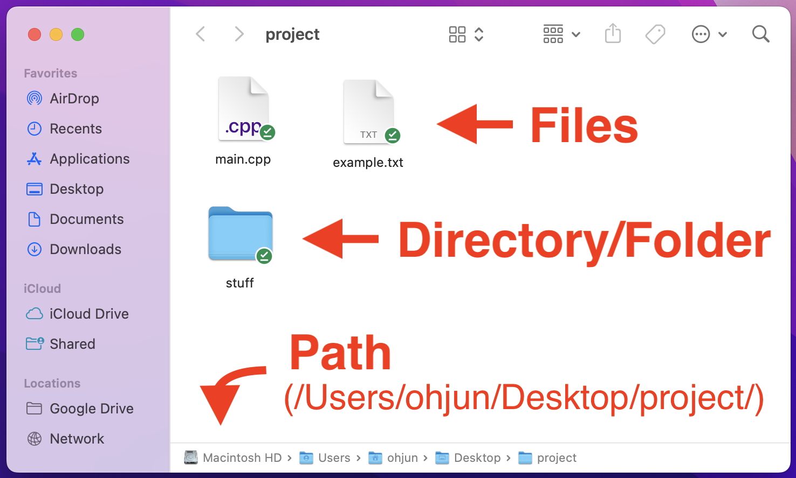

Command Line Interface (CLI)
================
{: .primer-spec-toc-ignore }

<b>GUI</b> (Graphic User Interface) is the familiar "point and click" way of interacting with a computer.

<b>CLI</b> (Command Line Interface) is an alternative way that can be faster and more flexible.

You can use the CLI by opening a <b>terminal</b> (WSL on Windows, Terminal on Mac).


## Keywords

<b>Path</b>: Location of a given file or directory in your computer.

<b>File</b>: Something that stores data.

<b>Directory</b>: Something that can contain files and directories.

Note that directory and folder mean the same thing. We will use the word directory in this tutorial.



## Basic Commands

### ls
`ls` is short for "list directory". It prints out the names of files and directories at the current or specified directory. [More info](https://man7.org/linux/man-pages/man1/ls.1.html).

CLI Example:


### pwd
`pwd` stands for "print working directory". It prints out the path to the current directory.
[More info](https://man7.org/linux/man-pages/man1/pwd.1.html).

CLI Example:


### mkdir
`mkdir` is short for "make directory". It creates a directory with the specified name.
[More info](https://man7.org/linux/man-pages/man1/mkdir.1.html).

CLI Example:


GUI Equivalent:


### touch
`touch` creates a file with the specified name.
[More info](https://man7.org/linux/man-pages/man1/touch.1.html).

CLI Example:


### rm
`rm` is short for "remove". It deletes the file or directory at the specified path.

You must include the `-r` (recursive) <b>option</b> to delete a directory.
[More info](https://man7.org/linux/man-pages/man1/rm.1.html).

CLI Example:


GUI Equivalent:


### cd
`cd` stands for "change directory". It switches you to the specified directory. [More info](https://man7.org/linux/man-pages/man1/cd.1p.html).

CLI Example:


GUI Equivalent:


### mv
`mv` is short for "move". It moves the specified file or directory to the specified path.

`mv` is also commonly used to rename a file or directory. [More info](https://man7.org/linux/man-pages/man1/mv.1.html).

CLI Example (moving):


Note the `/` at the end of `stuff/`. While not necessary, it is convention to end directory paths with `/`.

GUI Equivalent (moving):

<video controls="controls" width="768px" name="mv gui example">
  <source src="images/cli_vid001.mov">
</video>

CLI Example (renaming):


GUI Equivalent (renaming):


### cp
`cp` is short for "copy". It copies the specified file or directory to the specified path.
[More info](https://man7.org/linux/man-pages/man1/cp.1.html).

CLI Example:


GUI Equivalent:


### open / wslview
On MacOS, `open` opens a file or directory with the default application.
[More Info](https://ss64.com/osx/open.html).

On WSL (Windows), `wslview` opens a file or directory with the default application.
[More Info](https://wslutiliti.es/wslu/man/wslview.html).

CLI Example:

<video controls="controls" width="768px" name="mv gui example">
  <source src="images/cli_vid002.mov">
</video>
Note the `.` path used. This is a [special path](#special-paths) that refers to the current directory.

GUI Equivalent:


## Special Paths
A path is the location of a given file or directory in your computer. There are two types of paths: absolute and relative.

<b>Absolute path</b>: a path that starts from the [root directory](#-3). eg. `/Users/ohjun/Desktop/project/`

<b>Relative path</b>: a path that starts from the current directory.

You can choose the type of path depending on the situation, but relative pathing work in most cases and requires less typing.

Below are some common, useful, special paths:

### Current directory: `.`
`.` refers to the current directory. Check the [open/wslview](#open--wslview) section for an example.

### Parent directory: `..`
`..` refers to the parent directory (of the current directory).


### Home directory: `~`
`~` refers to the home directory. [More info](https://stackoverflow.com/questions/998626/meaning-of-tilde-in-linux-bash-not-home-directory).


### Root directory: `/`
`/` refers to the root directory. This is the top-most directory in your file system, and has no parent.


# Tips and Tricks
## Ctrl + l
`clear` is a command that clears the shell. A faster way of doing this is to press `Ctrl + l`.

Note that l is a lowercase L, not an uppercase i.

<video controls="controls" width="768px" name="clear example">
  <source src="images/cli_vid003.mov">
</video>


## Tab
Pressing tab autocompletes a file/directory name. This allows you to navigate much faster than typing the entire path.

<video controls="controls" width="768px" name="clear example">
  <source src="images/cli_vid004.mov">
</video>

## Up Arrow
Pressing the up arrow allows you to see your previous commands. This is particularly useful when you are repeating compile-run-compile-run-... while debugging.

<video controls="controls" width="768px" name="clear example">
  <source src="images/cli_vid005.mov">
</video>

## Colors and Customization
Have you noticed how ugly the terminal looks in the screenshots above? Fortunately, there is a way to style the terminal exactly the way you want it. Below is one example.


First, determine which shell you are using by running the following command.
```console
$ echo $SHELL
```
On WSL, you will most likely see `bash`. On MacOS, you will most likely see `zsh`. These are different types of shells. A shell is a program that takes keyboard commands and gives them to the operating system.

Next, create a file to store your environment settings at the [home directory](#-2).

On `bash`:
```console
$ touch ~/.bash_profile
```

On `zsh`:
```console
$ touch ~/.zshrc
```

Now, open the file.

On `bash`:
```console
$ open ~/.bash_profile
```

On `zsh`:
```console
$ open ~/.zshrc
```

<div class="primer-spec-callout warning icon-warning" markdown="1">
**Note:** `open` is the command on MacOS. Use `wslview` if you are using WSL on Windows.
</div>

In this file, you can specify the exact interface you want by setting the right environment variables. But this can get very tedious and confusing. If you would like to learn how, start with [this guide](https://medium.com/@adamtowers/how-to-customize-your-terminal-and-bash-profile-from-scratch-9ab079256380) for `bash` or [this guide](https://shah22j.medium.com/how-to-customize-your-zsh-terminal-on-your-own-81f947ca2f12) for `zsh`.

If you just want a pretty terminal without going into all the details, you can find premade configurations online that you can simply copy and paste into `.bash_profile` or `.zshrc`. Below is the contents of the `.bash_profile` of the styled terminal in the screenshot above.

```
export LSCOLORS=gxBxhxDxfxhxhxhxhxcxcx
export CLICOLOR=1
PS1='\[\e[90m\][\u] \[\e[36m\]\w/ \[\e[31m\]$ \[\e[0m\]'
```


# Optional
Below are some more advanced commands that are cool to know, but not necessary.

## cat
`cat` is short for "con<b>cat</b>enate". It takes in a list of filenames, concatenates the contents, and prints it out.
[More info](https://man7.org/linux/man-pages/man1/cat.1.html).


## grep
`grep` is short for "<b>g</b>lobally search for a <b>re</b>gular expression and <b>p</b>rint matching lines". It takes in a regular expression (commonly called "regex") and a path. It finds all lines in the specified path that match the regex pattern.
[More info](https://man7.org/linux/man-pages/man1/grep.1.html).

Regular expressions are out of the scope of this tutorial, but you can learn how they work using [this guide](https://regexr.com/). The example below uses the most basic regular expression, a keyword.


Note that the `-r` option must be specified when searching for all files in a directory, and the `-i` option performs a case insensitive search.


## Pipe redirection ( | )
`|` is an operator, not a command. It can be placed between commands to feed the output of the "left" command as input to the "right" command.
[More info](https://www.redhat.com/sysadmin/pipes-command-line-linux).


## curl
`curl` is short for "<b>c</b>lient <b>URL</b>". It takes in a URL with a specified protocol, sends a request to the URL, and prints out the received data.
[More info](https://man7.org/linux/man-pages/man1/curl.1.html).


## Input redirection (<)
`<` is an operator, not a command. It can be placed between a command and a filename to feed the contents of the specified file as input to the command.
[More info](https://www.redhat.com/sysadmin/linux-shell-redirection-pipelining).

Below is a simple program that takes input from `std::cin` and prints it out.

```cpp
// main.cpp

#include <iostream>
#include <string>

int main(void) {
    std::string input;
    while (std::cin >> input) {
        if (input == "stop") {
            break;
        }
        std::cout << input << '\n'; 
    }
}
```

We can compile and run the program, then manually feed std::cin.

```console
$ g++ -g -Wall -fno-builtin -std=c++17 main.cpp -o main.exe
$ ./main.exe
hello    // user input
hello    // program output
world    // user input
world    // program output
stop     // user input
```

Or we can automate the input by creating a file with the words "hello", "world", "stop", then redirecting the file as input to the program.

input.txt
```
hello
world
stop
```
Input redirection:
```console
$ g++ -g -Wall -fno-builtin -std=c++17 main.cpp -o main.exe
$ ./main.exe < input.txt
hello    // program output
world    // program output
```


## Output redirection (>)
`>` is an operator, not a command. It can be placed between a command and a filename to redirect the output of the command into the specified file. If the specified file does not exist, it will be created.
[More info](https://www.redhat.com/sysadmin/linux-shell-redirection-pipelining).

Consider a simple Hello World program that just prints "Hello World".
```cpp
// main.cpp

#include <iostream>

int main(void) {
    std::cout << "Hello World\n";
}
```

We would normally see the output on the terminal.

```console
$ g++ -g -Wall -fno-builtin -std=c++17 main.cpp -o main.exe
$ ./main.exe
Hello World
```

Or we can redirect the output to a file.

```console
$ g++ -g -Wall -fno-builtin -std=c++17 main.cpp -o main.exe
$ ./main.exe > main.out
$ cat main.out
Hello World
```


## Scripting
As you have seen, the shell is a powerful tool that can perform many useful tasks. To get even more out of the shell, we can write a program composed of shell commands. This is called a script.

You can write scripts to automate many mundane tasks such as running test cases. Learn more at the [EECS 485 Shell Scripting Tutorial](https://eecs485staff.github.io/p1-insta485-static/setup_scripting.html).


# Acknowledgments
Original document written by Andrew DeOrio awdeorio@umich.edu and Oh Jun Kweon ohjun@umich.edu.

This document is licensed under a [Creative Commons Attribution-NonCommercial 4.0 License](https://creativecommons.org/licenses/by-nc/4.0/). You’re free to copy and share this document, but not to sell it. You may not share source code provided with this document.
