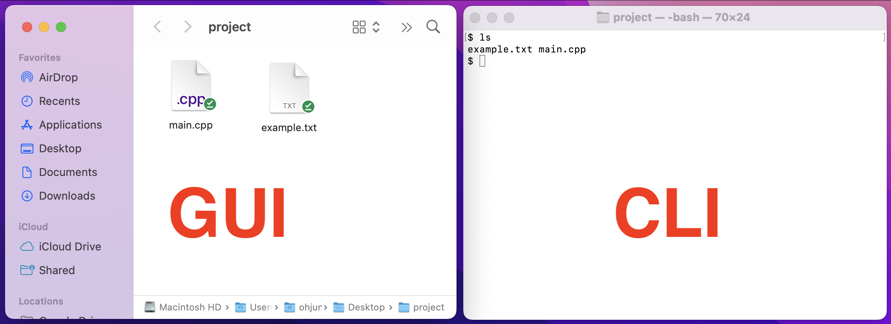
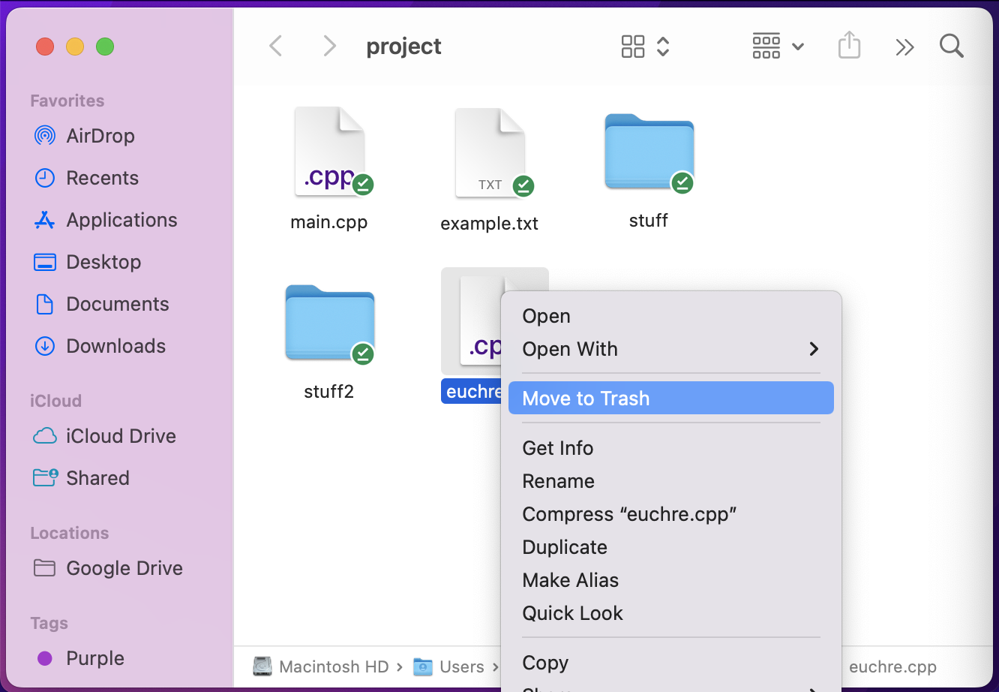
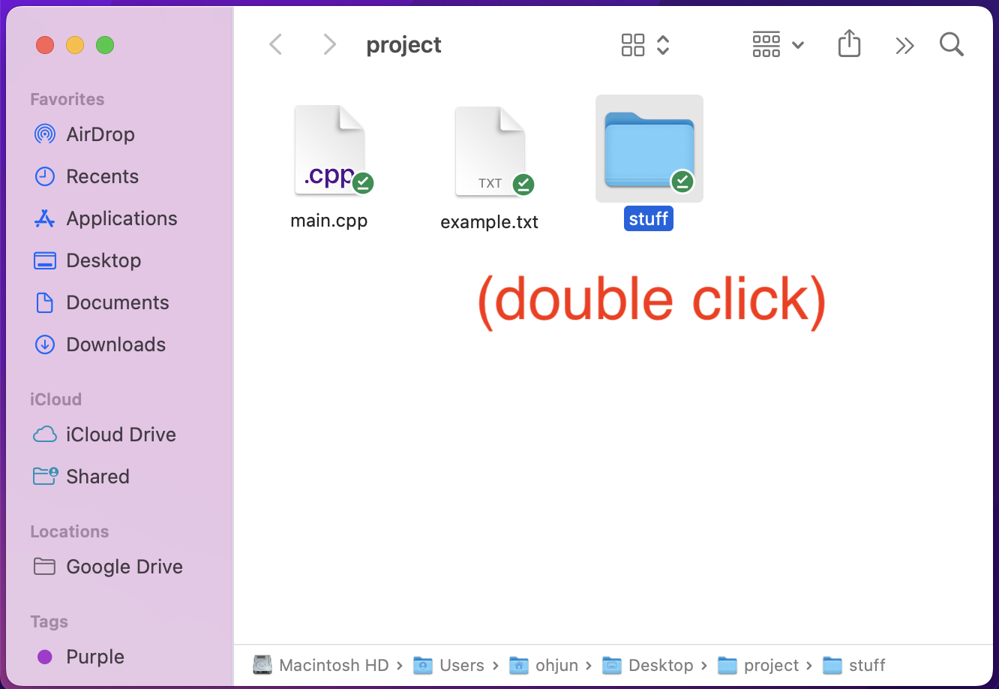
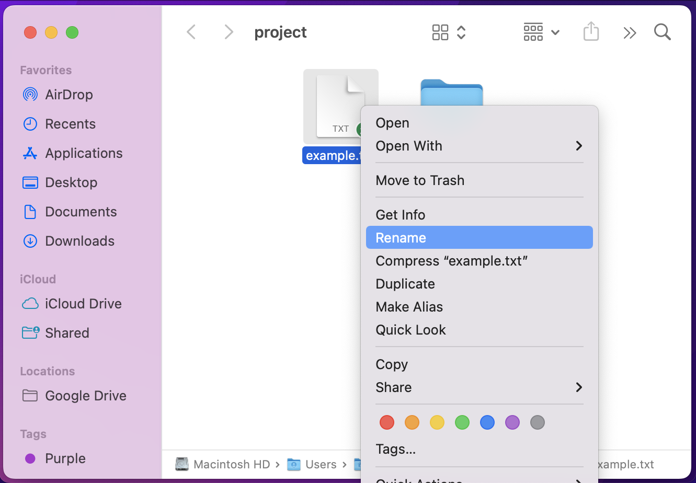
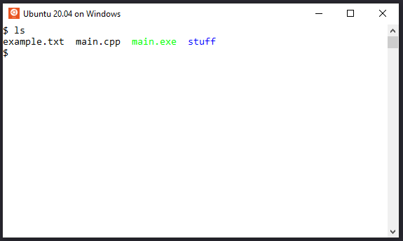
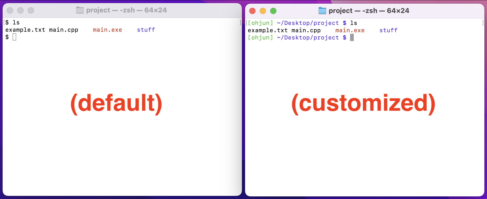

Command Line Interface (CLI)
================
{: .primer-spec-toc-ignore }

This is a brief tutorial of command line interface basics.

The *GUI* (Graphic User Interface) is a "point and click" way to interact with a computer.  The Windows File Explorer and macOS Finder are examples of GUIs.

The *CLI* (Command Line Interface) is a text-based way to interact with a computer.  The terminal is another name for the CLI.  On the Windows Subsystem for Linux (WSL) it might be called "Ubuntu".  The CLI is fast, easy to automate, and easy to use remotely.



## Prerequisites
If you haven't installed CLI tools on your machine yet, follow one of these tutorials first.  Linux users have CLI tools installed by default.

| [macOS](setup_macos.html)| [Windows](setup_wsl.html) |


## Keywords

A *file* stores data like C++ source code (`main.cpp`) or plain text (`example.txt`).

A *directory* contains files and other directories.  It's also called a folder.

A *path* is the location of a file or directory.  Sometimes we end a directory path with `/`.  For example:
```
/Users/ohjun/Desktop/project/main.cpp
/Users/ohjun/Desktop/project/stuff/
```
{: data-variant="no-line-numbers" }


## Basic Commands

### `ls`
`ls` prints files and directories in the present working directory.

<table>
  <tr>
  <td markdown="1" >

  ```console
  $ ls
  example.txt main.cpp stuff
  ```

  </td>
  <td>
    
  </td>
  </tr>
</table>

### `tree`
`tree` recursively prints files and directories.

```console
$ tree
.
├── example.txt
├── main.cpp
└── stuff
    └── hello.txt
```

<div class="primer-spec-callout warning" markdown="1">
**Pitfall:** You may need to install `tree`.
```console
$ sudo apt install tree  # WSL, Linux
$ brew install tree      # macOS
```
</div>

### `pwd`
`pwd` prints the path of the present working directory.

<table>
  <tr>
  <td markdown="1">

  ```console
  $ pwd
  /Users/ohjun/Desktop/project
  ```

  </td>
  <td>
    
  </td>
  </tr>
</table>


### `mkdir`
`mkdir` creates a directory.

<table>
  <tr>
  <td markdown="1">

  ```console
  $ mkdir myfolder
  ```

  </td>
  <td>
    
  </td>
  </tr>
</table>

### `rm`
`rm` removes (deletes) a file. `rm -rf` removes a directory.

<table>
  <tr>
  <td markdown="1">

  ```console
  $ rm euchre.cpp
  $ rm -r stuff2/
  ```

  </td>
  <td>
    
  </td>
  </tr>
</table>

### `cd`
`cd` changes directory.

<table>
  <tr>
  <td markdown="1">

  ```console
  $ cd stuff/
  ```

  </td>
  <td>
    
  </td>
  </tr>
</table>

### `mv`
`mv` moves a file or directory into a different directory.

<table>
  <tr>
  <td markdown="1">

  ```console
  $ mv main.cpp stuff/
  ```

  </td>
  <td>
    
  </td>
  </tr>
</table>

`mv` is also used to rename a file or directory.

<table>
  <tr>
  <td markdown="1">

  ```console
  $ mv example.txt new_name.txt
  ```

  </td>
  <td>
    
  </td>
  </tr>
</table>

### `cp`
`cp` copies a file.

<table>
  <tr>
  <td markdown="1">

  ```console
  $ cp new_name.txt stuff/
  ```

  </td>
  <td>
    
  </td>
  </tr>
</table>

### `open` / `wslview`
On macOS, `open` opens a file or directory with the default application, like a double click ([docs](https://ss64.com/osx/open.html)).

On WSL (Windows), `wslview` opens a file or directory with the default application, like a double click ([docs](https://wslutiliti.es/wslu/man/wslview.html)).

<video controls autoplay loop style="width: 100%; max-width: 640px; max-height: 480px;">
  <source src="images/cli_vid002.mp4" type="video/mp4">
  Your browser does not support the video tag.
</video>

<div class="primer-spec-callout warning" markdown="1">
**WSL Pitfall:** You may need to install `wslu`, which includes `wslview`.
```console
$ sudo apt install wslu
```
</div>

## Tips and Tricks

### `clear` <kbd>Control</kbd> + <kbd>l</kbd>
`clear` the terminal.  Pro-tip: <kbd>Control</kbd> + <kbd>l</kbd>.  That's a lowercase L.

<video controls autoplay loop style="width: 100%; max-width: 640px; max-height: 480px;">
  <source src="images/cli_vid003.mp4" type="video/mp4">
  Your browser does not support the video tag.
</video>

### Tab complete <kbd>TAB</kbd>
<kbd>TAB</kbd> autocompletes a file or directory name. It's faster than typing the whole thing.

Type the first part of a filename, then press <kbd>TAB</kbd>.  Press again to show multiple completion options.
```console
$ cd ~/src/e  # Press TAB twice to see options
eecs280/     eecs281/     eecs485/
```

<video controls autoplay loop style="width: 100%; max-width: 640px; max-height: 480px;">
  <source src="images/cli_vid004.mp4" type="video/mp4">
  Your browser does not support the video tag.
</video>

### Previous Command <kbd>⬆</kbd>
<kbd>⬆</kbd> shows previous commands. For example, you might repeat a compile command while debugging.

<video controls autoplay loop style="width: 100%; max-width: 640px; max-height: 480px;">
  <source src="images/cli_vid005.mp4" type="video/mp4">
  Your browser does not support the video tag.
</video>

### Colorize `ls` output
Colorize the output of `ls` so it's easy to tell the difference between files and directories.


#### Windows/WSL and Linux
Verify you're using the Bash shell, typical on WSL Ubuntu Linux.
```console
$ echo $0
-bash
```
{: data-variant="no-line-numbers" }

Edit your shell customization file.
```console
$ wslview ~/.bash_profile
```
{: data-variant="no-line-numbers" }

<div class="primer-spec-callout warning" markdown="1">
**WSL Pitfall:** You may need to install `wslu`, which includes `wslview`.
```console
$ sudo apt install wslu
```
</div>

Add this line.  Whenever you type `ls`, you'll actually get `ls --color`, which adds color.
```bash
alias ls='ls --color'
```
{: data-variant="no-line-numbers" data-title="~/.bash_profile" }

Close your terminal and reopen it.  You should see colorized `ls` output.



#### macOS
Verify you're using the Z shell, typical on macOS.
```console
$ echo $0
zsh
```
{: data-variant="no-line-numbers" }

Edit your shell customization file
```console
$ open ~/.zshrc
```
{: data-variant="no-line-numbers" }

Add this line.  Whenever you type `ls`, you'll actually get `ls -G`.
```bash
alias ls='ls -G'
```
{: data-variant="no-line-numbers" data-title="~/.zshrc" }

Close your terminal and reopen it.  You should see colorized `ls` output.


### Customize prompt
Customize the terminal prompt to be more helpful and look prettier.

First, complete the [Colorize `ls` output](#colorize-ls-output) section. At this point, you should know whether you are using Bash or Z Shell, and you should have a working `.bash_profile` or `.zshrc` file.

In this file, you can specify the exact interface you want by setting the right environment variables. But this can get very tedious and confusing. If you would like to learn how, start with [this guide](https://medium.com/@adamtowers/how-to-customize-your-terminal-and-bash-profile-from-scratch-9ab079256380) for Bash or [this guide](https://shah22j.medium.com/how-to-customize-your-zsh-terminal-on-your-own-81f947ca2f12) for Z Shell.

If you just want a pretty terminal without going into all the details, you can find premade configurations online that you can simply copy and paste into `.bash_profile` or `.zshrc`. Make sure to exit and open a new terminal window to see the changes.

Below are sample files that you can copy into `.bash_profile` or `.zshrc`.

```bash
PS1='\[\e[90m\][\u] \[\e[36m\]\w/ \[\e[31m\]$ \[\e[0m\]'
alias ls='ls -G'
```
{: data-variant="no-line-numbers" data-title="~/.bash_profile" }


```zsh
autoload -Uz vcs_info
precmd() { vcs_info }

setopt PROMPT_SUBST
PROMPT='%F{green}[%n] %F{blue}%~%f %F{red}$%f '
alias ls='ls --color'
```
{: data-variant="no-line-numbers" data-title="~/.zshrc" }



## Special Paths
A Path is the location of a file or directory.  There two types of paths: absolute and relative.

### Current directory `.`
`.` refers to the current directory.

For example, you might open the current directory in the Finder (File Explorer).
```console
$ open .     # macOS
$ wslview .  # Windows/WSL
```

### Parent directory `..`
`..` refers to the parent directory of the current directory.

```console
$ pwd
/Users/ohjun/Desktop/project/stuff
$ cd ..
$ pwd
/Users/ohjun/Desktop/project
```

### Home directory `~`
`~` refers to your home directory.

```console
$ cd ~
$ pwd
/Users/ohjun
$ ls
Applications Pictures Desktop ...
```

### Root directory `/`
`/` refers to the root directory. This is the top-most directory in your file system, and has no parent.

```console
$ ls /
Applications cores sbin ...
```

### Absolute Path
An *absolute path* starts from the root directory `/`.

For example, sometimes it's useful to make sure the *exact* file is correct.
```console
$ /usr/local/bin/python3  # One version of Python
$ /usr/bin/python3        # Another version of Python
```

### Relative Path
A *relative path* starts from the current directory.

For example, running an executable.
```console
$ ./main.exe
```

### Glob `*`
A *glob* is a wildcard path.  The `*` symbol matches any string.

```console
$ cp -v starter_files/* .
'starter-files/Makefile' -> './Makefile'
'starter-files/main_test.in' -> './main_test.in'
...
```

## More commands
This section contains some more useful commands.

### `wget`
`wget` downloads a file from the internet.

For example, download the starter files for EECS 280 project 1:
```console
$ wget https://eecs280staff.github.io/p1-stats/starter-files.tar.gz
$ ls
starter-files.tar.gz
```

### `tar`
`tar` unpacks an archive.

For example, unpack the starter files for EECS 280 project 1:
```console
$ tar -xvzf starter-files.tar.gz
starter-files/
...
$ tree
.
├── starter-files
│   ├── Makefile
│   ├── main_test.in
│   ├── main_test.out.correct
│   ├── main_test_data.tsv
│   ├── p1_library.cpp
│   ├── p1_library.h
│   ├── stats.h
│   ├── stats_public_test.cpp
│   └── stats_tests.cpp.starter
└── starter-files.tar.gz
```

### `diff`
`diff` compares two files.  It's useful for comparing your output to correct output.

Here's an example from EECS 280 project 1 ([full example](https://eecs280staff.github.io/p1-stats/#testing-1)).  No output means the files are identical.
```console
$ diff main_test.out main_test.out.correct
```

### `cat`
`cat` concatenates files and prints them.

For example, you can dump the contents of a file to the terminal.
```console
$ cat main.cpp
#include <iostream>
using namespace std;

int main() {
  cout << "hello from main!\n";
}
```

### `grep`
`grep` searches files.  It's short for "*g*lobally search for a *re*gular expression and *p*rint matching lines".

Search for `vector` in `main.cpp`.
```console
$ grep vector main.cpp
#include <vector>
  vector<double> v = extract_column(filename, column_name);
  vector<vector<double> > summary = summarize(v);
```

Search for `vector` in all `.cpp` files.  This example also uses a [glob (`*`)](#glob-).
```console
$ grep vector *.cpp
main.cpp:#include <vector>
main.cpp:  vector<double> v = extract_column(filename, column_name);
main.cpp:  vector<vector<double> > summary = summarize(v);
stats.cpp:#include <vector>
...
stats_tests.cpp:#include <vector>
...
```

## Redirection
*Redirection* sends input or output to a file or another command.

### Pipe `|`
The *pipe* (`|`) sends the output of the left command to the input of the right command.

Here's an example that searches for `.cpp` files.  The output of `ls` is piped to the input of `grep`.
```console
$ ls | grep cpp
main.cpp
stats.cpp
stats_tests.cpp
```

### Input redirection `<`
Input redirection sends the contents of a file to the input of a command.  It's useful for automating input.  Here's an example from EECS 280 project 1 ([full example](https://eecs280staff.github.io/p1-stats/#testing-1)).

Put the input that you would type in a file.
```
main_test_data.tsv
B
```
{: data-title="main_test.in" data-variant="no-line-numbers" }

Now you can run your program and **redirect** the input from a file instead of typing it.
```console
$ ./main.exe < main_test.in
```

### Output redirection `>`
Output redirection sends the output of a command to a file.  Here's an example from EECS 280 project 1 ([full example](https://eecs280staff.github.io/p1-stats/#example)).

Run `main.exe`, redirecting input and output.  Then, compare the output.
```console
$ ./main.exe < main_test.in > main_test.out
$ diff main_test.out main_test.out.correct
```

## Shell scripting
A *shell script* is a file that contains commands.  Shell scripts are useful for automating things like running test cases. Learn more at the [EECS 485 Shell Scripting Tutorial](https://eecs485staff.github.io/p1-insta485-static/setup_scripting.html).


## Acknowledgments
Original document written by Andrew DeOrio awdeorio@umich.edu and Oh Jun Kweon ohjun@umich.edu.

This document is licensed under a [Creative Commons Attribution-NonCommercial 4.0 License](https://creativecommons.org/licenses/by-nc/4.0/). You’re free to copy and share this document, but not to sell it. You may not share source code provided with this document.
