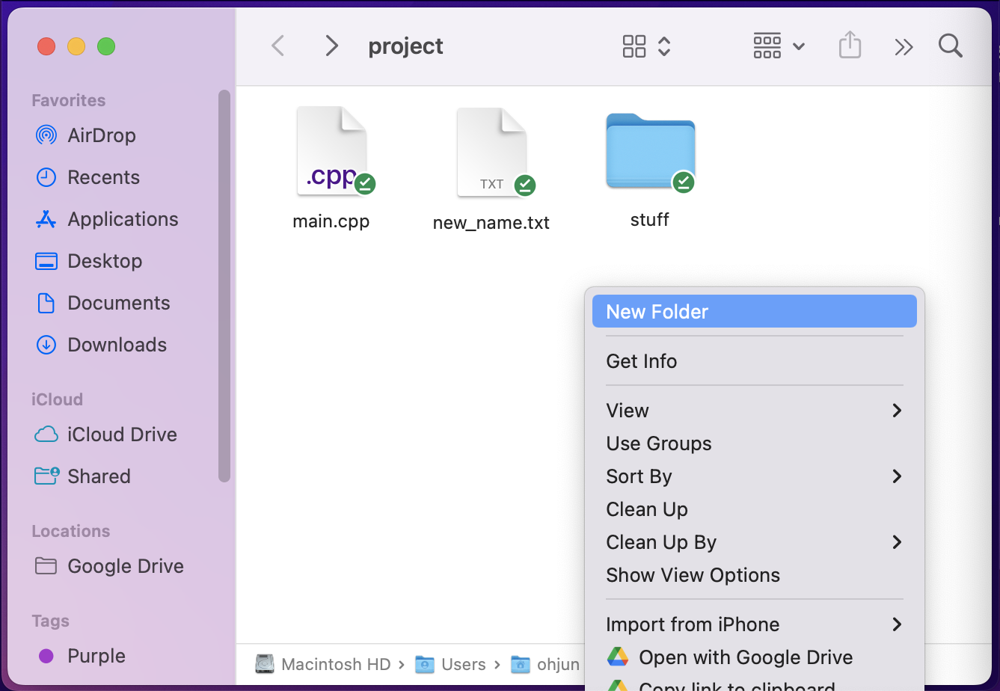
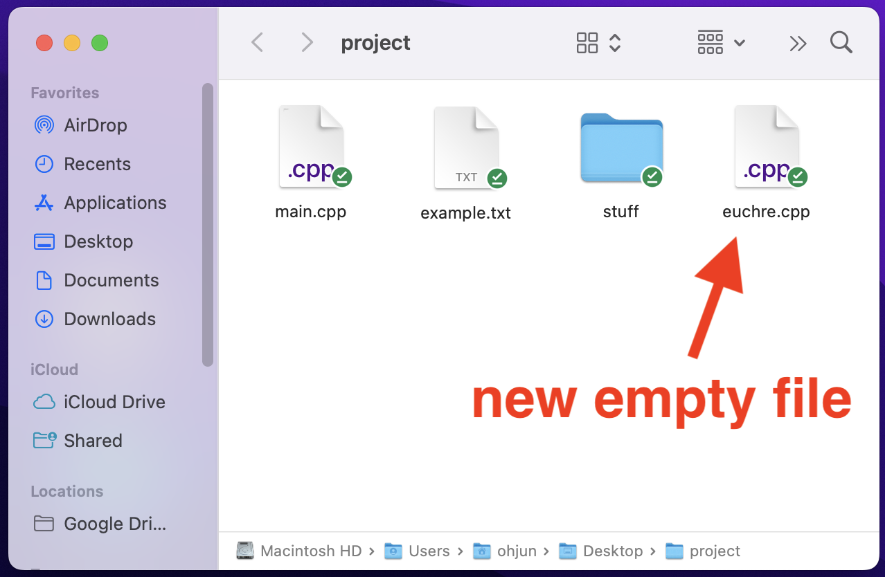
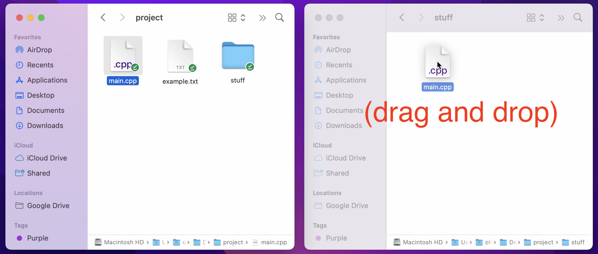

Command Line Interface (CLI)
================
{: .primer-spec-toc-ignore }

This is a brief tutorial of command line interface basics.

The *GUI* (Graphic User Interface) is a "point and click" way to interact with a computer.  The Windows File Explorer and macOS Finder are examples of GUIs.

The *CLI* (Command Line Interface) is a text-based way to interact with a computer.  The terminal is another name for the CLI.  On the Windows Subsystem for Linux (WSL) it might be called "Ubuntu".  The CLI is fast, easy to automate, and easy to use remotely.


## Keywords

A *Path* is the location of a file or directory.  For example:
```
/Users/ohjun/Desktop/project
```
{: data-variant="no-line-numbers" }

A *file* stores data like C++ source code (`main.cpp`) or plain text (`example.txt`).

A *directory* contains files and other directories.  It's also called a folder.


## Basic Commands

### `ls`
`ls` prints files and directories in the present working directory.

<table>
  <tr>
  <td markdown="1" >

  ```console
  $ ls
  example.txt main.cpp stuff
  ```

  </td>
  <td>
    
  </td>
  </tr>
</table>

### `pwd`
`pwd` prints the path of the present working directory.

<table>
  <tr>
  <td markdown="1">

  ```console
  $ pwd
  /Users/ohjun/Desktop/project
  ```

  </td>
  <td>
    
  </td>
  </tr>
</table>


### `mkdir`
`mkdir` creates a directory.

<table>
  <tr>
  <td markdown="1">

  ```console
  $ mkdir myfolder
  ```

  </td>
  <td>
    
  </td>
  </tr>
</table>

### `touch`
`touch` creates an empty file.

<table>
  <tr>
  <td markdown="1">

  ```console
  $ ls
  example.txt main.cpp stuff stuff2
  $ touch euchre.cpp
  $ ls
  example.txt main.cpp stuff stuff2 euchre.cpp 
  ```

  </td>
  <td>
    
  </td>
  </tr>
</table>

### `rm`
`rm` removes (deletes) a file. `rm -rf` removes a directory.

<table>
  <tr>
  <td markdown="1">

  ```console
  $ rm euchre.cpp
  $ rm -r stuff2/
  ```

  </td>
  <td>
    
  </td>
  </tr>
</table>

### `cd`
`cd` changes directory.

<table>
  <tr>
  <td markdown="1">

  ```console
  $ cd stuff/
  ```

  </td>
  <td>
    
  </td>
  </tr>
</table>

### `mv`
`mv` moves a file or directory.

<table>
  <tr>
  <td markdown="1">

  ```console
  $ mv main.cpp stuff/
  ```

  </td>
  <td>
    
  </td>
  </tr>
</table>

Note the `/` at the end of `stuff/`. While not necessary, it is convention to end directory paths with `/`.

GUI Equivalent:



`mv` is also used to rename a file or directory.

<table>
  <tr>
  <td markdown="1">

  ```console
  $ mv example.txt new_name.txt
  ```

  </td>
  <td>
    
  </td>
  </tr>
</table>

### `cp`
`cp` copies a file.

<table>
  <tr>
  <td markdown="1">

  ```console
  $ cp new_name.txt stuff/
  ```

  </td>
  <td>
    
  </td>
  </tr>
</table>

### `open` / `wslview`
On macOS, `open` opens a file or directory with the default application ([docs](https://ss64.com/osx/open.html)).

On WSL (Windows), `wslview` opens a file or directory with the default application ([docs](https://wslutiliti.es/wslu/man/wslview.html)).

<video controls="controls" class="invert-colors-in-dark-mode" width="768px" name="open cli example">
  <source src="images/cli_vid002.mov">
</video>
Note the `.` path used. This is a [special path](#special-paths) that refers to the current directory.

GUI Equivalent:


## Special Paths
A Path is the location of a file or directory.  There two types of paths: absolute and relative.

### Current directory `.`
`.` refers to the current directory.

For example, you might open the current directory in the Finder (File Explorer).
```console
$ open .     # macOS
$ wslview .  # Windows/WSL
```

### Parent directory `..`
`..` refers to the parent directory of the current directory.

```console
$ pwd
/Users/ohjun/Desktop/project/stuff
$ cd ..
$ pwd
/Users/ohjun/Desktop/project
```

### Home directory `~`
`~` refers to your home directory.

```console
$ cd ~
$ pwd
/Users/ohjun
$ ls
Applications Pictures Desktop ...
```

### Root directory `/`
`/` refers to the root directory. This is the top-most directory in your file system, and has no parent.

```console
$ ls /
Applications cores sbin ...
```

### Absolute Path
An *absolute path* starts from the root directory `/`.

For example, sometimes it's useful to make sure the *exact* file is correct.
```console
$ /usr/local/bin/python3  # One version of Python
$ /usr/bin/python3        # Another version of Python
```

### Relative Path
A *relative path*: starts from the current directory.

For example, running an executable.
```console
$ ./main.exe
```

## Tips and Tricks

### Clear
`clear` is a command that clears the shell. A faster way of doing this is to press `Ctrl + l`.

Note that l is a lowercase L, not an uppercase i.

<video controls="controls" class="invert-colors-in-dark-mode" width="768px" name="clear example">
  <source src="images/cli_vid003.mov">
</video>


### Tab Complete
Pressing tab autocompletes a file/directory name. This allows you to navigate much faster than typing the entire path.

<video controls="controls" class="invert-colors-in-dark-mode" width="768px" name="tab example">
  <source src="images/cli_vid004.mov">
</video>

### Previous Command
Pressing the up arrow allows you to see your previous commands. This is particularly useful when you are repeating compile-run-compile-run-... while debugging.

<video controls="controls" class="invert-colors-in-dark-mode" width="768px" name="up arrow example">
  <source src="images/cli_vid005.mov">
</video>

### Colors and Customization
The default terminal can look a little boring without colors or path descriptions. Fortunately, there is a way to style the terminal exactly the way you want it. Below is one example.


First, determine which shell you are using by running the following command.
```console
$ echo $SHELL
```
On WSL, you will most likely see `bash`. On MacOS, you will most likely see `zsh`. These are different types of shells. A shell is a program that takes keyboard commands and gives them to the operating system.

Next, create a file to store your environment settings at the [home directory](#-2).

On `bash`:
```console
$ touch ~/.bash_profile
```

On `zsh`:
```console
$ touch ~/.zshrc
```

Now, open the file.

On `bash`:
```console
$ open ~/.bash_profile
```

On `zsh`:
```console
$ open ~/.zshrc
```

<div class="primer-spec-callout warning icon-warning" markdown="1">
**Note:** `open` is the command on MacOS. Use `wslview` if you are using WSL on Windows.
</div>

In this file, you can specify the exact interface you want by setting the right environment variables. But this can get very tedious and confusing. If you would like to learn how, start with [this guide](https://medium.com/@adamtowers/how-to-customize-your-terminal-and-bash-profile-from-scratch-9ab079256380) for `bash` or [this guide](https://shah22j.medium.com/how-to-customize-your-zsh-terminal-on-your-own-81f947ca2f12) for `zsh`.

If you just want a pretty terminal without going into all the details, you can find premade configurations online that you can simply copy and paste into `.bash_profile` or `.zshrc`. Below is the contents of the `.bash_profile` of the styled terminal in the screenshot above.

```
export LSCOLORS=gxBxhxDxfxhxhxhxhxcxcx
export CLICOLOR=1
PS1='\[\e[90m\][\u] \[\e[36m\]\w/ \[\e[31m\]$ \[\e[0m\]'
```


## More commands
Below are some more advanced commands that are cool to know, but not necessary.

### `cat`
`cat` is short for "con*cat*enate". It takes in a list of filenames, concatenates the contents, and prints it out.
[More info](https://man7.org/linux/man-pages/man1/cat.1.html).

Example:

Consider the files `main.cpp` and `text.txt`:
<table>
  <tr>
      <th>main.cpp</th>
      <th>text.txt</th>
  </tr>
  <tr>
  <td markdown="1">

  ```cpp
  #include <iostream>

  int main(void) {
    std::cout << "Hello World\n";
  }

  ```

  </td>
  <td markdown="1">

  ```txt
  random text
  more random text

  ```

  </td>
  </tr>
</table>

Then:

```console
$ cat main.cpp
#include <iostream>

int main(void) {
  std::cout << "Hello World\n";
}
$ cat text.txt
random text
more random text
$ cat main.cpp text.txt
#include <iostream>

int main(void) {
  std::cout << "Hello World\n";
}
random text
more random text
```

### `grep`
`grep` is short for "*g*lobally search for a *re*gular expression and *p*rint matching lines". It takes in a regular expression (commonly called "regex") and a path. It finds all lines in the specified path that match the regex pattern.
[More info](https://man7.org/linux/man-pages/man1/grep.1.html).

Regular expressions are out of the scope of this tutorial, but you can learn how they work using [this guide](https://regexr.com/). The example below uses the most basic regular expression, a keyword.

Example:

Consider the files `main.cpp` and `text.txt`:
<table>
  <tr>
      <th>main.cpp</th>
      <th>text.txt</th>
  </tr>
  <tr>
  <td markdown="1">

  ```cpp
  #include <iostream>

  int main(void) {
    std::cout << "Hello World\n";
  }

  ```

  </td>
  <td markdown="1">

  ```txt
  random text
  more random text
  text text text text
  hello world
  this is a pointless text file

  ```

  </td>
  </tr>
</table>

Then:

```console
$ grep 'random' text.txt
random text
more random text
$ grep -r 'hello' .
./text.txt:hello world
$ grep -ri 'hello' .
./test.txt:hello world
./main.cpp:  std:cout << "Hello World\n";
```

Note that the `-r` option must be specified when searching for all files in a directory, and the `-i` option performs a case insensitive search.


### Pipe `|`
`|` is an operator, not a command. It can be placed between commands to feed the output of the "left" command as input to the "right" command.
[More info](https://www.redhat.com/sysadmin/pipes-command-line-linux).

Example:

Consider a directory containing some files `Makefile`, `main.cpp`, and `text.txt`.

Then:

```console
$ ls
Makefile main.cpp text.txt
$ ls | grep '.txt'
text.txt
```

### `curl`
`curl` is short for "*c*lient *URL*". It takes in a URL with a specified protocol, sends a request to the URL, and prints out the received data.
[More info](https://man7.org/linux/man-pages/man1/curl.1.html).

Examples:

```console
$ curl https://www.example.com/
<!doctype html>
<html>
<head>
    <title>Example Domain</title>

    <meta charset="utf-8" />
    <meta http-equiv="Content-type" content="text/html; charset=utf-8" />
    <meta name="viewport" content="width=device-width, initial-scale=1" />
    <style type="text/css">
    body {
        background-color: #f0f0f2;
        margin: 0;
        padding: 0;
        font-family: -apple-system, system-ui, BlinkMacSystemFont, "Segoe UI", "Open Sans", "Helvetica Neue", Helvetica, Arial, sans-serif;
        
    }
    div {
        width: 600px;
        margin: 5em auto;
        padding: 2em;
        background-color: #fdfdff;
        border-radius: 0.5em;
        box-shadow: 2px 3px 7px 2px rgba(0,0,0,0.02);
    }
    a:link, a:visited {
        color: #38488f;
        text-decoration: none;
    }
    @media (max-width: 700px) {
        div {
            margin: 0 auto;
            width: auto;
        }
    }
    </style>    
</head>

<body>
<div>
    <h1>Example Domain</h1>
    <p>This domain is for use in illustrative examples in documents. You may use this
    domain in literature without prior coordination or asking for permission.</p>
    <p><a href="https://www.iana.org/domains/example">More information...</a></p>
</div>
</body>
</html>
```

```console
$ curl dict://dict.org/m:hello
220 dict.dict.org dictd 1.12.1/rf on Linux 4.19.0-10-amd64 <auth.mime> <155236214.10349.1670110969@dict.dict.org>
250 ok
152 8 matches found
gcide "Hell"
gcide "Hello"
gcide "Cello"
gcide "Jell-O"
gcide "Hollo"
gcide "Hullo"
gcide "Helio-"
gcide "Helly"
.
250 ok [d/m/c = 0/8/12569; 0.000r 0.000u 0.000s]
221 bye [d/m/c = 0/0/0; 0.000r 0.000u 0.000s]
```


### Input redirection `<`
`<` is an operator, not a command. It can be placed between a command and a filename to feed the contents of the specified file as input to the command.
[More info](https://www.redhat.com/sysadmin/linux-shell-redirection-pipelining).

Below is a simple program that takes input from `std::cin` and prints it out.

```cpp
// main.cpp

#include <iostream>
#include <string>

int main(void) {
    std::string input;
    while (std::cin >> input) {
        if (input == "stop") {
            break;
        }
        std::cout << input << '\n'; 
    }
}

```

We can compile and run the program, then manually feed std::cin.

```console
$ g++ -g -Wall -fno-builtin -std=c++17 main.cpp -o main.exe
$ ./main.exe
hello    // user input
hello    // program output
world    // user input
world    // program output
stop     // user input
```

Or we can automate the input by creating a file with the words "hello", "world", "stop", then redirecting the file as input to the program.

input.txt
```
hello
world
stop
```
Input redirection:
```console
$ g++ -g -Wall -fno-builtin -std=c++17 main.cpp -o main.exe
$ ./main.exe < input.txt
hello    // program output
world    // program output
```


### Output redirection `>`
`>` is an operator, not a command. It can be placed between a command and a filename to redirect the output of the command into the specified file. If the specified file does not exist, it will be created.
[More info](https://www.redhat.com/sysadmin/linux-shell-redirection-pipelining).

Consider a simple Hello World program that just prints "Hello World".
```cpp
// main.cpp

#include <iostream>

int main(void) {
    std::cout << "Hello World\n";
}

```

We would normally see the output on the terminal.

```console
$ g++ -g -Wall -fno-builtin -std=c++17 main.cpp -o main.exe
$ ./main.exe
Hello World
```

Or we can redirect the output to a file.

```console
$ g++ -g -Wall -fno-builtin -std=c++17 main.cpp -o main.exe
$ ./main.exe > main.out
$ cat main.out
Hello World
```


### Scripting
As you have seen, the shell is a powerful tool that can perform many useful tasks. To get even more out of the shell, we can write a program composed of shell commands. This is called a script.

You can write scripts to automate many mundane tasks such as running test cases. Learn more at the [EECS 485 Shell Scripting Tutorial](https://eecs485staff.github.io/p1-insta485-static/setup_scripting.html).


## Acknowledgments
Original document written by Andrew DeOrio awdeorio@umich.edu and Oh Jun Kweon ohjun@umich.edu.

This document is licensed under a [Creative Commons Attribution-NonCommercial 4.0 License](https://creativecommons.org/licenses/by-nc/4.0/). You’re free to copy and share this document, but not to sell it. You may not share source code provided with this document.
