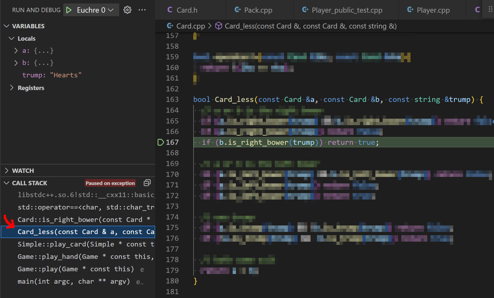
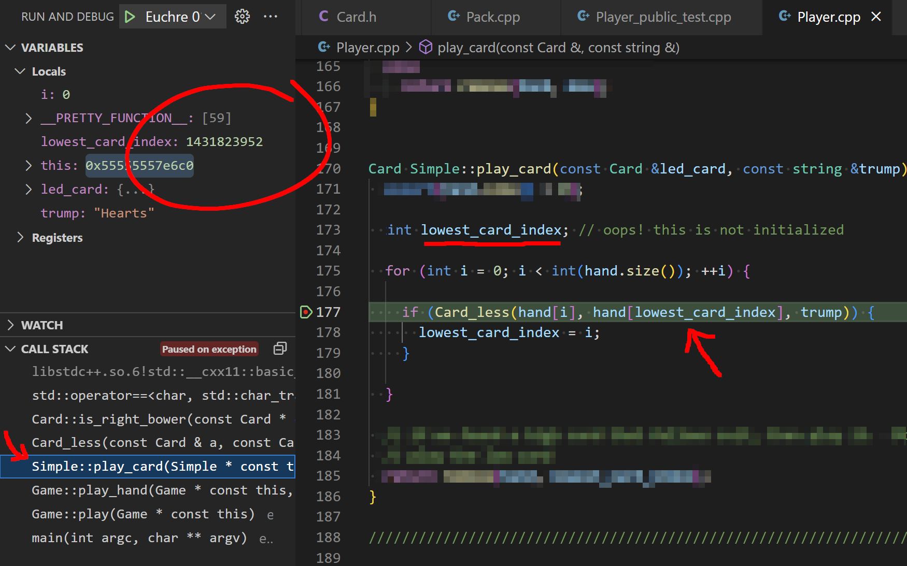
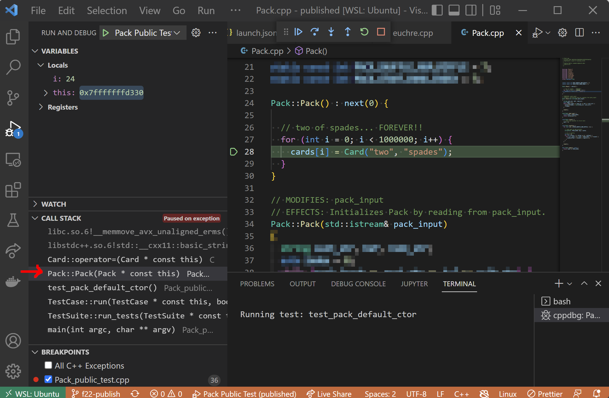

Debugging Guide
==========================
{: .primer-spec-toc-ignore }

There are two fundamental components to debugging:
1. Form hypotheses about the specific cause of a bug
2. Use debugging tools and strategies to investigate those hypotheses

This guide focuses on effective strategies for point 2 above, in particular through the use of a **debugger**, which allows you to pause your program's execution at key points and inspect the state of objects in memory.

We also show several real examples drawn from course projects in EECS 280. In some of the cases, we've blurred out parts of screenshots where we ran the debugger on our instructor solution.

TODO: link back to relevant parts of IDE or setup tutorials for debuggers

## Inspect Program State

A fundamental part of debugging is simply getting more information about what exactly your program is doing.

### Local Variables

<div class="primer-spec-callout info icon-info" markdown="1">
Use the **variables panel** to inspect the values of variables while your debugger is paused. In many debuggers, you can also **hover your mouse over a variable** in the source code to see its current value.
</div>

Let's say I'm working on the Euchre project - there's a lot of information to keep track of during the card game. I'd like to check that everything seems in order after the cards are dealt and the players have finished making.

When the debugger pauses at my breakpoint, we can see the value of local variables:


You can see some variables directly. For example, `trump` is currently `"Hearts"`.

Variables may contain **"memory junk"**. `i` is currently `-11632`. That's expected in this case, because we just haven't run the line `int i=0;` quite yet. In other cases, bogus values might indicate a bug!

#### Expand Complex Variables
{: .primer-spec-toc-ignore }

You can **click to expand** more complex variables like pointers, arrays, or classes to inspect their contents. Below, I've expanded the `leader` variable to see the `Player` it is pointing to, then also expanded the `cards` array to take a look at their current hand.


<div class="primer-spec-callout warning" markdown="1">

**Heads up!** You may need to configure your debugger to ensure full information is shown for polymorphic objects through pointers. In the example above, the `leader` variable is a `Player*` pointing to a `SimplePlayer` object. By default, the debugger may only show the base class `Player` data.

To fix this in VS Code, run `-exec set print object on` from the debug console, or add the following to the `setupCommands` in your `launch.json` configuration:

```json
  "setupCommands": [
      ...
      {
        "description": "Print polymorphic objects according to dynamic type",
        "text": "set print object on"
      }
      ...
  ]
```
{: data-variant="legacy" }
</div>

#### Member Functions and `this`
{: .primer-spec-toc-ignore }

In **member functions**, you can also open up the `this` pointer. In our Euchre example, we'd see member variables from the current `Game` class instance:


### The Call Stack

<div class="primer-spec-callout info icon-info" markdown="1">
The debugger allows you to inspect any function currently on the call stack, starting from your current function all the way back to `main()`.
</div>

When the debugger is paused, it shows stack frames for all functions currently executing on the call stack. You can click on each to inspect its local variables just as you can with the current function.

It's often necessary to take a look at the _calling context_ for your current function, for example to understand why a function was originally called in the first place, or why the inputs passed in to it may be invalid.

For example, consider this crash within the `Card::is_right_bower()` function from our Euchre project.


Evidently, something is very wrong with the current `Card` object. The debugger is not even able to access its `rank` or `suit` member variables to show us their values.


We don't have enough information here to determine the problem, so let's click on the stack frame for `Card_less()`, which is the function that called `Card::is_right_bower()`. Now we can see the code and local variables for `Card_less()`, including the fact that the specific call that crashed was `b.is_right_bower(trump)`:



That's not quite enough information, though. Evidently the card `b` is invalid, but that was a parameter to `Card_less()`. Let's keep looking for more context by again clicking the stack frame for `Simple::play_card()`.



Here we finally have the information we need. We see that the parameter for `b` in this call to `Card_less()` was `hand[lowest_card_index]`, and we can also take a look at the variables window to see that `lowest_card_index` has a value of `1431823952`. This is where the bad card came from originally, which ultimately resulted in the crash deeper in `Card::is_right_bower()`.

### Evaluate Expressions

<div class="primer-spec-callout info icon-info" markdown="1">
Use the **debug console** to evaluate expressions while your debugger is paused.
</div>

Let's say I'm working on a project involving matrices and I get a segfault from dereferencing `ptr` in my `Matrix_max()` function below. My debugger pauses when the segfault occurs.

I can see `ptr` holds the address `0x55555586e000` and `size` is `25` in the variables window.

But, I don't know how far `ptr` is from the beginning of the array. For this, I enter `ptr - mat->data` at the debug console.


The debugger evaluates that pointer subtraction for me, which confirms that the pointer is far out of bounds.


That suggests the loop is effectively infinite, and only stops when the pointer travels far enough to segfault. Looking back at my code (see above), I find that the loop condition `ptr < ptr + size` is incorrect.

You can enter almost any valid C++ expression at the debug console - even function calls! Take a look below - we've called `Matrix_print()` from the debug console and the result shows at the terminal.


### Debug Logging

<div class="primer-spec-callout info icon-info" markdown="1">
In _some_ situations, **logging additional output via print statements** may be more efficient than manually stepping line-by-line with a debugger. For example, debugging a loop across many iterations or generating verbose output for quick inspection.
</div>


<div class="primer-spec-callout info icon-info" markdown="1">

**Tip:** When adding print statements to log debug info:  
- Use a prefix like `"DEBUG: "` to clearly distinguish from other output.
- Take some time to format them nicely so it's easier to see what's going on.
- Use `endl` for newlines (don't use `\n`). This guarantees you see the output, even if your code crashes.
- Comment out your debug outputs once you're done (rather than deleting them). You might use them again later!
</div>

Let's say I'm getting the wrong output in my Euchre program, evidenced by the diff check below. The players are playing the right cards, but the wrong person takes the trick.


I've also identified the relevant portion of my code:


I might be tempted to dive in with my debugger, but it will take a while to step to the right place (especially if the first mismatch was even farther into the game). I could also get a bit lost trying to manually walk through the card comparisons one-at-a-time.

We could get the same information quickly with some debug printouts:


Then, scan the output for the relevant portion:


The _Queen of Clubs_ is chosen to beat out the _Ten of Diamonds_, which is wrong. The _Ten of Diamonds_ is better because _diamonds_ is the led suit. Ah ha - we may notice that the wrong version of `Card_less()` is used in the code above, which doesn't consider the led suit.

## Diagnose Crashes

You can use a debugger to assess the cause of a crash or runtime error, including:

- Failed debugging assertions
- Undefined behavior detected by sanitizer tools
- Segmentation faults
- Unhandled exceptions
- And more!

Basically, if your code is doing something bad:
1. Run through the debugger. No breakpoints needed.
2. The debugger pauses when the error occurs.
3. You look at local variables, the call stack, etc. to diagnose the issue

Here's several examples:

### Crash in _My_ Code

I've just finished part of the Euchre project and want to run my own `Player_tests.exe` via the terminal:

```console
$ ./Player_tests.exe
Running test: test_get_name
Segmentation fault
```

My code crashed with a segmentation fault, but I don't know much else.

Let's run in a debugger and let it crash there. No need to set any breakpoints.


From the above, we can quickly see the line where the segfault occurs. We also observe that `p1->get_name()` crashes because `p1` is `0x0` (a null pointer), as seen in the variables panel. Ah ha - we just mistyped `p1` on this line instead of `p2`.

Sometimes you might also need to explore [the call stack](#the-call-stack) to determine the cause of the crash. 

### Crash in _Library/System_ Code

Sometimes a crash occurs in library code that your program uses, but that you didn't write.

For example, the debugger might show you a crash in code from the standard library, which is often very difficult to read:


Or, the debugger might choose to show you the compiled assembly code where the crash occurred:


There are also some implicitly defined functions that don't literally appear in your source code (e.g. a built-in copy constructor or assignment operator). For a crash in any of these functions, the debugger may just show you the first line of the class:


**Tracing Back to _Your_ Code**  
To diagnose crashes where the debugger initially shows you library code, you need to find the nearest part of _your_ code that ultimately called the library functions.

Let's consider again the case of a crash in an implicitly-defined function. The debugger first just shows us the top line of the class definition, since there's no code to show for implicitly-defined functions.


In this case, check [the call stack](#the-call-stack). First, observe that the segfault did occur in an implicitly-defined function, the built-in `Card::operator=` assignment operator for copying a `Card`.


Now, click the next stack frame below to see the where that operator was used. It was in our `Pack` constructor. Taking a look at the _calling_ stack frame(s) allows me to see where the problem originated and is generally sufficient to figure out what part of _my code_ was responsible for causing the implicitly-defined function to crash. In the picture below, we can see that an (obviously) incorrect loop is attempting to copy `Card`s to out-of-bounds array elements.



## Breakpoints

### Basic Usage

<div class="primer-spec-callout info icon-info" markdown="1">
A **breakpoint** pauses the program whenever it reaches a certain line.
</div>

For example, if you're running the main driver for a statistics project and your dataset summary doesn't print out correctly, you might want to pause the program after the summary has been calculated but before printing it out.

To set a breakpoint, click to the left of a line as shown. A red dot appears to indicate the breakpoint on that line. (You can click again to unset it.)


Now, when I run the program via my debugger, it pauses just **before** running that line. That is, the highlighted line is up next, but has not run yet.


Now, I can inspect the `summary` variable and see if my `summarize()` function was returning the right result.

<div class="primer-spec-callout warning" markdown="1">
If your debugger isn't respecting your breakpoints or the lines where it pauses don't seem to match your source code:
- Double check that you've **saved** and **re-compiled** any source files you were editing. (Some IDEs may auto-save or auto-build when you launch the debugger, but not all.)
- Verify compilation was successful. (Otherwise, your debugger may launch on the last succesfully compiled program.)
- Make sure you're compiling with appropriate flags for debugging (e.g. `-g` and no `-OX` optimization flags).
</div>

### Conditional Breakpoints

<div class="primer-spec-callout info icon-info" markdown="1">
Use a **conditional breakpoint** to pause the program _only_ if a given condition is true.
</div>

Consider a case where I'm debugging my Euchre program, but I find that the first mismatch in output (see the diff below) occurs pretty far into the game - in the making trump phase of hand 3, Edsger passes but should have ordered up Spades.


It would be quite tedious to use the debugger navigation controls to step to this point manually. Instead, let's modify our code for making trump so that it will trigger a breakpoint only when it's Edsger's turn to order up in hand 3:


In the code above, we've done three things:
1. Add an `if` branch to our code that checks for the condition where we'd like to pause.
2. Put an `asm("nop");` line inside the `if`. This is an assembly code instruction for "no operation", which does nothing at runtime. It's just a placeholder so that we can...
3. Set a breakpoint on the line inside the `if`. Now the debugger will pause exactly when we want it to!

Of course, make sure to eventually remove or comment out the extra code once you're finished debugging.

<div class="primer-spec-callout warning" markdown="1">

Your debugger may also support "conditional breakpoints" by allowing you to attach a condition when you create a breakpoint (i.e. without changing the code itself). However, the conditions you may specify this way are generally quite limited and will not always work as you expect. For this reason, we recommend the approach above.
</div>

## Navigating Code

### Basic Controls

While the debugger is paused, it highlights the line of code that is up next, but has not run yet. At this point, you have a number of options to continue the execution of your program.

Most debuggers support the following navigation controls:

 **Step Over**  
Run one line of code, stepping _over_ any function calls by running the whole function in one step.

 **Step Into**  
Run one line of code, stepping _into_ any function calls to execute them line-by-line.

 **Step Out**  
Run the program until it returns from the current function (or until the next breakpoint).

 **Continue**  
Run the program until the next breakpoint.

 **Restart**  
Restart the currently running program in the debugger.

 **Stop**  
Exit the debugger.

### Strategies

Here's a few high-level strategies for navigating effectively when debugging your code.

#### Step Over and Check

<div class="primer-spec-callout info icon-info" markdown="1">
If you're not sure whether a function is correct, use **step over** to run it and then inspect its results in the debugger to see if it worked. (You can restart and come back to _step into_ the function if it wasn't correct.)
</div>

When the next line of code contains a function call, you need to decide whether to _step into_ the function or go ahead and _step over_ the whole thing. It's tempting to _step in_ so you can see all the details, but that may be a waste of time if the function isn't actually broken!

For example, consider the Euchre program. Assume we've discovered that players are not making the right decision during the making phase. The players choose whether to order up based on the cards they have, which also depends on how the pack of cards was shuffled and how cards were dealt to each player.

Let's say you've got your debugger paused before the relevant helper functions for each of those steps:


Should we step into `shuffle_pack()`? Or should we step over that and then step into `deal()`? Probably not... yet. Instead, it would be better to step over both of these and use the debugger to check what cards the players now have in their hands. If those cards are correct, the bug must be in `make_trump()` and we've saved ourselves a lot of time that would have been wasted stepping through the first two functions. Or, if the cards are incorrect, we can restart the debugger and investigate more closely.

#### Continue-To-Breakpoint

<div class="primer-spec-callout info icon-info" markdown="1">
To move quickly through a large portion of code, set a **breakpoint** at your next destination and then use the **continue** command.
</div>

Breakpoints are not only used to tell the debugger where to stop initially. You can add/remove them while the debugger is running. This is particularly useful for quick navigation over several lines or looping constructs that would otherwise take a long time to step through line-by-line.

Here's an example. In the code below, let's say my debugger is paused on line 302. Looking ahead, I'd like to investigate what happens when my Euchre players either lead or play cards. Instead of stepping through the intervening lines one-at-a-time with _step into_ or _step over_, I'll set breakpoints on the lines that interest me (310 and 319) and use _continue_ to hop from one breakpoint to another.


#### Step In + Step Out

<div class="primer-spec-callout info icon-info" markdown="1">
If _step into_ takes you into a function you didn't intend to explore, you can immediately _step out_ and move on.
</div>

When you have multiple function calls on one line, _step into_ will take you to the first one that is executed. Sometimes that's not what you want. For example, consider this line of code:

```cpp
player->add_card(pack.deal_one());
```
{: data-variant="legacy" }

_Step into_ will take us into the `deal_one()` implementation. If we instead wanted to investigate `add_card()`, we can just _step out_ of `deal_one()` and then run _step into_ again.

Sometimes _step into_ may also take you into a function that you didn't necessarily expect but that is technically present. For example, a copy constructor used implicitly to pass a parameter. In these cases, again, you can just _step out_ and then try _step in_ again.

#### Just My Code (Visual Studio)


<div class="primer-spec-callout info icon-info" markdown="1">
Enable [_Just My Code_](https://learn.microsoft.com/en-us/visualstudio/debugger/just-my-code?view=vs-2022#BKMK_Enable_or_disable_Just_My_Code) in Visual Studio so that the debugger will skip over standard library code.
</div>

In general, it's not very useful for the debugger to step line-by-line through functions from the standard library. You can presume these functions are correct, so there's no need to go bug hunting in there. The code is also terribly hard to read.

Unfortunately, this feature is not supported in XCode or [VS Code](https://github.com/microsoft/vscode-cpptools/issues/5763).


