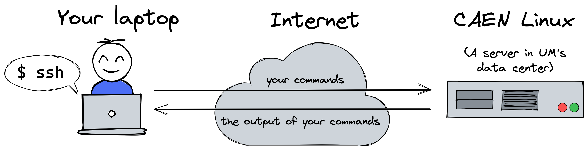
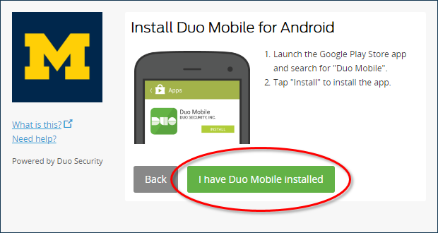

CAEN Linux
==========
{: .primer-spec-toc-ignore }

This tutorial will show you how to copy source code from your Laptop to CAEN Linux.  CAEN Linux is a server in a University data center that runs the Linux operating system.  It's useful for making sure that your code works on a computer that is a lot like the autograder.



## Install
Everyone who registers for an EECS class (like EECS 280) should receive a CAEN account automatically by the first day class.  If you register after the first day of class, you should get your account within 24 hours of registration.

### `ssh` and `rsync`
Make sure you have `ssh` and `rsync` installed.  Your versions might be different.  They are installed by default on macOS and Windows/WSL users may have already followed [these instructions](setup_wsl.html#install-cli-tools).
```console
$ ssh -V
OpenSSH_7.4p1, LibreSSL 2.5.0
$ rsync --version
rsync  version 2.6.9  protocol version 29
```

### Duo Mobile
You'll need a two factor authentication app set up on your mobile device.  Make sure that you have the Duo Mobile app installed and configured according the [ITCS documentation](http://documentation.its.umich.edu/2fa/enroll-smartphone-or-tablet-duo).



### VPN
To access CAEN Linux from off campus, you'll first need to connect to the UM VPN Service.  Follow the ITS [instructions](https://its.umich.edu/enterprise/wifi-networks/vpn/getting-started).

### Test log in
Test an SSH connection.  Be sure to change `awdeorio` to your own uniqname.

```console
$ ssh -T awdeorio@login-course.engin.umich.edu
The authenticity of host 'login-course.engin.umich.edu (141.213.74.65)' can't be established.
ECDSA key fingerprint is SHA256:LL0GPTtaVGa6gvv2kVpGq4ZULA1l5pw2wXC4dK3ymIk.
Are you sure you want to continue connecting (yes/no)? yes
Warning: Permanently added 'login-course.engin.umich.edu,141.213.74.65' (ECDSA) to the list of known hosts.
Password: 
Duo two-factor login for awdeorio

Enter a passcode or select one of the following options:

 1. Duo Push to XXX-XXX-3142
 2. Phone call to XXX-XXX-3142
 3. SMS passcodes to XXX-XXX-3142

Passcode or option (1-3): 1
Success. Logging you in...
...
-bash-4.2$ 
```

Exit as soon as your test is successful.
```console
$ exit
Connection to login-course.engin.umich.edu closed.
```

<div class="primer-spec-callout warning" markdown="1">
**Pitfall:** If you are off campus, make sure you have connected to the [UM VPN](https://its.umich.edu/enterprise/wifi-networks/vpn/getting-started).
</div>

## Copy with `rsync`
Next, we will copy our source code to CAEN Linux using the `rsync` command line program.

<div class="primer-spec-callout warning" markdown="1">
**Pitfall:** Make sure you're in the directory containing your source code.
```console
$ ls
main.cpp
```
</div>

Clean up first to avoid copying binary files.
```console
$ make clean
```

Next, copy files using `rsync`.  Remember to change `awdeorio` to your username.
```console
$ rsync -rtv --exclude '.git*' ../p1-stats/ awdeorio@login-course.engin.umich.edu:p1-stats-copy/
building file list ... done
created directory p1-stats-copy
./
Makefile
main.cpp
main_test.in
main_test.out.correct
main_test_data.tsv
p1_library.cpp
p1_library.hpp
stats.cpp
stats.hpp
stats_public_test.cpp
stats_tests.cpp

sent 9557 bytes  received 268 bytes  19650.00 bytes/sec
total size is 8818  speedup is 0.90
```

<div class="primer-spec-callout warning" markdown="1">
**Pitfall:** If you are off campus, make sure you have connected to the [UM VPN](https://its.umich.edu/enterprise/wifi-networks/vpn/getting-started).
</div>

## Login with `ssh`
Now log in to CAEN Linux.  Your terminal is now a shell on a *different computer*, `caen-vnc-vm16` in this example.  Yours may be different.  Don't forget to change `awdeorio` to your own uniqname.
```console
$ ssh awdeorio@login-course.engin.umich.edu
$ hostname
caen-vnc-vm16.engin.umich.edu
```

<div class="primer-spec-callout warning" markdown="1">
**Pitfall:** If you are off campus, make sure you have connected to the [UM VPN](https://its.umich.edu/enterprise/wifi-networks/vpn/getting-started).
</div>

Notice that the folder copied earlier.
```console
$ ls
p1-stats-copy
```

Change directory into the copied folder and double-check that all binary files are cleaned up.
```console
$ cd p1-stats-copy
$ make clean
```

Compile and run main.
```console
$ make main.exe
$ ./main.exe
Hello world!
```

A good practice is to run a regression test on CAEN Linux.  In EECS 280, that's `make test`.  Your results on CAEN Linux should match the Autograder and your own computer.
```console
$ make test
```

Log out.  Notice that after logging out, you are back to using a shell on your laptop.
```console
$ exit
$ hostname
your-laptop-name
```

## Avoiding repeated 2FA
CAEN requires two factor authentication (2FA) with every `rsync` copy or `ssh` login.  Avoid repeated 2FA by configuring SSH to share a connection.

Add some lines to the SSH config file, which lives in `~/.ssh/config`.
```console
$ echo -e '# SSH multiplexing\nHost *\n  ControlMaster auto\n  ControlPersist yes\n   ControlPath ~/.ssh/socket-%C\n  ServerAliveInterval 60\n  ServerAliveCountMax 5' >> ~/.ssh/config
$ chmod 600 ~/.ssh/config
```

Check your `~/.ssh/config` file.
```console
$ cat ~/.ssh/config
# SSH multiplexing
Host *
  ControlMaster auto
  ControlPersist yes
  ControlPath ~/.ssh/socket-%C
  ServerAliveInterval 60
  ServerAliveCountMax 5
```

SSH into CAEN Linux.
```console
$ ssh awdeorio@login-course.engin.umich.edu
Password:
Duo two-factor login for awdeorio

Enter a passcode or select one of the following options:

 1. Duo Push to XXX-XXX-3142
 2. Phone call to XXX-XXX-3142
 3. SMS passcodes to XXX-XXX-3142

Passcode or option (1-3): 1
Success. Logging you in...

$
```

Open a second terminal and run an `rsync` command, which uses the new configuration.  No authentication is required!
```console
$ rsync -rtv --exclude '.git*' ../p1-stats/ awdeorio@login-course.engin.umich.edu:p1-stats-copy/
building file list ... done

sent 273 bytes  received 20 bytes  586.00 bytes/sec
total size is 13015  speedup is 44.42
```

<div class="primer-spec-callout warning" markdown="1">
**Pitfall:** Make sure you're in the directory containing your source code.
```console
$ ls
main.cpp
```
</div>

<div class="primer-spec-callout warning" markdown="1">
**Pitfall:** If you are off campus, make sure you have connected to the [UM VPN](https://its.umich.edu/enterprise/wifi-networks/vpn/getting-started).
</div>


## Version control on CAEN Linux
An alternative to copying code to CAEN Linux is checking out a your code from GitHub.

SSH to a CAEN Linux machine and see the copy we made earlier using `rsync`.
```console
$ ssh awdeorio@login-course.engin.umich.edu
$ ls
p1-stats-copy  # this is from our rsync'ed copy earlier
```

Notice that the copy is *not* under version control.
```console
$ cd p1-stats-copy
$ git status
fatal: Not a git repository (or any of the parent directories): .git
```

Change directory and `git clone` your repo.
```console
$ cd ~  # This will move to your home directory
$ git clone https://github.com/awdeorio/p1-stats.git
$ ls
p1-stats p1-stats-copy
```

## Pro-tips

### Synchronizing deleted files
Tell `rsync` to synchronize deleted files.  In other words, if it's gone on your laptop, delete it on CAEN.
```console
$ rsync -rtv --delete --exclude '.git*' ../p1-stats/ awdeorio@login-course.engin.umich.edu:p1-stats-copy/
```
{: data-variant="no-line-numbers" }

### Don't synchronize Git-ignored files
Tell `rsync` not to synchronize files ignored by Git.  You can also combine this option with `--delete`.
```console
$ rsync -rtv --exclude '.git*' --filter=':- .gitignore' ../p1-stats/ awdeorio@login-course.engin.umich.edu:p1-stats-copy/
```
{: data-variant="no-line-numbers" }

### `make sync` shortcut
Avoid typing a long `rsync` command by adding a Makefile target.  Add these lines to the end of your `Makefile`.  Notice that's a TAB character before `rsync`.
```make
# Copy files to CAEN Linux
sync :
	rsync \
  -rtv \
  --delete \
  --exclude '.git*' \
  --filter=':- .gitignore' \
  ../p1-stats/ \
  awdeorio@login-course.engin.umich.edu:p1-stats-copy/
```

Now you can type `make sync` as a short cut.
```console
$ make sync
rsync \
  -rtv \
  --delete \
  --exclude '.git*' \
  --filter=':- .gitignore' \
  ../p1-stats/ \
  awdeorio@login-course.engin.umich.edu:p1-stats-copy/
building file list ... done
./
Makefile

sent 446 bytes  received 60 bytes  1012.00 bytes/sec
total size is 8939  speedup is 17.67
```

<div class="primer-spec-callout warning icon-warning" markdown="1">
**PITFALL** Some IDEs (Xcode, for example) will automatically insert several spaces instead of a TAB.  Makefiles *must* have a TAB just before a command (`rsync` in this case).  On macOS, Option-Tab will insert a literal TAB.  Here's an example of the problem:
```console
$ make sync
make: Nothing to be done for `sync'.
```
</div>


## Acknowledgments
Original document written by Andrew DeOrio awdeorio@umich.edu.

This document is licensed under a [Creative Commons Attribution-NonCommercial 4.0 License](https://creativecommons.org/licenses/by-nc/4.0/). You’re free to copy and share this document, but not to sell it. You may not share source code provided with this document.
