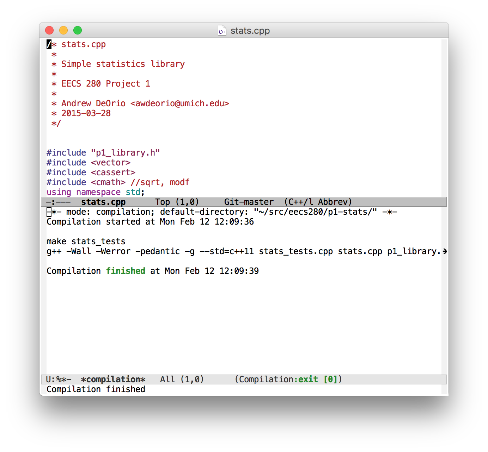
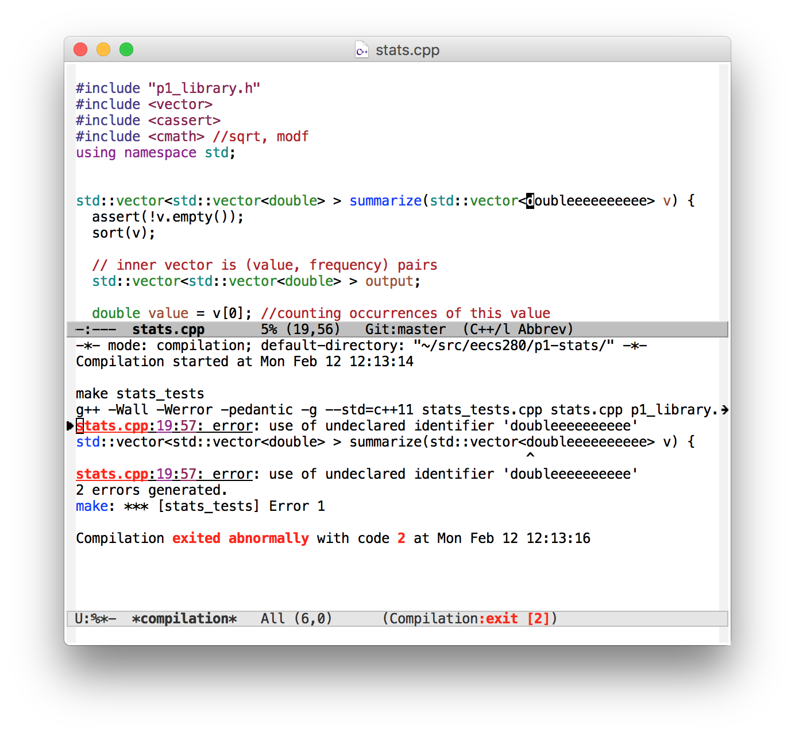

Emacs
=====
{: .primer-spec-toc-ignore }

[Emacs](https://www.gnu.org/software/emacs/) is an extensible, customizable, free, text editor.  It has an IDE mode that works with `gdb` and `lldb`.  It is awdeorio's favorite way to code.  When you are good at Emacs, you can edit code *very* quickly.

This tutorial is intended for Emacs beginners who want to learn a powerful editor and some of its features for working with C++ projects.

Reasons to learn Emacs:
- Endlessly customizable
- Blazing fast code editing.  Once you learn the key bindings, they become second nature.
- IDE-like features with zero project setup
- Optional text-only mode good for remote servers
- Emacs keyboard shortcuts work in many places: command line, GDB prompt, LLDB prompt, Xcode (optional), Visual Studio (optional)


# Quick start
Install.
```console
$ brew install --cask emacs   # macOS
$ sudo apt-get install emacs  # Windows/WSL, Linux
```

Learn keyboard shortcuts with this [Emacs Cheat Sheet for beginners](http://sachachua.com/blog/wp-content/uploads/2013/05/How-to-Learn-Emacs-v2-Large.png).

Get a copy of our beginner `init.el` file and install third party Emacs packages.
```console
$ mkdir ~/.emacs.d
$ wget --no-clobber https://eecs280staff.github.io/tutorials/init.el -O ~/.emacs.d/init.el
$ emacs --batch -l ~/.emacs.d/init.el
```

Start editing files.
```console
$ emacs main.cpp &
```
{: data-variant="no-line-numbers" }


# Prerequisites
At this point, you should already have a folder for your project ([instructions](setup.md#create-a-folder)).  Your folder location might be different.  You should have downloaded and unpacked the starter files already ([instructions](setup.md#download-and-unpack-starter-files)).
```console
$ pwd
/Users/awdeorio/src/eecs280/p1-stats
$ ls
Makefile      main_test.out.correct  p1_library.h           stats_tests.cpp
README.md     main_test_data.tsv     stats.h
main_test.in  p1_library.cpp         stats_public_test.cpp
```


# Restarting this tutorial
If you tried using this tutorial in the past and want to "start clean", here's how to delete all Emacs configuration files.  This will not delete your code.  First, quit Emacs.
```console
$ pwd
/Users/awdeorio/src/eecs280/p1-stats
$ rm -rf ~/.emacs ~/.emacs.d/
$ make clean
rm -rvf main stats_tests stats_public_test *~ *.out *.dSYM *.stackdump
```


# Install
Choose your platform below.

## macOS
Use the [Homebrew package manager](https://brew.sh).
```console
$ brew install --cask emacs
```
{: data-variant="no-line-numbers" }

## Windows/WSL or Linux
Start a Bash shell (not a Windows PowerShell) and then follow the [Ubuntu Linux instructions](#ubuntu-linux).
```console
$ sudo apt-get install emacs
```
{: data-variant="no-line-numbers" }

Caveat: getting GUI Emacs windows to work from inside WSL can be tricky.  Search for "WSL emacs X server" to get started.

## CAEN Linux
Emacs is already installed on CAEN Linux.  See the [Editing remotely with TRAMP](#editing-remotely-with-tramp) pro-tip.

## All platforms
You should have Emacs version 24.4 or higher.
```console
$ emacs --version
GNU Emacs 27.1
```

Start Emacs, and you should see something like this screenshot.
```console
$ emacs
```
{: data-variant="no-line-numbers" }


Quit.  The Emacs notation for this keyboard shortcut is `C-x C-c`.
1. Press and hold `Control`.
2. Press `x` and release it.  Continue holding `Control`.
3. Press `c` and release it.
4. Release `Control`.

### Configure
The out-of-the-box Emacs configuration is terrible.  Some users start with *Spacemacs* or *Doom Emacs*, which are just Emacs shipped with a bunch of customizations.  Many of these users later graduate to vanilla Emacs with their own customizations.  We have provided a starting point for Emacs customization.  The Emacs configuration file is `~/emacs.d/init.el` (formerly `~/.emacs`).

Get a copy of our sample `init.el` and install third party Emacs packages.
```console
$ mkdir -p ~/.emacs.d
$ wget --no-clobber https://eecs280staff.github.io/tutorials/init.el -O ~/.emacs.d/init.el
$ emacs --batch -l ~/.emacs.d/init.el
```

View `init.el` with Emacs.  You should see something like this screenshot.  Notice that the Welcome message is gone.  Quit with `C-x C-c`.
```console
$ emacs ~/.emacs.d/init.el
```
{: data-variant="no-line-numbers" }


# Key bindings
Emacs key bindings may seem byzantine at first, but once you learn them you can edit files *very* quickly.  When Emacs was created, keyboards looked different and today's conventions like cut-copy-paste hadn't been invented yet.


Without keyboard shortcuts, you can run commands by name, for example "save and quit" with `M-x save-buffers-kill-terminal`.
1. Press and hold `Meta` (AKA `Alt` on Windows/Linux, AKA `Option` on macOS).
2. Continue pressing `Meta` and press `x`.
3. Release both keys.
4. You're now in the mini-buffer, where you can type the command `save-buffer`. Tab completion works in the mini-buffer.
5. Press `Return` (`Enter`).

In Emacs documentation, `M` means `Meta` (AKA `Alt` on Windows/Linux, AKA `Option` on macOS) and `C` means `Control`.

`C-x C-s`: Save
1. Press and hold `Control`.
2. Press `x` and release it.  Continue holding `Control`.
3. Press `s` and release it.
4. Release `Control`.

`C-x C-c`: Quit

Learn a few more keyboard shortcuts with this [Emacs Cheat Sheet for beginners](http://sachachua.com/blog/wp-content/uploads/2013/05/How-to-Learn-Emacs-v2-Large.png) and keep around an [Emacs Reference Card](https://www.gnu.org/software/emacs/refcards/pdf/refcard.pdf).

**Pro-tip:** Keep your hands on the keyboard's home row.  Don't use the mouse or the arrow keys.

**Pro-tip:** Remove the menu bars, tool bars and scroll bars by adding this to your `~/emacs.d/init.el`.  You'll get a nice clean look.  Move to end of buffer with `M->`, then paste with `C-y`.  Save and quit (`C-x C-s C-x C-c`).  Restart Emacs to see the changes.
```elisp
;; Remove scrollbars, menu bars, and toolbars
(when (fboundp 'menu-bar-mode) (menu-bar-mode -1))
(when (fboundp 'tool-bar-mode) (tool-bar-mode -1))
(when (fboundp 'scroll-bar-mode) (scroll-bar-mode -1))

;; Dialog settings.  No more typing the whole yes or no. Just y or n
;; will do. Disable GUI dialogs and use emacs text interface.
(fset 'yes-or-no-p 'y-or-n-p)
(setq use-dialog-box nil)
```


<div class="primer-spec-callout warning icon-warning" markdown="1">
**Warning:** You might be tempted to remap Emacs keyboard shortcuts to be more familiar, `M-c` for copy, etc.  Don't do this!  There are thousands of keybindings, and changing them can cause a chain reaction.  For example, `C-c` is already used a prefix for many other commands.
</div>

## Caps lock as control
You'll use the control key a lot in Emacs.  Some users find it more ergonomic to map the Caps Lock key to Control.  Here's the setting in MacOS.


## macOS
On Apple laptops, it's more ergonomic to map Command to Meta and Option to Super.  Add this to your `init.el`.
```elisp
;; macOS modifier keys
(setq mac-command-modifier 'meta) ; Command == Meta
(setq mac-option-modifier 'super) ; Option == Super
```


# Create a project
Emacs doesn't require any special setup for a project.  In this section, we'll add some files to our directory.

## Add new files
EECS 280 project 1 requires us to create two new files: `stats.cpp` and `main.cpp`.

Add a new file in the same way you edit an existing file.  The ampersand (`&`) at the end of a command means "run this command in the background".  That way, you can continue using the command prompt.
```console
$ emacs stats.cpp &
```
{: data-variant="no-line-numbers" }

### Project 1 `stats.cpp`
Edit `stats.cpp` and add placeholder function stubs.  Each of these stubs corresponds to a function prototype in `stats.h`.  Don't forget to save.  The keyboard shortcut for paste is `C-y`, and save is `C-x C-s`.
```c++
// stats.cpp
// Project UID 5366c7e2b77742d5b2142097e51561a5
#include "stats.h"
#include <cassert>
#include <vector>
#include <cmath>
using namespace std;

vector<vector<double> > summarize(vector<double> v) {
  assert(false);
}

int count(vector<double> v) {
  assert(false);
}

double sum(vector<double> v) {
  assert(false);
}

double mean(vector<double> v) {
  assert(false);
}

double median(vector<double> v) {
  assert(false);
}

double mode(vector<double> v) {
  assert(false);
}

double min(vector<double> v) {
  assert(false);
}

double max(vector<double> v) {
  assert(false);
}

double stdev(vector<double> v) {
  assert(false);
}

double percentile(vector<double> v, double p) {
  assert(false);
}
```
{: data-title="stats.cpp" }

### Project 1 `main.cpp`
Start your `main.cpp` like this.

To open a new file while Emacs is already open, use `C-x C-f`, and save with `C-x C-s`.

To switch between files, use `C-x C-b`.  You can select a file with the up and down arrows, or better yet, use `C-n` for next or `C-p` for previous.

```c++
// main.cpp
// Project UID 5366c7e2b77742d5b2142097e51561a5
#include "stats.h"
#include "p1_library.h"
#include <iostream>
using namespace std;

int main() {
  cout << "hello from main!\n";
}
```
{: data-title="main.cpp" }

# Autocomplete
Use built-in Emacs autocomplete with `M-/`.  Cycle through the completion options by holding `M` and continuing to hit `/`.

Use [Company Mode](http://company-mode.github.io/) to provide more complex C++ code completion by simply typing the first 3 characters of a symbol and waiting for a second.  Hit `TAB` to cycle the completion options.  `M-n` and `M-p` for next or previous completion.  You'll see the `company-mode` configuration in `init.el`.


# Compile
Compiling inside Emacs is optional.

## Compile outside Emacs
Compile using the command line.
```console
$ make stats_tests.exe
g++ -Wall -Werror -pedantic -g --std=c++11 stats_tests.cpp stats.cpp p1_library.cpp -o stats_tests.exe
```

<div class="primer-spec-callout warning icon-warning" markdown="1">
**PITFALL:** Debugging will fail if there are no debugging symbols.  Double check the output of `make` and verify that you see `-g` being used in the commands.  The EECS 280 defaults include `-g`.
</div>

## Compile inside Emacs
Optionally, Emacs can run `make stats_tests.exe` for you.  `C-c m` (or `M-x compile`) builds (this keyboard shortcut is set in `init.el`).  Edit the target in the mini-buffer (`stats_tests.exe`) and hit Return.

Emacs will show the compilation output in a separate window.



### Tips
{: .primer-spec-toc-ignore }

`C-c c` (`M-x recompile`) recompile without prompting

`C-x 1` delete all other windows

`C-x 0` delete this window


### Compile errors
{: .primer-spec-toc-ignore }

`M-g n` (`M-x next-error`) navigates to the next error in the source code.

`M-g p` (`M-x previous-error`) navigates to the previous error in the source code.




# Run
Some Emacs users run programs from the terminal.  Open an Emacs window for editing, and a terminal window for compiling and running the program.  The tests fail because of the `assert()` calls in our function stubs.
```console
$ ./stats_tests.exe
test_sum_small_data_set
Assertion failed: (false), function sum, file stats.cpp, line 16.
Abort trap: 6
```

Other Emacs users prefer to run a shell inside Emacs.  Give it a try if you like with `M-x shell`.


# Debug
Emacs provides a user interface for GDB or LLDB.  First, check out the [GDB Tutorial](setup_gdb.html) (Linux and Windows/WSL) or [LLDB Tutorial](setup_lldb.html) (macOS).

Compile the executable you wish to debug.
```console
$ make stats_tests.exe 
g++-10 --std=c++11 -Wall -Werror -pedantic -g stats_tests.cpp stats.cpp p1_library.cpp -o stats_tests.exe
```

Start Emacs.
```console
$ emacs stats_tests.cpp &
```
{: data-variant="no-line-numbers" }

Start debug mode.  Emacs runs GDB or LLDB behind the scenes.

| GDB (Linux/WSL) | LLDB (macOS) |
| - | - |
| `M-x gud-gdb` | `M-x  realgud--lldb` |

**Pro-tip:** try `M-x gdb M-x gdb-many-windows` on Linux/WSL.


Set a breakpoint and run.  GDB and LLDB use very similar commands.  The Emacs window should split.
```
(lldb) b main
(lldb) r
```


Step into a function with `s`.


Move to the next line of code with `n`.  Do this a few times until you reach this line of code.


Print a variable with `p`.


Quit the debugger with `q`.  Then, close the current window pane (the debugger) with `C-x 0`.


# Pro-tips
Tips and tricks for becoming an Emacs wizard.

### Emacs launch shortcut
Add this to your `.bash_profile` (`.bashrc` on some machines) to start Emacs in the background with `e`.  Close your terminal and open it again.
```bash
e ()
{
    emacs "$@" &
}
```

Then you can simply type:
```console
$ e stats.cpp
```
{: data-variant="no-line-numbers" }

### Editing remotely with TRAMP
Emacs [TRAMP](https://www.emacswiki.org/emacs/TrampMode) mode lets you edit a file on a remote server using a local GUI window.

First, make sure you have a copy of your code on CAEN Linux ([CAEN Linux Tutorial](setup_caen.html)).  In particular, make sure you set up SSH multiplexing to avoid repeated 2FA ([Avoiding repeated 2FA Tutorial](setup_caen.html#avoiding-repeated-2fa)).
```console
$ rsync -rtv --exclude '.git*' ../p1-stats/ awdeorio@login.engin.umich.edu:p1-stats-copy/
```
{: data-variant="no-line-numbers" }

Next, configure Emacs TRAMP mode to use SSH multiplexing.  Add this to your `~/.emacs.d/init.el`.
```elisp
;; Remote file editing with TRAMP.  Configure TRAMP to use the same SSH
;; multiplexing that I configure in ~/.ssh/config.  By default, TRAMP ignore my
;; SSH config's multiplexing configuration, so configure the same settings here.
;; https://www.emacswiki.org/emacs/TrampMode
;; https://www.gnu.org/software/emacs/manual/html_node/tramp/Frequently-Asked-Questions.html
(use-package tramp
  :config
  (setq tramp-default-method "ssh")
  (setq tramp-ssh-controlmaster-options
        (concat
         "-o ControlPath=~/.ssh/master-%%r@%%h:%%p "
         "-o ControlMaster=auto -o ControlPersist=yes"))
  :defer 1  ; lazy loading
)
```

Open an Emacs GUI window on your local machine.  It doesn't matter what directory you're in.
```console
$ emacs &
```
{: data-variant="no-line-numbers" }

SSH into your remote server, CAEN Linux in this example.
```console
$ ssh login.engin.umich.edu
...
awdeorio@caen-vnc-vm05 ~
```

Open the file `/ssh:login.engin.umich.edu:p1-stats-copy/main.cpp`.  Recall `C-x C-f` is `find-file`.  Tab completion works in the minibuffer.


Edit the file and save.


On the remote server, change directory into your project.  Compile and run.
```console
$ pwd
/home/awdeorio/p1-stats-copy
$ make main.exe
g++ --std=c++11 -Wall -Werror -pedantic -g main.cpp stats.cpp p1_library.cpp -o main.exe
$ ./main.exe
Hello World!
Added this line from TRAMP mode
```

**Pro-tip:** Debug on the remote machine with `gud-gdb` ([Tutorial](setup_gdb.html)).

<div class="primer-spec-callout warning icon-warning" markdown="1">
**Warning:** Your changes on the remote server will be clobbered when you run `rsync` again.
</div>

### Pair programming with tmux
Pair program on a remote machine with two people inside the same Emacs instance.  We'll use tmux, which is a terminal multiplexer.

Alice connects to a remote server containing her code.  She starts a tmux session named `shared`.  Then, she starts Emacs inside that tmux session.
```console
$ ssh login.engin.umich.edu
$ hostname
caen-vnc-vm05.engin.umich.edu
$ cd p1-stats
$ tmux new -s shared
$ emacs -nw main.cpp
```

Bob connects to the same remote server that Alice did.  He connects to Alice's tmux session named `shared`.  She's already running Emacs, so he sees her Emacs session.
```console
$ ssh caen-vnc-vm05.engin.umich.edu
$ tmux attach -t shared
```

**Pro-tip:** Debug inside the tmux session so everyone on the team can see what's going on.  You can debug with GDB at the command line ([Tutorial](setup_gdb.html)) or inside Emacs.

### Text-only Emacs
If you're on a remote server without a GUI, you can use Emacs in text-only mode.  The `-nw` option stands for "no window".
```console
$ emacs -nw
```
{: data-variant="no-line-numbers" }


#### Fast text-only Emacs install
For a light weight text-only Emacs install on a Linux server, use the `emacs-nox` package.  This is great for small tasks on remote servers.
```console
$ sudo apt-get install emacs-nox
```
{: data-variant="no-line-numbers" }

#### Nano as a fallback
Many servers have two text editors installed by default: `vi` and `nano`.  Because Nano navigation keyboard shortcuts are similar to Emacs, it's a nice alternative for environments where you need to edit some configuration files, but don't want to install anything.
```console
$ nano main.cpp
```
{: data-variant="no-line-numbers" }

#### Dark mode
Of course Emacs has a dark mode. Add the following to your `init.el`.
```elisp
(use-package spacemacs-common
    :ensure spacemacs-theme
    :config (load-theme 'spacemacs-dark t)
    )

```


# Next steps
[Return to the main set up tutorial.](setup.md#text-editor-and-debugger)


# Acknowledgments
Original document written by Andrew DeOrio awdeorio@umich.edu.

This document is licensed under a [Creative Commons Attribution-NonCommercial 4.0 License](https://creativecommons.org/licenses/by-nc/4.0/). You’re free to copy and share this document, but not to sell it. You may not share source code provided with this document.
