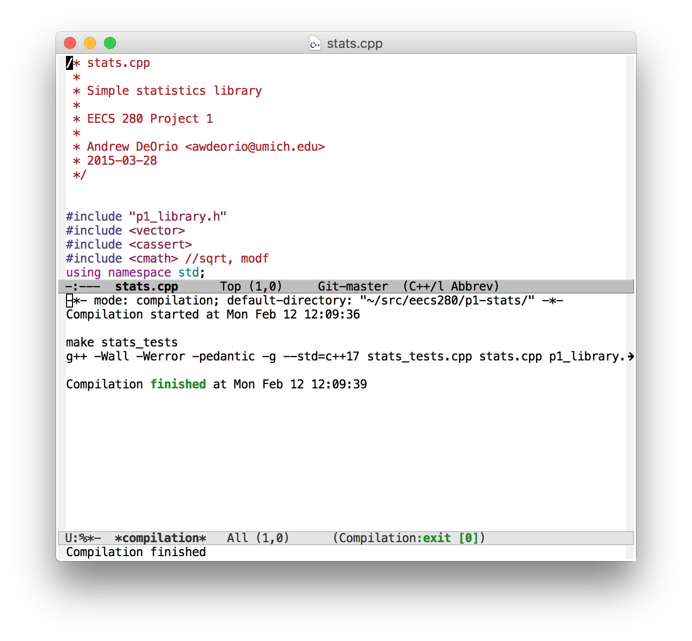

Emacs
=====
{: .primer-spec-toc-ignore }

[Emacs](https://www.gnu.org/software/emacs/) is an extensible, customizable, free, text editor.  It has an IDE mode that works with `gdb` and `lldb`.  It is awdeorio's favorite way to code.  When you are good at Emacs, you can edit code *very* quickly.

This tutorial is intended for Emacs beginners who want to learn a powerful editor and some of its features for working with C++ projects.

Reasons to learn Emacs:
- Endlessly customizable
- Blazing fast code editing.  Once you learn the key bindings, they become second nature.
- IDE-like features with zero project setup
- Optional text-only mode good for remote servers
- Emacs keyboard shortcuts work in many places: command line, GDB prompt, LLDB prompt, Xcode (optional), Visual Studio (optional)


## Quick start
Install.
```console
$ brew install --cask emacs  # macOS
$ sudo apt install emacs     # Windows/WSL, Linux
```

Learn keyboard shortcuts with this [Emacs Cheat Sheet for beginners](http://sachachua.com/blog/wp-content/uploads/2013/05/How-to-Learn-Emacs-v2-Large.png).

Start editing files.
```console
$ emacs main.cpp &
```
{: data-variant="no-line-numbers" }


## Prerequisites
We're going to use external command line tools.  If you haven't installed CLI tools on your machine yet, follow one of these tutorials first.

| [macOS](setup_macos.html)| [Windows](setup_wsl.html) | [Linux](setup_wsl.html#install-cli-tools)

Make sure you have a compiler and a debugger installed.  Your version might be different.  Instructions for installation on [macOS](setup_macos#install-compiler), [Windows/WSL/Linux](setup_wsl.html#install-cli-tools).
```console
$ g++ --version  # macOS
Apple clang version 13.1.6 (clang-1316.0.21.2.5)
$ lldb --version # macOS
Apple Swift version 5.6.1 (swiftlang-5.6.0.323.66 clang-1316.0.20.12)
$ g++ --version  # WSL/Linux
g++ (GCC) 8.5.0 20210514
$ gdb --version  # WSL/Linux
GNU gdb (GDB)
```

Next, follow our [Command line interface (CLI)](cli.html) tutorial.

## Restart
Here's how to delete all Emacs configuration files.  This will not delete your code.  First, quit Emacs.
```console
$ rm -rf ~/.emacs ~/.emacs.d/
```

## Install
Choose your platform below.

When you're done, you should have Emacs version 24.4 or higher.
```console
$ emacs --version
GNU Emacs 27.1
```
### Linux
This works for Ubuntu and other Debian-based distros.
```console
$ sudo apt install emacs
```

### CAEN Linux
Emacs is already installed on CAEN Linux.

### macOS
Use the [Homebrew package manager](https://brew.sh).
```console
$ brew install --cask emacs
```

### Windows/WSL
Start an Ubuntu Bash shell.
```console
$ sudo apt install emacs
```

It will be easier to get GUI Emacs windows to work from inside WSL if you have Windows 11 and WSL 2.

## Start and quit
Start Emacs, and you should see something like this screenshot.
```console
$ emacs
```


Quit.  The Emacs notation for this keyboard shortcut is `C-x C-c`.
1. Press and hold <kbd>Control</kbd>.
2. Press <kbd>x</kbd> and release it.  Continue holding <kbd>Control</kbd>.
3. Press <kbd>c</kbd> and release it.
4. Release <kbd>Control</kbd>.

## Key bindings
Emacs key bindings may seem byzantine at first, but once you learn them you can edit files *very* quickly.  When Emacs was created, keyboards looked different and today's conventions like cut-copy-paste hadn't been invented yet.


Without keyboard shortcuts, you can run commands by name, for example "save and quit" with `M-x save-buffers-kill-terminal`.
1. Press and hold <kbd>Meta</kbd> (AKA <kbd>Alt</kbd> on Windows/Linux, AKA <kbd>Option</kbd> on macOS).
2. Continue pressing <kbd>Meta</kbd> and press <kbd>x</kbd>.
3. Release both keys.
4. You're now in the mini-buffer, where you can type the command `save-buffer`. Tab completion works in the mini-buffer.
5. Press <kbd>Return</kbd> (<kbd>Enter</kbd>).

In Emacs documentation, `M` means <kbd>Meta</kbd> (AKA <kbd>Alt</kbd> on Windows/Linux, AKA <kbd>Option</kbd> on macOS) and `C` means <kbd>Control</kbd>.

`C-x C-s`: Save
1. Press and hold <kbd>Control</kbd>.
2. Press <kbd>x</kbd> and release it.  Continue holding <kbd>Control</kbd>.
3. Press <kbd>s</kbd> and release it.
4. Release <kbd>Control</kbd>.

`C-x C-c`: Quit

Learn a few more keyboard shortcuts with this [Emacs Cheat Sheet for beginners](http://sachachua.com/blog/wp-content/uploads/2013/05/How-to-Learn-Emacs-v2-Large.png) and keep around an [Emacs Reference Card](https://www.gnu.org/software/emacs/refcards/pdf/refcard.pdf).

<div class="primer-spec-callout info" markdown="1">
**Pro-tip:** Keep your hands on the keyboard's home row.  Don't use the mouse or the arrow keys.
</div>

<div class="primer-spec-callout info" markdown="1">
**Pro-tip:** Remove the menu bars, tool bars and scroll bars by adding this to your `~/emacs.d/init.el`.  You'll get a nice clean look.  Move to end of buffer with `M->`, then paste with `C-y`.  Save and quit (`C-x C-s C-x C-c`).  Restart Emacs to see the changes.
```elisp
;; Remove scrollbars, menu bars, and toolbars
(when (fboundp 'menu-bar-mode) (menu-bar-mode -1))
(when (fboundp 'tool-bar-mode) (tool-bar-mode -1))
(when (fboundp 'scroll-bar-mode) (scroll-bar-mode -1))

;; Dialog settings.  No more typing the whole yes or no. Just y or n
;; will do. Disable GUI dialogs and use emacs text interface.
(fset 'yes-or-no-p 'y-or-n-p)
(setq use-dialog-box nil)
```


</div>

<div class="primer-spec-callout warning icon-warning" markdown="1">
**Warning:** You might be tempted to remap Emacs keyboard shortcuts to be more familiar, `M-c` for copy, etc.  Don't do this!  There are thousands of keybindings, and changing them can cause a chain reaction.  For example, `C-c` is already used a prefix for many other commands.
</div>

### Caps lock as control
You'll use the control key a lot in Emacs.  Some users find it more ergonomic to map the Caps Lock key to Control.  Here's the setting in MacOS.


### macOS
On Apple laptops, it's more ergonomic to map Command to Meta and Option to Super.  Add this to your `init.el`.
```elisp
;; macOS modifier keys
(setq mac-command-modifier 'meta) ; Command == Meta
(setq mac-option-modifier 'super) ; Option == Super
```


## Customize
The out-of-the-box Emacs configuration is terrible.  Some users start with *Spacemacs* or *Doom Emacs*, which are just Emacs shipped with a bunch of customizations.  Many of these users later graduate to vanilla Emacs with their own customizations.  Here's [awdeorio's init.el](https://github.com/awdeorio/dotfiles/blob/main/.emacs.d/init.el).

### Basic
Edit `~/emacs.d/init.el` with Emacs.  Yours will probably be blank.
```console
$ emacs ~/.emacs.d/init.el
```


Here are a few basic customizations that you might like.  Paste with `C-y`
```elisp
;; Don't show a startup message
(setq inhibit-startup-message t)

;; Show line and column numbers
(setq line-number-mode t)
(setq column-number-mode t)

;; Show syntax highlighting
(global-font-lock-mode t)

;; Highlight marked regions
(setq-default transient-mark-mode t)

;; Parentheses
(electric-pair-mode 1)                  ; automatically close parentheses, etc.
(show-paren-mode t)                     ; show matching parentheses

;; Smooth scrolling (one line at a time)
(setq scroll-step 1)

;; Tab settings: 2 spaces.  See also: language-specific customizations below.
(setq-default indent-tabs-mode nil)
(setq tab-width 2)

;; Easier buffer switching
(global-set-key "\C-x\C-b" 'electric-buffer-list)
```

### Package manager
Set up [`use-package`](https://github.com/jwiegley/use-package), which automates package installation and configuration.

```elisp
;; Package Management.  Configure the built-in emacs package manager to use
;; several publicly available repositories.
(require 'package)
(setq package-enable-at-startup nil)
(add-to-list 'package-archives '("melpa" . "http://melpa.org/packages/"))
(add-to-list 'package-archives '("gnu" . "http://elpa.gnu.org/packages/"))
(package-initialize)

;; Bootstrap 'use-package' and enable it.  Later, 'use-package- will
;; download and install third-party packages automatically.
;; http://cachestocaches.com/2015/8/getting-started-use-package/
(unless (package-installed-p 'use-package)
  (package-refresh-contents)
  (package-install 'use-package))
(eval-when-compile
  (require 'use-package))
```

### Undo/redo
Emacs default undo is confusing.  [Undo Tree](https://www.emacswiki.org/emacs/UndoTree) provides more intuitive undo and redo.
```elisp
;; More intuitive undo/redo.  M-_ undo, C-M-_ redo
(use-package undo-tree
  :config
  (global-undo-tree-mode)
  (global-set-key "\C-\M-_" 'redo)
  :ensure t
  :defer t
  )
```

### C/C++
Here are some optional packages that you might like for C/C++ programming.

```elisp
;; Intellisense syntax checking
;; http://www.flycheck.org/en/latest/
(use-package flycheck
  :config
  ;; enable in all modes
  (global-flycheck-mode)
  ;; C++11
  (add-hook 'c++-mode-hook (lambda () (setq flycheck-clang-language-standard "c++11")))
  :ensure t
  :defer t
)

;; Autocomplete for code
;; Company docs: https://company-mode.github.io/
;; Company TNG: https://github.com/company-mode/company-mode/issues/526
(use-package company
  :config
  (company-tng-configure-default)       ; use default configuration
  (global-company-mode)
  :ensure t
  :defer t                              ; lazy loading
  )

;; C and C++ programming.  Build with C-c m.  Rebuild with C-c c.  Put
;; this in c-mode-base-map because c-mode-map, c++-mode-map, and so
;; on, inherit from it.
(add-hook 'c-initialization-hook
          (lambda () (define-key c-mode-base-map (kbd "C-c m") 'compile)))
(add-hook 'c-initialization-hook
          (lambda () (define-key c-mode-base-map (kbd "C-c c") 'recompile)))
(setq-default c-basic-offset tab-width) ; indentation
(add-to-list 'auto-mode-alist '("\\.h$" . c++-mode))  ; assume C++ for .h files
```

### Dark mode
Of course Emacs has a dark mode. Add the following to your `init.el`.
```elisp
(use-package spacemacs-common
    :ensure spacemacs-theme
    :config (load-theme 'spacemacs-dark t)
    )

```

## Create a project
Emacs doesn't require any special setup for a project.

Create a new folder for your project. Your folder location might be different.

```console
$ mkdir p1-stats
```

Change into your new project directory. Use the terminal to download, unpack, and move the starter files into your project. Your URL or folder might be different.
```console
$ cd p1-stats
$ wget https://eecs280staff.github.io/p1-stats/starter-files.tar.gz
$ tar -xvzf starter-files.tar.gz
$ mv starter-files/* .
$ rm -rf starter-files starter-files.tar.gz
```

You should see your new files in your project directory.
```console
$ tree
.
├── Makefile
├── main_test.in
├── main_test.out.correct
├── main_test_data.tsv
├── p1_library.cpp
├── p1_library.h
├── stats.h
├── stats_public_test.cpp
└── stats_tests.cpp.starter
```

### Add new files
EECS 280 project 1 requires us to create two new files: `stats.cpp` and `main.cpp`.

Add a new file in the same way you edit an existing file.  The ampersand (`&`) at the end of a command means "run this command in the background".  That way, you can continue using the command prompt.
```console
$ emacs stats.cpp &
```

#### Project 1 `stats.cpp`
Edit `stats.cpp` and add placeholder function stubs.  Each of these stubs corresponds to a function prototype in `stats.h`.  Don't forget to save.  The keyboard shortcut for paste is `C-y`, and save is `C-x C-s`.
```c++
// stats.cpp
// Project UID 5366c7e2b77742d5b2142097e51561a5
#include "stats.h"
#include <cassert>
#include <vector>
#include <cmath>
using namespace std;

vector<vector<double> > summarize(vector<double> v) {
  assert(false);
}

int count(vector<double> v) {
  assert(false);
}

double sum(vector<double> v) {
  assert(false);
}

double mean(vector<double> v) {
  assert(false);
}

double median(vector<double> v) {
  assert(false);
}

double mode(vector<double> v) {
  assert(false);
}

double min(vector<double> v) {
  assert(false);
}

double max(vector<double> v) {
  assert(false);
}

double stdev(vector<double> v) {
  assert(false);
}

double percentile(vector<double> v, double p) {
  assert(false);
}
```
{: data-title="stats.cpp" }

#### Project 1 `main.cpp`
Start your `main.cpp` like this.

To open a new file while Emacs is already open, use `C-x C-f`, and save with `C-x C-s`.

To switch between files, use `C-x C-b`.  You can select a file with the up and down arrows, or better yet, use `C-n` for next or `C-p` for previous.

```c++
// main.cpp
// Project UID 5366c7e2b77742d5b2142097e51561a5
#include "stats.h"
#include "p1_library.h"
#include <iostream>
using namespace std;

int main() {
  cout << "hello from main!\n";
}
```
{: data-title="main.cpp" }

## Autocomplete
Use built-in Emacs autocomplete with `M-/`.  Cycle through the completion options by holding `M` and continuing to hit `/`.

Use [Company Mode](http://company-mode.github.io/) to provide more complex C++ code completion by simply typing the first 3 characters of a symbol and waiting for a second.  Hit `TAB` to cycle the completion options.  `M-n` and `M-p` for next or previous completion.  You'll see the `company-mode` configuration in `init.el`.


## Compile
Compiling inside Emacs is optional.

### Compile outside Emacs
Compile using the command line.
```console
$ make stats_tests.exe
g++ -Wall -Werror -pedantic -g --std=c++11 stats_tests.cpp stats.cpp p1_library.cpp -o stats_tests.exe
```

<div class="primer-spec-callout warning icon-warning" markdown="1">
**PITFALL:** Debugging will fail if there are no debugging symbols.  Double check the output of `make` and verify that you see `-g` being used in the commands.  The EECS 280 defaults include `-g`.
</div>

### Compile inside Emacs
Optionally, Emacs can run `make stats_tests.exe` for you.  `C-c m` (or `M-x compile`) builds (this keyboard shortcut is set in `init.el`).  Edit the target in the mini-buffer (`stats_tests.exe`) and hit Return.

Emacs will show the compilation output in a separate window.



#### Tips
{: .primer-spec-toc-ignore }

`C-c c` (`M-x recompile`) recompile without prompting

`C-x 1` delete all other windows

`C-x 0` delete this window


#### Compile errors
{: .primer-spec-toc-ignore }

`M-g n` (`M-x next-error`) navigates to the next error in the source code.

`M-g p` (`M-x previous-error`) navigates to the previous error in the source code.


## Run
Some Emacs users run programs from the terminal.  Open an Emacs window for editing, and a terminal window for compiling and running the program.  The tests fail because of the `assert()` calls in our function stubs.
```console
$ ./stats_tests.exe
test_sum_small_data_set
Assertion failed: (false), function sum, file stats.cpp, line 16.
Abort trap: 6
```

Other Emacs users prefer to run a shell inside Emacs.  Give it a try if you like with `M-x shell`.


## Debug
Emacs provides a user interface for GDB or LLDB.  First, check out the [GDB Tutorial](setup_gdb.html) (Linux and Windows/WSL) or [LLDB Tutorial](setup_lldb.html) (macOS).

**macOS:** You'll need to install and configure the realgud-lldb package.
```elisp
(use-package realgud
  :ensure t
  )
(use-package realgud-lldb
  :ensure t
  )
```

Compile the executable you wish to debug.
```console
$ make stats_tests.exe 
g++-10 --std=c++11 -Wall -Werror -pedantic -g stats_tests.cpp stats.cpp p1_library.cpp -o stats_tests.exe
```

Start Emacs.
```console
$ emacs stats_tests.cpp &
```

Start debug mode.  Emacs runs GDB or LLDB behind the scenes.

| GDB (Linux/WSL) | LLDB (macOS) |
| - | - |
| `M-x gud-gdb` | `M-x  realgud--lldb` |

**Pro-tip:** try `M-x gdb M-x gdb-many-windows` on Linux/WSL.


Set a breakpoint and run.  GDB and LLDB use very similar commands.  The Emacs window should split.
```
(lldb) b main
(lldb) r
```


Step into a function with `s`.


Move to the next line of code with `n`.  Do this a few times until you reach this line of code.


Print a variable with `p`.


Quit the debugger with `q`.  Then, close the current window pane (the debugger) with `C-x 0`.


## Pro-tips
Tips and tricks for becoming an Emacs wizard.

#### Emacs launch shortcut
Add this to your `.bash_profile` (`.bashrc` on some machines) to start Emacs in the background with `e`.  Close your terminal and open it again.
```bash
e ()
{
    emacs "$@" &
}
```

Then you can simply type:
```console
$ e stats.cpp
```

#### Editing remotely with TRAMP
Emacs [TRAMP](https://www.emacswiki.org/emacs/TrampMode) mode lets you edit a file on a remote server using a local GUI window.

First, make sure you have a copy of your code on CAEN Linux ([CAEN Linux Tutorial](setup_caen.html)).  In particular, make sure you set up SSH multiplexing to avoid repeated 2FA ([Avoiding repeated 2FA Tutorial](setup_caen.html#avoiding-repeated-2fa)).
```console
$ rsync -rtv --exclude '.git*' ../p1-stats/ awdeorio@login.engin.umich.edu:p1-stats-copy/
```

Next, configure Emacs TRAMP mode to use SSH multiplexing.  Add this to your `~/.emacs.d/init.el`.
```elisp
;; Remote file editing with TRAMP.  Configure TRAMP to use the same SSH
;; multiplexing that I configure in ~/.ssh/config.  By default, TRAMP ignore my
;; SSH config's multiplexing configuration, so configure the same settings here.
;; https://www.emacswiki.org/emacs/TrampMode
;; https://www.gnu.org/software/emacs/manual/html_node/tramp/Frequently-Asked-Questions.html
(use-package tramp
  :config
  (setq tramp-default-method "ssh")
  (setq tramp-ssh-controlmaster-options
        (concat
         "-o ControlPath=~/.ssh/master-%%r@%%h:%%p "
         "-o ControlMaster=auto -o ControlPersist=yes"))
  :defer 1  ; lazy loading
)
```

Open an Emacs GUI window on your local machine.  It doesn't matter what directory you're in.
```console
$ emacs &
```

SSH into your remote server, CAEN Linux in this example.
```console
$ ssh login.engin.umich.edu
...
awdeorio@caen-vnc-vm05 ~
```

Open the file `/ssh:login.engin.umich.edu:p1-stats-copy/main.cpp`.  Recall `C-x C-f` is `find-file`.  Tab completion works in the minibuffer.


Edit the file and save.


On the remote server, change directory into your project.  Compile and run.
```console
$ pwd
/home/awdeorio/p1-stats-copy
$ make main.exe
g++ --std=c++11 -Wall -Werror -pedantic -g main.cpp stats.cpp p1_library.cpp -o main.exe
$ ./main.exe
Hello World!
Added this line from TRAMP mode
```

**Pro-tip:** Debug on the remote machine with `gud-gdb` ([Tutorial](setup_gdb.html)).

<div class="primer-spec-callout warning icon-warning" markdown="1">
**Warning:** Your changes on the remote server will be clobbered when you run `rsync` again.
</div>

#### Pair programming with tmux
Pair program on a remote machine with two people inside the same Emacs instance.  We'll use tmux, which is a terminal multiplexer.

Alice connects to a remote server containing her code.  She starts a tmux session named `shared`.  Then, she starts Emacs inside that tmux session.
```console
$ ssh login.engin.umich.edu
$ hostname
caen-vnc-vm05.engin.umich.edu
$ cd p1-stats
$ tmux new -s shared
$ emacs -nw main.cpp
```

Bob connects to the same remote server that Alice did.  He connects to Alice's tmux session named `shared`.  She's already running Emacs, so he sees her Emacs session.
```console
$ ssh caen-vnc-vm05.engin.umich.edu
$ tmux attach -t shared
```

**Pro-tip:** Debug inside the tmux session so everyone on the team can see what's going on.  You can debug with GDB at the command line ([Tutorial](setup_gdb.html)) or inside Emacs.

#### Text-only Emacs
If you're on a remote server without a GUI, you can use Emacs in text-only mode.  The `-nw` option stands for "no window".
```console
$ emacs -nw
```


##### Fast text-only Emacs install
For a light weight text-only Emacs install on a Linux server, use the `emacs-nox` package.  This is great for small tasks on remote servers.
```console
$ sudo apt-get install emacs-nox
```

##### Nano as a fallback
Many servers have two text editors installed by default: `vi` and `nano`.  Because Nano navigation keyboard shortcuts are similar to Emacs, it's a nice alternative for environments where you need to edit some configuration files, but don't want to install anything.
```console
$ nano main.cpp
```

## Acknowledgments
Original document written by Andrew DeOrio awdeorio@umich.edu.

This document is licensed under a [Creative Commons Attribution-NonCommercial 4.0 License](https://creativecommons.org/licenses/by-nc/4.0/). You’re free to copy and share this document, but not to sell it. You may not share source code provided with this document.
