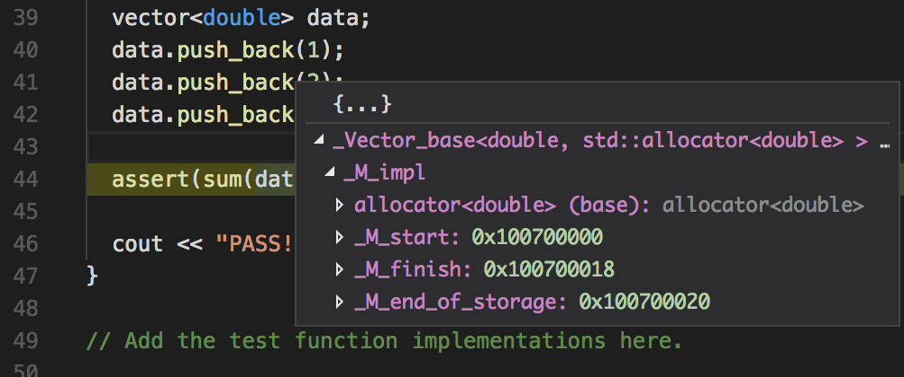

GDB Tutorial
============
{: .primer-spec-toc-ignore }

[GDB](https://www.gnu.org/software/gdb/) is a command line debugger.  It is a good choice on Linux or WSL.  On macOS, use LLDB instead ([LLDB Tutorial](setup_lldb.html)).

GDB is harder to learn compared to most visual debuggers.  However, you might want to use GDB in situations like these:
- Zero setup compared to Visual Studio or VS Code.  Fast and easy debugging once you've learned.
- Integration with Vim and Emacs
- Command line only, work on a remote server without a GUI
- Support for threads (used in EECS 482 Operating Systems)
- Support for connecting to a remote target like an operating system that has crashed so badly you can't use the keyboard or monitor

GDB uses commands.  Here's a handy [reference card](http://users.ece.utexas.edu/~adnan/gdb-refcard.pdf).


## Quick Start
Compile your program with the `-g` flag and start GDB in text user interface (TUI) mode.
```console
$ make main.exe
g++ -Wall -Werror -pedantic -g --std=c++11 main.cpp -o main.exe
$ gdb -tui main.exe
```

| `b main` | breakpoint on main function |
| `b 13` | breakpoint on line 13 of current file |
| `b main.cpp:13` | breakpoint on line 13 of main.cpp |
| `r` | run or rerun |
| `n` | step over (AKA next) |
| `s` | step into |
| `up` | step out |
| `c` | continue |
| `p myvar` | print variable `myvar` |
| `refresh` | refresh TUI view |
| `q` | quit |


## Install
You should already have `g++` and `gdb` installed from the [WSL tutorial](setup_wsl.html).  Your versions might be different.
```console
$ g++ --version
g++ (Ubuntu 9.3.0-17ubuntu1~20.04) 9.3.0
$ gdb --version
GNU gdb (Ubuntu 9.2-0ubuntu1~20.04) 9.2
```

## Compile and Run
GDB uses an executable you build at the command line.

First, compile and run your executable at the command line.
```console
$ make main.exe
$ ./main.exe
Hello World!
```

<div class="primer-spec-callout warning icon-warning" markdown="1">
**Pitfall:** GDB debugging will be very hard to understand if there are no debugging symbols.  Double check the output of `make` and verify that you see `-g`.
</div>

Run with GDB.  You now see the GDB prompt.  GDB's interface is similar to your command line shell, where you enter commands and press Enter (Return).
```
$ gdb main.exe
Reading symbols from main.exe...
(gdb)
```
{: data-highlight="1" }

The `r` command runs the program.
```
(gdb) r
FIXME
```
{: data-highlight="1" }

Quit with `q`.  **Pro-tip:** `Control-D` will also quit at any time.
```
(gdb) q
```
{: data-highlight="1" }

FIXME `bt` example.

### Sanitizers
We recommend enabling the address sanitizer and undefined behavior sanitizer. These will help you find memory errors like going off the end of an array or vector.

First, edit your `Makefile` and add the `CXXFLAGS` recommended by the [ASAN Quick Start](setup_asan.html#quick-start).

### Input redirection
If you're unfamiliar with input redirection, first read the CLI tutorial section on [input redirection](cli.html#input-redirection-).

Run with input redirection.  Make sure to add the name of your input file (`main_test.in` in this example).
```
$ gdb main.exe
...
(gdb) r < main_test.in
...
```

### Arguments and options
Arguments and options are inputs to a program typed at the command line.  Here's an example from EECS 280 Project 5:
```console
$ ./main.exe train_small.csv test_small.csv --debug
```
{: data-variant="no-line-numbers" data-highlight="1" }

- `main.exe` is the name of the program
- `train_small.csv` and `test_small.csv` are arguments
- `--debug` is an option

To run a program with options or arguments in LLDB, include them after `r`.
```console
$ gdb main.exe
(gdb) r train_small.csv test_small.csv --debug
```
{: data-highlight="2" }


FIXME BOOKMARK
-------------------------------------------------------------------------------
Use the back trace command (`bt`) to see the stack at the time of failure.  You can ignore all the standard library functions.  Just pay attention to functions that you wrote.  This is a great way to get a quick look at the root cause of a segfault.
```
(gdb) bt
#0  ...
#1  ...
#2  ...
#3  ...
#4  0x0000555555559244 in sum (v=std::vector of length 3, capacity 3 = {...})
    at stats.cpp:16
#5  0x0000555555557a5c in test_sum_small_data_set () at stats_tests.cpp:47
#6  0x0000555555557996 in main () at stats_tests.cpp:30
```

## Debug
Start GDB with your executable.
```console
$ gdb stats_tests.exe
GNU gdb (Ubuntu 9.2-0ubuntu1~20.04) 9.2
...
Reading symbols from stats_tests.exe...
(gdb)
```

Set a breakpoint on the main function (`b main`) and run the program (`r`).
```
(gdb) b main
Breakpoint 1 at 0x3989: file stats_tests.cpp, line 29.
(gdb) r
Starting program: /home/awdeorio/src/eecs280/p1-stats/stats_tests.exe

Breakpoint 1, main () at stats_tests.cpp:29
29  {
```

**Pro-tip**: `start` is a shortcut for `b main` followed by `r`.

**Pro-tip**: Other ways to set breakpoints:

| `b main` | breakpoint on main function |
| `b 29` | breakpoint on line 29 of current file |
| `b stats.cpp:16` | breakpoint on line 16 of stats.cpp |

Step over to the next line of code with `n`, do this twice.  Our test fails because we haven't implemented `sum()` yet.  You can ignore any error about "raise.c: No such file or directory.".
```
(gdb) n
30    test_sum_small_data_set();
(gdb) n
test_sum_small_data_set
stats_tests.exe: stats.cpp:16: double sum(std::vector<double>): Assertion `false' failed.

Program received signal SIGABRT, Aborted.
```

Rerun the program.
```
(gdb) r
The program being debugged has been started already.
Start it from the beginning? (y or n) y
Starting program: /home/awdeorio/src/eecs280/p1-stats/stats_tests.exe

Breakpoint 1, main () at stats_tests.cpp:29
29  {
```

Step over to the next line of code (`n`), then step into the function with `s`.
```
(gdb) n
30    test_sum_small_data_set();
(gdb) s
test_sum_small_data_set () at stats_tests.cpp:39
39  {
```

List a few lines of surrounding code with `l` (that's a lowercase `L`).
```
(gdb) l
34
35    return 0;
36  }
37
38  void test_sum_small_data_set()
39  {
40    cout << "test_sum_small_data_set\n";
41
42    vector<double> data;
43    data.push_back(1);
```

Step over to the next line of code (`n`) a couple times until you're on this line of code.  **Pro-tip:** just hit Enter to repeat your previous command.
```
(gdb) n
40    cout << "test_sum_small_data_set\n";
(gdb) n
test_sum_small_data_set
42    vector<double> data;
(gdb) n
43    data.push_back(1);
(gdb) n
44    data.push_back(2);
(gdb) n
45    data.push_back(3);
(gdb) n
47    assert(sum(data) == 6);
```

Print the value of a variable with `p`.  If you have trouble viewing the contents of the `vector` in the previous step, see the [Pretty Printing STL Containers with `gdb`](#pretty-printing-stl-containers-with-gdb) section.
```
(gdb) p data
$3 = std::vector of length 3, capacity 4 = {1, 2, 3}
```

Quit.  **Pro-tip:** `Control-D` will quit, and a second `Control-D` will confirm the `y or n` prompt.
```
(gdb) q
A debugging session is active.

  Inferior 1 [process 1090] will be killed.

Quit anyway? (y or n) y
```


## Debug with TUI mode
Start GDB in TUI mode with your executable and hit Enter a few times until you see the `(gdb)` prompt.  TUI mode shows your source code at the top with a GDB prompt at the bottom.  It uses the [ncurses](https://en.wikipedia.org/wiki/Ncurses) library for text-based user interfaces.
```
$ gdb -tui stats_tests.exe
┌──stats_tests.cpp─────────────────────────────────────────────────────────────┐
│   29          {                                                              │
│   30            test_sum_small_data_set();                                   │
│   31            test_sum_small_data_set();                                   │
│   32                                                                         │
│   33            // Call your test functions here                             │
│   34                                                                         │
│   35            return 0;                                                    │
│   36          }                                                              │
│   37                                                                         │
│   38          void test_sum_small_data_set()                                 │
│   39          {                                                              │
│   40            cout << "test_sum_small_data_set\n";                         │
│   41                                                                         │
└──────────────────────────────────────────────────────────────────────────────┘
exec No process In:                                                L??   PC: ??
Find the GDB manual and other documentation resources online at:
    <http://www.gnu.org/software/gdb/documentation/>.

For help, type "help".
--Type <RET> for more, q to quit, c to continue without paging--
Type "apropos word" to search for commands related to "word"...
Reading symbols from stats_tests.exe...
(gdb)
```

Set a breakpoint on the main function (`b main`) and run the program (`r`).
```
┌──stats_tests.cpp─────────────────────────────────────────────────────────────┐
│B+>29          {                                                              │
│   30            test_sum_small_data_set();                                   │
│   31            test_sum_small_data_set();                                   │
│   32                                                                         │
│   33            // Call your test functions here                             │
│   34                                                                         │
│   35            return 0;                                                    │
│   36          }                                                              │
│   37                                                                         │
│   38          void test_sum_small_data_set()                                 │
│   39          {                                                              │
│   40            cout << "test_sum_small_data_set\n";                         │
│   41                                                                         │
└──────────────────────────────────────────────────────────────────────────────┘
native process 1154 In: main                           L29   PC: 0x555555557989
Reading symbols from stats_tests.exe...
(gdb) b main
Breakpoint 1 at 0x3989: file stats_tests.cpp, line 29.
(gdb) r
Starting program: /vagrant/src/eecs280/p1-stats-awdeorio/stats_tests.exe

Breakpoint 1, main () at stats_tests.cpp:29
(gdb)
```

**Pro-tip**: `start` is a shortcut for `b main` followed by `r`.

**Pro-tip**: Other ways to set breakpoints:

| `b main` | breakpoint on main function |
| `b 29` | breakpoint on line 29 of current file |
| `b stats.cpp:16` | breakpoint on line 16 of stats.cpp |

Step over to the next line of code with `n` and notice the line cursor `>` advance.
```
┌──stats_tests.cpp─────────────────────────────────────────────────────────────┐
│B+ 29          {                                                              │
│  >30            test_sum_small_data_set();                                   │
│   31            test_sum_small_data_set();                                   │
│   32                                                                         │
│   33            // Call your test functions here                             │
│   34                                                                         │
│   35            return 0;                                                    │
│   36          }                                                              │
│   37                                                                         │
│   38          void test_sum_small_data_set()                                 │
│   39          {                                                              │
│   40            cout << "test_sum_small_data_set\n";                         │
│   41                                                                         │
└──────────────────────────────────────────────────────────────────────────────┘
native process 1161 In: main                           L30   PC: 0x555555557991
(gdb) b main
Breakpoint 1 at 0x3989: file stats_tests.cpp, line 29.
(gdb) r
Starting program: /vagrant/src/eecs280/p1-stats-awdeorio/stats_tests.exe

Breakpoint 1, main () at stats_tests.cpp:29
(gdb) n
(gdb)
```

Again, step over to the next line code with `n`.  Our test fails because we haven't implemented `sum()` yet.  You can ignore any error about "raise.c: No such file or directory.".
```
...
stats_tests.exe: stats.cpp:16: double sum(std::vector<double>): Assertion `false' failed.

Program received signal SIGABRT, Aborted.
```

Refresh the TUI interface and rerun the program.  Sometimes, a crash can cause random characters to appear in TUI mode, which is why we use `refresh`.
```
(gdb) refresh
(gdb) r
The program being debugged has been started already.
Start it from the beginning? (y or n) y
```

At this point, you should be back at the breakpoint on `main` that you set earlier.
```
┌──stats_tests.cpp─────────────────────────────────────────────────────────────┐
│B+>29          {                                                              │
│   30            test_sum_small_data_set();                                   │
│   31            test_sum_small_data_set();                                   │
│   32                                                                         │
│   33            // Call your test functions here                             │
│   34                                                                         │
│   35            return 0;                                                    │
│   36          }                                                              │
│   37                                                                         │
│   38          void test_sum_small_data_set()                                 │
│   39          {                                                              │
│   40            cout << "test_sum_small_data_set\n";                         │
│   41                                                                         │
└──────────────────────────────────────────────────────────────────────────────┘
native process 1209 In: main                           L29   PC: 0x555555557989
(gdb) refresh
(gdb) r
The program being debugged has been started already.
Start it from the beginning? (y or n) y
Starting program: /vagrant/src/eecs280/p1-stats-awdeorio/stats_tests.exe

Breakpoint 1, main () at stats_tests.cpp:29
(gdb)
```

Step over to the next line of code (`n`), then step into the function with `s`.
```
┌──stats_tests.cpp─────────────────────────────────────────────────────────────┐
│B+ 29          {                                                              │
│   30            test_sum_small_data_set();                                   │
│   31            test_sum_small_data_set();                                   │
│   32                                                                         │
│   33            // Call your test functions here                             │
│   34                                                                         │
│   35            return 0;                                                    │
│   36          }                                                              │
│   37                                                                         │
│   38          void test_sum_small_data_set()                                 │
│  >39          {                                                              │
│   40            cout << "test_sum_small_data_set\n";                         │
│   41                                                                         │
└──────────────────────────────────────────────────────────────────────────────┘
native process 1209 In: test_sum_small_data_set        L39   PC: 0x5555555579a2
Start it from the beginning? (y or n) y
Starting program: /vagrant/src/eecs280/p1-stats-awdeorio/stats_tests.exe

Breakpoint 1, main () at stats_tests.cpp:29
(gdb) n
(gdb) s
test_sum_small_data_set () at stats_tests.cpp:39
(gdb)
```

Step over to the next line of code (`n`) a couple times until you're on this line of code.  If the user interface ever starts to look messed up, just `refresh` it.  **Pro-tip:** just hit Enter to repeat your previous command.
```
┌──stats_tests.cpp─────────────────────────────────────────────────────────────┐
│   42            vector<double> data;                                         │
│   43            data.push_back(1);                                           │
│   44            data.push_back(2);                                           │
│   45            data.push_back(3);                                           │
│   46                                                                         │
│  >47            assert(sum(data) == 6);                                      │
│   48                                                                         │
│   49            cout << "PASS!\n";                                           │
│   50          }                                                              │
│   51                                                                         │
│   52          // Add the test function implementations here.                 │
│                                                                              │
│                                                                              │
└──────────────────────────────────────────────────────────────────────────────┘
native process 1209 In: test_sum_small_data_set        L47   PC: 0x555555557a3d
(gdb) n
(gdb) n
(gdb) n
(gdb) n
(gdb) n
(gdb) n
(gdb) refresh
(gdb)
```

Print the value of a variable with `p`.  If you have trouble viewing the contents of the `vector` in the previous step, see the [Pretty Printing STL Containers with `gdb`](#pretty-printing-stl-containers-with-gdb) section.
```
(gdb) p data
$3 = std::vector of length 3, capacity 4 = {1, 2, 3}
```

Quit.  **Pro-tip:** `Control-D` will quit, and a second `Control-D` will confirm the `y or n` prompt.
```
(gdb) q
A debugging session is active.

  Inferior 1 [process 1090] will be killed.

Quit anyway? (y or n) y
```


## Pro-tips
Use the up arrow key to cycle through previously used commands.

Use TAB completion to automatically complete the name of a command or a variable.

Use Emacs keyboard shortcuts to enter and edit your current command.


## Pretty-printing STL Containers with `gdb`
Some installations of `gdb` don't ship with pretty printing support for STL containers like `vector`.

If you have this problem, you'll see something like this when you try to view the contents of a `vector` while debugging in GDB or VS Code (some VS Code configurations use GDB under the hood).




Install Subversion and Python.

Get the GDB STL pretty printers. These are written in Python.
```console
$ mkdir ~/.gdb.d/
$ svn co svn://gcc.gnu.org/svn/gcc/trunk/libstdc++-v3/python ~/.gdb.d/python
```

Use this command to create a `.gdbinit` file in your home directory.
```console
$ echo -e 'python\nimport os\nimport sys\nsys.path.insert(0, os.path.expanduser("~/.gdb.d/python"))\nfrom libstdcxx.v6.printers import register_libstdcxx_printers\nregister_libstdcxx_printers (None)\nend' > ~/.gdbinit
```
{: data-variant="no-line-numbers" }

Double check everything:
```console
$ cat ~/.gdbinit
python
import os
import sys
sys.path.insert(0, os.path.expanduser("~/.gdb.d/python"))
from libstdcxx.v6.printers import register_libstdcxx_printers
register_libstdcxx_printers (None)
end
$ ls -R ~/.gdb.d/
/Users/awdeorio/.gdb.d/:
python

/Users/awdeorio/.gdb.d/python:
Makefile.am  Makefile.in  hook.in  libstdcxx

/Users/awdeorio/.gdb.d/python/libstdcxx:
__init__.py  v6

/Users/awdeorio/.gdb.d/python/libstdcxx/v6:
__init__.py  printers.py  xmethods.py
```

Finally, restart GDB or VS Code and try to check the contents of vector
again.


## Acknowledgments
Original document written by Andrew DeOrio awdeorio@umich.edu.

This document is licensed under a [Creative Commons Attribution-NonCommercial 4.0 License](https://creativecommons.org/licenses/by-nc/4.0/). You’re free to copy and share this document, but not to sell it. You may not share source code provided with this document.
