Setting Up Version Control
==========================
{: .primer-spec-toc-ignore }

This how-to will walk you through setting up a Git repository and using it to collaborate with a partner.

<div class="primer-spec-callout info" markdown="1">
If you've used version control before on your computer, skip to the [Create a local repository](#create-a-local-repository) section.
</div>

## Prerequisites
We're assuming that you already have a folder with starter source code in it, e.g., `p1-stats/`.
```console
$ pwd
/Users/awdeorio/src/eecs280/p1-stats
$ ls -A
Makefile      main_test.out.correct  p1_library.h  stats_public_test.cpp
main.cpp      main_test_data.tsv     stats.cpp     stats_tests.cpp
main_test.in  p1_library.cpp         stats.h
```

You have installed `git`.  Your version might be different.
```console
$ git --version
git version 2.15.1
```

## Restarting this tutorial
If you tried using this tutorial in the past and want to start over, here's how to delete the files created by `git` and how to remove your repository from GitLab.

First, remove your GitLab repository.  Browse to your repository's project page from [https://gitlab.eecs.umich.edu/](https://gitlab.eecs.umich.edu/).  Select "Settings" -> "Advanced Settings" -> "Delete Project".

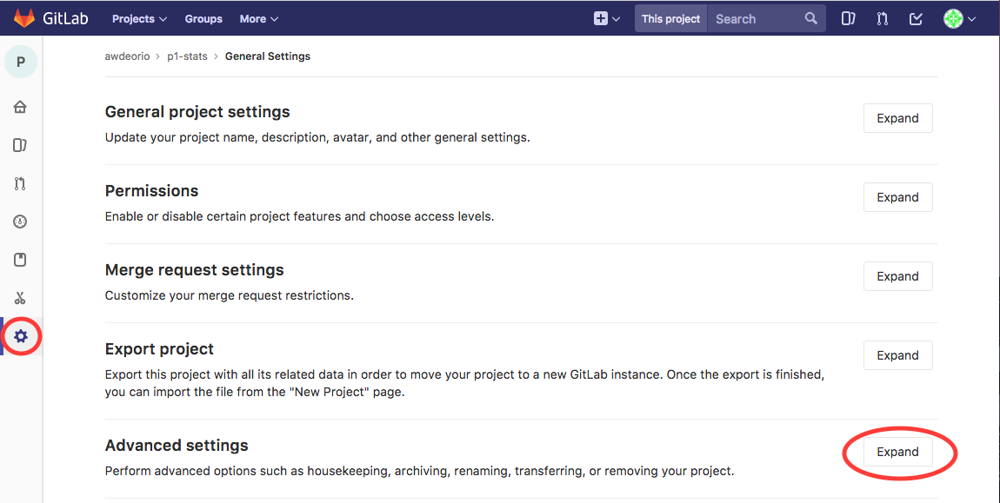

...

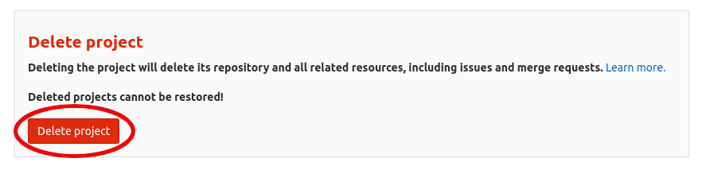

Next, remove the hidden files created by `git`.  Remember, hidden files start with a dot (`.`).
```console
$ pwd
/Users/awdeorio/src/eecs280/p1-stats
$ rm -rf .git/ .gitignore
$ ls -A
Makefile      main_test.out.correct  p1_library.h  stats_public_test.cpp
main.cpp      main_test_data.tsv     stats.cpp     stats_tests.cpp
main_test.in  p1_library.cpp         stats.h
```

Confirm that this is no longer a git repository.
```console
$ git status
fatal: Not a git repository (or any of the parent directories): .git
```

## Prerequisites
This tutorial uses command line tools.  If you haven't installed CLI tools on your machine yet, follow one of these tutorials first.

| [macOS](setup_macos.html)| [Windows](setup_wsl.html) | [Linux](setup_wsl.html#install-cli-tools)

Verify that `git` is installed.  Your version might be different.
```console
$ git --version
git version 2.15.1
```

#### Configure your name and email
{: .primer-spec-toc-ignore }
This sets the `git` preferences for your local machine.  These settings apply to all repos on your computer.  You only have to do this once, but repeating these commands won't hurt anything.  Be sure to use your own uniqname and email address
```console
$ git config --global user.name "Andrew DeOrio"         # Your name
$ git config --global user.email "awdeorio@umich.edu"   # Your email
```

<div class="primer-spec-callout warning" markdown="1">
Confirm that your settings are correct.  You may see other settings.
```console
$ git config --global --list
user.name=Andrew DeOrio        # Your name
user.email=awdeorio@umich.edu  # Your uniqname
```
</div>

## Create a local repository
Navigate to your project directory and clean up any binary files using `make clean`.  You should see your starter files.
```console
$ pwd
/Users/awdeorio/src/eecs280/p1-stats
$ make clean
$ ls
Makefile      main_test.out.correct  p1_library.h  stats_public_test.cpp
main.cpp      main_test_data.tsv     stats.cpp     stats_tests.cpp
main_test.in  p1_library.cpp         stats.h
```

Next, add a `.gitignore` file.  This will prevent Git from controlling files like compiled binaries.  We have a sample for you to download.  It's a hidden file (starts with a dot `.`), so you'll need to use `ls -A` to see it.  This sample is pre-configured to work with most C++ projects, so use the same sample file for all EECS 280 projects.
```console
$ wget https://eecs280staff.github.io/tutorials/dot_gitignore_sample -O .gitignore
$ ls -A
.gitignore     ...
```

<div class="primer-spec-callout warning" markdown="1">
Double-check that you have a `.gitignore` file.
```console
$ head .gitignore
# This is a sample .gitignore file that's useful for C++ projects.
...
```
</div>

Initialize the repo and make sure that the main branch is named `main`.  You'll see that all the files in our directory are currently untracked.

```console
$ git init
Initialized empty Git repository in /Users/awdeorio/src/eecs280/p1-stats/.git/
$ git checkout -b main
Switched to a new branch 'main'
$ git status
On branch main

No commits yet

Untracked files:
  (use "git add <file>..." to include in what will be committed)

	.gitignore
	Makefile
	main.cpp
	main_test.in
	main_test.out.correct
	main_test_data.tsv
	p1_library.cpp
	p1_library.h
	stats.cpp
	stats.h
	stats_public_test.cpp
	stats_tests.cpp

nothing added to commit but untracked files present (use "git add" to track)
```

#### Add existing files to version control
{: .primer-spec-toc-ignore }
Add all the files in this directory.  See that they are ready to be committed.
```console
$ git add .
$ git status
On branch main

No commits yet

Changes to be committed:
  (use "git rm --cached <file>..." to unstage)

	new file:   .gitignore
	new file:   Makefile
	new file:   main.cpp
	new file:   main_test.in
	new file:   main_test.out.correct
	new file:   main_test_data.tsv
	new file:   p1_library.cpp
	new file:   p1_library.h
	new file:   stats.cpp
	new file:   stats.h
	new file:   stats_public_test.cpp
	new file:   stats_tests.cpp
```

Commit the added files to the local repo with the commit message "Initial commit.  Starter files with function stubs.".
```console
$ git commit -m "Initial commit.  Starter files with function stubs."
[main (root-commit) c19cc98] Initial commit.  Starter files with function stubs.
 12 files changed, 776 insertions(+)
 create mode 100644 .gitignore
 create mode 100644 Makefile
 create mode 100644 main.cpp
 create mode 100644 main_test.in
 create mode 100644 main_test.out.correct
 create mode 100644 main_test_data.tsv
 create mode 100644 p1_library.cpp
 create mode 100644 p1_library.h
 create mode 100644 stats.cpp
 create mode 100644 stats.h
 create mode 100644 stats_public_test.cpp
 create mode 100644 stats_tests.cpp
$ git status
On branch main
nothing to commit, working tree clean
```

View the commit log and see our first commit.
```console
$ git log
commit a13e2521fab6488458c912f598d6d5f89d429484 (HEAD -> main)
Author: Andrew DeOrio <awdeorio@umich.edu>
Date:   Fri Jan 12 15:59:25 2018 -0500

    Initial commit.  Starter files with function stubs.
```

<div class="primer-spec-callout warning icon-warning" markdown="1">
Verify you didn't accidentally commit automatically generated or binary files.
```console
$ git ls-files
...
main.exe
main.exe.dSYM/Contents/Info.plist
main.exe.dSYM/Contents/Resources/DWARF/main.exe
...
```

First, double-check your `.gitignore`.  Go [back](http://localhost:4000/setup_git.html#create-a-local-repository) if necessary and re-download it.
```console
$ head .gitignore
# This is a sample .gitignore file that's useful for C++ projects.
...
```

Then, remove the offending binary files and folders and commit.
```console
$ git rm -f main.exe
$ git rm -rf main.exe.dSYM
$ git status
On branch main
Changes to be committed:
  (use "git restore --staged <file>..." to unstage)
	deleted:    main.exe
	deleted:    main.exe.dSYM/Contents/Info.plist
	deleted:    main.exe.dSYM/Contents/Resources/DWARF/main.exe
$ git commit -m "remove binary files"
$ git status
On branch main
nothing to commit, working tree clean
```
</div>

## Create a remote repository
First, log in to [https://gitlab.eecs.umich.edu/](https://gitlab.eecs.umich.edu/users/sign_in).  It's a Git server run by the EECS department and all UM students should have a login.

Create a new project

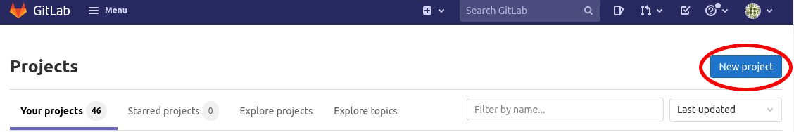

Select "Create blank project".

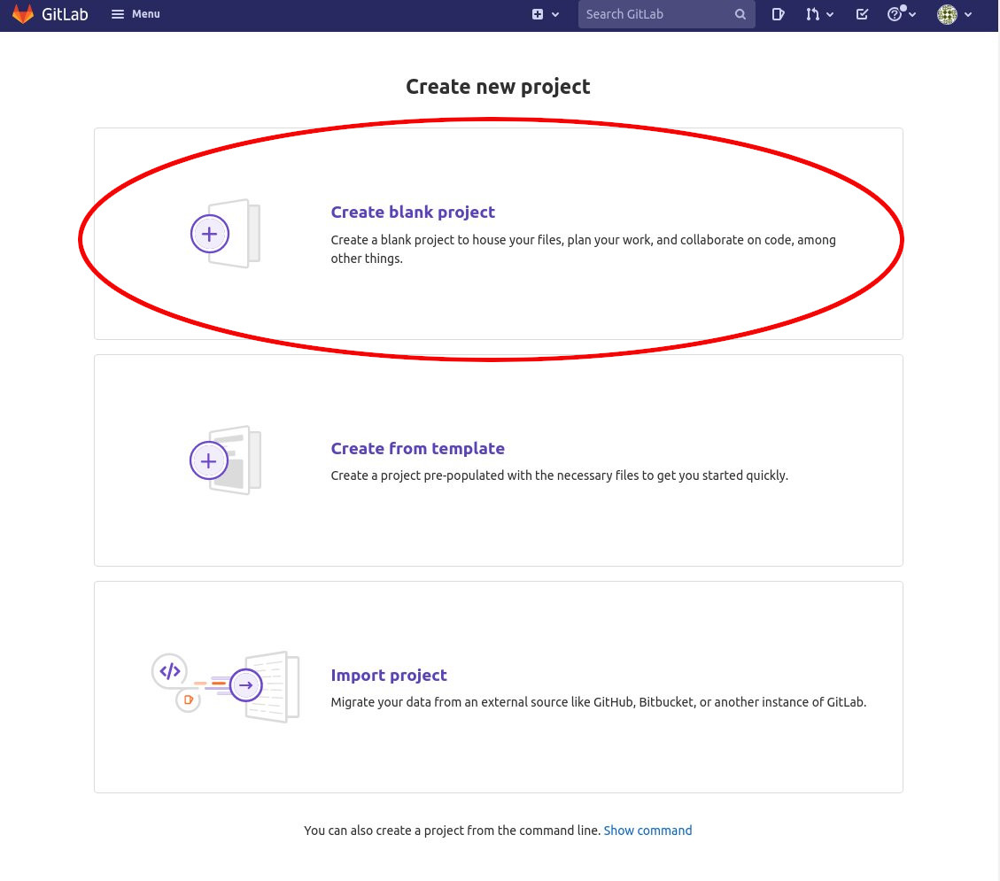

Call the new project `p1-stats`, mark it as "private". Then uncheck the "Initialize repository with a README" box. Click "Create".

**Double check that you have selected "private".** Making your project code or test cases publicly available online is a violation of the honor code.

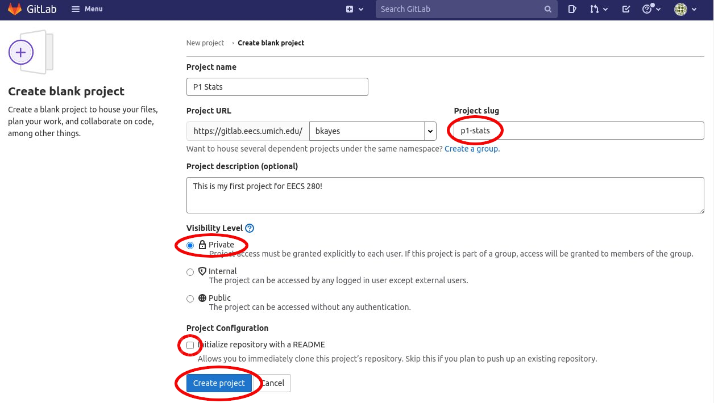

You now have a project page for your remote repo.  In this example, awdeorio's project page is [https://gitlab.eecs.umich.edu/awdeorio/p1-stats](https://gitlab.eecs.umich.edu/awdeorio/p1-stats).  You won't have access to it because it's private, but your page should look similar.


#### Connect local repo to remote repo
{: .primer-spec-toc-ignore }
Browse to your repository's project page from [https://gitlab.eecs.umich.edu/](https://gitlab.eecs.umich.edu/).  Click on "Clone". Under the "Clone with HTTPS" heading, select "Copy URL to clip board".

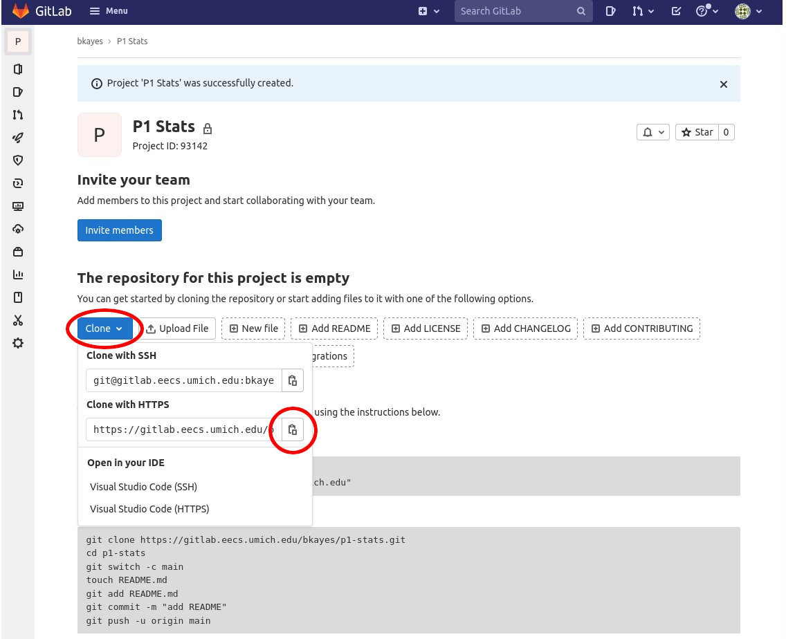

<div class="primer-spec-callout info icon-info" markdown="1">
**Pro-tip:** If you want avoid typing a username and password all the time, you can use SSH keys and an SSH URL (instead of HTTPS).  Check out the [GitHub tutorial on SSH keys](https://help.github.com/articles/connecting-to-github-with-ssh/).  Don't forget to [add your key to GitLab](https://gitlab.eecs.umich.edu/profile/keys) (not GitHub).
</div>

Connect your local repo to your remote repo.
```console
$ pwd
/Users/awdeorio/src/eecs280/p1-stats
$ git remote add origin https://gitlab.eecs.umich.edu/awdeorio/p1-stats.git  # use your URL
```

<div class="primer-spec-callout warning" markdown="1">
Double-check that your local repo is connected to your remote repo.  You'll see the URL you copied from your remote repo appear.
```console
$ git remote -v
origin	https://gitlab.eecs.umich.edu/awdeorio/p1-stats.git (fetch)
origin	https://gitlab.eecs.umich.edu/awdeorio/p1-stats.git (push)
```

Make sure that your `main` branch is connected to GitLab's `main` branch.  From the local perspective, GitLab is `origin`.
```console
$ git branch -vv
* main e016bfa [origin/main] Add instructor
```
</div>

Push commits already committed on the local repo to the remote repo.
```console
$ git push -u origin main
Username for 'https://gitlab.eecs.umich.edu': awdeorio
Password for 'https://awdeorio@gitlab.eecs.umich.edu': 
Counting objects: 14, done.
Delta compression using up to 4 threads.
Compressing objects: 100% (12/12), done.
Writing objects: 100% (14/14), 6.97 KiB | 3.48 MiB/s, done.
Total 14 (delta 0), reused 0 (delta 0)
To https://gitlab.eecs.umich.edu/awdeorio/p1-stats.git
 * [new branch]      main -> main
Branch 'main' set up to track remote branch 'main' from 'origin'.
```

<div class="primer-spec-callout warning" markdown="1">
Verify that your local repo is up-to-date with the remote the repo (AKA `origin/main`).
```console
$ git fetch -vv
From gitlab.eecs.umich.edu:awdeorio/p1-stats
 = [up to date]      main     -> origin/main
$ git status
On branch main
Your branch is up to date with 'origin/main'.

nothing to commit, working tree clean
```
</div>

Verify the commit log.
```console
$ git log
commit a13e2521fab6488458c912f598d6d5f89d429484 (HEAD -> main, origin/main)
Author: Andrew DeOrio <awdeorio@umich.edu>
Date:   Fri Jan 12 15:59:25 2018 -0500

    Initial commit.  Starter files with function stubs.
```

See the commit log on your GitLab project page.  Click "History".  (You may need to refresh the page to see this.)

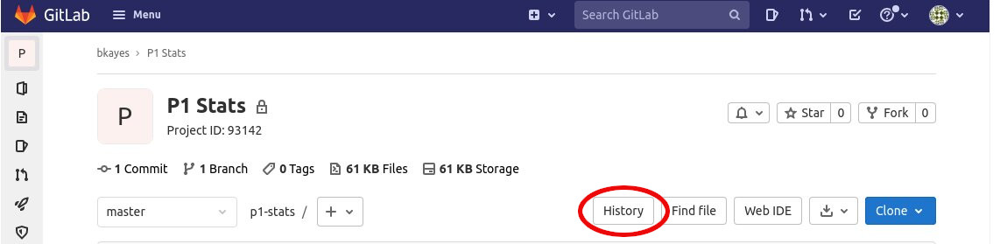

You should see your first commit show up.

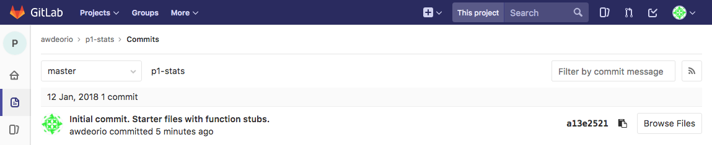


## Add a new file to version control
Next we'll add a README, which will show up on the front page of our GitLab repository web page.
```console
$ pwd
/Users/awdeorio/src/eecs280/p1-stats
$ ls
Makefile      main_test.out.correct  p1_library.h  stats_public_test.cpp
main.cpp      main_test_data.tsv     stats.cpp     stats_tests.cpp
main_test.in  p1_library.cpp         stats.h
```

We have no modified files and our code is in sync with the code stored on GitLab.  In other words, we haven't changed anything since the last `git commit`, and no changes have happened on the GitLab server.
```console
$ git fetch
$ git status
On branch main
Your branch is up to date with 'origin/main'.

nothing to commit, working tree clean
```

Add an empty file called `README.md` using the command line.
```console
$ touch README.md
$ ls
Makefile   main_test.in           p1_library.cpp  stats.h
README.md  main_test.out.correct  p1_library.h    stats_public_test.cpp
main.cpp   main_test_data.tsv     stats.cpp       stats_tests.cpp
```

Add the existing file using your visual debugger.
- [Add existing files with Xcode](setup_xcode.html#add-existing-files)
- [Add existing files with Visual Studio](setup_visualstudio.html#add-existing-files)
- Visual Studio Code adds new files automatically

Now, edit `README.md` to look like the following example.  Be sure to change the name :)
```markdown
EECS 280 Project 1 Solution
===========================
Statistics

By Andrew DeOrio <awdeorio@umich.edu>
```
{: data-title="README.md" }

You can see that the new file shows up as untracked.
```console
$ git status
On branch main
Your branch is up-to-date with 'origin/main'.

Untracked files:
  (use "git add <file>..." to include in what will be committed)

	README.md
```

We want to track `README.md`, so `git add` it.
```console
$ git add README.md
$ git status
On branch main
Your branch is up-to-date with 'origin/main'.

Changes to be committed:
  (use "git reset HEAD <file>..." to unstage)

	new file:   README.md
```

Commit, and you'll see that the repo has a clean status again.
```console
$ git commit -m "Added README"
[main e016bfa] Added README
 1 file changed, 5 insertions(+)
 create mode 100644 README.md
$ git status
On branch main
Your branch is ahead of 'origin/main' by 1 commit.
  (use "git push" to publish your local commits)
```

From the previous `git status` command, we see that we have added code on our local computer that hasn't yet been pushed to the remote GitLab server (`Your branch is ahead of 'origin/main' by 1 commit.`).  Let's push it now.

<div class="primer-spec-callout info icon-info" markdown="1">
**NOTE:** if you get a `rejected` error, see [Fixing rejected pushes](#fixing-rejected-pushes), below.
</div>

```console
$ git push 
Counting objects: 3, done.
Delta compression using up to 4 threads.
Compressing objects: 100% (3/3), done.
Writing objects: 100% (3/3), 361 bytes | 361.00 KiB/s, done.
Total 3 (delta 1), reused 0 (delta 0)
To gitlab.eecs.umich.edu:awdeorio/p1-stats.git
   350f38e..7fa8093  main -> main
$ git status
On branch main
Your branch is up-to-date with 'origin/main'.

nothing to commit, working tree clean
```

Browse to your repo's project page on GitLab and you'll see a fancy formatted version of your README.

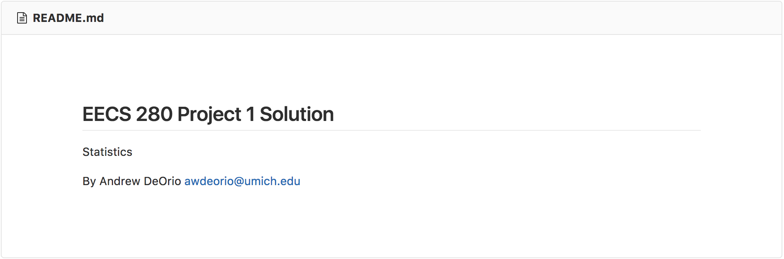


## Modify a version controlled file
Let's practice modifying an existing file.  We'll add to the README.  Check that our version controlled files are clean and up to date with the remote repo.
```console
$ pwd
/Users/awdeorio/src/eecs280/p1-stats
$ git fetch
$ git status
On branch main
Your branch is up-to-date with 'origin/main'.

nothing to commit, working tree clean
```

Edit `README.md` to add quick start instructions.  We're using [Markdown](https://help.github.com/articles/getting-started-with-writing-and-formatting-on-github/) formatting.  It should look this when you're done:
````markdown
EECS 280 Project 1 Solution
===========================
Statistics

By Andrew DeOrio <awdeorio@umich.edu>

<!-- primer-spec-highlight-start -->
## Quick start
```console
$ make main.exe
$ ./main.exe
```
<!-- primer-spec-highlight-end -->
````
{: data-title="README.md" }

We can see that our files are no longer clean.
```console
$ git status
On branch main
Your branch is up-to-date with 'origin/main'.

Changes not staged for commit:
  (use "git add <file>..." to update what will be committed)
  (use "git checkout -- <file>..." to discard changes in working directory)

	modified:   README.md

no changes added to commit (use "git add" and/or "git commit -a")
```

See what's different.  You can see lines added (`+`) compared to the last clean committed version of the file.
```console
$ git diff README.md
diff --git a/README.md b/README.md
index 4641b12..b1dde51 100644
--- a/README.md
+++ b/README.md
@@ -3,3 +3,9 @@ EECS 280 Project 1 Solution
 Statistics
 
 By Andrew DeOrio <awdeorio@umich.edu>
+
+## Quick start
+```console
+$ make main.exe
+$ ./main.exe
+```
```
{: data-highlight="10-15" }

<div class="primer-spec-callout info icon-info" markdown="1">
**NOTE:** On Windows, you may see lines that end with the `^M` character. This is normal; Windows uses a different convention for line endings than other operating systems.
</div>

Add, commit, and push.

<div class="primer-spec-callout info icon-info" markdown="1">
**NOTE:** if get a `rejected` error, see [Fixing rejected pushes](#fixing-rejected-pushes), below.
</div>

```console
$ git add README.md
$ git commit -m "Added quick start to README"
[main 2fac8d1] Added quick start to README
 1 file changed, 6 insertions(+)
$ git push
Counting objects: 3, done.
Delta compression using up to 4 threads.
Compressing objects: 100% (3/3), done.
Writing objects: 100% (3/3), 348 bytes | 348.00 KiB/s, done.
Total 3 (delta 2), reused 0 (delta 0)
To https://gitlab.eecs.umich.edu/awdeorio/p1-stats.git
   a80db0b..2fac8d1  main -> main
```

View the commit history from the command line.
```console
$ git log
commit 4d375b45357b4b39822ad48c62c6988910258370 (HEAD -> main, origin/main)
Author: Andrew DeOrio <awdeorio@umich.edu>
Date:   Fri Jan 12 16:14:02 2018 -0500

    Added quick start to README

commit e016bfad5a6371097ea00380aedd3e22ee63f754
Author: Andrew DeOrio <awdeorio@umich.edu>
Date:   Fri Jan 12 16:07:36 2018 -0500

    Added README

commit a13e2521fab6488458c912f598d6d5f89d429484
Author: Andrew DeOrio <awdeorio@umich.edu>
Date:   Fri Jan 12 15:59:25 2018 -0500

    Initial commit.  Starter files with function stubs.
```

View the commit history on GitLab.  Click a commit message to see a graphical diff.


View the diff on GitLab.

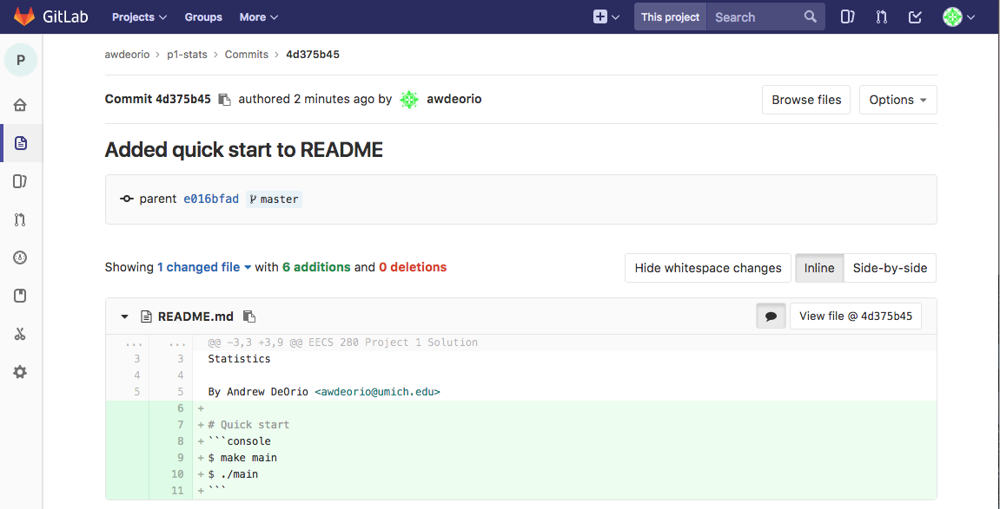


## Daily work flow
This section describes the work flow for a coding session with `git`.

Start with clean files.
```console
$ git status
On branch main
Your branch is up-to-date with 'origin/main'.

nothing to commit, working tree clean
```

Retrieve any changes from the server.  For example, you might have pushed changes while working on another computer, like CAEN Linux.
```console
$ git fetch
$ git rebase
```

Make changes to files.  Add and commit when you're ready.  You can do this several times.
```console
$ git add SOME_FILE
$ git commit -m "Short description goes here"
```

Push changes to GitLab server.
```console
$ git push
```

If you get a `rejected` error, see [Fixing rejected pushes](#fixing-rejected-pushes), below.


## Add team members
Add your partner as a "Maintainer" on the remote repo by inviting them in the "Members" tab.

   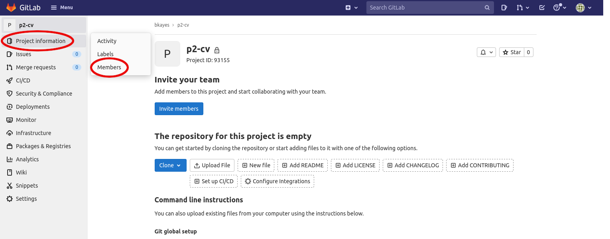

   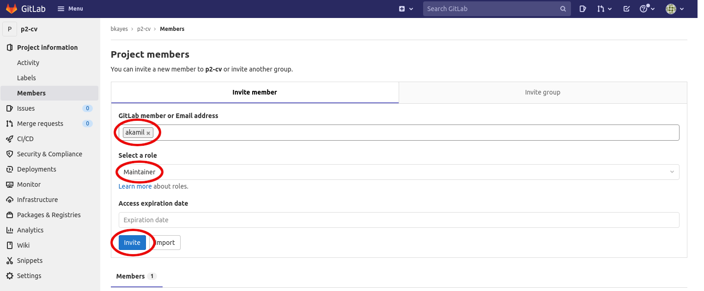

   GitLab sends a confirmation email to your partner.  Your partner clicks accept.

Your partner `clone`s the remote repo on their own local machine.

Your partner uses the same remote URL that you do.  Notice that `akamil` uses a link that has `awdeorio` in it, that's because `akamil` is a member of the repo that `awdeorio` created.
```console
$ whoami
akamil
$ pwd
/Users/akamil/Documents/eecs280/
$ git clone https://gitlab.eecs.umich.edu/awdeorio/p2-cv.git
Cloning into 'p2-cv'...
```

Remember, other team members don't need to download the starter files again because those files were already added by the first team member.


## Resolving conflicts
The following text is copied from a [helpful GitHub article](https://help.github.com/articles/resolving-merge-conflicts-after-a-git-rebase/).

When you perform a `git rebase` operation, you're typically moving commits around. Because of this, you might get into a situation where a merge conflict is introduced. That means that two of your commits modified the same line in the same file, and Git doesn't know which change to apply.

After you reorder and manipulate commits using `git rebase`, should a merge conflict occur, Git will tell you so with the following message printed to the terminal:

```console
error: could not apply fa39187... something to add to patch A

When you have resolved this problem, run "git rebase --continue".
If you prefer to skip this patch, run "git rebase --skip" instead.
To check out the original branch and stop rebasing, run "git rebase --abort".
Could not apply fa39187f3c3dfd2ab5faa38ac01cf3de7ce2e841... Change fake file
```

Here, Git is telling you which commit is causing the conflict (`fa39187`).

If you did this by mistake, you can undo the `git rebase` with `git rebase --abort`.

To fix the conflict, follow [this how-to]( https://help.github.com/articles/resolving-a-merge-conflict-using-the-command-line/).

## Fixing `rejected` pushes
If you get a `rejected` error when using `git push`, this probably means you (or your partner) changed your repo using another computer (or the GitLab web interface).
```console
$ git push
To https://gitlab.eecs.umich.edu/awdeorio/p1-stats.git
 ! [rejected]        main -> main (fetch first)
error: failed to push some refs to 'https://gitlab.eecs.umich.edu/awdeorio/p1-stats.git'
```

Fetch changes from the remote repo.
```console
$ git fetch
remote: Counting objects: 3, done.
remote: Compressing objects: 100% (3/3), done.
remote: Total 3 (delta 2), reused 0 (delta 0)
Unpacking objects: 100% (3/3), done.
From https://gitlab.eecs.umich.edu/awdeorio/p1-stats
   4d375b4..2b9bea7  main     -> origin/main
```

See that the local and remote repos have diverged.
```console
$ git status
On branch main
Your branch and 'origin/main' have diverged,
and have 1 and 1 different commits each, respectively.
  (use "git pull" to merge the remote branch into yours)

nothing to commit, working tree clean
```

Reapply your local commits on top of your remote commits, combining them into one sequence of commits.
```console
$ git rebase
First, rewinding head to replay your work on top of it...
Applying: Local update to README.
```

Divergence between local and remote is fixed.  You're good to push.
```console
$ git status
On branch main
Your branch is ahead of 'origin/main' by 1 commit.
  (use "git push" to publish your local commits)

nothing to commit, working tree clean
$ git push
Counting objects: 3, done.
Delta compression using up to 4 threads.
Compressing objects: 100% (3/3), done.
Writing objects: 100% (3/3), 318 bytes | 318.00 KiB/s, done.
Total 3 (delta 2), reused 0 (delta 0)
To https://gitlab.eecs.umich.edu/awdeorio/p1-stats.git
   2b9bea7..63a5d0b  main -> main
$ git status
On branch main
Your branch is up to date with 'origin/main'.

nothing to commit, working tree clean
```

## Acknowledgments
Original document written by Andrew DeOrio awdeorio@umich.edu.

This document is licensed under a [Creative Commons Attribution-NonCommercial 4.0 License](https://creativecommons.org/licenses/by-nc/4.0/). You’re free to copy and share this document, but not to sell it. You may not share source code provided with this document.
