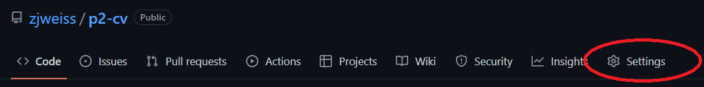
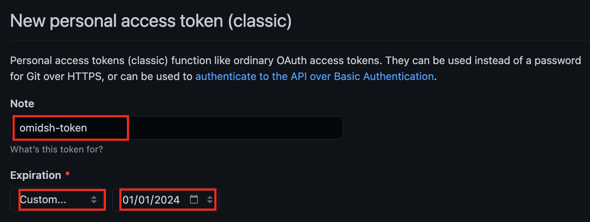
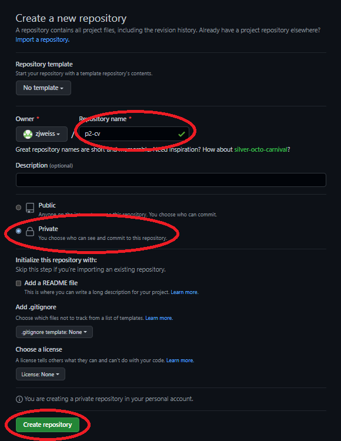
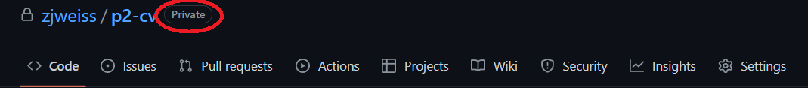
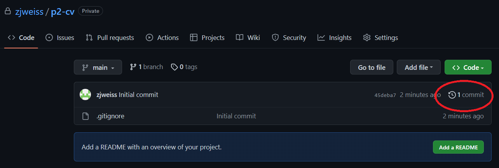
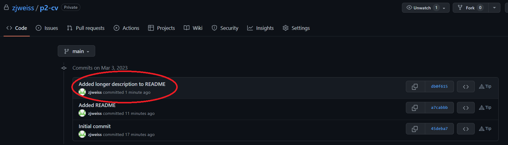
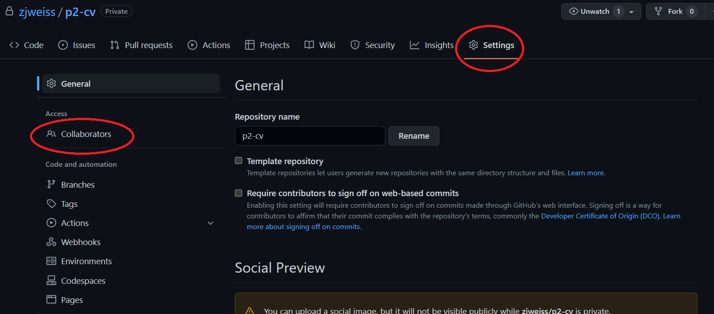
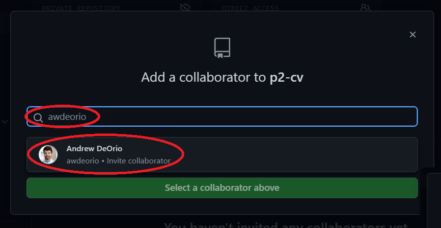
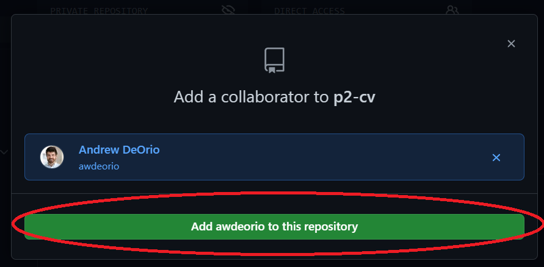

Version Control Tutorial
========================
{: .primer-spec-toc-ignore }

This tutorial will walk you through setting up a Git repository, linking it to GitHub, and using it to collaborate with a partner.  This is the EECS 280 adaptation of the [EECS 485 Version Control Tutorial](https://eecs485staff.github.io/p1-insta485-static/setup_git.html).

<div class="primer-spec-callout danger" markdown="1">
**WARNING:** Do not post any code in a publicly accessible repo!
</div>

<div class="primer-spec-callout info" markdown="1">
If you've used version control before on your computer, skip to the [Create a local repository](#create-a-local-repository) section.
</div>

## Prerequisites
We're assuming that you already have a folder, e.g., `p1-insta485-static/` or `p2-cv/`. Your folder name may be different. It's OK if there aren't any files in it yet.
```console
$ pwd
/Users/japplefield/Developer/eecs485/p1-insta485-static
```

You have installed `git`.  Your version might be different.
```console
$ git --version
git version 2.37.2
```

You have configured your name and email address.
```console
$ git config --global user.name
Justin Applefield
$ git config --global user.email
jmapple@umich.edu
```

If you need to set your name and email, here's how.
```console
$ git config --global user.name "YOUR NAME HERE"
$ git config --global user.email "YOUR EMAIL HERE"
```

## Restarting this tutorial
If you tried using this tutorial in the past and want to start over, here's how to delete the files created by `git` and how to remove your repository from GitHub.

First, remove your GitHub repository.  Browse to your repository's project page from [https://github.com/](https://github.com/).  Select "Settings", scroll to the bottom and select "Delete this repository" under the "Danger Zone" heading.



...


Next, remove the hidden files created by `git`.  Remember, hidden files start with a dot (`.`).
```console
$ pwd
/Users/japplefield/Developer/eecs485/p1-insta485-static
$ rm -rf .git/ .gitignore
$ ls -A
```

Confirm that this is no longer a git repository.
```console
$ git status
fatal: Not a git repository (or any of the parent directories): .git
```

## Create a local repository
Navigate to your project directory.  Your directory might be different.
```console
$ pwd
/Users/japplefield/Developer/eecs485/p1-insta485-static
```

### Add a `.gitignore` file
Add a `.gitignore` file.  This will prevent Git from controlling files like compiled binaries or locally installed Python libraries.  It's a hidden file (starts with a dot `.`), so you'll need to use `ls -A` to see it.

#### C/C++ Projects
This sample is pre-configured to work with most C++ projects, so use the same sample file for all EECS 280/281 projects.
```console
$ pwd
/Users/awdeorio/src/eecs280/p2-cv
$ wget https://eecs280staff.github.io/tutorials/dot_gitignore_sample -O .gitignore
$ ls -A
.gitignore     ...
```

#### Web Projects
This sample is pre-configured to work with most projects that use Python, JavaScript, and React.  Use the same sample file for all EECS 485 projects.
```console
$ pwd
/Users/japplefield/Developer/eecs485/p1-insta485-static
$ wget https://eecs485staff.github.io/p1-insta485-static/dot_gitignore_sample -O .gitignore
$ ls -A
.gitignore
```

### Initialize repo
Initialize the repo.  You may have more untracked files.
```console
$ git init
Initialized empty Git repository in /Users/japplefield/Developer/eecs485/p1-insta485-static/.git/
$ git status
On branch main

Untracked files:

	.gitignore
    ...

nothing added to commit but untracked files present (use "git add" to track)
```

### Add existing files to version control
First, double-check that you have a `.gitignore` file.  Your gitignore might be different.
```console
$ head .gitignore
This is a sample .gitignore file that's useful for C++ projects.
... OR ...
This is a sample .gitignore file that's useful for EECS 485 projects.
```

Add your `.gitignore` file and any additional starter files.  See that your existing files are ready to be committed.  You may have more files.
```console
$ git add .
$ git status
On branch main

Changes to be committed:

	new file:   .gitignore
    ...
```

Commit the added files to the local repo with the commit message "Initial commit".
```console
$ git commit -m "Initial commit"
[main (root-commit) cefd222] Initial commit
 1 file changed, 71 insertions(+)
 create mode 100644 .gitignore
```

View the commit log and see our first commit.
```console
$ git log
commit cefd2227510fa5e16e357198be19832b952d314e (HEAD -> main)
Author: Justin Applefield <jmapplef@gmail.com>
Date:   Tue Aug 30 19:29:52 2022 -0400

    Initial commit
```

See that the status is clean.
```console
$ git status
On branch main
nothing to commit, working tree clean
```

<div class="primer-spec-callout warning icon-warning" markdown="1">
Verify you didn't accidentally commit automatically generated or binary files.  Binaries that work on your machine may not work on another machine (like a group member's or CAEN Linux).
```console
$ git ls-files
...
main.exe
main.exe.dSYM/Contents/Info.plist
main.exe.dSYM/Contents/Resources/DWARF/main.exe
...
```

First, double-check your `.gitignore`.  Go [back](http://localhost:4000/setup_git.html#create-a-local-repository) if necessary and re-download it.
```console
$ head .gitignore
# This is a sample .gitignore file that's useful for C++ projects.
...
```

Then, remove the offending binary files and folders and commit.
```console
$ git rm -f main.exe
$ git rm -rf main.exe.dSYM
$ git status
On branch main
Changes to be committed:
  (use "git restore --staged <file>..." to unstage)
	deleted:    main.exe
	deleted:    main.exe.dSYM/Contents/Info.plist
	deleted:    main.exe.dSYM/Contents/Resources/DWARF/main.exe
$ git commit -m "remove binary files"
$ git status
On branch main
nothing to commit, working tree clean
```
</div>

## GitHub Authentication
There are two ways to connect to GitHub: Personal Access Tokens and SSH Keys.

### Personal Access Token
Before you continue with using your repositories in GitHub, you want to create your authentication method for accessing remote repo. GitHub personal access token (PAT) is a secure, user-friendly way to connect to GitHub. It gives you unique credentials to verify your identity.

Click on your profile, and head over to Settings.


Scroll down and select Developer settings from the left-hand side menu bar.


Click on the drop down arrow to reveal the options. Select Tokens (classic). 


Click on Generate new token and from the drop down menu, click on Generate new token (classic).


Now you should be able to view a page similar to the one below titled New personal access token (classic). If you do not see this page, go back to the previous page and make sure to select Generate new token (classic).

Write a meaningful name for your token (such as &lt;uniqname&gt;-token). From the Expiration drop down menu select Custom. Set the expiration date to January 1st of next year (in `mm/dd/yy` format).



<div class="primer-spec-callout info icon-info" markdown="1">
**Note**: You have to renew your token after January 1st of next year by repeating this process. Setting your token expiration date to no expiration is a security risk. After expiration, to access remote repos previously accessed using your expired access token, you have to use the HTTPS link for the repo and [update the remote repo url](https://docs.github.com/en/enterprise-server@3.4/get-started/getting-started-with-git/managing-remote-repositories#changing-a-remote-repositorys-url). 
</div>

From the list below, select the boxes for `repo`, `admin:repo_hook`, and `delete_repo`.


Now generate your token.


Copy your token. **Make sure to copy it now. You won’t be able to see it again!**


For now, store your token on your computer in a text file. Do not share this token with anyone!

Open your terminal and enter the following command. Now, you only have to enter your access token the first time you are prompted for your password. From then on, GitHub won't prompt you to enter a password again.

```console
$ git config --global credential.helper store
```

### SSH Keys
If you want avoid re-generating tokens every 90 days, you can use SSH keys and an SSH URL (instead of HTTPS).  Check out the [GitHub tutorial on SSH keys](https://help.github.com/articles/connecting-to-github-with-ssh/). Don't forget to [add your key to GitHub](https://github.com/settings/keys) and [switch the remote from SSH to HTTPS.](https://docs.github.com/en/enterprise-server@3.4/get-started/getting-started-with-git/managing-remote-repositories#switching-remote-urls-from-ssh-to-https).

Test your connection.
```console
$ ssh -T git@github.com
Hi awdeorio! You've successfully authenticated, but GitHub does not provide shell access.
```

## Create a remote repository
First, log in to [https://github.com/](https://github.com/login).

Create a new project.


Call the new project `p1-insta485-static`, mark it as "private". Click "Create repository".

<div class="primer-spec-callout danger" markdown="1">
**Double check that you have selected "private".** Making your project code or test cases publicly available online is a violation of the honor code.
</div>



Triple-check that your new repository is private.  If you made a mistake, you can change it to private in "Settings".



You now have a project page for your remote repo.  In this example, japplefield's project page is [https://github.com/japplefield/p1-insta485-static](https://github.com/japplefield/p1-insta485-static). You won't have access to it because it's private, but your page should look similar.


#### Connect local repo to remote repo
Browse to your repository's project page from [https://github.com/](https://github.com//). Copy the URL for your repo from the `HTTPS` tab by clicking on the copy icon. The link starts with `https://` .


Connect your local repo to your remote repo.
```console
$ pwd
/Users/japplefield/Developer/eecs485/p1-insta485-static
$ git remote add origin https://github.com/japplefield/p1-insta485-static.git  # use your URL
```

Double-check that your local repo is connected to your remote repo.  You'll see the URL you copied from your remote repo appear.
```console
$ git remote -v
origin	https://github.com/japplefield/p1-insta485-static.git (fetch)
origin	https://github.com/japplefield/p1-insta485-static.git (push)
```

Push commits already committed on the local repo to the remote repo. You will be prompted to enter a password, 
this will be your personal access token.
```console
$ git push -u origin main
Username for 'https://github.com': japplefield
Password for 'https://japplefield@github.com': 
Counting objects: 14, done.
Delta compression using up to 4 threads.
Compressing objects: 100% (12/12), done.
Writing objects: 100% (14/14), 6.97 KiB | 3.48 MiB/s, done.
Total 14 (delta 0), reused 0 (delta 0)
To https://github.com/japplefield/p1-insta485-static.git
 * [new branch]      main -> main
Branch 'main' set up to track remote branch 'main' from 'origin'.
```

<div class="primer-spec-callout warning" markdown="1">
**MacOS Pitfall:** If you are not prompted for your username and password, your credentials may be cached on your computer. [Clear your credentials from Keychain Access](https://docs.github.com/en/enterprise-server@3.4/get-started/getting-started-with-git/updating-credentials-from-the-macos-keychain#updating-your-credentials-via-keychain-access).
</div>

<div class="primer-spec-callout warning" markdown="1">
**Pitfall:** Your local `git` may use `master` as the name for the initial branch, whereas GitHub expects it to be named main.

```console
$ git push -u origin main
error: src refspec main does not match any
error: failed to push some refs to 'github.com:japplefield/p1-insta485-static.git'
```

You can rename your local branch to `main` to resolve this.

```console
$ git branch
* master
$ git branch -M main
$ git branch
* main
```

</div>

Verify that your local repo is up to date with the remote the repo (AKA `origin/main`).
```console
$ git status
On branch main
Your branch is up to date with 'origin/main'.

nothing to commit, working tree clean
```

Verify the commit log.
```console
$ git log
commit cefd2227510fa5e16e357198be19832b952d314e (HEAD -> main)
Author: Justin Applefield <jmapplef@gmail.com>
Date:   Tue Aug 30 19:29:52 2022 -0400

    Initial commit
```

See the commit log on your GitHub project page.  Click "1 commit".  (You may need to refresh the page to see this.)



You should see your first commit show up.


## Add a new file to version control
Next we'll add a README, which will show up on the front page of our GitHub repository web page.
```console
$ pwd
/Users/japplefield/Developer/eecs485/p1-insta485-static
```

We have no modified files and our code is in sync with the code stored on GitHub.  In other words, we haven't changed anything since the last `git commit`, and no changes have happened on the GitHub server.
```console
$ git fetch
$ git status
On branch main
Your branch is up to date with 'origin/main'.

nothing to commit, working tree clean
```

Add an empty file called `README.md` using the command line.
```console
$ touch README.md
$ ls
README.md
```

Now, using the text editor or IDE of your choosing, edit `README.md` to look like the following example.  Be sure to change the name :)
```markdown
EECS 485 Project 1 Solution
===========================
Templated Static Site Generator

By Justin Applefield <jmapple@umich.edu>
```
{: data-title="README.md" }

You can see that the new file shows up as untracked.
```console
$ git status
On branch main
Your branch is up-to-date with 'origin/main'.

Untracked files:
  (use "git add <file>..." to include in what will be committed)

	README.md
```

We want to track `README.md`, so `git add` it.
```console
$ git add README.md
$ git status
On branch main
Your branch is up-to-date with 'origin/main'.

Changes to be committed:
  (use "git reset HEAD <file>..." to unstage)

	new file:   README.md
```

Commit, and you'll see that the repo has a clean status again.
```console
$ git commit -m "Added README"
[main e016bfa] Added README
 1 file changed, 5 insertions(+)
 create mode 100644 README.md
$ git status
On branch main
Your branch is ahead of 'origin/main' by 1 commit.
  (use "git push" to publish your local commits)
```

From the previous `git status` command, we see that we have added code on our local computer that hasn't yet been pushed to the remote GitHub server (`Your branch is ahead of 'origin/main' by 1 commit.`).  Let's push it now.

<div class="primer-spec-callout info icon-info" markdown="1">
**NOTE:** if you get a `rejected` error, see [Fixing rejected pushes](#fixing-rejected-pushes), below.
</div>

```console
$ git push 
Counting objects: 3, done.
Delta compression using up to 4 threads.
Compressing objects: 100% (3/3), done.
Writing objects: 100% (3/3), 361 bytes | 361.00 KiB/s, done.
Total 3 (delta 1), reused 0 (delta 0)
To https://github.com/japplefield/p1-insta485-static.git
   350f38e..7fa8093  main -> main
$ git status
On branch main
Your branch is up-to-date with 'origin/main'.

nothing to commit, working tree clean
```

Browse to your repo's project page on GitHub and you'll see a fancy formatted version of your README.


## Modify a version controlled file
Let's practice modifying an existing file.  We'll add to the README.  Check that our version controlled files are clean and up to date with the remote repo.
```console
$ pwd
/Users/japplefield/Developer/eecs485/p1-insta485-static
$ git fetch
$ git status
On branch main
Your branch is up-to-date with 'origin/main'.

nothing to commit, working tree clean
```

Edit `README.md` to add quick start instructions.  We're using [Markdown](https://help.github.com/articles/getting-started-with-writing-and-formatting-on-github/) formatting.  It should look this when you're done:
````markdown
EECS 485 Project 1 Solution
===========================
Templated Static Site Generator

By Justin Applefield <jmapple@umich.edu>

## Quick start
```console
$ python3 -m venv env/
$ source env/bin/activate
```
````
{: data-title="README.md" data-highlight="7-11" }

We can see that our files are no longer clean.
```console
$ git status
On branch main
Your branch is up-to-date with 'origin/main'.

Changes not staged for commit:
  (use "git add <file>..." to update what will be committed)
  (use "git checkout -- <file>..." to discard changes in working directory)

	modified:   README.md

no changes added to commit (use "git add" and/or "git commit -a")
```

See what's different.  You can see lines added (`+`) compared to the last clean committed version of the file.
```console
$ git diff README.md
diff --git a/README.md b/README.md
index 4641b12..b1dde51 100644
--- a/README.md
+++ b/README.md
@@ -3,3 +3,9 @@ EECS 485 Project 1 Solution
 Templated Static Site Generator
 
 By Justin Applefield <jmapple@umich.edu>
+
+## Quick start
+```console
+$ python3 -m venv env/
+$ source env/bin/activate
+```
```
{: data-highlight="10-15" }

<div class="primer-spec-callout info icon-info" markdown="1">
**NOTE:** On Windows, you may see lines that end with the `^M` character. This is normal; Windows uses a different convention for line endings than other operating systems.
</div>

Add, commit, and push.

<div class="primer-spec-callout info icon-info" markdown="1">
**NOTE:** if get a `rejected` error, see [Fixing rejected pushes](#fixing-rejected-pushes), below.
</div>

```console
$ git add README.md
$ git commit -m "Added quick start to README"
[main 2fac8d1] Added quick start to README
 1 file changed, 6 insertions(+)
$ git push
Counting objects: 3, done.
Delta compression using up to 4 threads.
Compressing objects: 100% (3/3), done.
Writing objects: 100% (3/3), 348 bytes | 348.00 KiB/s, done.
Total 3 (delta 2), reused 0 (delta 0)
To https://github.com/japplefield/p1-insta485-static.git
   a80db0b..2fac8d1  main -> main
```

View the commit history from the command line.
```console
$ git log
commit 6fce59386afd9c85b6de8953b1bd5e3fdbe9fcd3 (HEAD -> main)
Author: Justin Applefield <jmapplef@gmail.com>
Date:   Tue Aug 30 19:40:40 2022 -0400

    Added quick start to README

commit bfc9dc8341ca3999b7aad2775b625b6ddce63caf (origin/main)
Author: Justin Applefield <jmapplef@gmail.com>
Date:   Tue Aug 30 19:35:21 2022 -0400

    Added README

commit cefd2227510fa5e16e357198be19832b952d314e
Author: Justin Applefield <jmapplef@gmail.com>
Date:   Tue Aug 30 19:29:52 2022 -0400

    Initial commit
```

View the commit history on GitHub.  Click a commit message to see a graphical diff.



View the diff on GitHub.


## Daily work flow with version control
This section describes the work flow for a coding session with `git`.

Start with clean files.
```console
$ git status
On branch main
Your branch is up-to-date with 'origin/main'.

nothing to commit, working tree clean
```

Retrieve any changes from the server.  For example, you might have pushed changes while working on another computer, like CAEN Linux, or your partners may have made changes, if applicable.
```console
$ git fetch
$ git rebase
```

Make changes to files.  Add and commit when you're ready.  You can do this several times.
```console
$ git add SOME_FILE
$ git commit -m "Short description goes here"
```

Push changes to GitHub server.
```console
$ git push
```

If you get a `rejected` error, see [Fixing rejected pushes](#fixing-rejected-pushes), below.

## Version control for a team
Add your partner as a "Collaborator" on the remote repo by inviting them in the "Collaborators" tab.

   

   

   

   GitHub sends a confirmation email to your partner.  Your partner clicks accept.

Your partner `clone`s the remote repo on their own local machine using the same remote URL that you do.  Notice that `awdeorio` uses a link that has `japplefield` in it, that's because `awdeorio` is a member of the repo that `japplefield` created.
```console
$ whoami
awdeorio
$ pwd
/Users/awdeorio/src/eecs485/
$ git clone https://github.com/japplefield/p1-insta485-static.git
Cloning into 'p1-insta485-static...
```

Remember, other team members don't need to download the starter files again because those files were already added by the first team member.

## Resolving conflicts
The following text is copied from a [helpful GitHub article](https://help.github.com/articles/resolving-merge-conflicts-after-a-git-rebase/).

When you perform a `git rebase` operation, you're typically moving commits around. Because of this, you might get into a situation where a merge conflict is introduced. That means that two of your commits modified the same line in the same file, and Git doesn't know which change to apply.

After you reorder and manipulate commits using `git rebase`, should a merge conflict occur, Git will tell you so with the following message printed to the terminal:

```console
error: could not apply fa39187... something to add to patch A

When you have resolved this problem, run "git rebase --continue".
If you prefer to skip this patch, run "git rebase --skip" instead.
To check out the original branch and stop rebasing, run "git rebase --abort".
Could not apply fa39187f3c3dfd2ab5faa38ac01cf3de7ce2e841... Change fake file
```

Here, Git is telling you which commit is causing the conflict (`fa39187`).

If you did this by mistake, you can undo the `git rebase` with `git rebase --abort`.

To fix the conflict, follow [this how-to]( https://help.github.com/articles/resolving-a-merge-conflict-using-the-command-line/).

## Fixing `rejected` pushes
If you get a `rejected` error when using `git push`, this probably means you (or your partner) changed your repo using another computer (or the GitHub web interface).
```console
$ git push
To https://github.com/japplefield/p1-insta485-static.git
 ! [rejected]        main -> main (fetch first)
error: failed to push some refs to 'https://github.com/japplefield/p1-insta485-static.git'
```

Fetch changes from the remote repo.
```console
$ git fetch
remote: Counting objects: 3, done.
remote: Compressing objects: 100% (3/3), done.
remote: Total 3 (delta 2), reused 0 (delta 0)
Unpacking objects: 100% (3/3), done.
From https://github.com/japplefield/p1-insta485-static
   4d375b4..2b9bea7  main     -> origin/main
```

See that the local and remote repos have diverged.
```console
$ git status
On branch main
Your branch and 'origin/main' have diverged,
and have 1 and 1 different commits each, respectively.
  (use "git pull" to merge the remote branch into yours)

nothing to commit, working tree clean
```

Reapply your local commits on top of your remote commits, combining them into one sequence of commits.
```console
$ git rebase
First, rewinding head to replay your work on top of it...
Applying: Local update to README.
```

Divergence between local and remote is fixed.  You're good to push.
```console
$ git status
On branch main
Your branch is ahead of 'origin/main' by 1 commit.
  (use "git push" to publish your local commits)

nothing to commit, working tree clean
$ git push
Counting objects: 3, done.
Delta compression using up to 4 threads.
Compressing objects: 100% (3/3), done.
Writing objects: 100% (3/3), 318 bytes | 318.00 KiB/s, done.
Total 3 (delta 2), reused 0 (delta 0)
To https://github.com/japplefield/p1-insta485-static.git
   2b9bea7..63a5d0b  main -> main
$ git status
On branch main
Your branch is up to date with 'origin/main'.

nothing to commit, working tree clean
```

## Acknowledgments
Original document written by Andrew DeOrio <awdeorio@umich.edu>. Updates made to use GitHub by Justin Applefield <jmapple@umich.edu>.

This document is licensed under a [Creative Commons Attribution-NonCommercial 4.0 License](https://creativecommons.org/licenses/by-nc/4.0/). You're free to copy and share this document, but not to sell it.  You may not share source code provided with this document.
