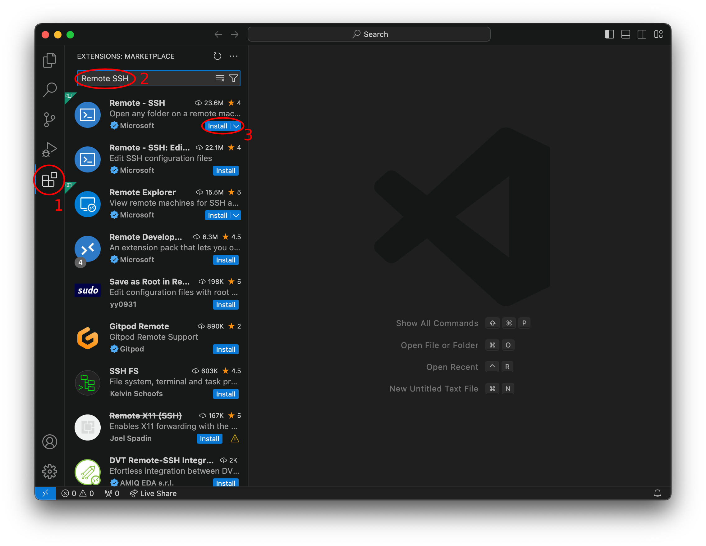

VSCode CAEN Access
==========
{: .primer-spec-toc-ignore }

This tutorial will show you how to set up VSCode access into CAEN Linux via SSH. It allows you to remotely edit and execute files as if you were using VSCode on the CAEN computers themselves. This may come in handy for those who wish to develop and test their projects directly on CAEN.


## Prerequisites
If you haven't already, follow the [CAEN Linux Tutorial](setup_caen.html) so your CAEN environment is ready for VSCode to access. If you need a refresher on VScode, read through the [tutorial](setup_vscode.html).


<div class="primer-spec-callout warning" markdown="1">
**Pitfall:** If you are off campus, make sure you have connected to the [UM VPN](https://its.umich.edu/enterprise/wifi-networks/vpn/getting-started) before continuing.
</div>

## Setup Remote SSH Extension

### Edit SSH Config
First, we need to specify CAEN as a host in our SSH config file so VSCode knows where to connect. You can find the file at `~/.ssh/config`.

Add the following lines to the SSH config file, replacing `<uniqname>` with your own uniqname.
```
Host caen #(Can be named anything you like)
  HostName login.engin.umich.edu
  User <uniqname>
```

Verify the contents of your `~/.ssh/config` file.
```console
$ cat ~/.ssh/config
# SSH multiplexing (from CAEN Linux Tutorial)
Host *
  ControlMaster auto
  ControlPersist yes
  ControlPath ~/.ssh/socket-%C
  ServerAliveInterval 60
  ServerAliveCountMax 5

Host caen
  HostName login.engin.umich.edu
  User armaanr
```

<div class="primer-spec-callout info" markdown="1">
**Pro-tip:** Adding hosts in this manner also gives you an easy way to SSH without needing to remember the hostname. For example:
```console
$ ssh caen
(armaanr@login.engin.umich.edu) Password: 
```
</div>

### Install Extension
Open up VSCode and install the [Remote - SSH Extension](https://aka.ms/vscode-remote/download/ssh).



### Modify Extension Settings
In its default configuration, the extension doesn't play nicely with the CAEN computers. So, we need to modify some settings first.

Open the command palette by pressing <kbd>Command</kbd> + <kbd>Shift</kbd> + <kbd>P</kbd> on Mac or <kbd>Ctrl</kbd> + <kbd>Shift</kbd> + <kbd>P</kbd> on Windows/Linux. Search for "Remote SSH settings" and click on the option.


Search for "Exec Server" and disable the "Use Exec Server" option.


Search for "Flock" and disable the "Use Flock" option.


## Connect to CAEN
### Connect
Click the remote connection button on the bottom left and then click the "Connect to Host..." option.


Click on the "caen" option (this is the SSH host that we set up [earlier](#edit-ssh-config)). 

<div class="primer-spec-callout info" markdown="1">
If you want to connect to some other host in the future, you can manually specify `user@host` in this box too (e.g. `armaanr@XXXXX.amazonaws.com`).
</div>


Finally, you will be prompted for your CAEN password and Duo 2FA. The Duo 2FA prompt may be cut off. You can hover your mouse over the box and the full prompt will be shown.


Now, the button in the bottom left should say "SSH: caen" (or whatever host you specified earlier).


### Open Workspace
Now you can open a folder from your CAEN home directory as a workspace. 


Browse to your chosen directory and click "OK".


Now you should be able to work on CAEN!


## Troubleshooting
If you are suddenly unable to connect, you can try deleting the VSCode server files. Sometimes the files that VSCode drops onto the remote host don't get cleaned up properly and it tries to reuse an unreachable remote server. SSH into CAEN and execute the following:

```console
$ ssh armaanr@login.engin.umich.edu
...
$ mv ~/.vscode-server ~/.vscode-old
$ rm -rf ~/.vscode-old
```

Restart VSCode on your own computer and [try again](#connect-to-caen).


## Acknowledgments
Original tutorial written by Anish Nyayachavadi for EECS 491.

This document is licensed under a [Creative Commons Attribution-NonCommercial 4.0 License](https://creativecommons.org/licenses/by-nc/4.0/). You’re free to copy and share this document, but not to sell it. You may not share source code provided with this document.
