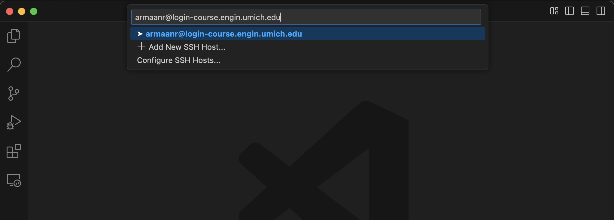

VS Code CAEN Access
==========
{: .primer-spec-toc-ignore }

This tutorial will show you how to use VS Code to remotely develop and test on CAEN Linux. This may come in handy for those who wish to develop and test their projects directly on CAEN.


## Prerequisites
If you haven't already, follow the [CAEN Linux Tutorial](setup_caen.html) to prepare your CAEN environment for VS Code access. Be sure to set up [SSH multiplexing](setup_caen.html#avoiding-repeated-2fa). This can help you avoid repeated 2FA prompts when connecting.

If you need a refresher on VS code, read through the [tutorial](setup_vscode.html).


<div class="primer-spec-callout warning" markdown="1">
**Pitfall:** If you are off campus, make sure you have connected to the [UM VPN](https://its.umich.edu/enterprise/wifi-networks/vpn/getting-started) before continuing.
</div>

## Install and Configure Remote SSH Extension


### Install Extension
Open up VS Code and install the [Remote - SSH Extension](https://aka.ms/vscode-remote/download/ssh).


### Modify Extension Settings
In its default configuration, the extension doesn't play nicely with the CAEN computers. So, we need to modify some settings first.

Open the command palette by pressing <kbd>Command</kbd> + <kbd>Shift</kbd> + <kbd>P</kbd> on Mac or <kbd>Ctrl</kbd> + <kbd>Shift</kbd> + <kbd>P</kbd> on Windows/Linux. Search for "Remote SSH settings" and click on the option.


Search for "Exec Server" and disable the "Use Exec Server" option. This setting is needed when the remote home directory is on a network share.


Search for "Lockfile" and enable the "Lockfiles in Tmp" option.


## Connect to CAEN
### Connect
Click the remote connection button on the bottom left and then click the "Connect to Host..." option.


Type in `<uniqname>@login-course.engin.umich.edu` and hit <kbd>Enter</kbd>. 



<div class="primer-spec-callout info" markdown="1">
If you want to connect to some other host in the future, you can follow these steps with any `user@host` (e.g. `armaanr@XXXXX.amazonaws.com`).
</div>

<div class="primer-spec-callout info" markdown="1">
**Pro-tip:** If you don't want to type this every single time, you can add the information to your SSH config file. You can find the file at `~/.ssh/config`.

Add the following lines, replacing `<uniqname>` with your own uniqname.
```
Host caen
  HostName login-course.engin.umich.edu
  User <uniqname>
```

You should now be able to just click on the "caen" option.


As an added bonus, adding hosts in this manner also gives you an easy way to SSH when using the terminal. For example:
```console
$ ssh caen
(armaanr@login-course.engin.umich.edu) Password: 
```
</div>

### Authenticate
Finally, you will be prompted for your CAEN password and Duo 2FA. The Duo 2FA prompt may be cut off, but it's the same one you usually see when using SSH in the terminal. You can hover your mouse over the box and the full prompt will be shown.


<div class="primer-spec-callout info" markdown="1">
If you're using Windows, the Duo 2FA prompt may not appear after you type your password. If so, click "details" on the bottom-right corner of your VS Code window and the prompt will appear in the terminal.


</div>

Now, the button in the bottom left should say "SSH: login-course.engin.umich.edu" (or "SSH: caen" if you used the SSH config file).


### Open Workspace
Now you can open a folder from your CAEN home directory as a workspace. 


Browse to your chosen directory and click "OK".


Now you should be able to work on CAEN!


## Troubleshooting
If you are suddenly unable to connect, you can try killing the VS Code server and/or deleting its files. Sometimes the files that VS Code drops onto the remote host don't get cleaned up properly and it tries to reuse an unreachable remote server. SSH into CAEN and execute the following:

```console
$ ssh armaanr@login-course.engin.umich.edu
...
$ pkill -u $(id -u) -f vscode
$ rm -rf ~/.vscode-server
```

Restart VS Code on your own computer and [try again](#connect-to-caen).


## Acknowledgments
Original tutorial written by Anish Nyayachavadi, Fall 2024.

This document is licensed under a [Creative Commons Attribution-NonCommercial 4.0 License](https://creativecommons.org/licenses/by-nc/4.0/). You’re free to copy and share this document, but not to sell it. You may not share source code provided with this document.
