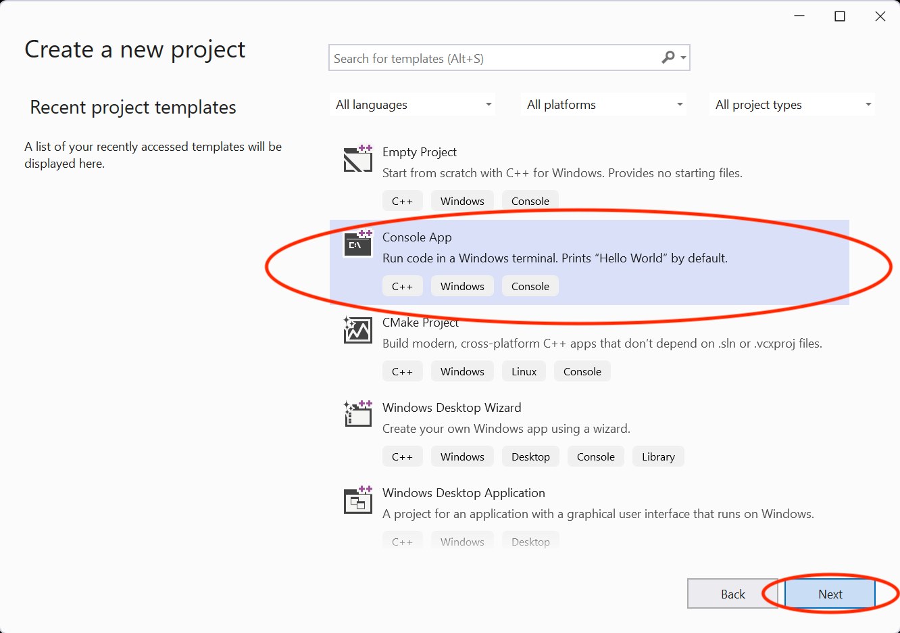
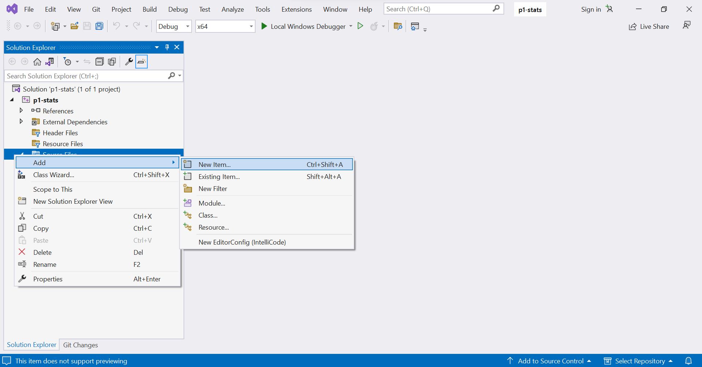
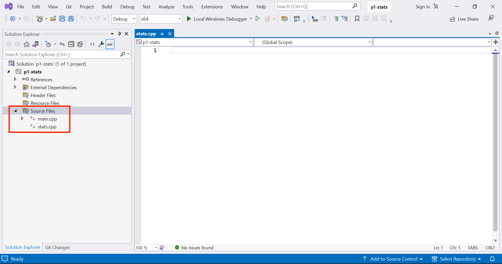
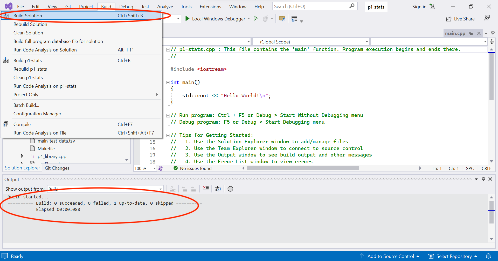

Setting up Visual Studio
========================
{: .primer-spec-toc-ignore }

[Visual Studio](https://www.visualstudio.com/) is a feature-rich integrated debugging environment (IDE) that runs on Windows.


# Prerequisites
At this point, you should already have a folder for your project ([instructions](setup.html#create-a-folder)).  Your folder location might be different.  You should have downloaded and unpacked the starter files already ([instructions](setup.html#download-and-unpack-starter-files)).
```console
$ pwd
/Users/awdeorio/src/eecs280/p1-stats
$ ls
Makefile      main_test.out.correct  p1_library.h           stats_tests.cpp
README.md     main_test_data.tsv     stats.h
main_test.in  p1_library.cpp         stats_public_test.cpp
```


# Restarting this tutorial
If you tried using this tutorial in the past and want to "start clean", here's how to delete all Visual Studio project configuration files.  This will not delete your code.  First, quit Visual Studio.  **BEWARE:** make sure you are in the correct `pwd` and be very careful with `rm -rf`!
```console
$ pwd
/Users/awdeorio/Desktop/eecs280/p1-stats
$ rm -rf .vs *.sln *.vcxproj *.vcxproj.filters
$ make clean
rm -rvf *.exe *~ *.out *.dSYM *.stackdump
```

Visual Studio has a *lot* of settings.  You can reset the entire user interface to the default settings by selecting "Tools" -> "Import" and Export Settings" -> "Reset all settings".  This is optional.


# Install
If you're using Windows, go to [https://www.visualstudio.com/vs/community/](https://www.visualstudio.com/vs/community/) and click "Click the "Download Community 2017" (select the latest version).

If you have an older version of Windows, we recommend upgrading to latest version of Windows, version 10 or newer.  It's free to UM students: [https://umich.onthehub.com/WebStore/Security/Signin.aspx](https://umich.onthehub.com/WebStore/Security/Signin.aspx)

Select "Desktop Development with C++" and make sure that the "Windows 10 SDK" and "C++ AddressSanitizer" are selected (your version might be different).  Click "Continue".  Reboot your computer when the installer prompts you.


Start Visual Studio.  The first time, you'll be asked to sign in with your Microsoft account.  Select "Visual C++" for your default development settings.


For reference, this is the version of Visual Studio we're using in this example.  Yours might be different.


### Getopt setup
<div class="primer-spec-callout warning" markdown="1">
This sections is only required for EECS 281 students. If you are a EECS 280 student, please skip this section.
</div>

Please follow the guide [here](/setup_eecs281.md#getopt-setup) to setup

# Create a project
A Visual Studio project contains the files and information to build your software.  In EECS 280, you'll eventually create one Visual Studio project for each EECS 280 project.

Start Visual Studio and create a new "Project From Existing Code".


Select the type "Visual C++".



We're going to use the same name as the directory that contains our starter files, `p1-stats`.  Set the project name to `p1-stats`.  Click "Next".


Select "Console application project" and then "Finish".


Quit Visual Studio, open a terminal, and navigate to your source code directory (remember the `cd` command).  You'll notice that Visual Studio created a new directory (`.vs/p1-stats.xcodeproj/`) and new files (`p1-stats.sln`, `p1-stats.vcxproj`, `p1-stats.vcxproj.filters`).
```console
$ cd /mnt/c/Users/awdeorio/Desktop/eecs280/p1-stats  # where awdeorio stored his source code
$ pwd
/mnt/c/Users/awdeorio/Desktop/eecs280/p1-stats
$ tree -a -L 2
.
├── .vs
│   └── p1-stats
├── main_test.in
├── main_test.out.correct
├── main_test_data.tsv
├── Makefile
├── p1_library.cpp
├── p1_library.h
├── p1-stats.sln
├── p1-stats.vcxproj
├── p1-stats.vcxproj.filters
├── stats.h
├── stats_public_test.cpp
└── stats_tests.cpp
```


## Add existing files

Start Visual Studio and open your project.  Here's how to do that all at once, from the command line:
```console
$ cmd.exe /c start p1-stats.vcxproj
```

All our existing files were already added when we selected "Project From Existing Code".  You should see them in the side bar.


To add an existing file after the project has been created, right click "Source Files", then select "Add" > "Existing Item".


Select the file to add and click "Add".

## Add New files

EECS 280 project 1 requires us to create two new files: `stats.cpp` and `main.cpp`.

Right click "Source Files", then select "Add" > "New Item".



Select "Visual C++" and "C++ File".  Name it `main.cpp`.  Click "Add".


Repeat the previous steps to create another new file, `stats.cpp`.

Now you'll see the two new files in the side bar.



You'll also see the new files at the command line.
```console
$ tree -L 1
.
├── main.cpp
├── main_test.in
├── main_test.out.correct
├── main_test_data.tsv
├── Makefile
├── p1_library.cpp
├── p1_library.h
├── p1-stats.sln
├── p1-stats.vcxproj
├── p1-stats.vcxproj.filters
├── stats.cpp
├── stats.h
├── stats_public_test.cpp
└── stats_tests.cpp
```

### Project 1 `stats.cpp`
Now let's modify the files that you created.  Edit `stats.cpp` and add function stubs.  A function stub contains only `assert(false)`; it's like a placeholder that we'll use to get our application to compile.  Each of these stubs corresponds to a function prototype in `stats.h`.  Don't forget to save.
```c++

// stats.cpp
// Project UID 5366c7e2b77742d5b2142097e51561a5

#include "stats.h"
#include <cassert>
#include <vector>
#include <cmath>
using namespace std;

vector<vector<double> > summarize(vector<double> v) {
  assert(false);
  return {{}};  // avoid Visual Studio error "function must return a value"
}

int count(vector<double> v) {
  assert(false);
  return 0;  // avoid Visual Studio error "function must return a value"
}

double sum(vector<double> v) {
  assert(false);
  return 0;  // avoid Visual Studio error "function must return a value"
}

double mean(vector<double> v) {
  assert(false);
  return 0;  // avoid Visual Studio error "function must return a value"
}

double median(vector<double> v) {
  assert(false);
  return 0;  // avoid Visual Studio error "function must return a value"
}

double mode(vector<double> v) {
  assert(false);
  return 0;  // avoid Visual Studio error "function must return a value"
}

double min(vector<double> v) {
  assert(false);
  return 0;  // avoid Visual Studio error "function must return a value"
}

double max(vector<double> v) {
  assert(false);
  return 0;  // avoid Visual Studio error "function must return a value"
}

double stdev(vector<double> v) {
  assert(false);
  return 0;  // avoid Visual Studio error "function must return a value"
}

double percentile(vector<double> v, double p) {
  assert(false);
  return 0;  // avoid Visual Studio error "function must return a value"
}

```
{: data-title="stats.cpp" }

### Project 1 `main.cpp`
Start your `main.cpp` like this.  All it does so far is "hello world".  We'll include a few libraries that will be useful later.
```c++
// main.cpp
// Project UID 5366c7e2b77742d5b2142097e51561a5

#include "stats.h"
#include "p1_library.h"
#include <iostream>
using namespace std;

int main() {
  cout << "hello from main!\n";
}
```
{: data-title="main.cpp" }


# Compile
A Visual Studio Build compiles one executable.  One executable should have exactly one `main()` function.  Three of our project 1 files have `main()` functions.

| Project 1 Target | File with `main()` | Other `.cpp` files to include in build |
| ------ | --------------- |
| `stats_tests.exe` | `stats_tests.cpp` | `stats.cpp`, `p1_library.cpp` |
| `stats_public_test.exe` | `stats_public_test.cpp` | `stats.cpp`, `p1_library.cpp` |
| `stats_tests.exe` | `main.cpp` | `stats.cpp`, `p1_library.cpp` |


## Compile at the command line
First, try building each target at the command line.

```console
$ pwd
/Users/awdeorio/src/eecs280/p1-stats
$ make clean
rm -rvf *.exe *~ *.out *.dSYM *.stackdump
$ make stats_tests.exe
g++ -Wall -Werror -pedantic -g --std=c++11 stats_tests.cpp stats.cpp p1_library.cpp -o stats_tests.exe
$ make stats_public_test.exe
g++ -Wall -Werror -pedantic -g --std=c++11 stats_public_test.cpp stats.cpp p1_library.cpp -o stats_public_test.exe
$ make main.exe
g++ -Wall -Werror -pedantic -g --std=c++11 main.cpp stats.cpp p1_library.cpp -o main.exe
```

Clean up.
```console
$ make clean
rm -rvf *.exe *~ *.out *.dSYM *.stackdump
```

## Compile with Visual Studio
Now, we'll make Visual Studio do the build.  We need to exclude the files that would cause multiple `main()` functions in the same build.  Right click `stats_public_test.cpp` in the solution explorer (left side bar) and select "Properties".  Set "Excluded From Build" to "Yes".


Do the same to exclude `main.cpp` from the build.  You should now see that both are excluded in the side bar.


"Build" -> "Build Solution".  See that the build output was successful.



To compile a different target, change the files included in the build.

## Compile future projects
In future projects, you'll have to figure out which files to include in a build.  Generally, each time you see `#include "myfile.h"`, you will include a corresponding `myfile.cpp` file in the build.  Be sure that you include only one `main()` function.

An alternative is to mimic the `Makefile`.  Compile one target and include any `.cpp` files in the `g++` command.  Notice that `main.cpp`, `stats.cpp`, and `p1_library.cpp` were included in the `g++` compile command.  These are the files you should include in the Xcode build.  Note that the files will be different for building a unit test, but you can use the same trick again.
```console
$ make clean
rm -rvf *.exe *~ *.out *.dSYM *.stackdump
$ make main.exe
g++ -Wall -Werror -pedantic -g --std=c++11 main.cpp stats.cpp p1_library.cpp -o main.exe
```


# Run
Click the "Local Windows Debugger" button.  It compiles, runs, and stops on the assertion we added earlier.  Click "Abort".


**Tip**: to run a program to the end and view its terminal output, set a breakpoint at the end of your `main()` function.  The [Debug](#debug) section describes breakpoints.

## Input redirection
Skip this subsection on your first time through the tutorial.  You can use input redirection to avoid typing program input each time you run (for debugging) a program.

Without input redirection, here's how you type input at the command line.  Notice that the program asks the user to `enter a filename` and then the user types `main_test_data.tsv`.  Then, the program asks the user to `enter a column name` and the user types `B`.
```console
$ make clean
rm -rvf *.exe *~ *.out *.dSYM *.stackdump
$ make main.exe
g++ -Wall -Werror -pedantic -g --std=c++11 main.cpp stats.cpp p1_library.cpp -o main.exe
$ ./main.exe
enter a filename
main_test_data.tsv
enter a column name
B
...
```

If we put the user input in a file we can automate the user input.  We'll put it in a file called `main_test.in`.
```console
$ cat main_test.in   # Peek at the contents of a file
main_test_data.tsv
B
$ ./main.exe < main_test.in  # Redirect file content to main's stdin (cin)
enter a filename
enter a column name
reading column B from main_test_data.tsv
...
```

Without input redirection, here's how to type input in the Visual Studio command line.  Notice that when we run `main`, a window pops up that accepts user input.


To configure input redirection, right-click the project in the Solution Explorer (`p1-stats` in this example).  Select "Properties".


Edit "Command Arguments" and click "OK".


## Arguments and options

<div class="primer-spec-callout info" markdown="1">
Skip this subsection for EECS 280 project 1.  You'll need it for project 2 and beyond.
</div>

*Arguments* and *options* are inputs to a program typed at the command line.  Arguments are often required.  Options (AKA *flags* or *switches*) start with a hyphen (`-`), and are typically optional.

**Arguments example** from project 2:  `resize.exe` is the name of the program, and the arguments are `horses.ppm`,  `horses_400x250.ppm`, `400`, and `250`.
```console
$ ./resize.exe horses.ppm horses_400x250.ppm 400 250
```
{: data-variant="no-line-numbers" }

**Options example** from project 5:  `main.exe` is the name of the program.  `train_small.csv` and  `test_small.csv` are arguments.  `--debug` is an option.
```console
$ ./main.exe train_small.csv test_small.csv --debug
```
{: data-variant="no-line-numbers" }

To configure options or arguments in Visual Studio, right-click the project in the Solution Explorer (`p1-stats` in this example).  Select "Properties".


Edit "Command Arguments" and click "OK".


# Debug
In order to debug, we want our application to stop when we run it.  Set a breakpoint by clicking to the left of a line number.  Then run the application.


Build and run.  Notice that the application is paused on entry to `main()`.


Click "Step Over" to go to the next line of code.


Our test fails immediately because we haven't implemented `sum()` yet.  Click "Abort".


Restart the program.  Then, click "step into".  You'll see that the cursor enters the `test_sum_small_data_set()` function.


Click "step over" a few times until you're on this line of code. Hover over a variable to see its value.


# Pro-tips
To start Visual Studio with our project open from the command line:
```console
$ cmd.exe /c start p1-stats.vcxproj
```

To search for help on the internet, try including the version.  For example, "Visual Studio 2017 command line arguments".

# Next steps
[Return to the main set up tutorial.](setup.html#visual-debugger)


# Acknowledgments
Original document written by Andrew DeOrio awdeorio@umich.edu.

This document is licensed under a [Creative Commons Attribution-NonCommercial 4.0 License](https://creativecommons.org/licenses/by-nc/4.0/). You’re free to copy and share this document, but not to sell it. You may not share source code provided with this document.
