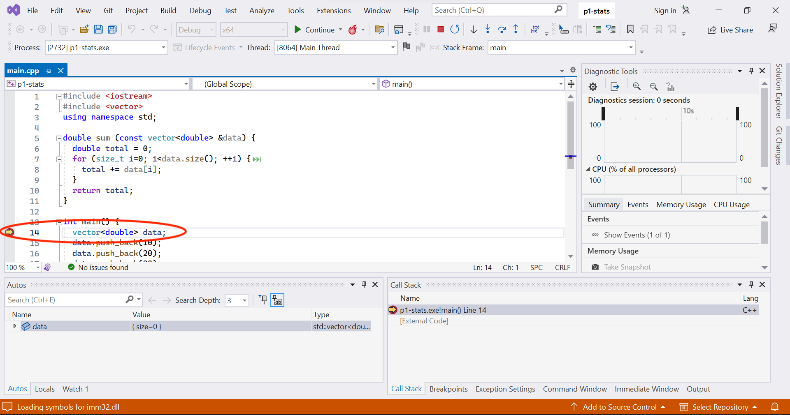
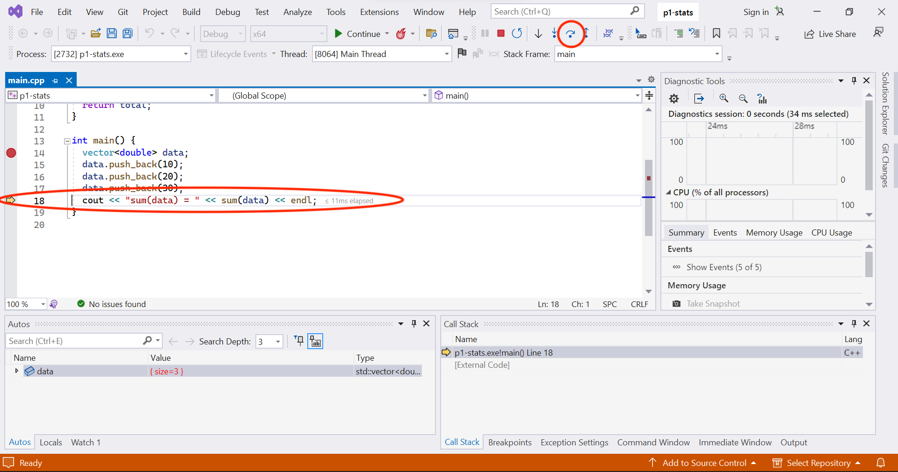

Setting up Visual Studio
========================
{: .primer-spec-toc-ignore }

[Visual Studio](https://www.visualstudio.com/) is a feature-rich integrated debugging environment (IDE) that runs on Windows.

<div class="primer-spec-callout info" markdown="1">
If you already have Visual Studio installed, skip to the [Create a project](#create-a-project) section.
</div>

## Prerequisites
There are no prerequisites for Visual Studio.

## Restart
To start clean, first quit Visual Studio.  Back up your files, and then delete your project directory.  Your project directory might be different.
```console
$ pwd
/Users/awdeorio/src/eecs280
$ cp -a p1-stats p1-stats.bak  # Backup
$ rm -rf p1-stats              # Delete
```

Visual Studio has a *lot* of settings.  You can reset the entire user interface to the default settings by selecting "Tools" -> "Import" and Export Settings" -> "Reset all settings".  This is optional.


## Install
Install Visual Studio Community edition from [Microsoft's website](https://www.visualstudio.com/vs/community/).

Select "Desktop Development with C++" and make sure that the "Windows 10 SDK", "Windows 11 SDK", and "C++ AddressSanitizer" are selected.  Click "Continue".  Reboot your computer when the installer prompts you.


Start Visual Studio.  The first time, you'll be asked about a few preferences.


The screenshots in the tutorial were created with Visual Studio Community 2022.  Your version might be different.

## Create a project
A Visual Studio project contains the files and information to build your software.  In EECS 280, you'll eventually create one Visual Studio project for each EECS 280 project.

Start Visual Studio.  Create a new project.


Select the type "Visual C++".


Set a project name, we'll call our example project `p1-stats`.  Click "Next".

<div class="primer-spec-callout warning" markdown="1">
**Pitfall:** Avoid paths that contain spaces.  Spaces causes problems with some command line tools.

| Bad Example     | Good Example   |
|-----------------|----------------|
| `.../EECS 280/Project 1 Stats` | `.../eecs280/p1-stats`  |

</div>


Select "Console application project" and then "Finish".


Click the `p1-stats` folder and rename it to `src`.  We recommend this in EECS 280 to avoid confusing the outer directory (`p1-stats`) with the inner directory (`src`).  This step is optional.


You can see the files created by Visual Studio from the command line.  Notice that Visual Studio created a folder project metadata: `.vs/p1-stats/` and new files `p1-stats.sln`, `p1-stats.vcxproj`, `p1-stats.vcxproj.filters`.
```console
FIXME FIXME FIXME
$ pwd
/mnt/c/Users/awdeorio/Desktop/eecs280/p1-stats
$ tree -a -L 2
.
├── .vs
│   └── p1-stats
└── src
    └── main.cpp
```

### Add new files
<div class="primer-spec-callout info" markdown="1">
Visual Studio created `main.cpp` by default.  Skip this subsection your first time through the tutorial.  You can come back to it.
</div>

FIXME Open your project folder by selecting `File` > `Open` > navigate to the `p1-stats` folder and open `p1-stats.xcodeproj`.

<div class="primer-spec-callout info" markdown="1">
**Pro-tip:** Here's a quick way to open Visual Studio to a specific project folder from the command line.
```console
$ wslview p1-stats
```
{: data-variant="no-line-numbers" }
</div>

Right click "Source Files", then select "Add" > "New Item".


Select "Visual C++" and "C++ File".  Name your file, we'll use `stats.cpp` for this example.  Click "Add".


You should see your new file in the `src` directory.


### Add existing files
If you have starter files, add them to the `src` subdirectory inside your project directory.

We'll use the terminal to download, unpack, and move starter files into the `src` subdirectory.  Your URL or folder might be different.  **Pro-tip:** [copy/paste instructions for WSL](setup_wsl.html#how-do-i-copy-and-paste).

<div class="primer-spec-callout warning" markdown="1">
**Pitfall:** Make sure you're in the subdirectory containing your source code.
```console
$ ls
main.cpp ...
```
</div>

```console
$ wget https://eecs280staff.github.io/p1-stats/starter-files.tar.gz
$ tar -xvzf starter-files.tar.gz
$ mv starter-files/* .
$ rm -rf starter-files starter-files.tar.gz
```

You should see your new files in the `src` subdirectory.
```console
$ tree
.
├── p1-stats.xcodeproj
    ...
└── src
    ├── Makefile
    ├── main.cpp
    ├── main_test.in
    ├── main_test.out.correct
    ├── main_test_data.tsv
    ├── p1_library.cpp
    ├── p1_library.h
    ├── stats.cpp
    ├── stats.h
    ├── stats_public_test.cpp
    └── stats_tests.cpp.starter
```

Start Visual Studio and open your project.

FIXME remove image 070 ?


To add an existing file after the project has been created, right click "Source Files", then select "Add" > "Existing Item".


Select the file to add and click "Add".

FIXME image

You will now see your files in the sidebar on the left.

FIXME image

#### Rename files
If you need to rename any files, use Visual Studio, not the command line or Finder.  In EECS 280, you'll need to rename any files that end in `.starter`.

Select a file and press <kbd>Enter</kbd>.  Change the file name.  In EECS 280, you'll do this to any file that ends in `.starter`.

|  |  |

## Compile and Run
A Visual Studio Build compiles one executable.  One executable should have exactly one `main()` function.

Now, we'll have Visual Studio do the build.  We need to avoid multiple `main()` functions in the same build.  Right click `FIXME.cpp` in the solution explorer (left side bar) and select "Properties".  Set "Excluded From Build" to "Yes".


Do the same to exclude `main.cpp` from the build.  You should now see that both are excluded in the side bar.


"Build" -> "Build Solution".  See that the build output was successful.


Compile and run.  Click the "Local Windows Debugger" button.


<div class="primer-spec-callout info" markdown="1">
**Pro-tip**: FIXME To run a program to the end and view its terminal output, set a breakpoint at the end of your `main()` function.  The [Debug](#debug) section describes breakpoints.
</div>

### Sanitizers
FIXME

### Input redirection
<div class="primer-spec-callout info" markdown="1">
Skip this subsection your first time through the tutorial.  You can come back to it.
</div>

You can use input redirection to avoid typing program input each time you run a program.  Here's an example program.
```c++
#include <iostream>
#include <string>
using namespace std;

int main() {
  cout << "What's your name?" << endl;
  string name;
  cin >> name;
  cout << "Hello " << name << "!\n";
}
```

Without input redirection, the user types input at the command line (highlighted).
```console
$ make main.exe
$ ./main.exe
What's your name?
Drew
Hello Drew!
```
{: data-highlight="4" }

Automate user input by putting it in a file.
```
Drew
```
{: data-title="main_test.in" data-highlight="1" }

Redirect file `main_test.in` to stdin of `main.exe`.
```console
$ ./main.exe < main_test.in
What's your name?
Hello Drew!
```
{: data-highlight="1" }

Without input redirection, here's how to type input in the Visual Studio command line.  Notice that when we run `main`, a window pops up that accepts user input.


To configure input redirection, right-click the project in the Solution Explorer (`p1-stats` in this example).  Select "Properties".


Edit "Command Arguments" and click "OK".


### Arguments and options
<div class="primer-spec-callout info" markdown="1">
Skip this subsection for EECS 280 project 1.
</div>

Arguments and options are inputs to a program typed at the command line.  Here's an example from EECS 280 Project 5:
```console
$ ./main.exe train_small.csv test_small.csv --debug
```
{: data-variant="no-line-numbers" data-highlight="1" }

- `main.exe` is the name of the program
- `train_small.csv` and `test_small.csv` are arguments
- `--debug` is an option

Right-click the project in the Solution Explorer (`p1-stats` in this example).  Select "Properties".


Edit "Command Arguments" and click "OK".


## Debug
In this section, we'll set a breakpoint, which pauses the debugger.  Then, we'll cover some of the options to continue execution.

 **Step Over**
Run one line of code, stepping _over_ any function calls by running the whole function in one step.

 **Step Into**
Run one line of code, stepping _into_ any function calls to execute them line-by-line.

 **Step Out**
Run the program until it returns from the current function (or until the next breakpoint).

 **Continue**
Run the program until the next breakpoint.

### Example code
{: .primer-spec-toc-ignore }

To get started, copy this example `main.cpp` into your editor.
```c++
#include <iostream>
#include <vector>
using namespace std;

double sum (const vector<double> &data) {
  double total = 0;
  for (size_t i=0; i<data.size(); ++i) {
    total += data[i];
  }
  return total;
}

int main() {
  vector<double> data;
  data.push_back(10);
  data.push_back(20);
  data.push_back(30);
  cout << "sum(data) = " << sum(data) << endl;
}
```
{: data-title="main.cpp" }

### Breakpoint
FIXME Select the file you want to debug.  Set a breakpoint by clicking to the left of a line number.  A breakpoint tells the program to pause.


### Run
Run the debugger.  The program pauses at the breakpoint.  The FIXME indicator highlights the next line of code to be run.



### Step over
Click "Step Over" a few times until you reach the highlighted line of code



### Inspect
Hover over a variable to inspect its value.  You can also see values in the variables pane.  FIXME


### Step into
Click "Step Into".  The cursor enters the `sum()` function.


### Step out
Click "Step Out".  The `sum()` function completes, and the program pauses again.


### Continue
Press "Continue" to run the program to the next breakpoint, or the end, whichever comes first.


## Acknowledgments
Original document written by Andrew DeOrio awdeorio@umich.edu.

This document is licensed under a [Creative Commons Attribution-NonCommercial 4.0 License](https://creativecommons.org/licenses/by-nc/4.0/). You’re free to copy and share this document, but not to sell it. You may not share source code provided with this document.
