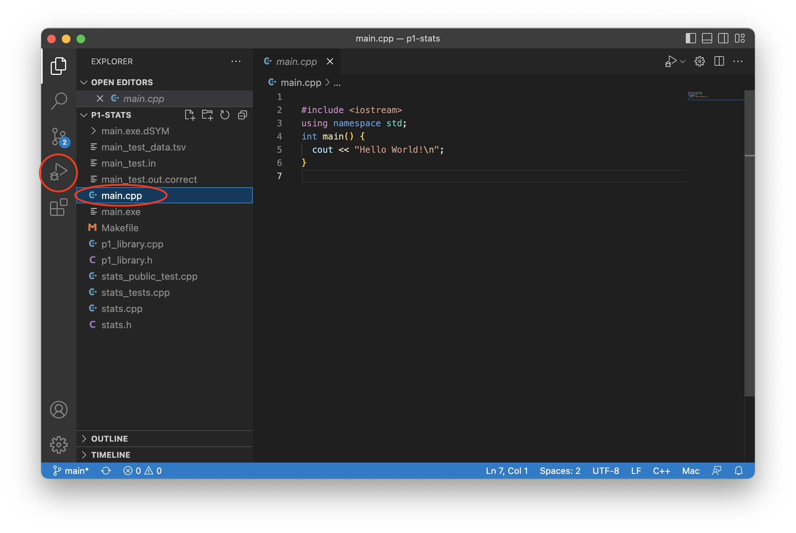

Setup up VS Code for C/C++
==========================
{: .primer-spec-toc-ignore }

[Visual Studio Code](https://code.visualstudio.com/) is a lightweight, easy-to-use, source code editor with debugging support.  It runs on macOS, Windows, and Linux (including CAEN Linux).  Visual Studio Code is not the same program as Visual Studio.

<div class="primer-spec-callout info" markdown="1">
If you already have VS Code installed with the C/C++ extensions, skip to the [Create a project](#create-a-project) section.
</div>

## Prerequisites
VS Code relies on external command line tools.  If you haven't installed CLI tools on your machine yet, follow one of these tutorials first.

| [macOS](setup_macos.html)| [Windows](setup_wsl.html) | [Linux](setup_wsl.html#install-cli-tools)

Make sure you have a compiler and a debugger installed.  Your version might be different.  Instructions for installation on [macOS](setup_macos#install-compiler), [Windows/WSL/Linux](setup_wsl.html#install-cli-tools).
```console
$ g++ --version  # macOS
Apple clang version 13.1.6 (clang-1316.0.21.2.5)
$ lldb --version # macOS
Apple Swift version 5.6.1 (swiftlang-5.6.0.323.66 clang-1316.0.20.12)
$ g++ --version  # WSL/Linux
g++ (GCC) 8.5.0 20210514
$ gdb --version  # WSL/Linux
GNU gdb (GDB)
```

Next, follow our [Command line interface (CLI)](cli.html) tutorial.

<div class="primer-spec-callout warning" markdown="1">
**Pitfall:** Make sure you have installed CLI tools for your OS before continuing.

| [macOS](setup_macos.html#install-cli-tools)| [Windows](setup_wsl.html#install-cli-tools) | [Linux](setup_wsl.html#install-cli-tools)

</div>

## Install
Choose your platform below. Also make sure to install extensions.

### Linux
Install the .deb package from the web [https://code.visualstudio.com/docs/setup/linux](https://code.visualstudio.com/docs/setup/linux).

### CAEN Linux
VS Code is already installed on CAEN Linux desktop environment.  You can use it while sitting at a CAEN Linux computer, or through a [VNC connection to CAEN Linux](https://teamdynamix.umich.edu/TDClient/76/Portal/KB/ArticleDet?ID=4999).

### macOS
Make sure you have macOS 11.1 or later.
```console
$ sw_vers
ProductName:	macOS
ProductVersion:	11.7
```

Use the homebrew package manager to install VS Code.  You can run this command from any directory.
```console
$ brew install --cask visual-studio-code
```

### Windows
Make sure you have updated Windows and WSL installations according to the [WSL tutorial](setup_wsl.html).

Then, Install VS Code from the web [https://code.visualstudio.com/](https://code.visualstudio.com/).

Select "Add to PATH".


Reboot.  Open a terminal again (WSL/Ubuntu) and verify your installation.  Your version might be different.

```console
$ code --version
1.74.1
1ad8d514439d5077d2b0b7ee64d2ce82a9308e5a
x64
```

### Extensions
Make sure VS Code is installed correctly by checking the version.  You need version 1.52.1 or higher.
```console
$ code --version
1.52.1
```

#### macOS
Install the Microsoft [C/C++ extension](https://marketplace.visualstudio.com/items?itemName=ms-vscode.cpptools) and the [CodeLLDB extension](https://marketplace.visualstudio.com/items?itemName=vadimcn.vscode-lldb).  See the [C/C++ extension alternatives](#cc-extension-alternatives) section for details about why we recommend these extensions.
```console
$ code --install-extension ms-vscode.cpptools
$ code --install-extension vadimcn.vscode-lldb
```

Restart VS Code.

Verify that the extensions are installed.  It's OK if you have other extensions installed.
```console
$ code --list-extensions
ms-vscode.cpptools
vadimcn.vscode-lldb
```

#### Windows
Install the Microsoft [C/C++ extension](https://marketplace.visualstudio.com/items?itemName=ms-vscode.cpptools) and the [WSL extension](https://code.visualstudio.com/docs/remote/wsl).  See the [C/C++ extension alternatives](#cc-extension-alternatives) section for details about why we recommend these extensions.
```console
$ code --install-extension ms-vscode.cpptools
$ code --install-extension ms-vscode-remote.remote-wsl
```

Restart VS Code.

Verify that the extension is installed.  It's OK if you have other extensions installed.
```console
$ code --list-extensions
ms-vscode.cpptools
ms-vscode-remote.remote-wsl
```

## Create a project
To create a VS Code project, create a folder (directory).  There are many ways to create folders: Finder AKA File Explorer, VS Code interface, VS Code integrated terminal, and the system terminal.  We'll use the system terminal and call our example project `p1-stats`.

Open the Terminal ([macOS](cli.html#open-terminal-macos)) or Ubuntu Bash Shell ([Windows](cli.html#open-terminal-windows)).

Navigate to your home directory, create a new directory, then move into the new directory. Your folder location might be different.  Here's some help with [`cd`](cli.html#cd), the [tilde `~`](cli.html#home-directory-), and [`mkdir`](cli.html#mkdir).

```console
$ mkdir ~/eecs280
$ cd ~/eecs280
$ mkdir p1-stats
$ cd p1-stats
```

<div class="primer-spec-callout warning" markdown="1">
**Pitfall:** Avoid paths that contain spaces.  Spaces causes problems with some command line tools.

| Bad Example     | Good Example   |
|-----------------|----------------|
| `EECS 280/` | `eecs280/` |
| `Project 1 Stats/` | `p1-stats/` |

</div>
  
<div class="primer-spec-callout warning" markdown="1">
**Windows Pitfall:** Linux (Ubuntu) has a separate home directory.  Storing code in your Windows home directory can cause slowdowns.

```console
$ pwd
/home/awdeorio ...         # Good, Linux home
/c/mnt/Users/awdeorio ...  # Bad, Windows home
```

Here's how to [access your Linux files from Windows](setup_wsl.html#accessing-linux-files-from-windows).

</div>

Start VS Code and open your project folder by selecting `File` > `Open Folder...` > navigate to the `p1-stats` folder.

<div class="primer-spec-callout info" markdown="1">
**Pro-tip:** Here's a quick way to open VS Code to a specific project folder from the command line.  First make sure you're in the directory that contains your source code.
```console
$ ls
main.cpp ...
$ code .
```
</div>


### Add new files
Open your project folder by selecting `File` > `Open Folder...` > navigate to the `p1-stats` folder.

Select the add file icon and give it a name, e.g., `main.cpp`.


Alternatively, create your `main.cpp` file from the command line using [`touch`](cli.html#touch). 

```console
$ touch main.cpp
```

Copy-paste this Hello World program into your `main.cpp`.  Save the updated file.

```c++
#include <iostream>
using namespace std;

int main() {
  cout << "Hello World!\n";
}
```
{: data-title="main.cpp" }

### Add existing files
If you have starter files, add them to your project directory.  This example is from [EECS 280 Project 1](https://eecs280staff.github.io/p1-stats/), but this tutorial doesn't require understanding the files.  Your URL or files might be different.

<div class="primer-spec-callout warning" markdown="1">
**Pitfall:** Make sure you're in the directory containing your source code.
```console
$ ls
main.cpp
```
</div>

<div class="primer-spec-callout info" markdown="1">
**Pro-tip:** [Copy/paste instructions](setup_wsl.html#copy-paste) for WSL.
</div>

We'll use the terminal to download, unpack, and move the starter files into the directory that already contains `main.cpp`.  Your URL or folder might be different.
```console
$ wget https://eecs280staff.github.io/p1-stats/starter-files.tar.gz
$ tar -xvzf starter-files.tar.gz
$ mv starter-files/* .
$ rm -rf starter-files starter-files.tar.gz
```

You should see your new files in your project directory.
```console
$ tree
.
├── Makefile
├── main.cpp
├── main_test.in
├── main_test.out.correct
├── main_test_data.tsv
├── p1_library.cpp
├── p1_library.h
├── stats.h
├── stats_public_test.cpp
└── stats_tests.cpp.starter
```

You should see your new files appear in VS Code.


#### Rename files
If you need to rename any files, you can do this from VS Code or from the command line.  In EECS 280, you'll need to rename any files that end in `.starter`.

Right click a file and select "rename".  Change the file name.  In EECS 280, you'll do this to any file that ends in `.starter`.

|  |  |

<div class="primer-spec-callout info" markdown="1">
**Pro-tip:** You can also rename files the command line, for example:
```console
$ mv stats_tests.cpp.starter stats_tests.cpp
```
</div>

## Compile and Run
VS Code uses an executable you build at the command line.

First, compile and run your executable at the command line.
```console
$ touch stats.cpp  # Needed for EECS 280 P1
$ make main.exe
$ ./main.exe
Hello World!
```

<div class="primer-spec-callout warning" markdown="1">
**Pitfall:** Make sure you're in the directory containing your source code.
```console
$ ls
main.cpp ...
```
</div>

<div class="primer-spec-callout warning" markdown="1">
**Pitfall:** If you're in EECS 280 and get an error like this, [add a new file](#add-new-files) `stats.cpp`.  It's OK if the file is empty for now.
```console
$ make main.exe
make: *** No rule to make target `stats.cpp', needed by `main.exe'.  Stop.
```
</div>

<div class="primer-spec-callout warning" markdown="1">
**Pitfall:** VS Code debugging will fail if there are no debugging symbols.  Double check the output of `make` and verify that you see `-g` being used in the commands.  The EECS 280 defaults include `-g`.
```console
$ make main.exe
g++ ... -g main.cpp ...
```
</div>

<div class="primer-spec-callout warning" markdown="1">
If you don't have a `Makefile`, you can compile manually.  We don't recommend this for EECS 280 students.
```console
$ g++ -g main.cpp -o main.exe
```
</div>

### macOS create `launch.json`

Select the file you would like to run.  Navigate to the debugging pane.



Click "create a launch.json file".


Select LLDB.


Edit the `program` field in `launch.json`.  Save the updated file.  Your `program` name might be different.


### Windows/WSL create `launch.json`

<div class="primer-spec-callout warning" markdown="1">
**WSL Pitfall:** Make sure you're in WSL mode.


If you accidentally open VS Code from Windows mode, click on the green icon in the lower left hand corner and then select "Reopen Folder in WSL".


</div>

Select the file you would like to run.  Navigate to the debugging pane.


Click "create a launch.json file".


If you are prompted to select a debugger, select C++ (GDB/LLDB).


Click "Add Configuration".  If the button does not appear in the bottom-right corner, select "Run" from the top menu, then select "Add Configuration".


Select the "C/C++ (gdb) Launch" configuration.  This will create a default `launch.json` ([Microsoft Reference](https://code.visualstudio.com/docs/cpp/launch-json-reference)).


Edit the `program` and `cwd` fields in `launch.json`.  Save the updated file.  Your `program` name might be different.


### Edit `launch.json` program

If you already have a working `launch.json` and want to debug a different program, edit the `program` field `launch.json`.  Your `program` name might be different.  Make sure `cwd` is set to `"${workspaceFolder}"`.
```json
{
    "program": "${workspaceFolder}/main.exe",
    ...
    "cwd": "${workspaceFolder}",
}
```
{: data-highlight="2,4" }


### Run

Click the triangle to run.  You'll see your program's output in the terminal window at the bottom.


<div class="primer-spec-callout warning" markdown="1">
**Pitfall:** Remember to build your executable at the command line first.
```console
$ make main.exe
```
</div>

<div class="primer-spec-callout warning" markdown="1">
**Pitfall:** If you're having trouble running your program, delete your `launch.json` and try the [compile and run](#compile-and-run) section again.


</div>

### Sanitizers
We recommend enabling the address sanitizer and undefined behavior sanitizer. These will help you find memory errors like going off the end of an array or vector.

First, edit your `Makefile` and add the `CXXFLAGS` recommended by the [ASAN Quick Start](setup_asan.html#quick-start).

#### Windows/WSL or Linux `launch.json` changes
Edit the `"environment"` property in your `launch.json`.  If there's already an empty `"environment": []`, replace it.  If there isn't one, add it after the `"args"` property.

```json
  "environment": [
    {
      "name": "ASAN_OPTIONS",
      "value": "abort_on_error=1:detect_leaks=0"
    }
  ],
```
{: data-highlight="3-4" }

#### macOS `launch.json` and settings changes
Edit the `"env"` property in your `launch.json`.  If there's already an empty `"env": {}`, replace it.  If there isn't one, add it after the `"args"` property.

```json
  "env": {
      "ASAN_OPTIONS": "abort_on_error=1:detect_leaks=0"
  },
```
{: data-highlight="2" }

Open Settings on VSCode (**macOS:** Code > Settings > Settings). Search for "lldb: show disassembly" (without the quotes) and set the option to `never`.  (See [ASAN error shows assembly code](#asan-error-shows-assembly-code) for an explanation.)


### Input redirection
<div class="primer-spec-callout info" markdown="1">
Skip this subsection your first time through the tutorial.  You can come back to it.
</div>

If you're unfamiliar with input redirection, first read the CLI tutorial section on [input redirection](cli.html#input-redirection-).

#### Windows/WSL or Linux `launch.json` changes

To configure input redirection, edit `launch.json`.  These changes are for the Microsoft [C/C++ extension](https://marketplace.visualstudio.com/items?itemName=ms-vscode.cpptools).
```json
{
    "configurations": [
        {
            ...
            "program": "${workspaceFolder}/main.exe",
            "args": ["<", "main_test.in"],
            ...
        }
    ]
}
```
{: data-title="launch.json" data-highlight="6" }

#### macOS `launch.json` changes

To configure input redirection, edit `launch.json` ([docs](https://github.com/vadimcn/vscode-lldb/blob/master/MANUAL.md#stdio-redirection)).  These instructions are for the [CodeLLDB extension](https://marketplace.visualstudio.com/items?itemName=vadimcn.vscode-lldb).
```json
{
    "configurations": [
        {
            ...
            "program": "${workspaceFolder}/main.exe",
            "stdio": ["main_test.in", null, null],
            ...
        }
    ]
}
```
{: data-title="launch.json" data-highlight="6" }

<div class="primer-spec-callout warning" markdown="1">
**Pitfall:** Make sure you're using the CodeLLDB extension.  You should see `lldb` in your `launch.json`.  If not, delete your `launch.json` and try the [compile and run](#compile-and-run) section again.

```json
{
    "configurations": [
        {
            "type": "lldb",
            ...
```
{: data-title="launch.json" data-highlight="4" }

</div>

### Arguments and options
<div class="primer-spec-callout info" markdown="1">
Skip this subsection for EECS 280 project 1.
</div>

Arguments and options are inputs to a program typed at the command line.  Here's an example from EECS 280 Project 5:
```console
$ ./main.exe train_small.csv test_small.csv --debug
```
{: data-variant="no-line-numbers" data-highlight="1" }

- `main.exe` is the name of the program
- `train_small.csv` and `test_small.csv` are arguments
- `--debug` is an option

To run a program with options or arguments in VS Code, edit `launch.json`.  Each option or argument should goes in a separate comma-separated string.
```json
{
    "configurations": [
        {
            ...
            "program": "${workspaceFolder}/main.exe",
            "args": ["train_small.csv", "test_small.csv", "--debug"],
            ...
        }
    ]
}
```
{: data-title="launch.json" data-highlight="6" }

## Debug
In this section, we'll set a breakpoint, which pauses the debugger.  Then, we'll cover some of the options to continue execution.

 **Step Over**
Run one line of code, stepping _over_ any function calls by running the whole function in one step.

 **Step Into**
Run one line of code, stepping _into_ any function calls to execute them line-by-line.

 **Step Out**
Run the program until it returns from the current function (or until the next breakpoint).

 **Continue**
Run the program until the next breakpoint.

### Example code

To get started, copy this example `main.cpp` into your editor.
```c++
#include <iostream>
#include <vector>
using namespace std;

double sum (const vector<double> &data) {
  double total = 0;
  for (size_t i=0; i<data.size(); ++i) {
    total += data[i];
  }
  return total;
}

int main() {
  vector<double> data;
  data.push_back(10);
  data.push_back(20);
  data.push_back(30);
  cout << "sum(data) = " << sum(data) << endl;
}
```
{: data-title="main.cpp" }

### Breakpoint
Select the file you want to debug.  Set a breakpoint by clicking to the left of a line number.  A breakpoint tells the program to pause.


### Run
Select the debugging pane, then run the debugger.  The program pauses at the breakpoint.  The yellow indicator highlights the next line of code to be run.


<div class="primer-spec-callout warning" markdown="1">
**Pitfall:** Don't forget to compile!
```console
$ make main.exe                # With a Makefile
$ g++ -g main.cpp -o main.exe  # Without a Makefile
```
</div>

### Step over
Click "Step Over" a few times until you reach the highlighted line of code


### Inspect
Hover over a variable to inspect its value.  You can also see values in the VARIABLES pane.


<div class="primer-spec-callout warning" markdown="1">
If you have trouble viewing the contents of a container like this screenshot, see [Pretty Printing STL Containers with `gdb`](setup_gdb.html#pretty-printing-stl-containers-with-gdb).


</div>

### Step into
Click "Step Into".  The cursor enters the `sum()` function.


### Step out
Click "Step Out".  The `sum()` function completes, and the program pauses again.


### Continue
Press "Continue" to run the program to the next breakpoint, or the end, whichever comes first.


## Troubleshooting
This section is for common problems and solutions.

### Restart
To reset VS Code project settings and starter files, first quit VS Code.  Make a backup copy of your files, and then delete your project directory.  Your project directory might be different.

```console
$ pwd
/Users/awdeorio/src/eecs280
$ cp -a p1-stats p1-stats.bak  # Backup
$ rm -rf p1-stats              # Delete
```

Then, return to the [Create a project](#create-a-project) section.

#### Remove all extensions and configuration
If you tried recreating your project directory and are still having trouble, try removing all VS Code extensions and configuration.  These instructions are based on the [Microsoft instructions](https://code.visualstudio.com/docs/setup/uninstall#_clean-uninstall).

**macOS:**
```console
$ rm -rf ~/.vscode
$ rm -rf ~/Library/Application\ Support/Code
```

**Windows:**  Replace `awdeorio` with your Windows username.  List the usernames with `ls /mnt/c/Users/`.
```console
$ rm -rf ~/.vscode
$ rm -rf "/mnt/c/Users/awdeorio/.vscode"
$ rm -rf "/mnt/c/Users/awdeorio/AppData/Roaming/Code"
```

### Intellisense C++ Standard
Intellisense is the feature that indicates compiler errors with red squiggly lines and suggests code completions.  If the C++ standard is out-of-date, you'll see squiggles where you shouldn't.

First, you should already have the `C/C++` extension installed ([Instructions](#extensions)).

Next, open VS Code's Command Palette with `View > Command Palette` or with the keyboard shortcut `ctrl + shift + P` on Windows or `cmd + shift + P` on macOS.  Search for and select `C/C++: Edit Configurations (JSON)`.  This will open the file `c_cpp_properties.json`.


Modify the `cStandard` and `cppStandard` settings in `c_cpp_properties.json`.  Don't change any other settings.  Save the file.
```json
{
    "configurations": [
        {
            ...
            "cStandard": "c17",
            "cppStandard": "c++17",
            ...
        }
    ],
    ...
}
```
{: data-title="c_cpp_properties.json" data-highlight="5-6" }

### C/C++ extension alternatives
There are multiple options for C/C++ extensions.

[Microsoft C/C++ extension](https://marketplace.visualstudio.com/items?itemName=ms-vscode.cpptools) provides debugging support and intellisense on Windows, Linux and macOS.  At the time of this writing (January 2023) debug support has a [bug on macOS](https://github.com/microsoft/vscode-cpptools/issues/7240).

[CodeLLDB](https://marketplace.visualstudio.com/items?itemName=vadimcn.vscode-lldb) provides debugging support for those using the LLVM compiler.  Apple's compiler on macOS is based on LLVM.

[clangd](https://marketplace.visualstudio.com/items?itemName=llvm-vs-code-extensions.vscode-clangd) provides intellisense and requires the `clangd` language server, which is related to the LLVM compiler.  We do not recommend installing the `clangd` extension with the Microsoft C/C++ extension because multiple intellisense providers can produce confusing results.

[WSL](https://code.visualstudio.com/docs/remote/wsl) lets us develop with Linux-based utilities like the `g++` compiler.

### ASAN error shows assembly code
When the Address Sanitizer detects an error, VSCode may stop in an assembly file that does not help you find where the error was caused. For example, consider the following code with a use-after-free error.

```cpp
#include <iostream>
using namespace std;

int main() {
    int * p = new int;
    delete p;
    cout << *p << endl;  // use-after-free
}
```
{: data-title="main.cpp" data-highlight="7" }

Running the debugger with the ASAN sanitizer will display a confusing assembly file.


To disable this pop up, you can set the `lldb.showDisassembly` option to `never`.

First, open Settings on VSCode (**macOS:** Code > Settings > Settings, **Windows:** File > Preferences > Settings).

Next, search for "lldb: show disassembly" and set the option to `never`.


Now, running the debugger will not display the assembly file. However, it will not yet highlight the erroneous line. To find the erroneous line, look through the Call Stack on the debugging panel and click on your source file.


## Acknowledgments
Original document written by Andrew DeOrio awdeorio@umich.edu.

This document is licensed under a [Creative Commons Attribution-NonCommercial 4.0 License](https://creativecommons.org/licenses/by-nc/4.0/). You’re free to copy and share this document, but not to sell it. You may not share source code provided with this document.
