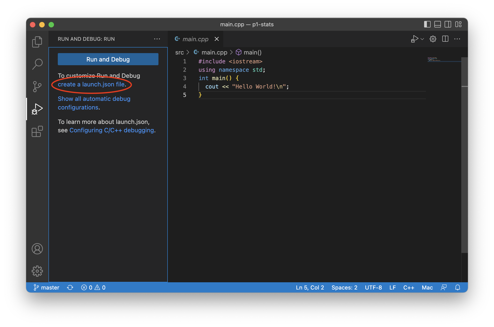
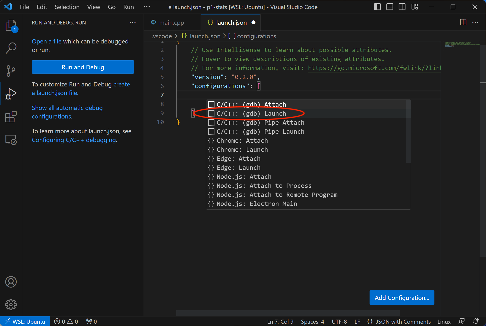
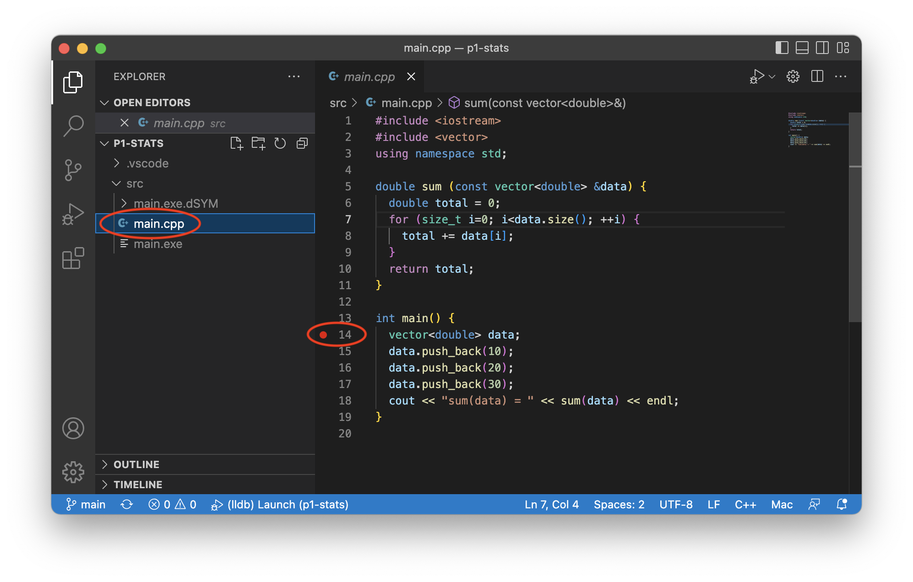
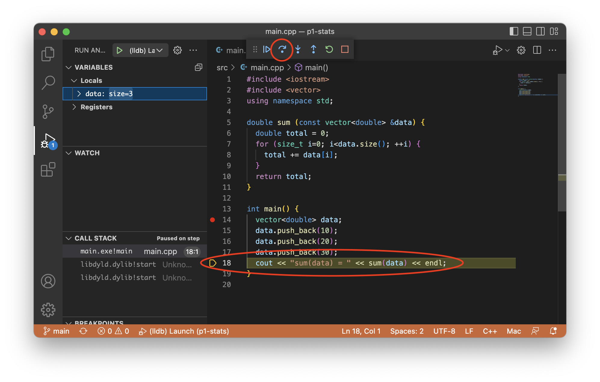

Setting up VS Code
==================
{: .primer-spec-toc-ignore }

[Visual Studio Code](https://code.visualstudio.com/) is a lightweight, easy-to-use, source code editor with debugging support.  It run on macOS, Windows, and Linux (including CAEN Linux).  Visual Studio Code is not the same program as Visual Studio.

## Prerequisites
There are no prerequisites for VS Code.

## Restart
If you tried using this tutorial in the past and want to "start clean", here's how to delete all VS Code configuration files.  This will not delete your code.  First, quit VS Code.
```console
$ pwd
/Users/awdeorio/src/eecs280/p1-stats
$ rm -rf .vscode
$ rm -rf ~/.vscode
$ make clean
rm -rvf *.exe *~ *.out *.dSYM *.stackdump
```

## Install
Choose your platform below.

<div class="primer-spec-callout info" markdown="1">
If you already have VS Code installed with C/C++ extensions, skip to the [Create a project](#create-a-project) section.
</div>


### macOS
Make sure you have macOS 11.1 or later.
```console
$ sw_vers
ProductName:	macOS
ProductVersion:	11.7
```

Use the homebrew package manager to install VS Code.
```console
$ brew install --cask visual-studio-code
```

### Windows
Make sure you have updated Windows and WSL installations according to the [WSL tutorial](setup_wsl.html).

Then, Install VS Code from the web [https://code.visualstudio.com/](https://code.visualstudio.com/).

Select "Add to PATH".


Finally, reboot

#### WSL remote mode

Use VS Code's [remote mode](https://code.visualstudio.com/docs/remote/wsl) to connect the VS Code graphical user interface (GUI) running on Windows to the Linux environment and tools like `g++` running on WSL.

WSL Remote Mode connects VS Code to a remote instance of a VS Code server running elsewhere. When you launch VS Code from the WSL terminal, a VS Code server is started within WSL and the VS Code UI running on Windows connects to that server.


Install the [WSL extension](https://marketplace.visualstudio.com/items?itemName=ms-vscode-remote.remote-wsl).  It's OK if you have other extensions installed.
```console
$ code --install-extension ms-vscode-remote.remote-wsl
$ code --list-extensions
ms-vscode-remote.remote-wsl
```

After the extension is installed, close VS Code and start it from the WSL terminal.

```console
$ pwd
/Users/awdeorio/src/eecs280/p1-stats
$ code .
```

You'll know that VS Code is running in remote mode when you see the remote mode indicator in the bottom left corner.


### Linux
Install the .deb package from the web [https://code.visualstudio.com/docs/setup/linux](https://code.visualstudio.com/docs/setup/linux).

### CAEN Linux
VS Code is already installed on CAEN Linux desktop environment.  You can use it while sitting at a CAEN Linux computer, or through a [VNC connection to CAEN Linux](https://teamdynamix.umich.edu/TDClient/76/Portal/KB/ArticleDet?ID=4999).

### Extensions
Make sure VS Code is installed correctly by checking the version.  You need version 1.52.1 or higher.
```console
$ code --version
1.52.1
```

Install the Microsoft [C/C++ extension](https://marketplace.visualstudio.com/items?itemName=ms-vscode.cpptools).
```console
$ code --install-extension ms-vscode.cpptools
$ code --install-extension ms-vscode.cpptools-extension-pack
```

<div class="primer-spec-callout warning icon-warning" markdown="1">
Verify that the cpptools extensions installed.  It's OK if you have other extensions installed.
```consle
$ code --list-extensions
ms-vscode.cpptools
ms-vscode.cpptools-extension-pack
```
</div>

<div class="primer-spec-callout warning icon-warning" markdown="1">
Verify that the clangd or CodeLLDB extensions are *not* installed.  The clangd extension provided C/C++ intellisense which conflicts with the Microsoft C/C++ extension.  The CodeLLDB extension provides C/C++ debugging support which causes confusion with the Microsoft C/C++ extension.
```consle
$ code --list-extensions
llvm-vs-code-extensions.vscode-clangd  # REMOVE ME
vadimcn.vscode-lldb                    # REMOVE ME
```

Uninstall them if necessary.
```console
$ code --uninstall-extension llvm-vs-code-extensions.vscode-clangd
$ code --uninstall-extension vadimcn.vscode-lldb
```
</div>


## Create a project
To create a VS Code project, create a folder and add files to it.  There are many ways to create folders and files that work with VS Code.  We'll use the terminal.
- Finder AKA File Explorer
- VS Code graphical user interface
- VS Code integrated terminal
- System terminal

Decide where to store your EECS 280 projects.  For reference, here are some common locations.  You might want to use your Desktop, Documents or Dropbox.


At this point, you should already have a folder for your project ([instructions](setup.html#create-a-folder)).  Your folder location might be different.  You should have downloaded and unpacked the starter files already ([instructions](setup.html#download-and-unpack-starter-files)).
```console
$ pwd
/Users/awdeorio/src/eecs280/p1-stats
$ ls
Makefile      main_test.out.correct  p1_library.h           stats_tests.cpp
README.md     main_test_data.tsv     stats.h
main_test.in  p1_library.cpp         stats_public_test.cpp
```

Start VS Code.
```console
$ pwd
/Users/awdeorio/src/eecs280/p1-stats
$ code .
```

### Add new files
EECS 280 project 1 requires us to create two new files: `stats.cpp` and `main.cpp`.

Open the p1-stats folder by selecting `File` > `Open Folder...` > navigate to the p1-stats folder.

Select the add file icon and name the new file `stats.cpp`.  Do this again to create `main.cpp`.


You'll also see the new files at the command line.
```console
$ ls
Makefile      main_test.out.correct  p1_library.h  stats_public_test.cpp
main.cpp      main_test_data.tsv     stats.cpp     stats_tests.cpp
main_test.in  p1_library.cpp         stats.h
```

#### Project 1 `stats.cpp`
Now let's modify the files that you created.  Edit `stats.cpp` and add function stubs.  A function stub contains only `assert(false)`; it's like a placeholder that we'll use to get our application to compile.  Each of these stubs corresponds to a function prototype in `stats.h`.  Don't forget to save.
```c++
// stats.cpp
// Project UID 5366c7e2b77742d5b2142097e51561a5

#include "stats.h"
#include <cassert>
#include <vector>
#include <cmath>
using namespace std;

vector<vector<double> > summarize(vector<double> v) {
  assert(false);
}

int count(vector<double> v) {
  assert(false);
}

double sum(vector<double> v) {
  assert(false);
}

double mean(vector<double> v) {
  assert(false);
}

double median(vector<double> v) {
  assert(false);
}

double mode(vector<double> v) {
  assert(false);
}

double min(vector<double> v) {
  assert(false);
}

double max(vector<double> v) {
  assert(false);
}

double stdev(vector<double> v) {
  assert(false);
}

double percentile(vector<double> v, double p) {
  assert(false);
}
```
{: data-title="stats.cpp" }

#### Project 1 `main.cpp`
Start your `main.cpp` like this.  All it does so far is "hello world".  We'll include a few libraries that will be useful later.
```c++
// main.cpp
// Project UID 5366c7e2b77742d5b2142097e51561a5
#include "stats.h"
#include "p1_library.h"
#include <iostream>
using namespace std;

int main() {
  cout << "hello from main!\n";
}
```
{: data-title="main.cpp" }


## Compile
VS Code uses an executable you build at the command line.  One executable should have exactly one `main()` function.  Three of our project 1 files have `main()` functions.

| Project 1 Target | File with `main()` | Other `.cpp` Build Sources |
| ------ | --------------- |
| `stats_tests.exe` | `stats_tests.cpp` | `stats.cpp`, `p1_library.cpp` |
| `stats_public_test.exe` | `stats_public_test.cpp` | `stats.cpp`, `p1_library.cpp` |
| `stats_tests.exe` | `main.cpp` | `stats.cpp`, `p1_library.cpp` |


Compile the executable you plan to run.
```console
$ pwd
/Users/awdeorio/src/eecs280/p1-stats
$ make clean
rm -rvf *.exe *~ *.out *.dSYM *.stackdump
$ make stats_tests.exe
g++ -Wall -Werror -pedantic -g --std=c++11 stats_tests.cpp stats.cpp p1_library.cpp -o stats_tests.exe
```

<div class="primer-spec-callout warning icon-warning" markdown="1">
**PITFALL:** VS Code debugging will fail if there are no debugging symbols.  Double check the output of `make` and verify that you see `-g` being used in the commands.  The EECS 280 defaults include `-g`.
</div>

## Run
Make sure you can run your executable at the command line.
```console
$ pwd
/Users/awdeorio/src/eecs280/p1-stats
$ ./stats_tests.exe
test_small_data_set
PASS!
```

Select the file you would like to debug.  Navigate to the debugging pane.


Click "Run and Debug".



Click "Add Configuration".


Select a "Launch" configuration.  This will create a default `launch.json` ([Microsoft Reference](https://code.visualstudio.com/docs/cpp/launch-json-reference)).
- macOS: "C/C++ (lldb) Launch"
- WSL orLinux: "C/C++ (gdb) Launch"



Edit the `program` field in `launch.json` with the program to run.  Your `launch.json` might be different.


Click the triangle to run.


### Sanitizers
We recommend enabling the address sanitizer and undefined behavior sanitizer. These will help you find memory errors like going off the end of an array or vector.

First, edit your `Makefile` and add the `CXXFLAGS` recommended by the [ASAN Quick Start](setup_asan.html#quick-start).

Then, edit the `"environment"` property in your `launch.json`.  If there's already an empty `"environment": []`, replace it.

```json
  "environment": [
    {
      "name": "ASAN_OPTIONS",
      "value": "abort_on_error=1:detect_leaks=0"
    }
  ]
```

When ASan detects an error, VSCode will stop so that you can see the stack trace and inspect the current state of the program.  This configuration also turns off leak-checking (LSan), which can't run simultaneously with the visual debugger. If you do want to check for leaks, just run from the terminal with sanitizers enabled.

If you're debugging something else in your program and don't want it to terminate on ASAN errors, you can change to `abort_on_error=0`.

### Input redirection
<div class="primer-spec-callout info" markdown="1">
Skip this subsection your first through the tutorial.  You can come back to it.
</div>

You can use input redirection to avoid typing program input each time you run (for debugging) a program.

Without input redirection, here's how you type input at the command line.  Notice that the program asks the user to `enter a filename` and then the user types `main_test_data.tsv`.  Then, the program asks the user to `enter a column name` and the user types `B`.
```console
$ make clean
rm -rvf *.exe *~ *.out *.dSYM *.stackdump
$ make main.exe
g++ -Wall -Werror -pedantic -g --std=c++11 main.cpp stats.cpp p1_library.cpp -o main.exe
$ ./main.exe
enter a filename
main_test_data.tsv
enter a column name
B
...
```

If we put the user input in a file we can automate the user input.  We'll put it in a file called `main_test.in`.
```console
$ cat main_test.in   # Peek at the contents of a file
main_test_data.tsv
B
$ ./main.exe < main_test.in  # Redirect file content to main's stdin (cin)
enter a filename
enter a column name
reading column B from main_test_data.tsv
...
```

Without input redirection, here's how to type input in the Visual Studio Code command line.  In some configurations, a window will pop up, in others, you'll type into a pane on the VS Code interface.


#### Windows `launch.json` changes

To configure input redirection, edit `launch.json`.
```json
{
    "configurations": [
        {
            ...
            "program": "${workspaceFolder}/main.exe",
            "args": ["<", "main_test.in"],
            ...
        }
    ]
}
```
#### macOS `launch.json` changes

To configure input redirection, edit `launch.json`.
```json
{
    "configurations": [
        {
            ...
            "MIMode": "lldb",
            "setupCommands": [
                {
                    "text": "settings set target.input-path main_test.in"
                }
            ]
            ...
        }
    ]
}
```

### Arguments and options
<div class="primer-spec-callout info" markdown="1">
Skip this subsection for EECS 280 project 1.  You'll need it for project 2 and beyond.
</div>

*Arguments* and *options* are inputs to a program typed at the command line.  Arguments are often required.  Options (AKA *flags* or *switches*) start with a hyphen (`-`), and are typically optional.

**Arguments example** from project 2:  `resize.exe` is the name of the program, and the arguments are `horses.ppm`,  `horses_400x250.ppm`, `400`, and `250`.
```console
$ ./resize.exe horses.ppm horses_400x250.ppm 400 250
```

**Options example** from project 5:  `main.exe` is the name of the program.  `train_small.csv` and  `test_small.csv` are arguments.  `--debug` is an option.
```console
$ ./main.exe train_small.csv test_small.csv --debug
```

To run a program with options or arguments in VS Code, edit `launch.json`.  Be sure to put each option or argument as a separate comma-separated string.
```json
"args": ["train_small.csv", "test_small.csv", "--debug"],
```

## Debug
In order to debug, we want our application to stop when we run it.  Set a breakpoint by clicking to the left of a line number.




Run the debugger.  The yellow indicator highlights the next line of code to be run (in this case, the first line of the program).


Click "Step Over" to run the highlighted line of code all at once.  Our test fails immediately because we haven't implemented `sum()` yet.



Restart the program.


Click "step into".  You'll see that the cursor enters the function.


Click "step over" a few times until you're on this line of code.  Hover over a variable to see its value.


<div class="primer-spec-callout warning icon-warning" markdown="1">
If you have trouble viewing the contents of a container like this screenshot, see the [Pretty Printing STL Containers with `gdb`](setup_gdb.html#pretty-printing-stl-containers-with-gdb).


</div>


## Troubleshooting
This section is for common problems and solutions.

### Intellisense and C++11
Intellisense is the feature that indicates compiler errors with red squiggly lines and suggests code completions.  If the C++ standard is out-of-date, you'll see squiggles where you shouldn't.

First, you should already have the `C/C++` extension installed ([Instructions](#extensions)).

Next, open VS Code's Command Palette with `View > Command Palette` or with the keyboard shortcut `ctrl + shift + P` on Windows or `cmd + shift + P` on macOS.  Search for and select `C/C++: Edit Configurations (JSON)`.  This will open the file `c_cpp_properties.json`.


Modify the `cStandard` and `cppStandard` settings in `c_cpp_properties.json`.  Don't change other settings.  Save the file.
```json
{
    "configurations": [
        {
            ...
            "cStandard": "c17",
            "cppStandard": "c++17",
            ...
        }
    ],
    ...
}
```

## Acknowledgments
Original document written by Andrew DeOrio awdeorio@umich.edu.

This document is licensed under a [Creative Commons Attribution-NonCommercial 4.0 License](https://creativecommons.org/licenses/by-nc/4.0/). You’re free to copy and share this document, but not to sell it. You may not share source code provided with this document.
