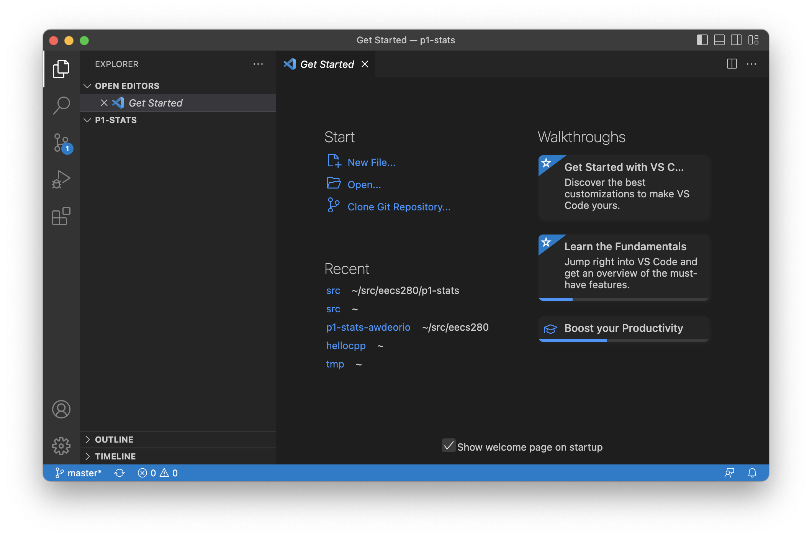
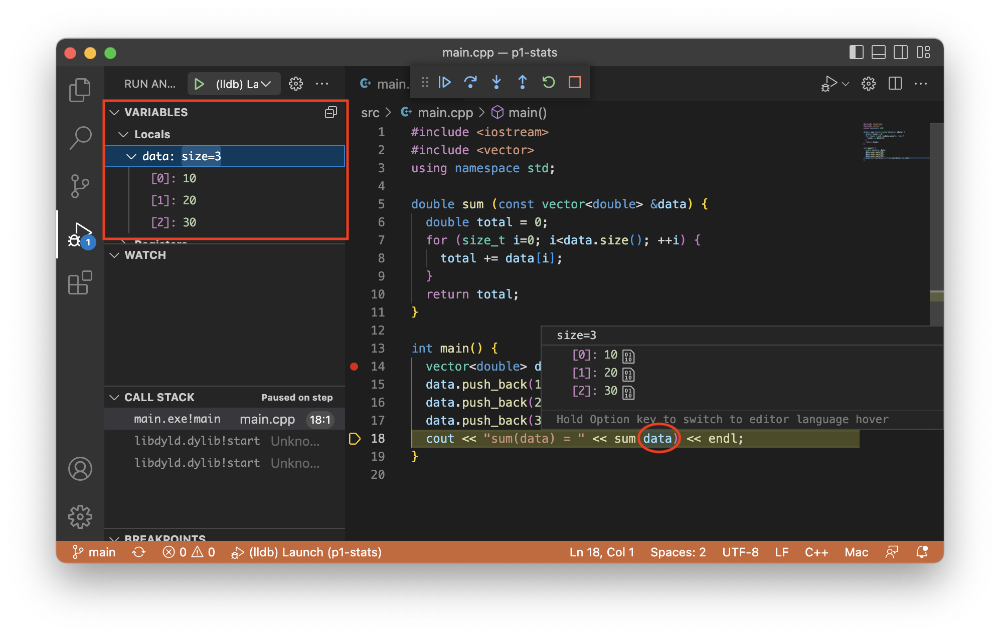
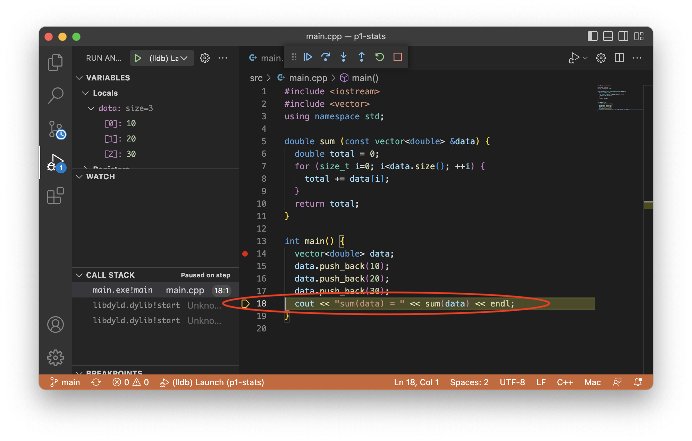

Setting up VS Code
==================
{: .primer-spec-toc-ignore }

[Visual Studio Code](https://code.visualstudio.com/) is a lightweight, easy-to-use, source code editor with debugging support.  It run on macOS, Windows, and Linux (including CAEN Linux).  Visual Studio Code is not the same program as Visual Studio.


# Prerequisites
At this point, you should already have a folder for your project ([instructions](setup.html#create-a-folder)).  Your folder location might be different.  You should have downloaded and unpacked the starter files already ([instructions](setup.html#download-and-unpack-starter-files)).
```console
$ pwd
/Users/awdeorio/src/eecs280/p1-stats
$ ls
Makefile      main_test.out.correct  p1_library.h           stats_tests.cpp
README.md     main_test_data.tsv     stats.h
main_test.in  p1_library.cpp         stats_public_test.cpp
```

This tutorial uses command line tools.  If you haven't installed CLI tools on your machine yet, follow one of these tutorials first.

| [macOS](setup_macos.html)| [Windows](setup_wsl.html) | [Linux](setup_wsl.html#install-cli-tools)


# Restarting this tutorial
If you tried using this tutorial in the past and want to "start clean", here's how to delete all VS Code configuration files.  This will not delete your code.  First, quit VS Code.
```console
$ pwd
/Users/awdeorio/src/eecs280/p1-stats
$ rm -rf .vscode
$ rm -rf ~/.vscode
$ make clean
rm -rvf *.exe *~ *.out *.dSYM *.stackdump
```


# Install
Choose your platform below.

### macOS
Use the homebrew package manager.
```console
$ brew install --cask visual-studio-code
```

### Windows
Install from the web [https://code.visualstudio.com/](https://code.visualstudio.com/).

Select "Add to PATH".


Finally, reboot

#### WSL remote mode
{: .primer-spec-toc-ignore }

Use VS Code's [remote mode](https://code.visualstudio.com/docs/remote/wsl) to connect the VS Code graphical user interface (GUI) running on Windows to the Linux environment and tools like `g++` running on WSL.

WSL Remote Mode connects VS Code to a remote instance of a VS Code server running elsewhere. When you launch VS Code from the WSL terminal, a VS Code server is started within WSL and the VS Code UI running on Windows connects to that server.


Start VS Code and install the `WSL - Remote` extension.  Navigate to the extensions tab and search for `WSL - Remote`.


After the extension is installed, close VS Code and start it from the WSL terminal.

```console
$ pwd
/Users/awdeorio/src/eecs280/p1-stats
$ code .
```

You'll know that VS Code is running in remote mode when you see the remote mode indicator in the bottom left corner.


### Linux
Install the .deb package from the web [https://code.visualstudio.com/docs/setup/linux](https://code.visualstudio.com/docs/setup/linux).

### CAEN Linux
VS Code is already installed on CAEN Linux desktop environment.  You can use it while sitting at a CAEN Linux computer, or through a [VNC connection to CAEN Linux](http://caenfaq.engin.umich.edu/linux-login/how-do-i-connect-to-a-caen-linux-computer-remotely).  You'll need to load the `vscode/1.19.2` module any time you open new terminal.
```console
$ module load vscode/1.19.2
$ module load git     # Optional, avoids warning about old git version
```

<div class="primer-spec-callout warning icon-warning" markdown="1">
**PITFALL:** Do not use the Applications menu to open VS Code.  It will open an older version.  Always use the command line, as shown later in this tutorial.
</div>

### All platforms
Make sure VS Code is installed correctly by checking the version.  You need version 1.18.0 or higher.
```console
$ code --version
1.18.0
dcee2202709a4f223185514b9275aa4229841aa7
```

# Install the C/C++ extension
Start Visual Studio Code from your source code directory.  Remember that the dot (`.`) means "the present working directory".
```console
$ pwd
/Users/awdeorio/src/eecs280/p1-stats
$ code .
```

Navigate to the extensions pane.


Install the C/C++ extension.

<div class="primer-spec-callout warning icon-warning" markdown="1">
If you have an M1 chip ("Apple Silicon"), install the CodeLLDB extension, too.

At the time of this writing, the official VSCode C/C++ extension visual debugging feature is broken, but intellisense works.  The unofficial CodeLLDB extension visual debugging feature works, but it does not provide intellisense.  Install both to get visual debugging and intellisense on the M1.
</div>




# Create a project
VS Code doesn't require any special setup for a project.  However, we'll add some files to our directory.

Start VS Code.  If you're on CAEN linux, don't forget to load the vscode module with `module load vscode/1.19.2`.
```console
$ pwd
/Users/awdeorio/src/eecs280/p1-stats
$ code .
```

## Add new files
EECS 280 project 1 requires us to create two new files: `stats.cpp` and `main.cpp`.

Open the p1-stats folder by selecting `File` > `Open Folder...` > navigate to the p1-stats folder.

Select the add file icon and name the new file `stats.cpp`.  Do this again to create `main.cpp`.


You'll also see the new files at the command line.
```console
$ ls
Makefile      main_test.out.correct  p1_library.h  stats_public_test.cpp
main.cpp      main_test_data.tsv     stats.cpp     stats_tests.cpp
main_test.in  p1_library.cpp         stats.h
```

### Project 1 `stats.cpp`
Now let's modify the files that you created.  Edit `stats.cpp` and add function stubs.  A function stub contains only `assert(false)`; it's like a placeholder that we'll use to get our application to compile.  Each of these stubs corresponds to a function prototype in `stats.h`.  Don't forget to save.
```c++
// stats.cpp
// Project UID 5366c7e2b77742d5b2142097e51561a5

#include "stats.h"
#include <cassert>
#include <vector>
#include <cmath>
using namespace std;

vector<vector<double> > summarize(vector<double> v) {
  assert(false);
}

int count(vector<double> v) {
  assert(false);
}

double sum(vector<double> v) {
  assert(false);
}

double mean(vector<double> v) {
  assert(false);
}

double median(vector<double> v) {
  assert(false);
}

double mode(vector<double> v) {
  assert(false);
}

double min(vector<double> v) {
  assert(false);
}

double max(vector<double> v) {
  assert(false);
}

double stdev(vector<double> v) {
  assert(false);
}

double percentile(vector<double> v, double p) {
  assert(false);
}
```
{: data-title="stats.cpp" }

### Project 1 `main.cpp`
Start your `main.cpp` like this.  All it does so far is "hello world".  We'll include a few libraries that will be useful later.
```c++
// main.cpp
// Project UID 5366c7e2b77742d5b2142097e51561a5
#include "stats.h"
#include "p1_library.h"
#include <iostream>
using namespace std;

int main() {
  cout << "hello from main!\n";
}
```
{: data-title="main.cpp" }


# Compile
VS Code uses an executable you build at the command line.  One executable should have exactly one `main()` function.  Three of our project 1 files have `main()` functions.

| Project 1 Target | File with `main()` | Other `.cpp` Build Sources |
| ------ | --------------- |
| `stats_tests.exe` | `stats_tests.cpp` | `stats.cpp`, `p1_library.cpp` |
| `stats_public_test.exe` | `stats_public_test.cpp` | `stats.cpp`, `p1_library.cpp` |
| `stats_tests.exe` | `main.cpp` | `stats.cpp`, `p1_library.cpp` |


Compile the executable you plan to run.
```console
$ pwd
/Users/awdeorio/src/eecs280/p1-stats
$ make clean
rm -rvf *.exe *~ *.out *.dSYM *.stackdump
$ make stats_tests.exe
g++ -Wall -Werror -pedantic -g --std=c++11 stats_tests.cpp stats.cpp p1_library.cpp -o stats_tests.exe
```

<div class="primer-spec-callout warning icon-warning" markdown="1">
**PITFALL:** VS Code debugging will fail if there are no debugging symbols.  Double check the output of `make` and verify that you see `-g` being used in the commands.  The EECS 280 defaults include `-g`.
</div>

# Run
Navigate to the debugging pane. Click "create a launch.json file".


You'll be prompted to select a debug configuration. Ignore the list of templates and just hit enter, leaving the box blank. This will create a default `launch.json` file.


VS Code should bring up the new `launch.json` file. If you need to find it again, look under `.vscode/launch.json` in your project explorer.


Find the appropriate configuration below based on your computer and operating system. Copy and paste it to replace the entire contents of `launch.json`. Once you save the file, the debugging pane should contain a button to launch the debugger. Clicking the gear button will take you back to `launch.json` if you need to change the configuration.


### macOS with Intel chip `launch.json`
```json
{
    "version": "0.2.0",
    "configurations": [
        {
            "name": "(lldb) Launch",
            "type": "cppdbg",
            "request": "launch",
            "program": "${workspaceFolder}/stats_tests.exe",
            "args": [],
            "stopAtEntry": false,
            "cwd": "${workspaceFolder}",
            "environment": [],
            "externalConsole": false,
            "MIMode": "lldb"
        }
    ]
}
```

### macOS with M1 chip ("Apple Silicon") `launch.json`
```json
{
    "version": "0.2.0",
    "configurations": [
        {
            "type": "lldb",
            "request": "launch",
            "name": "Debug",
            "program": "${workspaceFolder}/stats_tests.exe",
            "args": [],
            "cwd": "${workspaceFolder}"
        }
    ]
}
```

### Windows/WSL `launch.json`
```json
{
    "version": "0.2.0",
    "configurations": [
        {
            "name": "(gdb) Launch",
            "type": "cppdbg",
            "request": "launch",
            "program": "${workspaceFolder}/stats_tests.exe",
            "args": [],
            "stopAtEntry": false,
            "cwd": "${workspaceFolder}",
            "environment": [],
            "externalConsole": false,
            "MIMode": "gdb",
            "setupCommands": [
                {
                    "description": "Enable pretty-printing for gdb",
                    "text": "-enable-pretty-printing",
                    "ignoreFailures": true
                }
            ]
        }
    ]
}
```

### Linux `launch.json`
```json
{
    "version": "0.2.0",
    "configurations": [
        {
            "name": "(gdb) Launch",
            "type": "cppdbg",
            "request": "launch",
            "program": "${workspaceFolder}/stats_tests.exe",
            "args": [],
            "stopAtEntry": false,
            "cwd": "${workspaceFolder}",
            "environment": [],
            "externalConsole": false,
            "MIMode": "gdb",
            "setupCommands": [
                {
                    "description": "Enable pretty-printing for gdb",
                    "text": "-enable-pretty-printing",
                    "ignoreFailures": false
                }
            ]
        }
    ]
}
```

## Intellisense
Intellisense is the feature that indicates compiler errors with red squiggly lines and suggests code completions.  We'll configure the C/C++ Extension's intellisense features to support C++11.

First, you should already have the `C/C++` extension installed ([Instructions](setup_vscode.html#install-the-cc-extension)).

Next, open VS Code's Command Palette with `View > Command Palette` or with the keyboard shortcut `ctrl + shift + P` on Windows or `cmd + shift + P` on macOS.  Search for and select `C/C++: Edit Configurations (JSON)`.  This will open the file `c_cpp_properties.json`.


Modify the `cStandard` and `cppStandard` settings in `c_cpp_properties.json`.  Don't change other settings.  Save the file.
```json
{
    "configurations": [
        {
            ...
            "cStandard": "c11",
            "cppStandard": "c++11",
            ...
        }
    ],
    ...
}
```

## Sanitizers
We recommend enabling the address sanitizer and undefined behavior sanitizer. These will help you find memory errors like going off the end of an array or vector.  Edit the `Makefile` and change the `CXXFLAGS`.  Then, edit your `launch.json` configuration.

### macOS `CXXFLAGS`
{: .primer-spec-toc-ignore }
Add `-fsanitize=address -fsanitize=undefined`, for example:
```make
CXXFLAGS ?= --std=c++11 -Wall -Werror -pedantic -g -fsanitize=address -fsanitize=undefined
```

### WSL/Linux `CXXFLAGS`
{: .primer-spec-toc-ignore }
Add `-D_GLIBCXX_DEBUG`, for example:
```make
CXXFLAGS ?= --std=c++11 -Wall -Werror -pedantic -g -D_GLIBCXX_DEBUG
```

### `launch.json` configuration
Edit the `"environment"` property in your `launch.json`.  If there's already an empty `"environment": []`, replace it.

```json
  "environment": [
    {
      "name": "ASAN_OPTIONS",
      "value": "abort_on_error=1:detect_leaks=0"
    }
  ]
```

When ASan detects an error, VSCode will stop so that you can see the stack trace and inspect the current state of the program.  This configuration also turns off leak-checking (LSan), which can't run simultaneously with the visual debugger. If you do want to check for leaks, just run from the terminal with sanitizers enabled.

If you're debugging something else in your program and don't want it to terminate on ASAN errors, you can change to `abort_on_error=0`.

## Input redirection
Skip this subsection on your first time through the tutorial.  You can use input redirection to avoid typing program input each time you run (for debugging) a program.

Without input redirection, here's how you type input at the command line.  Notice that the program asks the user to `enter a filename` and then the user types `main_test_data.tsv`.  Then, the program asks the user to `enter a column name` and the user types `B`.
```console
$ make clean
rm -rvf *.exe *~ *.out *.dSYM *.stackdump
$ make main.exe
g++ -Wall -Werror -pedantic -g --std=c++11 main.cpp stats.cpp p1_library.cpp -o main.exe
$ ./main.exe
enter a filename
main_test_data.tsv
enter a column name
B
...
```

If we put the user input in a file we can automate the user input.  We'll put it in a file called `main_test.in`.
```console
$ cat main_test.in   # Peek at the contents of a file
main_test_data.tsv
B
$ ./main.exe < main_test.in  # Redirect file content to main's stdin (cin)
enter a filename
enter a column name
reading column B from main_test_data.tsv
...
```

Without input redirection, here's how to type input in the Visual Studio Code command line.  In some configurations, a window will pop up, in others, you'll type into a pane on the VS Code interface.


### Windows `launch.json` changes

To configure input redirection, edit `launch.json`.
```json
{
    "configurations": [
        {
            ...
            "program": "${workspaceFolder}/main.exe",
            "args": ["<", "main_test.in"],
            ...
        }
    ]
}
```
### macOS Intel chip `launch.json` changes

To configure input redirection, edit `launch.json`.
```json
{
    "configurations": [
        {
            ...
            "MIMode": "lldb",
            "setupCommands": [
                {
                    "text": "settings set target.input-path main_test.in"
                }
            ]
            ...
        }
    ]
}
```

### macOS M1 chip `launch.json` changes

To configure input redirection, edit `launch.json`.
```json
{
    "configurations": [
        {
            ...
            "stdio": ["main_test.in", null]
            ...
        }
    ]
}
```


## Arguments and options
<div class="primer-spec-callout info" markdown="1">
Skip this subsection for EECS 280 project 1.  You'll need it for project 2 and beyond.
</div>

*Arguments* and *options* are inputs to a program typed at the command line.  Arguments are often required.  Options (AKA *flags* or *switches*) start with a hyphen (`-`), and are typically optional.

**Arguments example** from project 2:  `resize.exe` is the name of the program, and the arguments are `horses.ppm`,  `horses_400x250.ppm`, `400`, and `250`.
```console
$ ./resize.exe horses.ppm horses_400x250.ppm 400 250
```

**Options example** from project 5:  `main.exe` is the name of the program.  `train_small.csv` and  `test_small.csv` are arguments.  `--debug` is an option.
```console
$ ./main.exe train_small.csv test_small.csv --debug
```

To run a program with options or arguments in VS Code, edit `launch.json`.  Be sure to put each option or argument as a separate comma-separated string.
```json
"args": ["train_small.csv", "test_small.csv", "--debug"],
```

# Debug
In order to debug, we want our application to stop when we run it.  Set a breakpoint by clicking to the left of a line number.


Run the debugger.  The yellow indicator highlights the next line of code to be run (in this case, the first line of the program).


Click "Step Over" to run the highlighted line of code all at once.  Our test fails immediately because we haven't implemented `sum()` yet.


Restart the program.



Click "step into".  You'll see that the cursor enters the function.


Click "step over" a few times until you're on this line of code.  Hover over a variable to see its value.



If you have trouble viewing the contents of the `vector` in the previous step, see the [Pretty Printing STL Containers with `gdb`](setup_gdb.html#pretty-printing-stl-containers-with-gdb).

# Pro-tips
The C/C++ extension for Visual Studio Code has more features.  Check out this Blog Post from the Visual C++ Team Blog.  [https://blogs.msdn.microsoft.com/vcblog/2016/03/31/cc-extension-for-visual-studio-code/](https://blogs.msdn.microsoft.com/vcblog/2016/03/31/cc-extension-for-visual-studio-code/)

You can optionally use the command line to install VS Code extensions.
```console
$ code --install-extension ms-vscode.cpptools
Found 'ms-vscode.cpptools' in the marketplace.
Installing...
Extension 'ms-vscode.cpptools' v0.14.0 was successfully installed!
```


# Next steps
[Return to the main set up tutorial.](setup.html#visual-debugger)


# Troubleshooting & FAQ

## Pretty-printing STL Containers with `gdb`
Some versions of Visual Studio Code uses `gdb` under the hood.  Some installations of `gdb` don't ship with pretty printing support for STL containers like `vector`.  If you have this problem, you'll see something like this when you try to view the contents of a `vector` while debugging.  See [Pretty Printing STL Containers with `gdb`](setup_gdb.html#pretty-printing-stl-containers-with-gdb).


## macOS Visual Debugger Issues
On older versions of macOS, VS Code, or the C/C++ extension, you may experience issues with the visual debugger. Please try the following steps to troubleshoot your debugger:

1. Restart your computer
2. Update macOS, VS Code, and the C/C++ extension.  This tutorial has been tested as of macOS Big Sur 11.1, VS Code 1.52.1, and C/C++ Extension version 1.1.3.
3. Try using CodeLLDB's debugger instead (see below)

### Install CodeLLDB
{: .primer-spec-toc-ignore }
Another option in troubleshooting your visual debugger is to replace the one that comes with the C/C++ extension you set up in the beginning of this tutorial.

We **do not** recommend you uninstall the C/C++ extension because it provides syntax highlighting and other various niceties; instead, you can have both plugins installed concurrently.


After you've installed the plugin, you'll need to update your `launch.json` to specify that you want to use the CodeLLDB plugin instead. Replace your `launch.json` with the following:

```json
{
    "version": "0.2.0",
    "configurations": [
        {
            "name": "(lldb) Launch",
            "type": "lldb",
            "request": "launch",
            "program": "${workspaceFolder}/stats_tests.exe",
            "args": [],
            "cwd": "${workspaceFolder}"
        }
    ]
}
```

If this method works for you, feel free to continue using the CodeLLDB debugger!

Note that if you are using CodeLLDB, [the above section describing `launch.json`
configuration](#run) is no longer accurate. Instead, refer to the below
subsections.


### Input redirection `launch.json` changes
{: .primer-spec-toc-ignore }
You can use input redirection to avoid typing program input each time you run (for debugging) a program. In the [Run / Input redirection](#input-redirection) section, we provide modifications to the `launch.json` for the C/C++ extension. For CodeLLDB, these changes are slightly different:
```json
{
    "configurations": [
        {
            ...
            "program": "${workspaceFolder}/main.exe",
            "args": [
                // don't put stdio redirection here
            ],
            "stdio": [
                "main_test.in", // redirect stdin
                null, // don't redirect stdout
                null // don't redirect stderr
            ],
            ...
        }
    ]
}
```

Here's what a complete `launch.json` might look like.
```json
{
    "version": "0.2.0",
    "configurations": [
        {
            "name": "(lldb) Launch",
            "type": "lldb",
            "request": "launch",
            "program": "${workspaceFolder}/main.exe",
            "args": [],
            "stdio": [
                "main_test.in", 
                null,
                null
            ],
            "cwd": "${workspaceFolder}"
        }
    ]
}
```

### Arguments and options changes
{: .primer-spec-toc-ignore }
Passing command line arguments to CodeLLDB works identically to the [method
described earlier](#arguments-and-options).


# Acknowledgments
Original document written by Andrew DeOrio awdeorio@umich.edu.

This document is licensed under a [Creative Commons Attribution-NonCommercial 4.0 License](https://creativecommons.org/licenses/by-nc/4.0/). You’re free to copy and share this document, but not to sell it. You may not share source code provided with this document.
