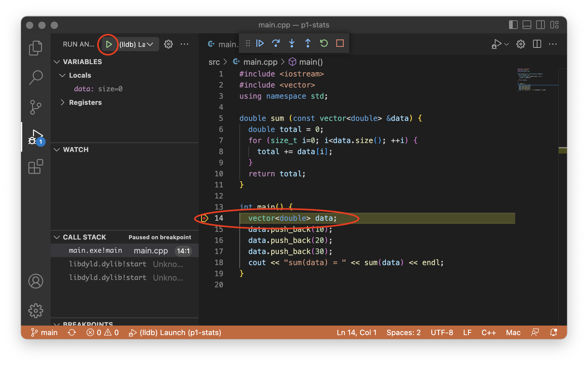

Setting up VS Code for C/C++
===========================
{: .primer-spec-toc-ignore }

[Visual Studio Code](https://code.visualstudio.com/) is a lightweight, easy-to-use, source code editor with debugging support.  It runs on macOS, Windows, and Linux (including CAEN Linux).  Visual Studio Code is not the same program as Visual Studio.

<div class="primer-spec-callout info" markdown="1">
If you already have VS Code installed with the C/C++ extensions, skip to the [Create a project](#create-a-project) section.
</div>

## Prerequisites
There are no prerequisites for VS Code.

## Restart
To start clean, first quit VS Code.  Back up your files, and then delete your project directory.  Your project directory might be different.
```console
$ pwd
/Users/awdeorio/src/eecs280
$ cp -a p1-stats p1-stats.bak  # Backup
$ rm -rf p1-stats              # Delete
```

## Install
Choose your platform below.

### macOS
Make sure you have macOS 11.1 or later.
```console
$ sw_vers
ProductName:	macOS
ProductVersion:	11.7
```

Use the homebrew package manager to install VS Code.  You can run this command from any directory.
```console
$ brew install --cask visual-studio-code
```

### Windows
Make sure you have updated Windows and WSL installations according to the [WSL tutorial](setup_wsl.html).

Then, Install VS Code from the web [https://code.visualstudio.com/](https://code.visualstudio.com/).

Select "Add to PATH".


Finally, reboot

#### WSL remote mode

Use VS Code's [remote mode](https://code.visualstudio.com/docs/remote/wsl) to connect the VS Code graphical user interface (GUI) running on Windows to the Linux environment and tools like `g++` running on WSL.

WSL Remote Mode connects VS Code to a remote instance of a VS Code server running elsewhere. When you launch VS Code from the WSL terminal, a VS Code server is started within WSL and the VS Code UI running on Windows connects to that server.


Install the [WSL extension](https://marketplace.visualstudio.com/items?itemName=ms-vscode-remote.remote-wsl).  It's OK if you have other extensions installed.
```console
$ code --install-extension ms-vscode-remote.remote-wsl
$ code --list-extensions
ms-vscode-remote.remote-wsl
```

After the extension is installed, quit VS Code and start it again.

You'll know that VS Code is running in remote mode when you see the remote mode indicator in the bottom left corner.


### Linux
Install the .deb package from the web [https://code.visualstudio.com/docs/setup/linux](https://code.visualstudio.com/docs/setup/linux).

### CAEN Linux
VS Code is already installed on CAEN Linux desktop environment.  You can use it while sitting at a CAEN Linux computer, or through a [VNC connection to CAEN Linux](https://teamdynamix.umich.edu/TDClient/76/Portal/KB/ArticleDet?ID=4999).

### Extensions
Make sure VS Code is installed correctly by checking the version.  You need version 1.52.1 or higher.
```console
$ code --version
1.52.1
```

Install the Microsoft [C/C++ extension](https://marketplace.visualstudio.com/items?itemName=ms-vscode.cpptools).
```console
$ code --install-extension ms-vscode.cpptools
$ code --install-extension ms-vscode.cpptools-extension-pack
```

<div class="primer-spec-callout warning" markdown="1">
Verify that the cpptools extensions installed.  It's OK if you have other extensions installed.
```consle
$ code --list-extensions
ms-vscode.cpptools
ms-vscode.cpptools-extension-pack
```
</div>

<div class="primer-spec-callout warning" markdown="1">
Verify that the clangd or CodeLLDB extensions are *not* installed.  The clangd extension provided C/C++ intellisense which conflicts with the Microsoft C/C++ extension.  The CodeLLDB extension provides C/C++ debugging support which causes confusion with the Microsoft C/C++ extension.
```consle
$ code --list-extensions
llvm-vs-code-extensions.vscode-clangd  # REMOVE ME
vadimcn.vscode-lldb                    # REMOVE ME
```

Uninstall them if necessary.
```console
$ code --uninstall-extension llvm-vs-code-extensions.vscode-clangd
$ code --uninstall-extension vadimcn.vscode-lldb
```
</div>


## Create a project
To create a VS Code project, create a folder (directory).  There are many ways to create folders: Finder AKA File Explorer, VS Code interface, VS Code integrated terminal, and the system terminal.  We'll use the system terminal and call our example project `p1-stats`.

**macOS:** Open the Terminal application.

**Windows/WSL:** Open the Ubuntu application.

Navigate to the directory where you store your projects, create a new directory, then move into the new directory. Your folder location might be different.
```console
$ cd /Users/awdeorio/src/eecs280
$ mkdir p1-stats
$ cd p1-stats
```

<div class="primer-spec-callout warning" markdown="1">
**Pitfall:** Avoid paths that contain spaces.  Spaces causes problems with some command line tools.

| Bad Example     | Good Example   |
|-----------------|----------------|
| `.../EECS 280/Project 1 Stats` | `.../eecs280/p1-stats`  |

</div>

Start VS Code and open your project folder by selecting `File` > `Open Folder...` > navigate to the `p1-stats` folder.

<div class="primer-spec-callout info" markdown="1">
**Pro-tip:** Here's a quick way to open VS Code to a specific project folder from the command line.
```console
$ pwd
/Users/awdeorio/src/eecs280/p1-stats
$ code .
```
</div>


### Add new files
Open your project folder by selecting `File` > `Open Folder...` > navigate to the `p1-stats` folder.

We recommend putting source code in a subdirectory called `src`.  Create the `src` subdirectory if needed.


Select the add file icon and give it a name, e.g., `main.cpp`.


<div class="primer-spec-callout warning" markdown="1">
**Pitfall:** Make sure your new file is in the `src` subdirectory.
</div>

<div class="primer-spec-callout info" markdown="1">
**Pro-tip:** You can also create files and folders from the command line, for example:
```console
$ mkdir src
$ touch src/main.cpp
```
</div>

Copy-paste this Hello World program into your `main.cpp`.
```c++
#include <iostream>
using namespace std;

int main() {
  cout << "Hello World!\n";
}
```
{: data-title="main.cpp" }

### Add existing files
If you have starter files, add them to the `src` subdirectory inside your project directory.

We'll use the terminal to download, unpack, and move starter files into the `src` subdirectory.  Your URL or folder might be different.  **Pro-tip:** [copy/paste instructions for WSL](setup_wsl.html#how-do-i-copy-and-paste).

<div class="primer-spec-callout warning" markdown="1">
**Pitfall:** Make sure you're in the subdirectory containing your source code.
```console
$ ls
main.cpp ...
```
</div>

```console
$ wget https://eecs280staff.github.io/p1-stats/starter-files.tar.gz
$ tar -xvzf starter-files.tar.gz
$ mkdir -p src
$ mv starter-files/* src/
$ rm -rf starter-files starter-files.tar.gz
```

You should see your new files in the `src` subdirectory.
```console
$ tree
.
└── src
    ├── Makefile
    ├── main.cpp
    ├── main_test.in
    ├── main_test.out.correct
    ├── main_test_data.tsv
    ├── p1_library.cpp
    ├── p1_library.h
    ├── stats.cpp
    ├── stats.h
    ├── stats_public_test.cpp
    └── stats_tests.cpp.starter
```

In VS Code, open your project folder by selecting `File` > `Open Folder...` > to navigate to the `p1-stats` folder or from the command line.  You should see your files.


#### Rename files
If you need to rename any files, you can do this from VS Code or from the command line.  In EECS 280, you'll need to rename any files that end in `.starter`.

Right click a file and select "rename".  Change the file name.  In EECS 280, you'll do this to any file that ends in `.starter`.

|  |  |

<div class="primer-spec-callout info" markdown="1">
**Pro-tip:** You can also rename files the command line, for example:
```console
$ mv stats_tests.cpp.starter stats_tests.cpp
```
</div>

## Compile and Run
VS Code uses an executable you build at the command line.

VS Code has an integrated terminal; it's up to you if like the integrated terminal or your system terminal.  Don't forget to `cd` into the subdirectory containing your source code (`src` in this example).


Compile and run your executable at the command line.
```console
$ make main.exe
$ ./main.exe
Hello World!
```

<div class="primer-spec-callout warning" markdown="1">
**Pitfall:** Make sure you're in the subdirectory containing your source code.
```console
$ ls
main.cpp ...
```
</div>

<div class="primer-spec-callout warning" markdown="1">
**Pitfall:** If you're in EECS 280 and get an error like this, [add a new file](#add-new-files) `stats.cpp`.  It's OK if the file is empty for now.
```console
$ make main.exe
make: *** No rule to make target `stats.cpp', needed by `main.exe'.  Stop.
```
</div>

<div class="primer-spec-callout warning" markdown="1">
**Pitfall:** VS Code debugging will fail if there are no debugging symbols.  Double check the output of `make` and verify that you see `-g` being used in the commands.  The EECS 280 defaults include `-g`.
```console
$ make main.exe
g++ ... -g main.cpp ...
```
</div>

<div class="primer-spec-callout warning" markdown="1">
If you don't have a `Makefile`, you can compile manually.  We don't recommend this for EECS 280 students.
```console
$ g++ -g main.cpp -o main.exe
$ ./main.exe
Hello World!
```
</div>

Select the file you would like to run.  Navigate to the debugging pane.


Click "create a launch.json file".


Click "Add Configuration".


Select a "Launch" configuration.  This will create a default `launch.json` ([Microsoft Reference](https://code.visualstudio.com/docs/cpp/launch-json-reference)).
- macOS: "C/C++ (lldb) Launch"
- WSL orLinux: "C/C++ (gdb) Launch"


Edit the `program` field in `launch.json` with the program to run.  Save the updated file.  Your `launch.json` might be different.

<div class="primer-spec-callout warning" markdown="1">
**Pitfall:** Remember to include the `src` subdirectory.
</div>

<div class="primer-spec-callout info" markdown="1">
**Pro-tip:** VS Code puts its configuration files in a hidden directory called `.vscode`.  You can see hidden files with `ls -A`.
```console
$ pwd
/Users/awdeorio/src/eecs280/p1-stats
$ ls -A
.vscode  src
```
</div>


Click the triangle to run.  You'll see your program's output in the debug console.

<div class="primer-spec-callout warning" markdown="1">
**Pitfall:** Remember to build your executable at the command line first.
```console
$ pwd
/Users/awdeorio/src/eecs280/p1-stats/src
$ make main.exe
```
</div>


### Sanitizers
We recommend enabling the address sanitizer and undefined behavior sanitizer. These will help you find memory errors like going off the end of an array or vector.

First, edit your `Makefile` and add the `CXXFLAGS` recommended by the [ASAN Quick Start](setup_asan.html#quick-start).

Then, edit the `"environment"` property in your `launch.json`.  If there's already an empty `"environment": []`, replace it.

```json
  "environment": [
    {
      "name": "ASAN_OPTIONS",
      "value": "abort_on_error=1:detect_leaks=0"
    }
  ]
```
{: data-highlight="3-4" }

When ASan detects an error, VSCode will stop so that you can see the stack trace and inspect the current state of the program.  This configuration also turns off leak-checking (LSan), which can't run simultaneously with the visual debugger. If you do want to check for leaks, just run from the terminal with sanitizers enabled.

If you're debugging something else in your program and don't want it to terminate on ASAN errors, you can change to `abort_on_error=0`.

### Input redirection
<div class="primer-spec-callout info" markdown="1">
Skip this subsection your first time through the tutorial.  You can come back to it.
</div>

You can use input redirection to avoid typing program input each time you run a program.

Without input redirection, the user types input at the command line.  Notice that the program asks the user to `enter a filename` and then the user types `main_test_data.tsv`.  Then, the program asks the user to `enter a column name` and the user types `B`.
```console
$ make main.exe
$ ./main.exe
enter a filename
main_test_data.tsv
enter a column name
B
...
```
{: data-highlight="4,6" }

Automate user input by putting it in a file.

```
main_test_data.tsv
B
```
{: data-title="main_test.in" data-highlight="1,2" }

Redirect file `main_test.in` to stdin of `main.exe`.
```console
$ ./main.exe < main_test.in
enter a filename
enter a column name
reading column B from main_test_data.tsv
...
```
{: data-highlight="1" }

#### Windows `launch.json` changes

To configure input redirection, edit `launch.json`.
```json
{
    "configurations": [
        {
            ...
            "program": "${workspaceFolder}/src/main.exe",
            "args": ["<", "main_test.in"],
            ...
        }
    ]
}
```
{: data-title="launch.json" data-highlight="6" }

#### macOS `launch.json` changes

To configure input redirection, edit `launch.json`.
```json
{
    "configurations": [
        {
            ...
            "program": "${workspaceFolder}/src/main.exe",
            ...
            "MIMode": "lldb",
            "setupCommands": [
                {
                    "text": "settings set target.input-path main_test.in"
                }
            ]
            ...
        }
    ]
}
```
{: data-title="launch.json" data-highlight="10" }

### Arguments and options
<div class="primer-spec-callout info" markdown="1">
Skip this subsection for EECS 280 project 1.
</div>

Arguments and options are inputs to a program typed at the command line.  For example:
```console
$ ./main.exe train_small.csv test_small.csv --debug
```
{: data-variant="no-line-numbers" data-highlight="1" }

- `main.exe` is the name of the program
- `train_small.csv` and `test_small.csv` are arguments
- `--debug` is an option

To run a program with options or arguments in VS Code, edit `launch.json`.  Each option or argument should goes in a separate comma-separated string.
```json
{
    "configurations": [
        {
            ...
            "program": "${workspaceFolder}/src/main.exe",
            "args": ["train_small.csv", "test_small.csv", "--debug"],
            ...
        }
    ]
}
```
{: data-title="launch.json" data-highlight="6" }

## Debug
In this section, we'll set a breakpoint, which pauses the debugger.  Then, we'll cover some of the options to continue execution.

 **Step Over**
Run one line of code, stepping _over_ any function calls by running the whole function in one step.

 **Step Into**
Run one line of code, stepping _into_ any function calls to execute them line-by-line.

 **Step Out**
Run the program until it returns from the current function (or until the next breakpoint).

 **Continue**
Run the program until the next breakpoint.

### Example code
{: .primer-spec-toc-ignore }

To get started, copy this example `main.cpp` into your editor.
```c++
#include <iostream>
#include <vector>
using namespace std;

double sum (const vector<double> &data) {
  double total = 0;
  for (size_t i=0; i<data.size(); ++i) {
    total += data[i];
  }
  return total;
}

int main() {
  vector<double> data;
  data.push_back(10);
  data.push_back(20);
  data.push_back(30);
  cout << "sum(data) = " << sum(data) << endl;
}
```
{: data-title="main.cpp" }

### Breakpoint
Select the file you want to debug.  Set a breakpoint by clicking to the left of a line number.  A breakpoint tells the program to pause.


### Run
Select the debugging pane, then run the debugger.  The program pauses at the breakpoint.  The yellow indicator highlights the next line of code to be run.



<div class="primer-spec-callout warning" markdown="1">
**Pitfall:** Don't forget to compile!
```console
$ make main.exe                # With a Makefile
$ g++ -g main.cpp -o main.exe  # Without a Makefile
```
</div>

### Step over
Click "Step Over" a few times until you reach the highlighted line of code


### Inspect
Hover over a variable to inspect its value.  You can also see values in the VARIABLES pane.


<div class="primer-spec-callout warning" markdown="1">
If you have trouble viewing the contents of a container like this screenshot, see [Pretty Printing STL Containers with `gdb`](setup_gdb.html#pretty-printing-stl-containers-with-gdb).


</div>

### Step into
Click "Step Into".  The cursor enters the `sum()` function.


### Step out
Click "Step Out".  The `sum()` function completes, and the program pauses again.


### Continue
Press "Continue" to run the program to the next breakpoint, or the end, whichever comes first.


## Troubleshooting
This section is for common problems and solutions.

### Intellisense and C++11
Intellisense is the feature that indicates compiler errors with red squiggly lines and suggests code completions.  If the C++ standard is out-of-date, you'll see squiggles where you shouldn't.

First, you should already have the `C/C++` extension installed ([Instructions](#extensions)).

Next, open VS Code's Command Palette with `View > Command Palette` or with the keyboard shortcut `ctrl + shift + P` on Windows or `cmd + shift + P` on macOS.  Search for and select `C/C++: Edit Configurations (JSON)`.  This will open the file `c_cpp_properties.json`.


Modify the `cStandard` and `cppStandard` settings in `c_cpp_properties.json`.  Don't change any other settings.  Save the file.
```json
{
    "configurations": [
        {
            ...
            "cStandard": "c17",
            "cppStandard": "c++17",
            ...
        }
    ],
    ...
}
```
{: data-title="c_cpp_properties.json" data-highlight="5-6" }


## Acknowledgments
Original document written by Andrew DeOrio awdeorio@umich.edu.

This document is licensed under a [Creative Commons Attribution-NonCommercial 4.0 License](https://creativecommons.org/licenses/by-nc/4.0/). You’re free to copy and share this document, but not to sell it. You may not share source code provided with this document.
