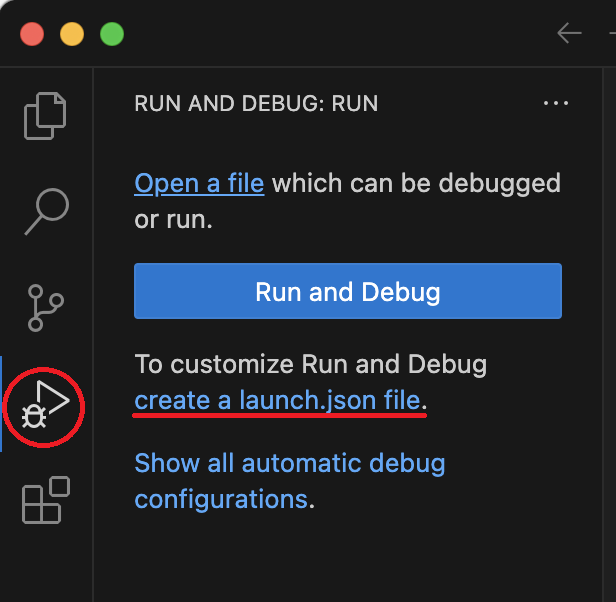

Setup up VS Code for C/C++ on macOS
===================================
{: .primer-spec-toc-ignore }

[Visual Studio Code](https://code.visualstudio.com/) is a lightweight, easy-to-use, source code editor with debugging support.  It runs on macOS, Windows, and Linux (including CAEN Linux).  Visual Studio Code is not the same program as Visual Studio.

This tutorial is specific to macOS.  Looking for the [Windows version](setup_vscode_wsl.html)?

<div class="primer-spec-callout info" markdown="1">
If you already have VS Code installed with the C/C++ extensions, skip to the [Create a project](#create-a-project) section.
</div>

## Prerequisites
1. VS Code relies on external command line tools.  To install CLI tools, follow the [macOS command line tools tutorial](setup_macos.html).

2. Make sure you have a compiler and a debugger installed.  Your version might be different.  Instructions for installation on [macOS](setup_macos.html#install-cli-tools).
    ```console
    $ g++ --version
    Apple clang version 13.1.6 (clang-1316.0.21.2.5)
    $ lldb --version
    Apple Swift version 5.6.1 (swiftlang-5.6.0.323.66 clang-1316.0.20.12)
    ```

3. Review our [Command line interface (CLI)](cli.html) tutorial.

## Install
Make sure you have macOS 11.1 or later.
```console
$ sw_vers
ProductName:	macOS
ProductVersion:	11.7
```

Use the homebrew package manager to install VS Code.  You can run this command from any directory.
```console
$ brew install --cask visual-studio-code
```

Open VS Code. You can find it in your applications (look for "Visual Studio Code") or, alternatively, you can run it using the command line.
```console
$ code
```

### Microsoft C++ Extension
Install the Microsoft [C/C++ extension](https://marketplace.visualstudio.com/items?itemName=ms-vscode.cpptools).  On macOS, this extension provides Intellisense.  See the [C/C++ extension alternatives](#cc-extension-alternatives) section for details about our macOS extension recommendations.

Note that you need the "C/C++" extension. You do *not* need the "C/C++ Extension Pack".

1. Open the extensions panel from the left sidebar.
2. Search for C++.
3. Click "Install".


### CodeLLDB Extension
Install the [CodeLLDB extension](https://marketplace.visualstudio.com/items?itemName=vadimcn.vscode-lldb).  On macOS, this extension provides debugging support.  See the [C/C++ extension alternatives](#cc-extension-alternatives) section for details about our macOS extension recommendations.

1. Open the extensions panel from the left sidebar.
2. Search for CodeLLDB.
3. Click "Install".


Clear out the search bar in the extensions panel. Under the "Installed" section, you should see:
- C/C++
- CodeLLDB


## Create a project
To create a VS Code project, create a folder (directory).  There are many ways to create folders: Finder, VS Code interface, VS Code integrated terminal, and the system terminal.  We'll use the system terminal and call our example project `p1-stats`.

Open the Terminal ([Terminal on macOS](cli.html#open-terminal-macos)).

Create a new folder for your project.

```console
$ mkdir -p ~/eecs280/p1-stats
$ cd ~/eecs280/p1-stats
```

This `mkdir -p` command creates a new `p1-stats` folder within an `eecs280` folder (creating that too, if it doesn't exist), within your Ubuntu home directory (`~`). The `cd` command changes your working directory to the new `p1-stats` directory.

<div class="primer-spec-callout warning" markdown="1">
**Pitfall:** Avoid paths that contain spaces.  Spaces causes problems with some command line tools.

| Bad Example     | Good Example   |
|-----------------|----------------|
| `EECS 280/` | `eecs280/` |
| `Project 1 Stats/` | `p1-stats/` |

</div>

Now, verify you're in the project directory with `pwd` and launch VS code with `code .`:
```console
$ pwd
/Users/awdeorio/eecs280/p1-stats
$ code .
```

The `.` in `code .` means "current working directory". It would also be fine to use an absolute path, for example, `code ~/eecs280/p1-stats`.

You can also open your project folder through the VS Code interface. Go to `File` > `Open Folder...`, then find your project folder.

You should see your project open in VS Code.


Finally, open the **integrated terminal** within VS Code. Go to `Terminal` > `New Terminal` (or press <kbd>ctrl</kbd> + <kbd>`</kbd>). The integrated terminal will automatically use your project directory as its working directory, and using it is easier than switching back and forth to your separate terminal window.

### Add existing files
If you have starter files, add them to your project directory.  We'll use [EECS 280 Project 1](https://eecs280staff.github.io/p1-stats/) as an example, downloading an archive of starter files from the provided URL.

We'll run several commands to get the starter file (see below). We recommend using the integrated terminal in VS Code. First, verify you're in the correct project directory (`pwd`). Use the terminal to download (`wget`), unpack (`tar -xvzf`), and move (`mv`) the starter files into our project directory. Finally, clean up the downloaded archive (`rm`). Your URL or folder might be different.

```console
$ pwd
/Users/awdeorio/eecs280/p1-stats
$ wget https://eecs280staff.github.io/p1-stats/starter-files.tar.gz
$ tar -xvzf starter-files.tar.gz
$ mv starter-files/* .
$ rm -rf starter-files starter-files.tar.gz
```

You should see your new files in your project directory.
```console
$ tree
.
├── Makefile
├── cats.csv
├── cats.out.correct
├── main.cpp
├── p1_library.cpp
├── p1_library.hpp
├── stats.hpp
├── stats_public_tests.cpp
├── stats_tests.cpp.starter
└── two_sample.cpp.starter
```

You should see your new files appear in VS Code. Your specific files may not match the image below.


#### Rename files
If you need to rename any files, you can do this in VS Code by right clicking a file and selecting "rename".

In EECS 280, you'll do this to any file that ends in `.starter`.

|  |  |

<div class="primer-spec-callout info" markdown="1">
**Pro-tip:** You can also rename files the command line, for example:
```console
$ mv stats_tests.cpp.starter stats_tests.cpp
```
</div>

### Add new files
We'll use [EECS 280 Project 1](https://eecs280staff.github.io/p1-stats/) as an example.

Select the add file icon and give it a name, for example, `stats.cpp`.


Alternatively, create your `stats.cpp` file from the command line using [`touch`](cli.html#touch). 

```console
$ touch stats.cpp
```

## Compile and Run
VS Code does not use an internal build system for C++. That means you'll be compiling your code from the terminal. In EECS 280 projects, you compile with the `make` utility and a `Makefile` provided with each project.

Identify your desired compilation target, for example, `stats_public_tests.exe` from EECS 280 project 1. (Note that this may not compile/run successfully if you haven't started the project yet.)

Compile with:

```console
$ make stats_public_tests.exe
```

And run with:

```console
$ ./stats_public_tests.exe
```

<div class="primer-spec-callout warning" markdown="1">
**Pitfall:** If something doesn't seem to be working, you can always check your current directory with `pwd` or `ls` to verify your terminal is in the correct place with the correct files.
```console
$ pwd
/Users/awdeorio/eecs280/p1-stats
$ ls
Makefile  cats.out.correct  p1_library.hpp  stats.hpp               stats_tests.cpp
cats.csv  p1_library.cpp    stats.cpp       stats_public_tests.cpp  two_sample.cpp
```
</div>

## Debug

You can also run your compiled executable through the VS Code visual debugger to diagnose runtime errors, inspect the state of your program at a breakpoint, or step line-by-line through your code.

### Create `launch.json`

Running and debugging code through VS Code requires a `launch.json` configuration file. The examples below assume a source file `main.cpp` compiled to `main.exe`. Your filenames may be different.

Select the file you would like to run.  Navigate to the debugging pane.



Click "create a launch.json file".


Select LLDB.


Edit the `program` field in `launch.json`.  Save the updated file.  Your `program` name might be different.


### Launch Debugger

Click the triangle to run.  You'll see your program's output in the terminal window at the bottom.


<div class="primer-spec-callout warning" markdown="1">
**Pitfall:** Remember to build your executable at the command line first.
```console
$ make main.exe
```
</div>

<div class="primer-spec-callout warning" markdown="1">
**Pitfall:** If you're having trouble running your program, delete your `launch.json` and try the [compile and run](#compile-and-run) section again.


</div>

### Configure Debugger

Depending on your program, its inputs, and how you want to debug it, you'll need to adjust `launch.json`.

#### Edit `launch.json` program

If you already have a working `launch.json` and want to debug a different program, edit the `program` field `launch.json`.  Your `program` name might be different.  Make sure `cwd` is set to `"${workspaceFolder}"`.
```json
{
    "program": "${workspaceFolder}/main.exe",
    ...
    "cwd": "${workspaceFolder}",
}
```
{: data-highlight="2,4" }

#### Sanitizers
We recommend enabling the address sanitizer and undefined behavior sanitizer. These will help you find memory errors like going off the end of an array or vector.

First, edit your `Makefile` and add the `CXXFLAGS` recommended by the [ASAN Quick Start](setup_asan.html#quick-start).

Edit the `"env"` property in your `launch.json`.  If there's already an empty `"env": {}`, replace it.  If there isn't one, add it after the `"args"` property.

```json
  "env": {
      "ASAN_OPTIONS": "abort_on_error=1:detect_leaks=0"
  },
```
{: data-highlight="2" }

Open Settings on VSCode (Code > Settings > Settings). Search for "lldb: show disassembly" (without the quotes) and set the option to `never`.  (See [ASAN error shows assembly code](#asan-error-shows-assembly-code) for an explanation.)


#### Command-Line Arguments and Options

<!-- Preserve links to old section heading "Arguments and Options" -->
<a id="arguments-and-options"></a>

Inputs to a program may be provided when it is initially run via command-line arguments or options. Here's an example from EECS 280 Project 1:

```console
$ ./two_sample.exe HCMST_ver_3.04.tsv q24_met_online 1 0 ppage
```

- `./two_sample.exe` is used to run the program
- Each of `HCMST_ver_3.04.tsv`, `q24_met_online`, `1`, `0`, `ppage` are passed to it as arguments

The arguments above specify the name of a data file, coulumns, and filter values for the program to use.

To run a program with options or arguments in VS Code, edit `launch.json`.  Each option or argument goes in a separate comma-separated string.
```json
{
    "configurations": [
        {
            ...
            "program": "${workspaceFolder}/main.exe",
            "args": ["HCMST_ver_3.04.tsv", "q24_met_online", "1", "0", "ppage"],
            ...
        }
    ]
}
```
{: data-title="launch.json" data-highlight="6" }

#### Input redirection
<div class="primer-spec-callout info" markdown="1">
Skip this subsection for EECS 280 project 1.
</div>

If you're unfamiliar with input redirection, first read the CLI tutorial section on [input redirection](cli.html#input-redirection-).

To configure input redirection, edit `launch.json` ([docs](https://github.com/vadimcn/vscode-lldb/blob/master/MANUAL.md#stdio-redirection)).  These instructions are for the [CodeLLDB extension](https://marketplace.visualstudio.com/items?itemName=vadimcn.vscode-lldb).
```json
{
    "configurations": [
        {
            ...
            "program": "${workspaceFolder}/main.exe",
            "stdio": ["main_test.in", null, null],
            ...
        }
    ]
}
```
{: data-title="launch.json" data-highlight="6" }

<div class="primer-spec-callout warning" markdown="1">
**Pitfall:** Make sure you're using the CodeLLDB extension.  You should see `lldb` in your `launch.json`.  If not, delete your `launch.json` and try the [compile and run](#compile-and-run) section again.

```json
{
    "configurations": [
        {
            "type": "lldb",
            ...
```
{: data-title="launch.json" data-highlight="4" }

</div>

### Step Through Code
In this section, we'll set a breakpoint, which pauses the debugger.  Then, we'll cover some of the options to continue execution.

 **Step Over**
Run one line of code, stepping _over_ any function calls by running the whole function in one step.

 **Step Into**
Run one line of code, stepping _into_ any function calls to execute them line-by-line.

 **Step Out**
Run the program until it returns from the current function (or until the next breakpoint).

 **Continue**
Run the program until the next breakpoint.

#### Example code

The examples below presume you have the sample `main.cpp` and `Makefile` files below.

Download them from your terminal with:

```console
$ pwd
/Users/awdeorio/eecs280/p1-stats
$ wget -nc https://eecs280staff.github.io/tutorials/main.cpp
$ wget -nc https://eecs280staff.github.io/tutorials/Makefile
```

These commands will not overwrite existing files. If you already have a Makefile for your project and it doesn't have a target for `main.exe`, copy the `main.exe` target below into it.

```c++
// Sample main.cpp for EECS 280 Setup Tutorials

#include <iostream>
#include <vector>
using namespace std;

double sum (const vector<double> &data) {
  double total = 0;
  for (size_t i=0; i<data.size(); ++i) {
    total += data[i];
  }
  return total;
}

int main() {
  vector<double> data;
  data.push_back(10);
  data.push_back(20);
  data.push_back(30);
  cout << "sum(data) = " << sum(data) << endl;
}
```
{: data-title="main.cpp" }

```make
# Sample makefile for EECS 280 Setup Tutorials

CXX ?= g++
CXXFLAGS ?= -Wall -Werror -pedantic -g --std=c++17 -Wno-sign-compare -Wno-comment

# Compile the main executable
main.exe: main.cpp
	$(CXX) $(CXXFLAGS) main.cpp -o main.exe


# Remove automatically generated files
clean :
	rm -rvf *.exe *~ *.out *.dSYM *.stackdump

# Disable built-in rules
.SUFFIXES:
```
{: data-title="Makefile" }

#### Set Breakpoints
Select the file you want to debug.  Set a breakpoint by clicking to the left of a line number.  A breakpoint tells the program to pause.


#### Run
Select the debugging pane, then run the debugger.  The program pauses at the breakpoint.  The yellow indicator highlights the next line of code to be run.


<div class="primer-spec-callout warning" markdown="1">
**Pitfall:** Don't forget to compile!
```console
$ make main.exe                # With a Makefile
$ g++ -g main.cpp -o main.exe  # Without a Makefile
```
</div>

<div class="primer-spec-callout warning" markdown="1">
**Pitfall:** VS Code debugging will fail if there are no debugging symbols.  Double check your compilation command or the output of `make` and verify that you see `-g` being used in the commands.  The EECS 280 defaults include `-g`.
```console
$ make main.exe
g++ ... -g main.cpp ...
```
</div>

#### Step over
Click "Step Over" a few times until you reach the highlighted line of code


#### Inspect
Hover over a variable to inspect its value.  You can also see values in the VARIABLES pane.


#### Step into
Click "Step Into".  The cursor enters the `sum()` function.


#### Step out
Click "Step Out".  The `sum()` function completes, and the program pauses again.


#### Continue
Press "Continue" to run the program to the next breakpoint, or the end, whichever comes first.


## Troubleshooting
This section is for common problems and solutions.

### Reset
To reset VS Code project settings and starter files, first quit VS Code.  Make a backup copy of your files, and then delete your project directory.  Your project directory might be different.

```console
$ pwd
/Users/awdeorio/src/eecs280
$ cp -a p1-stats p1-stats.bak  # Backup
$ rm -rf p1-stats              # Delete
```

VS Code has a *lot* of settings and extensions.   You can reset the entire user interface and remove all extensions using these commands (Based on [Microsoft instructions](https://code.visualstudio.com/docs/setup/uninstall#_clean-uninstall)).  This is optional.

```console
$ rm -rf ~/.vscode
$ rm -rf ~/Library/Application\ Support/Code
```

Then, return to the [Create a project](#create-a-project) section.

### Debug
If you have trouble with the [Debug](#debug) section, a good first step is to delete your `launch.json` and try the [Debug](#debug) section again.


### Intellisense C++ Standard
Intellisense is the feature that indicates compiler errors with red squiggly lines and suggests code completions.  If the C++ standard is out-of-date, you'll see squiggles where you shouldn't.

First, you should already have the `C/C++` extension installed ([Instructions](#extensions)).

Next, open VS Code's Command Palette with `View > Command Palette` or with the keyboard shortcut `cmd + shift + P`.  Search for and select `C/C++: Edit Configurations (JSON)`.  This will open the file `c_cpp_properties.json`.


Modify the `cStandard` and `cppStandard` settings in `c_cpp_properties.json`.  Don't change any other settings.  Save the file.
```json
{
    "configurations": [
        {
            ...
            "cStandard": "c17",
            "cppStandard": "c++17",
            ...
        }
    ],
    ...
}
```
{: data-title="c_cpp_properties.json" data-highlight="5-6" }

### C/C++ extension alternatives
There are multiple options for C/C++ extensions.

[Microsoft C/C++ extension](https://marketplace.visualstudio.com/items?itemName=ms-vscode.cpptools) provides debugging support and intellisense on Windows, Linux and macOS.  At the time of this writing (January 2023) debug support has a [bug on macOS](https://github.com/microsoft/vscode-cpptools/issues/7240).

[CodeLLDB](https://marketplace.visualstudio.com/items?itemName=vadimcn.vscode-lldb) provides debugging support for those using the LLVM compiler.  Apple's compiler on macOS is based on LLVM.

[clangd](https://marketplace.visualstudio.com/items?itemName=llvm-vs-code-extensions.vscode-clangd) provides intellisense and requires the `clangd` language server, which is related to the LLVM compiler.  We do not recommend installing the `clangd` extension with the Microsoft C/C++ extension because multiple intellisense providers can produce confusing results.

### ASAN error shows assembly code
When the Address Sanitizer detects an error, VSCode may stop in an assembly file that does not help you find where the error was caused. For example, consider the following code with a use-after-free error.

```cpp
#include <iostream>
using namespace std;

int main() {
    int * p = new int;
    delete p;
    cout << *p << endl;  // use-after-free
}
```
{: data-title="main.cpp" data-highlight="7" }

Running the debugger with the ASAN sanitizer will display a confusing assembly file.


To disable this pop up, you can set the `lldb.showDisassembly` option to `never`.

First, open Settings on VSCode (Code > Settings > Settings).

Next, search for "lldb: show disassembly" and set the option to `never`.


Now, running the debugger will not display the assembly file. However, it will not yet highlight the erroneous line. To find the erroneous line, look through the Call Stack on the debugging panel and click on your source file.


### Debugging fails
Sometimes on older Macs with an Intel chip or following an update, debugging in VS Code fails due to an incompatible bundled `debugserver` [bug report](https://github.com/vadimcn/codelldb/issues/999).

First, make sure you have the Xcode command line tools installed.  (They should [already](setup_macos.html#install-compiler) be installed.)
```console
$ xcode-select --install
```

Delete the incompatible file that comes bundled with CodeLLDB.
```console
$ rm ~/.vscode/extensions/vadimcn.vscode-lldb-*/lldb/bin/debugserver
```

Restart VS Code.

## Acknowledgments
Original document written by Andrew DeOrio awdeorio@umich.edu.

This document is licensed under a [Creative Commons Attribution-NonCommercial 4.0 License](https://creativecommons.org/licenses/by-nc/4.0/). You’re free to copy and share this document, but not to sell it. You may not share source code provided with this document.
