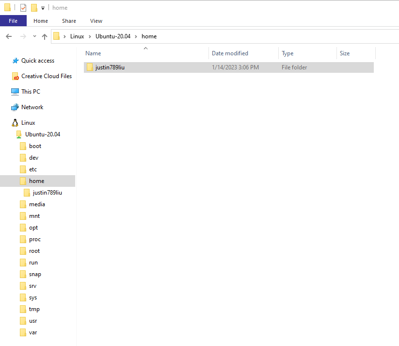
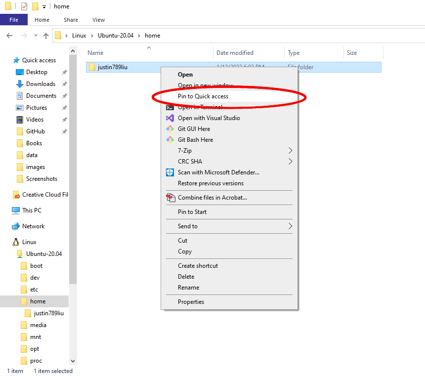
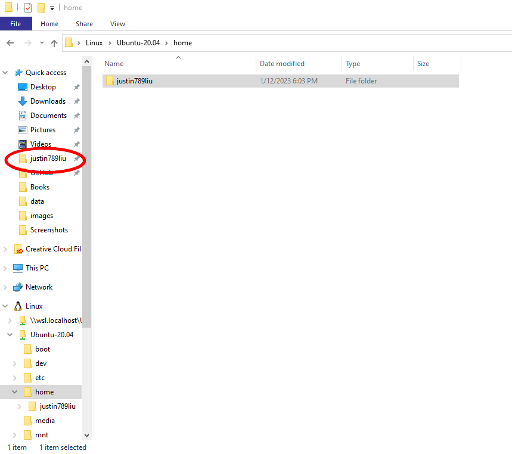
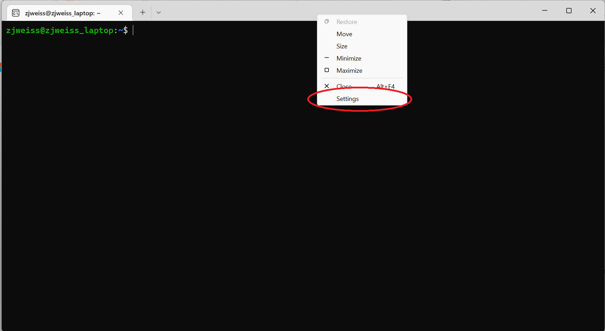
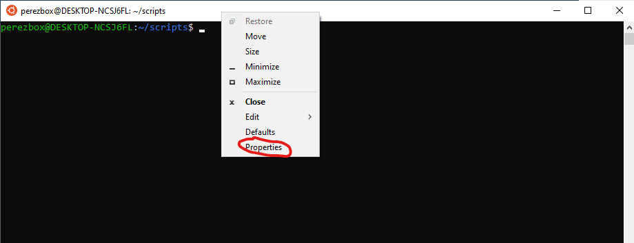
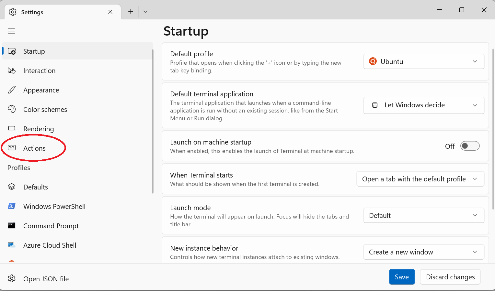
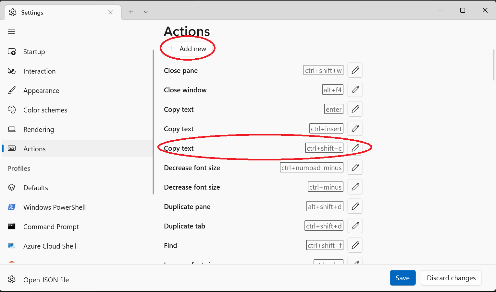

Windows Command line tools (WSL)
================================
{: .primer-spec-toc-ignore }

The Windows Subsystem for Linux (WSL) runs an Ubuntu Linux guest virtual machine on your Windows host machine.

When you see `$` in this tutorial, you should type into your shell the command that comes after the `$`.

## Upgrade Windows
We recommend Windows 11.  Windows 10 version 2004 build 19041 and higher will also work.  Here's how to [check your Windows version](https://support.microsoft.com/en-us/help/4027391/windows-10-see-which-version-you-have).

Free Windows upgrades are available for UM students via [OnTheHub](https://its.umich.edu/computing/computers-software/software-services/onthehub). If you have an older Windows machine and are not able to upgrade, please reach out to course instructors for assistance.

## Install WSL
Start PowerShell and run it as administrator.  Search for PowerShell in the start menu, then right-click and select "Run as administrator".  (Note: these instructions are based on the [instructions from Microsoft](https://docs.microsoft.com/en-us/windows/wsl/install).)


Check if WSL was already installed.  If you see this, WSL is already installed.
```console
C:\WINDOWS\system32> wsl -l -v
  NAME      STATE       VERSION
* Ubuntu    Stopped     2
```
{: data-highlight="3"}

If you see the WSL help text, WSL is not installed.
```console
C:\WINDOWS\system32> wsl -l -v
Copyright (c) Microsoft Corporation. All rights reserved.
Usage: wsl.exe [Argument]
...
```

Install WSL.
```console
C:\WINDOWS\system32> wsl --install
```

<div class="primer-spec-callout warning" markdown="1">
**Pitfall:** Make sure Windows Update is enabled and your machine is up-to-date.  Settings > Update and Security > Windows Update.
</div>

<div class="primer-spec-callout warning" markdown="1">
**Pitfall:** If you still get an error from `wsl --install`, try the [Manual installation steps](https://learn.microsoft.com/en-us/windows/wsl/install-manual).

For the Linux distribution, choose the latest version of Ubuntu LTS.  At the time of this writing, that's Ubuntu 22.04 LTS.
</div>

Restart your computer.

Start PowerShell as administrator, and check that the  `VERSION` is 2.

```console
C:\WINDOWS\system32> wsl -l -v
  NAME      STATE       VERSION
* Ubuntu    Stopped     2
```
{: data-highlight="3"}

If the `VERSION` is 1, you must [upgrade to WSL 2](https://learn.microsoft.com/en-us/windows/wsl/install-manual).

## Open terminal
Start an Ubuntu Bash shell.

|  |  |

## Install CLI tools
Use the `apt` package manager to install a few command line programs.  Linux users will run this same command.
```console
$ sudo apt update
$ sudo apt install g++ make rsync wget git ssh gdb python3 tree
```
{: data-variant="no-line-numbers" }

## Use CLI tools
Now would be a great time to take a look at our [CLI Tutorial](cli.html).

## Pro-tips

### Accessing Linux files from Windows
To access Linux files from the Windows File Explorer, click the Linux icon.  You may need to scroll down.

Navigate to your home directory: Linux > Ubuntu > home > awdeorio.  Your username will be different.



<div class="primer-spec-callout info" markdown="1">
**Pro-tip:**  Right click your Linux home directory and choose "Pin to Quick access". 

It should now show up under "Quick access" in the left sidebar.

|  |  |

</div>

To open the File Explorer in any directory at the WSL (Ubuntu) Terminal:
```console
$ explorer.exe .
```

### Accessing Windows files from Linux
To access Windows files from Linux, navigate to `/mnt/c/`.

For example, here's how to access your Windows Desktop.  Your username will be different.
```console
$ cd /mnt/c/Users
$ ls
'All Users'  'Default User'   defaultuser0   awdeorio   Default   Public   defaultuser100000   desktop.ini
$ cd awdeorio
$ ls
... Desktop  Downloads ...
$ cd Desktop
```

### CLI open file
Opens a file or directory with the default application, like a double click.  See the [`wslview` command](cli.html#open--wslview) in the CLI tutorial.

### Copy paste
Copy: <kbd>ctrl</kbd> + <kbd>shift</kbd> + <kbd>c</kbd>

Paste: <kbd>ctrl</kbd> + <kbd>shift</kbd> + <kbd>v</kbd>

If Copy/Paste doesn't work, read on to enable it.

#### Enable copy paste
{: .primer-spec-toc-ignore }

These instructions show how to enable WSL Copy/Paste on Windows 11 H2 or newer.

Right click on the window pane header of your Ubuntu WSL terminal. Click on the Settings option in the drop down menu.



<div class="primer-spec-callout warning" markdown="1">
**Pitfall:** If your dropdown contains the option "Properties" follow the instructions for [Older versions of windows](#enable-copy-paste-on-older-windows).


</div>

Click on the Actions tab on the left side of the settings window.



Confirm that the "Copy text" and "Paste text" bindings exist.  You may need to scroll down.  Add them if needed using the "Add new" button.
- Copy text: <kbd>ctrl</kbd> + <kbd>shift</kbd> + <kbd>c</kbd>
- Paste text: <kbd>ctrl</kbd> + <kbd>shift</kbd> + <kbd>v</kbd>



#### Enable copy paste on older Windows
{: .primer-spec-toc-ignore }

These instructions show how to enable WSL Copy/Paste on version of Windows older than 11 H2.

Click on the properties option in the dropdown.


Enable "Use Ctrl+Shift+C/V Copy/Paste" option in the Console "Options" properties page 


## Pitfalls

### Spaces in paths
Avoid paths that contain spaces.  Spaces causes problems with some command line tools.

| Bad Example     | Good Example   |
|-----------------|----------------|
| `EECS 280/` | `eecs280/` |
| `Project 1 Stats/` | `p1-stats/` |

### Project folder in Windows home directory
Linux (Ubuntu) has a separate home directory.  Storing code in your Windows home directory can cause slowdowns because WSL uses a network file share to communicate the files between Windows and Linux.

| Bad Example     | Good Example   |
|-----------------|----------------|
| `/c/mnt/Users/awdeorio ...` | `/home/awdeorio ...` |

Here's how to [access your Linux files from Windows](#accessing-linux-files-from-windows).

### Root user
Avoid doing everyday coding as the `root` user in WSL.  Some programs don't work correctly when run as `root`.  When you first installed Ubuntu, you should have been prompted to create a Linux username and password.

<table>
  <tr>
  <td markdown="1">

**Bad example:** If the default is a root login, here's how to [change your linux username and password](https://docs.microsoft.com/en-us/windows/wsl/setup/environment#set-up-your-linux-username-and-password).  For the same reasons, avoid using `su` or `su root`.
```console
$ whoami
root
```

  </td>
  <td markdown="1">

**Good example:** When you start a Bash shell (not a Windows PowerShell), you should have a non-root username.
```console
$ whoami
awdeorio
```

  </td>
  </tr>
</table>


## Acknowledgments
Original document written by Andrew DeOrio awdeorio@umich.edu.

This document is licensed under a [Creative Commons Attribution-NonCommercial 4.0 License](https://creativecommons.org/licenses/by-nc/4.0/). You’re free to copy and share this document, but not to sell it. You may not share source code provided with this document.
