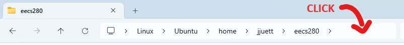
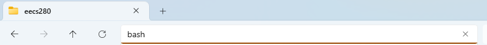
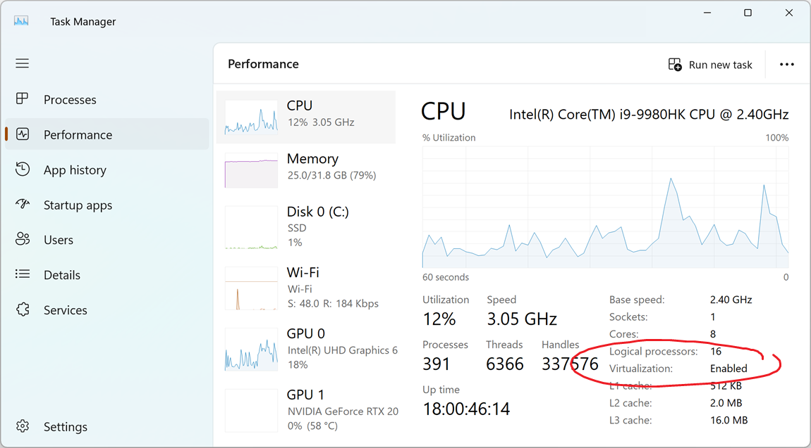

Windows Command line tools (WSL)
================================
{: .primer-spec-toc-ignore }

The Windows Subsystem for Linux (WSL) runs an Ubuntu Linux guest virtual machine on your Windows host machine.

## Upgrade Windows
We recommend Windows 11.  Windows 10 version 2004 build 19041 and higher will also work.  Here's how to [check your Windows version](https://support.microsoft.com/en-us/help/4027391/windows-10-see-which-version-you-have).

Free Windows upgrades are available for UM students via [OnTheHub](https://its.umich.edu/computing/computers-software/software-services/onthehub). If you have an older Windows machine and are not able to upgrade, please reach out to course instructors for assistance.


<div class="primer-spec-callout warning" markdown="1">
**Pitfall:** Make sure Windows Update is enabled and your machine is up-to-date. Search for "Windows Update" in the start menu.
</div>

## Install WSL
Start PowerShell and run it as administrator.  Search for PowerShell in the start menu, then right-click and select "Run as administrator".


PowerShell is a command-line interface for Windows. Its command prompt ends with a `>` (e.g. `C:\WINDOWS\system32>`). To follow the steps below, type the commands that appear after the `>` and hit enter.

Check if WSL is already installed by running the command `wsl -l -v`. If you see a list like below, WSL is already installed.
```console
C:\WINDOWS\system32> wsl -l -v
  NAME      STATE       VERSION
* Ubuntu    Stopped     2
```
{: data-highlight="3"}

If the `VERSION` is 1, you must [upgrade to WSL 2](https://learn.microsoft.com/en-us/windows/wsl/install-manual).

If you already have a distribution (e.g. Ubuntu) with `VERSION` 2, skip to [Setup Ubuntu](#setup-ubuntu) below.

Otherwise, WSL is not installed and you'll see help text similar to the following. (This is expected for most students.)
```console
C:\WINDOWS\system32> wsl -l -v
Copyright (c) Microsoft Corporation. All rights reserved.
Usage: wsl.exe [Argument]
...
```

Install WSL.  We recommend the most recent Ubuntu LTS version from the [Microsoft App Store](https://apps.microsoft.com/search?query=ubuntu+lts), currently Ubuntu 24.04.
```console
C:\WINDOWS\system32> wsl --install -d Ubuntu-24.04
```

<div class="primer-spec-callout warning" markdown="1">
**Pitfall:** If you get an error from `wsl --install`, see the [Troubleshooting](#troubleshooting) section below.
</div>

Restart your computer.

Start PowerShell as administrator, and check that WSL Ubuntu is now installed with version 2.

```console
C:\WINDOWS\system32> wsl -l -v
  NAME      STATE       VERSION
* Ubuntu    Stopped     2
```
{: data-highlight="3"}

## Setup Ubuntu
From the previous section, you have installed WSL and an Ubuntu Linux distribution. You'll do most C++ development in Ubuntu rather than Windows. Let's get it set up.

Start an Ubuntu Bash shell. Bash is a command-line interface for Linux. Search for "Ubuntu" or "bash" in the start menu.

 | 

The bash command prompt ends with a `$`. To follow the steps below, type commands that appear after the `$` and hit enter.

### First time: create account
The first time you open Ubuntu, you will be prompted to create a Linux username and password. Follow the prompts to create one.
- Choose a username that is all lowercase characters (could be your uniqname).
- While typing your password, the characters are not shown. This is fine.
- You can press <kbd>Enter</kbd> to skip fields other than username and password (e.g. "room number").


Double check that your user has been created.
```console
$ whoami
awdeorio  # this should NOT say root
```

<div class="primer-spec-callout warning" markdown="1">
**Pitfall:** If you are signed in as [root](#root-user), something has gone wrong.
  
```console
$ whoami
root  # SOMEthiNG IS WRONG
```

This can happen, for example, if you accidentally closed the terminal window before creating a user account.

We recommend you completely reinstall Ubuntu. (Note this will _delete all of the data associated with Ubuntu_. If you've just installed it, that's fine.)

Open PowerShell and run it as administrator. Run the commands below. You'll be prompted to create a user account.

```console
C:\WINDOWS\system32> wsl --unregister Ubuntu
Unregistering.
The operation completed successfully.

C:\WINDOWS\system32> wsl --install -d Ubuntu
Ubuntu is already installed.
Launching Ubuntu...
Installing, this may take a few minutes...
Please create a default UNIX user account. The username does not need to match your Windows username.
For more information visit: https://aka.ms/wslusers
Enter a new UNIX username:
```

</div>

### Install CLI tools
From an Ubuntu bash terminal, use the `apt` package manager to install a few command line programs.
```console
$ sudo apt update
$ sudo apt install g++ make rsync wget git ssh gdb python3 tree
```
{: data-variant="no-line-numbers" }

### Home Directory
You'll generally want to store your coding projects in the Linux filesystem, which is separate from your Windows filesystem.

Open an Ubuntu bash terminal and run `cd ~`. This will take you to your Ubuntu home directory. Running `pwd` afterward confirms the location. (Your username will be different.)

```console
$ cd ~
$ pwd
/home/jjuett
```

Create an EECS 280 folder by running `~/mkdir eecs280`. Running `ls` afterward confirms the folder has been created.

```console
$ mkdir ~/eecs280
$ ls
eecs280
```

We highly recommend you store all coding work for EECS 280 projects and labs here.

<div class="primer-spec-callout warning" markdown="1">
**Pitfall:** Avoid file or folder names that contain spaces. Spaces cause problems with some command line tools.

| Bad Example     | Good Example   |
|-----------------|----------------|
| `EECS 280/` | `eecs280/` |
| `Project 1 Stats/` | `p1-stats/` |

</div>

#### Access via File Explorer

Even though the files are stored in the Linux filesystem, you can still access them from the Windows file explorer. Run `explorer.exe .` to open an explorer window in bash's current directory (Note the extra `.` at the end, which means "current directory".)

```console
$ explorer.exe .
```

Right-click on the `eecs280` folder and select "Pin to Quick Access". This adds a shortcut to the left sidebar, which is useful for e.g. finding and submitting your files to the autograder via a web browser.

You can also open a bash terminal in the current directory of your file explorer. Click the blank area to the right of where the directory path is shown. Then, type "bash" (replacing the text already there) and hit enter.





This will open a new bash terminal in the same directory as the file explorer.

### CLI Tutorial
Now would be a great time to take a look at our [CLI Tutorial](cli.html).

## Pro-tips


### Accessing Windows files from Linux
To access Windows files from Linux, navigate to `/mnt/c/`.

```console

For example, here's how to access your Windows Desktop.  Your username will be different.
```console
$ cd /mnt/c/Users
$ ls
'All Users'  'Default User'   defaultuser0   awdeorio   Default   Public   defaultuser100000   desktop.ini
$ cd awdeorio
$ ls
... Desktop  Downloads ...
$ cd Desktop
```

### Copy/Paste in Terminal
Copy/Paste functionality in your bash terminal may be enabled by default with the usual <kbd>ctrl</kbd> + <kbd>c</kbd> and <kbd>ctrl</kbd> + <kbd>v</kbd> keyboard shortcuts.

Or, try <kbd>ctrl</kbd> + <kbd>shift</kbd> + <kbd>c</kbd> and <kbd>ctrl</kbd> + <kbd>shift</kbd> + <kbd>v</kbd>.

If these do not work, right click on the terminal window header. If you see option for "Settings", go to "Settings" -> "Actions" and add your desired keybindings for copy/paste. If you see an option for "Properties", go to "Properties" -> "Options" and ensure "Use Ctrl+Shift+C/V as Copy/Paste" box is checked.

## Troubleshooting

### Enable Virtualization

WSL2 requires virtualization support. Follow the steps below to ensure it is enabled.

**Step 1**  
Launch the task manager by pressing <kbd>ctrl</kbd> + <kbd>shift</kbd> + <kbd>esc</kbd>. Click on the "Performance" tab.



If you see "Virtualization: Enabled", proceed to step 2. If you don't see "Virtualization" at all, your computer may not support WSL. (This should only be the case for very old machines.)

If you see "Virtualization: Disabled", you need to enable virtualization in BIOS settings. The method for doing this varies depending on your computer's manufacturer, but instructions are generally available online, e.g. [here](https://www.tomshardware.com/reviews/bios-keys-to-access-your-firmware,5732.html). Once you have restarted into BIOS, navigate the options with your keyboard to find and enable virtualization. Save your changes and restart your computer.

**Step 2**  
Once virtualization is enabled, ensure the "Virtual Machine Platform" feature is enabled in Windows. Search for "Turn Windows features on or off" in the start menu. Scroll down and ensure that "Virtual Machine Platform" is checked. If it is not, check the box and click "OK". You may be asked to restart your computer.

Attempt to install WSL again, following the instructions at the top of this guide.

### Enable Windows Subsystem for Linux
If you're running commands like `wsl -l -v` or `wsl --install -d Ubuntu-24.04`, but it just prints out a generic help message, you may need to enable the Windows Subsystem for Linux feature. Search for "Turn Windows features on or off" in the start menu. Scroll down and ensure that "Windows Subsystem for Linux" is checked. If it is not, check the box and click "OK". You may be asked to restart your computer.

### Microsoft Troubleshooting

Microsoft maintains an extensive [troubleshooting page](https://learn.microsoft.com/en-us/windows/wsl/troubleshooting#installation-issues) for WSL installation. If you're getting a specific error code/message, you may be able to match it with a resolution here.

### Forgot Password

If you forgot you WSL password, follow the steps [here](https://learn.microsoft.com/en-us/windows/wsl/setup/environment#set-up-your-linux-username-and-password) to reset it. Scroll down to the part beginnning with "If you forgot the password for yoru Linux distribution:".

### Manual Installation
If you are running an older version of Windows 10 and unable to update to build 19041 or higher, you may be able to perform a [manual installation](https://learn.microsoft.com/en-us/windows/wsl/install-manual). Use this only as a last resort option.


## Acknowledgments
Original document written by Andrew DeOrio awdeorio@umich.edu.

This document is licensed under a [Creative Commons Attribution-NonCommercial 4.0 License](https://creativecommons.org/licenses/by-nc/4.0/). You’re free to copy and share this document, but not to sell it. You may not share source code provided with this document.
