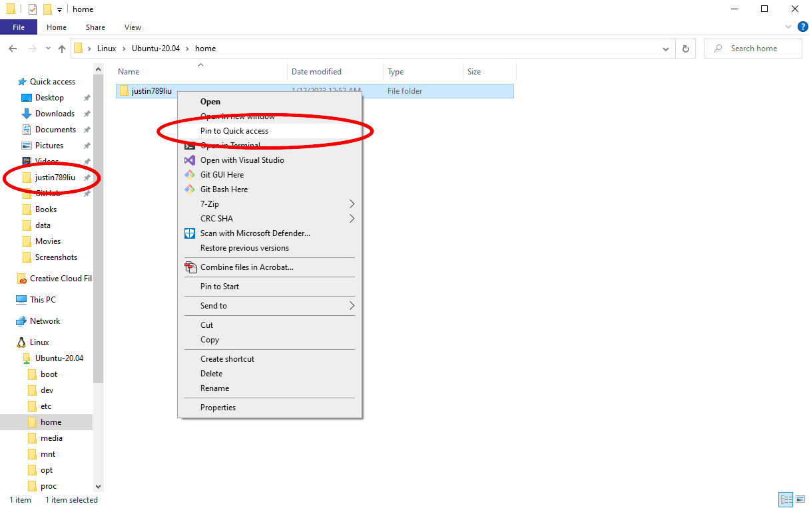

Windows Command line tools (WSL)
================================
{: .primer-spec-toc-ignore }

The Windows Subsystem for Linux (WSL) runs an Ubuntu Linux guest virtual machine on your Windows host machine.

When you see `$` in this tutorial, you should type into your shell the command that comes after the `$`.

## Upgrade Windows
We recommend Windows 11.  Windows 10 version 2004 build 19041 and higher will also work.  Here's how to [check your Windows version](https://support.microsoft.com/en-us/help/4027391/windows-10-see-which-version-you-have).

Free Windows upgrades are available for UM students via [OnTheHub](https://its.umich.edu/computing/computers-software/software-services/onthehub). If you have an older Windows machine and are not able to upgrade, please reach out to course instructors for assistance.

## Install Windows Subsystem for Linux (WSL)
Start PowerShell and run it as administrator.  Search for PowerShell in the start menu, then right-click and select "Run as administrator".  (Note: these instructions are based on the [instructions from Microsoft](https://docs.microsoft.com/en-us/windows/wsl/install).)


Check if WSL was already installed.  If you see this, WSL is already installed.
```console
C:\WINDOWS\system32> wsl -l -v
  NAME      STATE       VERSION
* Ubuntu    Stopped     2
```
{: data-highlight="3"}

If you see the WSL help text, WSL is not installed.
```console
C:\WINDOWS\system32> wsl -l -v
Copyright (c) Microsoft Corporation. All rights reserved.
Usage: wsl.exe [Argument]
...
```

Install WSL.
```console
C:\WINDOWS\system32> wsl --install
```

<div class="primer-spec-callout warning" markdown="1">
**Pitfall:** Make sure Windows Update is enabled and your machine is up-to-date.  Settings > Update and Security > Windows Update.
</div>

<div class="primer-spec-callout warning" markdown="1">
**Pitfall:** If you still get an error from `wsl --install`, try the [Manual installation steps](https://learn.microsoft.com/en-us/windows/wsl/install-manual).

For the Linux distribution, choose the latest version of Ubuntu LTS.  At the time of this writing, that's Ubuntu 22.04 LTS.
</div>

Restart your computer.

## Open terminal
Start an Ubuntu Bash shell.

|  |  |

## Install CLI tools
Use the `apt` package manager to install a few command line programs.  Linux users will run this same command.
```console
$ sudo apt update
$ sudo apt install g++ make rsync wget git ssh gdb python3 tree
```
{: data-variant="no-line-numbers" }

## Use CLI tools
Now would be a great time to take a look at our [CLI Tutorial](cli.html).

## Pro-tips

### Copy paste
Copy: <kbd>ctrl</kbd> + <kbd>shift</kbd> + <kbd>c</kbd>

Paste: <kbd>ctrl</kbd> + <kbd>shift</kbd> + <kbd>v</kbd>

If Copy/Paste doesn't work, read on to enable it.

#### Enable copy paste
{: .primer-spec-toc-ignore }

These instructions show how to enable WSL Copy/Paste on Windows 11 H2 or newer.

Right click on the window pane header of your Ubuntu WSL terminal. Click on the Settings option in the drop down menu.


<div class="primer-spec-callout warning" markdown="1">
**Pitfall:** If your dropdown contains the option "Properties" follow the instructions for [Older versions of windows](#enable-copy-paste-on-older-windows).


</div>

Click on the Actions tab on the left side of the settings window.


Confirm that the "Copy text" and "Paste text" bindings exist.  You may need to scroll down.  Add them if needed using the "Add new" button.
- Copy text: <kbd>ctrl</kbd> + <kbd>shift</kbd> + <kbd>c</kbd>
- Paste text: <kbd>ctrl</kbd> + <kbd>shift</kbd> + <kbd>v</kbd>


#### Enable copy paste on older Windows
{: .primer-spec-toc-ignore }

These instructions show how to enable WSL Copy/Paste on version of Windows older than 11 H2.

Click on the properties option in the dropdown.


Enable "Use Ctrl+Shift+C/V Copy/Paste" option in the Console "Options" properties page 


### Accessing files with Linux
Windows files are accessible from Linux at `/mnt/c/`.  You have a separate Ubuntu home directory, e.g., `/home/awdeorio/`. 

Most students will want to store project files on the Windows side (e.g. Desktop, Documents), however we recommend storing them in the Ubuntu home directory for ease of access and best practice. 

To find Ubuntu/Linux files in the file explorer, navigate to `/home`, and open the file explorer there using the command line.

```console
$ cd /home
$ explorer.exe .
```

You'll see your home directory. Right click it and choose "Pin to Quick access". Now you'll have a shortcut to your Linux home directory. 



### Accessing Windows files 
In case you do need to access these folders, you can start by navigating to your `/mnt/c/Users` path. Then, move into the directory labelled with your username. From here you should be able to access directories like Desktop and Documents. If you cannot find them, they may also be inside the OneDrive directory.

```console
$ cd /mnt/c/Users
$ ls
'All Users'  'Default User'   defaultuser0   awdeorio   Default   Public   defaultuser100000   desktop.ini
$ cd awdeorio
```

### CLI open file
Opens a file or directory with the default application, like a double click.  See the [`wslview` command](cli.html#open--wslview) in the CLI tutorial.


## Acknowledgments
Original document written by Andrew DeOrio awdeorio@umich.edu.

This document is licensed under a [Creative Commons Attribution-NonCommercial 4.0 License](https://creativecommons.org/licenses/by-nc/4.0/). You’re free to copy and share this document, but not to sell it. You may not share source code provided with this document.
