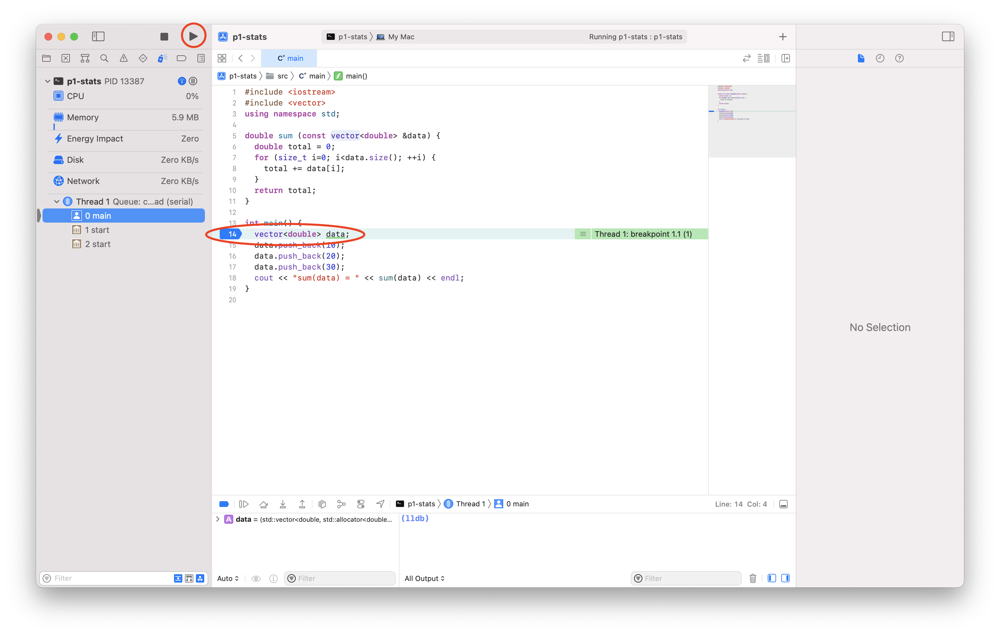
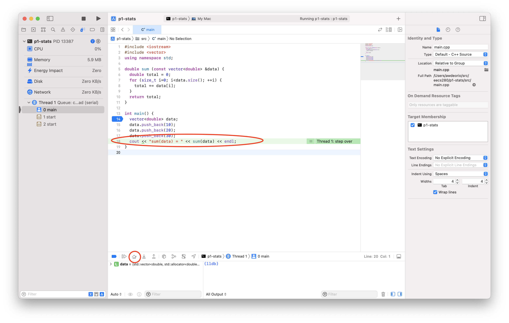

Setting up Xcode
================
{: .primer-spec-toc-ignore }

[Xcode](https://developer.apple.com/xcode/) is a feature-rich integrated debugging environment (IDE) that runs on macOS.


# Prerequisites
Be sure you have the `tree` command installed.
```console
$ brew install tree
```
{: data-variant="no-line-numbers" }

At this point, you should already have a folder for your project ([instructions](setup.html#create-a-folder)).  Your folder location might be different.  You should have downloaded and unpacked the starter files already ([instructions](setup.html#download-and-unpack-starter-files)).
```console
$ pwd
/Users/awdeorio/src/eecs280/p1-stats
$ ls
Makefile      main_test.out.correct  p1_library.h           stats_tests.cpp
README.md     main_test_data.tsv     stats.h
main_test.in  p1_library.cpp         stats_public_test.cpp
```

This tutorial uses command line tools.  If you haven't installed CLI tools on your machine yet, follow one of these tutorials first.

| [macOS](setup_macos.html)| [Windows](setup_wsl.html) | [Linux](setup_wsl.html#install-cli-tools)


# Restarting this tutorial
If you tried using this tutorial in the past and want to "start clean", here's how to delete all Xcode project configuration files.  This will not delete your code.  First, quit Xcode.
```console
$ pwd
/Users/awdeorio/src/eecs280/p1-stats
$ rm -rf p1-stats.xcodeproj
$ make clean
rm -rvf *.exe *~ *.out *.dSYM *.stackdump
```

Double-check that you only have project files in your directory, with no extra files or directories.  Files related to Git are OK, like `.git/` or `.gitignore`.  Remove extra files with `rm` and folders with `rm -rf`.
```console
$ tree
.
├── Makefile
├── main.cpp
├── main_test.in
├── main_test.out.correct
├── main_test_data.tsv
├── p1_library.cpp
├── p1_library.h
├── stats.cpp
├── stats.h
├── stats_public_test.cpp
└── stats_tests.cpp
```

Xcode has a *lot* of settings.  You can reset the entire user interface to the default settings using this command.  This is optional.
```console
$ defaults delete com.apple.dt.Xcode
```
{: data-variant="no-line-numbers" }


# Install
Install Xcode using the App Store.


Start Xcode and agree to the license.  You may be prompted for your administrator password to complete the install.

For reference, this is the version of Xcode we're using in this example.  Yours might be different.


# Create a project
An Xcode project contains the files and information to build your software.  In EECS 280, you'll eventually create one Xcode project for each EECS 280 project.

Start Xcode and create a new Xcode project.


Under "macOS", select "Command Line Tool".  Click "Next".


Set a project name.  We're going to use the same name as the directory that contains our starter files, `p1-stats`.  Ensure that "Language" is set to "C++". Click "Next".


In the File Dialog, navigate to the folder where you placed the starter files (`/Users/awdeorio/src/eecs280/p1-stats`).  Be sure to uncheck "Create Git repository".  Click "Create".


Select and right-click the automatically created `p1-stats` folder and click "Delete".


Select "Move to Trash" when prompted.


You should now have no files in Xcode's left panel.


Quit Xcode, open a terminal, and navigate to your source code directory (remember the `cd` command).  You'll notice that Xcode created a new folder, `p1-stats/`.
```console
$ pwd
/Users/awdeorio/src/eecs280/p1-stats
$ tree
.
├── Makefile
├── main_test.in
├── main_test.out.correct
├── main_test_data.tsv
├── p1-stats
│   ├── p1-stats
│   └── p1-stats.xcodeproj
│       ├── project.pbxproj
│       ├── project.xcworkspace
│       │   ├── contents.xcworkspacedata
│       │   └── xcuserdata
│       │       └── awdeorio.xcuserdatad
│       │           └── UserInterfaceState.xcuserstate
│       └── xcuserdata
│           └── awdeorio.xcuserdatad
│               └── xcschemes
│                   └── xcschememanagement.plist
├── p1_library.cpp
├── p1_library.h
├── stats.h
├── stats_public_test.cpp
└── stats_tests.cpp
```

The directory structure we want is a little bit different than Xcode's default.  That's because we're setting up this project like a simple C++ application.  We want to make sure that newly created files end up in the right place, and to simplify the present working directory configuration in Xcode.
```console
$ mv p1-stats/p1-stats.xcodeproj/ .
$ rm -rf p1-stats/
```

Your files should now look like this:
```console
$ pwd
/Users/awdeorio/src/eecs280/p1-stats
$ tree
.
├── Makefile
├── main_test.in
├── main_test.out.correct
├── main_test_data.tsv
├── p1-stats.xcodeproj
│   ├── project.pbxproj
│   ├── project.xcworkspace
│   │   ├── contents.xcworkspacedata
│   │   └── xcuserdata
│   │       └── awdeorio.xcuserdatad
│   │           └── UserInterfaceState.xcuserstate
│   └── xcuserdata
│       └── awdeorio.xcuserdatad
│           └── xcschemes
│               └── xcschememanagement.plist
├── p1_library.cpp
├── p1_library.h
├── stats.h
├── stats_public_test.cpp
└── stats_tests.cpp
```

## Add existing files
Next, we'll add our existing source code files to the project.

Start Xcode and open your project.  Here's how to do that all at once, from the command line:
```console
$ open p1-stats.xcodeproj
```
{: data-variant="no-line-numbers" }

Right-click "p1-stats" in the left side bar.  Select "Add Files to 'p1-stats'".


Select all the starter files (press Command-A) and click "Add".


You will now see your files in the sidebar on the left.


## Add new files

EECS 280 project 1 requires us to create two new files: `stats.cpp` and `main.cpp`.

Right-click "p1-stats" in the left side bar.  Select "New File".


Select "macOS", "C++ File", and click "Next".


Name your file.  Uncheck "Also create a header file".  The first file we'll create for project 1 is `stats.cpp`.


Don't select any targets.  Click "Create".


Repeat the previous steps to create another new file, `main.cpp`.

Now you'll see the two new files in the side bar.


You'll also see the new files at the command line.
```console
$ ls stats.cpp main.cpp
main.cpp  stats.cpp
$ tree
.
├── Makefile
├── main.cpp
├── main_test.in
├── main_test.out.correct
├── main_test_data.tsv
├── p1-stats.xcodeproj
│   ├── project.pbxproj
│   ├── project.xcworkspace
│   │   ├── contents.xcworkspacedata
│   │   └── xcuserdata
│   │       └── awdeorio.xcuserdatad
│   │           └── UserInterfaceState.xcuserstate
│   └── xcuserdata
│       └── awdeorio.xcuserdatad
│           └── xcschemes
│               └── xcschememanagement.plist
├── p1_library.cpp
├── p1_library.h
├── stats.cpp
├── stats.h
├── stats_public_test.cpp
└── stats_tests.cpp
```

### Project 1 `stats.cpp`
Now let's modify the files that you created.  Edit `stats.cpp` and add function stubs.  A function stub contains only `assert(false)`; it's like a placeholder that we'll use to get our application to compile.  Each of these stubs corresponds to a function prototype in `stats.h`.  Don't forget to save.
```c++
// stats.cpp
// Project UID 5366c7e2b77742d5b2142097e51561a5

#include "stats.h"
#include <cassert>
#include <vector>
#include <cmath>
using namespace std;

vector<vector<double> > summarize(vector<double> v) {
  assert(false);
}

int count(vector<double> v) {
  assert(false);
}

double sum(vector<double> v) {
  assert(false);
}

double mean(vector<double> v) {
  assert(false);
}

double median(vector<double> v) {
  assert(false);
}

double mode(vector<double> v) {
  assert(false);
}

double min(vector<double> v) {
  assert(false);
}

double max(vector<double> v) {
  assert(false);
}

double stdev(vector<double> v) {
  assert(false);
}

double percentile(vector<double> v, double p) {
  assert(false);
}
```
{: data-title="stats.cpp" }

### Project 1 `main.cpp`
Start your `main.cpp` like this.  All it does so far is "hello world".  We'll include a few libraries that will be useful later.
```c++
// main.cpp
// Project UID 5366c7e2b77742d5b2142097e51561a5

#include "stats.h"
#include "p1_library.h"
#include <iostream>
using namespace std;

int main() {
  cout << "hello from main!\n";
}
```
{: data-title="main.cpp" }


# Compile
An Xcode target compiles (builds) one executable.  One executable should have exactly one `main()` function.  Three of our project 1 files have `main()` functions.

| Project 1 Target | File with `main()` | Other `.cpp` Build Sources |
| ------ | --------------- |
| `stats_tests.exe` | `stats_tests.cpp` | `stats.cpp`, `p1_library.cpp` |
| `stats_public_test.exe` | `stats_public_test.cpp` | `stats.cpp`, `p1_library.cpp` |
| `main.exe` | `main.cpp` | `stats.cpp`, `p1_library.cpp` |


## Compile at the command line
First, try building each target at the command line.

```console
$ pwd
/Users/awdeorio/src/eecs280/p1-stats
$ make clean
rm -rvf *.exe *~ *.out *.dSYM *.stackdump
$ make stats_tests.exe
g++ -Wall -Werror -pedantic -g --std=c++11 stats_tests.cpp stats.cpp p1_library.cpp -o stats_tests.exe
$ make stats_public_test.exe
g++ -Wall -Werror -pedantic -g --std=c++11 stats_public_test.cpp stats.cpp p1_library.cpp -o stats_public_test.exe
$ make main.exe
g++ -Wall -Werror -pedantic -g --std=c++11 main.cpp stats.cpp p1_library.cpp -o main.exe
```

Clean up.
```console
$ make clean
rm -rvf *.exe *~ *.out *.dSYM *.stackdump
```

## Compile with Xcode
Now, we'll have Xcode do the build.  We need to avoid multiple `main()` functions by including the right files in our target.  Click "p1-stats" in the side bar, then "p1-stats" under TARGETS.  Click "Build Phases", the "Compile Sources".  Include the files needed to compile the `stats_tests.exe` executable.  Remove the other files by selecting them and clicking on the "–" button.


Build.


The code will then run and crash at the assert in the `sum()` function.  You can press the stop button next to the play button at the top to stop the program.

To compile a different target, change the list of files under "Compile Sources".

## Compile future projects
In future projects, you'll have to figure out which files to include in a build.  Generally, each time you see `#include "myfile.h"`, you will include a corresponding `myfile.cpp` file in the build.  Be sure that you include only one `main()` function.

An alternative is to mimic the `Makefile`.  Compile one target and include any `.cpp` files in the `g++` command.  Notice that `main.cpp`, `stats.cpp`, and `p1_library.cpp` were included in the `g++` compile command.  These are the files you should include in the Xcode build.  Note that the files will be different for building a unit test, but you can use the same trick again.
```console
$ make clean
rm -rvf *.exe *~ *.out *.dSYM *.stackdump
$ make main.exe
g++ -Wall -Werror -pedantic -g --std=c++11 main.cpp stats.cpp p1_library.cpp -o main.exe
```


# Run
An Xcode scheme builds a target and then automatically executes it.  We will configure Xcode to run your executable in the same directory that contains your input files.

Click "p1-stats" , then "Edit Scheme".


Select "Run", then "Options", then "Use custom working directory".  Set the directory to the directory containing your project's files.  In this example, that's `/Users/awdeorio/src/eecs280/p1-stats`.  Click "Close".


## Sanitizers
While editing the scheme ([instructions](#run)), we recommend enabling the address sanitizer and undefined behavior sanitizer.  These will help you find memory errors like going off the end of an array or vector. Find more detail in the [Apple Article](https://developer.apple.com/documentation/xcode/diagnosing_memory_thread_and_crash_issues_early).


## Input redirection
Skip this subsection on your first time through the tutorial.  You can use input redirection to avoid typing program input each time you run (for debugging) a program.

Without input redirection, here's how you type input at the command line.  Notice that the program asks the user to `enter a filename` and then the user types `main_test_data.tsv`.  Then, the program asks the user to `enter a column name` and the user types `B`.
```console
$ make clean
rm -rvf *.exe *~ *.out *.dSYM *.stackdump
$ make main.exe
g++ -Wall -Werror -pedantic -g --std=c++11 main.cpp stats.cpp p1_library.cpp -o main.exe
$ ./main.exe
enter a filename
main_test_data.tsv
enter a column name
B
...
```

If we put the user input in a file we can automate the user input.  We'll put it in a file called `main_test.in`.
```console
$ cat main_test.in   # Peek at the contents of a file
main_test_data.tsv
B
$ ./main.exe < main_test.in  # Redirect file content to main's stdin (cin)
enter a filename
enter a column name
reading column B from main_test_data.tsv
...
```

Without input redirection, here's how to type input in the Xcode command line.


Xcode no longer directly supports command-line style redirection.  One option is to simply type the input each time.  Another option is to use a work-around described in [https://gitlab.eecs.umich.edu/eecs281/wiki/wikis/xcode-file-redirection](https://gitlab.eecs.umich.edu/eecs281/wiki/wikis/xcode-file-redirection)


## Arguments and options
<div class="primer-spec-callout info" markdown="1">
Skip this subsection for EECS 280 project 1.  You'll need it for project 2 and beyond.
</div>

*Arguments* and *options* are inputs to a program typed at the command line.  Arguments are often required.  Options (AKA *flags* or *switches*) start with a hyphen (`-`), and are typically optional.

**Arguments example** from project 2:  `resize.exe` is the name of the program, and the arguments are `horses.ppm`,  `horses_400x250.ppm`, `400`, and `250`.
```console
$ ./resize.exe horses.ppm horses_400x250.ppm 400 250
```
{: data-variant="no-line-numbers" }

**Options example** from project 5:  `main.exe` is the name of the program.  `train_small.csv` and  `test_small.csv` are arguments.  `--debug` is an option.
```console
$ ./main.exe train_small.csv test_small.csv --debug
```
{: data-variant="no-line-numbers" }

To run a program with options or arguments in Xcode, select your scheme and then "Edit Scheme".


Add each option or argument separately.


# Debug
In order to debug, we want our application to stop when we run it.  Make sure your application is stopped and you can see the Project Navigator.  Set a breakpoint by clicking to the left of a line number.


Build and run.  Notice that the application is paused on entry to `main()`.



Click "Step Over" to go to the next line of code. Our test fails immediately because we haven't implemented `sum()` yet.



Restart the program.


Click "step into".  You'll see that the cursor enters the `test_sum_small_data_set()` function.


Click "step over" a few times until you're on this line of code. Hover over a variable to see its value.


# Pro-tips
To start Xcode with our project open from the command line:
```console
$ open p1-stats.xcodeproj
```
{: data-variant="no-line-numbers" }

To search for help on the internet, try including the version.  For example, "Xcode 9.2 command line arguments".


If you run in to problems, try cleaning up your executables from the command line.
```console
$ make clean
```
{: data-variant="no-line-numbers" }

# Next steps
[Return to the main set up tutorial.](setup.html#visual-debugger)

# Acknowledgments
Original document written by Andrew DeOrio awdeorio@umich.edu.

This document is licensed under a [Creative Commons Attribution-NonCommercial 4.0 License](https://creativecommons.org/licenses/by-nc/4.0/). You’re free to copy and share this document, but not to sell it. You may not share source code provided with this document.
