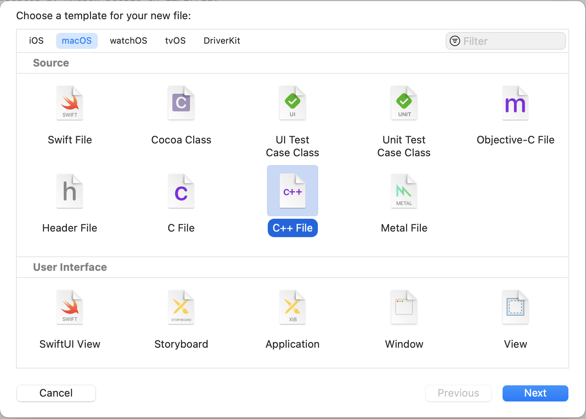
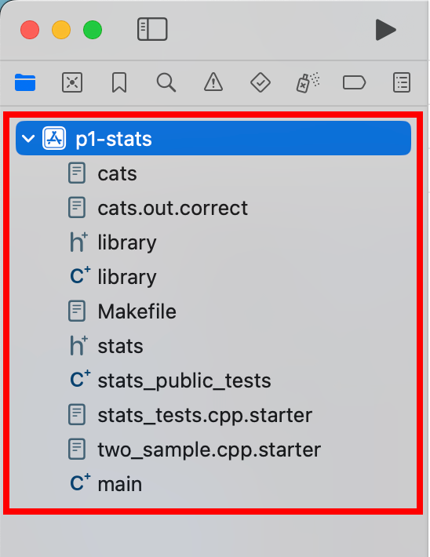
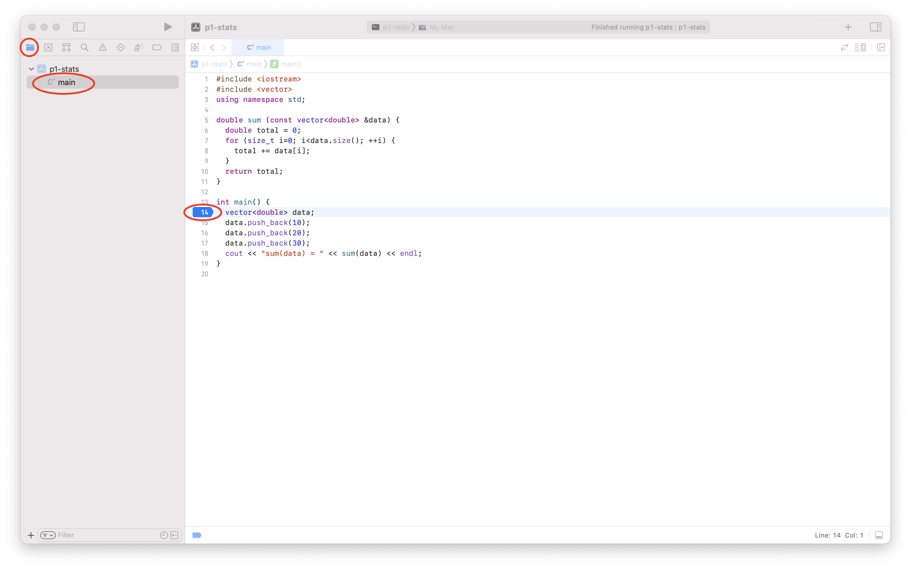
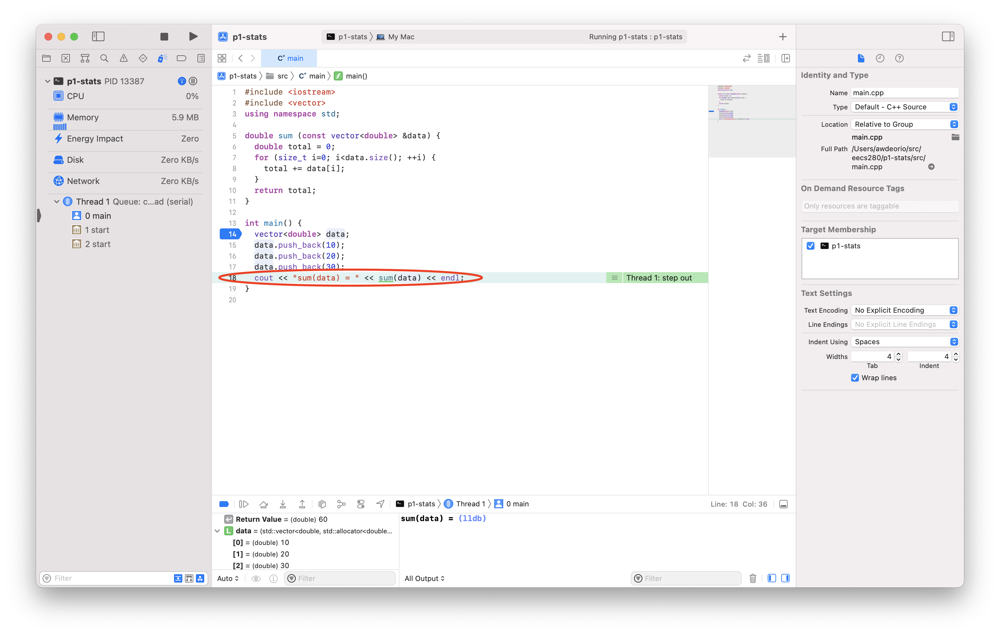

Setting up Xcode
================
{: .primer-spec-toc-ignore }

[Xcode](https://developer.apple.com/xcode/) is a feature-rich integrated debugging environment (IDE) that runs on macOS.

<div class="primer-spec-callout info" markdown="1">
If you already have Xcode installed, skip to the [Create a project](#create-a-project) section.
</div>

## Prerequisites
There are no prerequisites for VS Code.

## Restart
To start clean, first quit VS Code.  Back up your files, and then delete your project directory.  Your project directory might be different.
```console
$ pwd
/Users/awdeorio/src/eecs280
$ cp -a p1-stats p1-stats.bak  # Backup
$ rm -rf p1-stats              # Delete
```

Xcode has a *lot* of settings.  You can reset the entire user interface to the default settings using this command.  This is optional.
```console
$ defaults delete com.apple.dt.Xcode
```
{: data-variant="no-line-numbers" }


## Install
Install Xcode using the App Store.  Your version might be different.


Start Xcode and agree to the license.  You may be prompted for your administrator password to complete the install.

For reference, this is the version of Xcode we're using in this example.  Yours might be different.


## Create a project
An Xcode project contains the files and information to build your software.  In EECS 280, you'll eventually create one Xcode project for each EECS 280 project.

Start Xcode.  Create a new Xcode project.


Under "macOS", select "Command Line Tool".  Click "Next".


Set a project name, we'll call our example project `p1-stats`.  Ensure that that the Language is set to "C++". Click "Next".


In the File Dialog, navigate to the directory where you store your projects. Your folder location might be different. Be sure to uncheck "Create Git repository".  Click "Create".


<div class="primer-spec-callout warning" markdown="1">
**Pitfall:** Avoid paths that contain spaces.  Spaces causes problems with some command line tools.

| Bad Example     | Good Example   |
|-----------------|----------------|
| `.../EECS 280/Project 1 Stats` | `.../eecs280/p1-stats`  |

</div>

Click the `p1-stats` folder and rename it to `src`.  We recommend this in EECS 280 to avoid confusing the outer directory (`p1-stats`) with the inner directory (`src`).  This step is optional.


You can see the files created by Xcode from the command line.  Notice that Xcode created a folder project metadata: `p1-stats.xcodeproj`.
```console
$ pwd
/Users/awdeorio/src/eecs280/p1-stats
$ tree
.
├── p1-stats.xcodeproj
│   ├── project.pbxproj
        ...
└── src
    └── main.cpp
```

### Add new files
<div class="primer-spec-callout info" markdown="1">
Xcode created `main.cpp` by default.  Skip this subsection your first time through the tutorial.  You can come back to it.
</div>

Open your project folder by selecting `File` > `Open` > navigate to the `p1-stats` folder and open `p1-stats.xcodeproj`.

<div class="primer-spec-callout info" markdown="1">
**Pro-tip:** Here's a quick way to open VS Code to a specific project folder from the command line.
```console
$ open p1-stats.xcodeproj
```
{: data-variant="no-line-numbers" }
</div>

Right-click the `src` folder in the left side bar.  Select "New File".


Select "macOS", "C++ File", and click "Next".



Name your file, we'll use `stats.cpp` for this example.  Uncheck "Also create a header file".  There's nothing wrong with using "create a header file" if your project needs it.


Don't select any targets.  Click "Create".


You should see your new file in the `src` directory.


### Add existing files
If you have starter files, add them to the `src` subdirectory inside your project directory.

We'll use the terminal to download, unpack, and move starter files into the `src` subdirectory.  Your URL or folder might be different.  **Pro-tip:** [copy/paste instructions for WSL](setup_wsl.html#how-do-i-copy-and-paste).

<div class="primer-spec-callout warning" markdown="1">
**Pitfall:** Make sure you're in the subdirectory containing your source code.
```console
$ ls
main.cpp ...
```
</div>

```console
$ wget https://eecs280staff.github.io/p1-stats/starter-files.tar.gz
$ tar -xvzf starter-files.tar.gz
$ mkdir -p src
$ mv starter-files/* src/
$ rm -rf starter-files starter-files.tar.gz
```

You should see your new files in the `src` subdirectory.
```console
$ tree
.
├── p1-stats.xcodeproj
    ...
└── src
    ├── Makefile
    ├── main.cpp
    ├── main_test.in
    ├── main_test.out.correct
    ├── main_test_data.tsv
    ├── p1_library.cpp
    ├── p1_library.h
    ├── stats.cpp
    ├── stats.h
    ├── stats_public_test.cpp
    └── stats_tests.cpp.starter
```

Start Xcode and open your project.

Right-click "src" in the left side bar.  Select "Add Files".  Do *not* select "Copy items if needed".


Select all the starter files (<kbd>Command</kbd> + <kbd>a</kbd>) and click "Add".


You will now see your files in the sidebar on the left.



#### Rename files
If you need to rename any files, use Xcode, not the command line or Finder.  In EECS 280, you'll need to rename any files that end in `.starter`.

Right click a file and select "rename".  Change the file name.  In EECS 280, you'll do this to any file that ends in `.starter`.

|  |  |

## Compile and Run
An Xcode target compiles (builds) one executable.  One executable should have exactly one `main()` function.

Now, we'll have Xcode do the build.  We need to avoid multiple `main()` functions by including the right files in our target.  Click "p1-stats" in the side bar, then "p1-stats" under TARGETS.  Click "Build Phases", the "Compile Sources".  Include the files needed to compile the `main.exe` executable.  Remove any other files by selecting them and clicking on the "–" button.


<div class="primer-spec-callout info" markdown="1">
**Pro-tip:** In future projects, you'll have to figure out which files to include in a build.  Generally, each time you see `#include "myfile.h"`, you will include a corresponding `myfile.cpp` file in the build.  Be sure that you include only one `main()` function.

An alternative is to mimic the `Makefile`.  Compile one target and include any `.cpp` files in the `g++` command.  Notice that `main.cpp`, `stats.cpp`, and `p1_library.cpp` were included in the `g++` compile command.  These are the files you should include in the Xcode build.  Note that the files will be different for building a unit test, but you can use the same trick again.
```console
$ make clean
$ make main.exe
g++ -Wall -Werror -pedantic -g --std=c++11 main.cpp stats.cpp p1_library.cpp -o main.exe
```
{: data-highlight="3" }
</div>

Configure Xcode to run the executable in the directory containing the input files, which is `src/` in this example.

Click "p1-stats" , then "Edit Scheme".


Select "Run", then "Options", then "Use custom working directory".  Set the directory to the directory containing your project's files.  In this example, that's `/Users/awdeorio/src/eecs280/p1-stats/src`.  Click "Close".


<div class="primer-spec-callout warning" markdown="1">
**Pitfall:** Remember to include the `src` subdirectory.
</div>

Compile and run.


### Sanitizers
We recommend enabling the address sanitizer and undefined behavior sanitizer. These will help you find memory errors like going off the end of an array or vector.

Click "p1-stats" , then "Edit Scheme".


### Input redirection
Skip this subsection on your first time through the tutorial.  You can use input redirection to avoid typing program input each time you run (for debugging) a program.

Without input redirection, here's how you type input at the command line.  Notice that the program asks the user to `enter a filename` and then the user types `main_test_data.tsv`.  Then, the program asks the user to `enter a column name` and the user types `B`.
```console
$ make clean
rm -rvf *.exe *~ *.out *.dSYM *.stackdump
$ make main.exe
g++ -Wall -Werror -pedantic -g --std=c++11 main.cpp stats.cpp p1_library.cpp -o main.exe
$ ./main.exe
enter a filename
main_test_data.tsv
enter a column name
B
...
```

If we put the user input in a file we can automate the user input.  We'll put it in a file called `main_test.in`.
```console
$ cat main_test.in   # Peek at the contents of a file
main_test_data.tsv
B
$ ./main.exe < main_test.in  # Redirect file content to main's stdin (cin)
enter a filename
enter a column name
reading column B from main_test_data.tsv
...
```

Without input redirection, here's how to type input in the Xcode command line.


Xcode no longer directly supports command-line style redirection.  One option is to simply type the input each time.  Another option is to use a work-around described in [https://gitlab.eecs.umich.edu/eecs281/wiki/wikis/xcode-file-redirection](https://gitlab.eecs.umich.edu/eecs281/wiki/wikis/xcode-file-redirection)


### Arguments and options
<div class="primer-spec-callout info" markdown="1">
Skip this subsection for EECS 280 project 1.  You'll need it for project 2 and beyond.
</div>

*Arguments* and *options* are inputs to a program typed at the command line.  Arguments are often required.  Options (AKA *flags* or *switches*) start with a hyphen (`-`), and are typically optional.

**Arguments example** from project 2:  `resize.exe` is the name of the program, and the arguments are `horses.ppm`,  `horses_400x250.ppm`, `400`, and `250`.
```console
$ ./resize.exe horses.ppm horses_400x250.ppm 400 250
```
{: data-variant="no-line-numbers" }

**Options example** from project 5:  `main.exe` is the name of the program.  `train_small.csv` and  `test_small.csv` are arguments.  `--debug` is an option.
```console
$ ./main.exe train_small.csv test_small.csv --debug
```
{: data-variant="no-line-numbers" }

To run a program with options or arguments in Xcode, select your scheme and then "Edit Scheme".


Add each option or argument separately.


## Debug
Copy this example `main.cpp` into your editor.
```c++
#include <iostream>
#include <vector>
using namespace std;

double sum (const vector<double> &data) {
  double total = 0;
  for (size_t i=0; i<data.size(); ++i) {
    total += data[i];
  }
  return total;
}

int main() {
  vector<double> data;
  data.push_back(10);
  data.push_back(20);
  data.push_back(30);
  cout << "sum(data) = " << sum(data) << endl;
}
```
{: data-title="main.cpp" }


### Breakpoint
Make sure your application is stopped and you can see the Project Navigator.  Select the file you want to debug.  Set a breakpoint by clicking to the left of a line number.  A breakpoint tells the program to pause.



### Run
Build and run.  Notice that the application is paused on entry to `main()`.


### Step over
Click "Step Over" to go to the next line of code. Our test fails immediately because we haven't implemented `sum()` yet.


### Inspect
Restart the program.


### Step into
Click "step into".  You'll see that the cursor enters the `test_sum_small_data_set()` function.


### Step out
Click "step over" a few times until you're on this line of code. Hover over a variable to see its value.



### Continue
FIXME

## Acknowledgments
Original document written by Andrew DeOrio awdeorio@umich.edu.

This document is licensed under a [Creative Commons Attribution-NonCommercial 4.0 License](https://creativecommons.org/licenses/by-nc/4.0/). You’re free to copy and share this document, but not to sell it. You may not share source code provided with this document.
