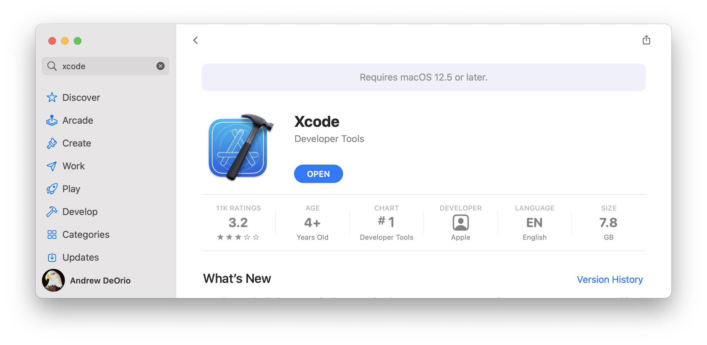
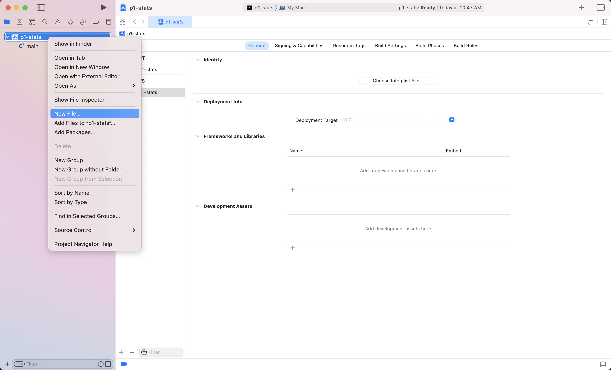
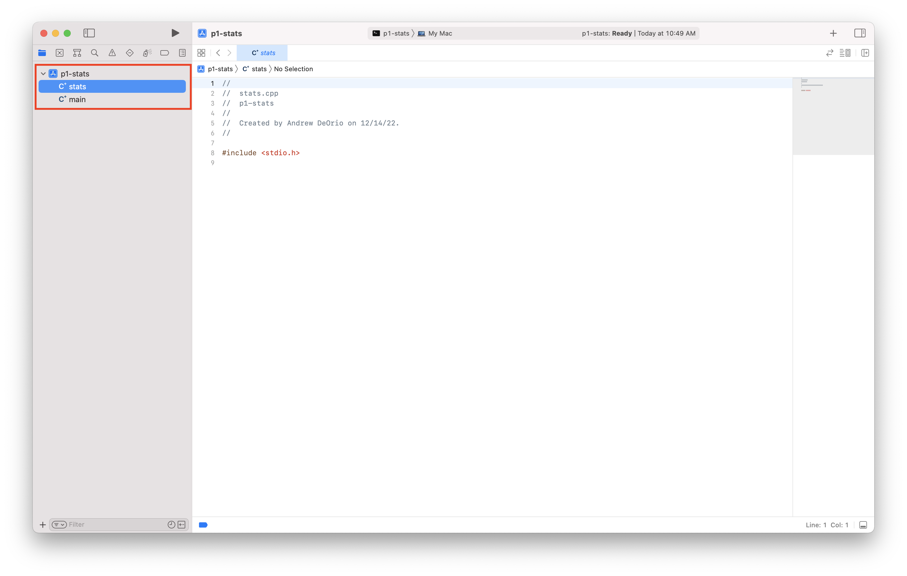
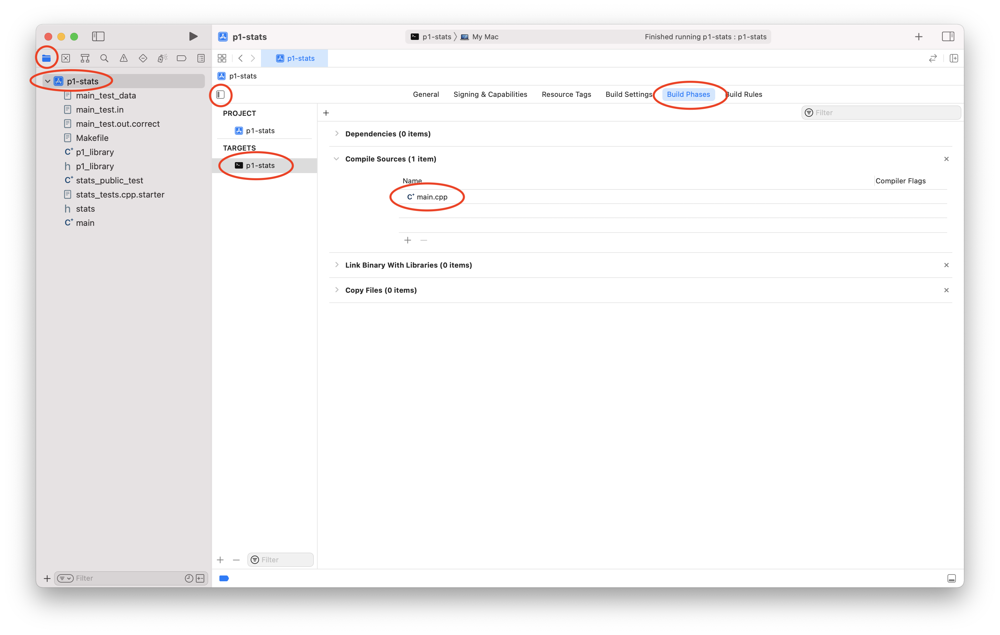
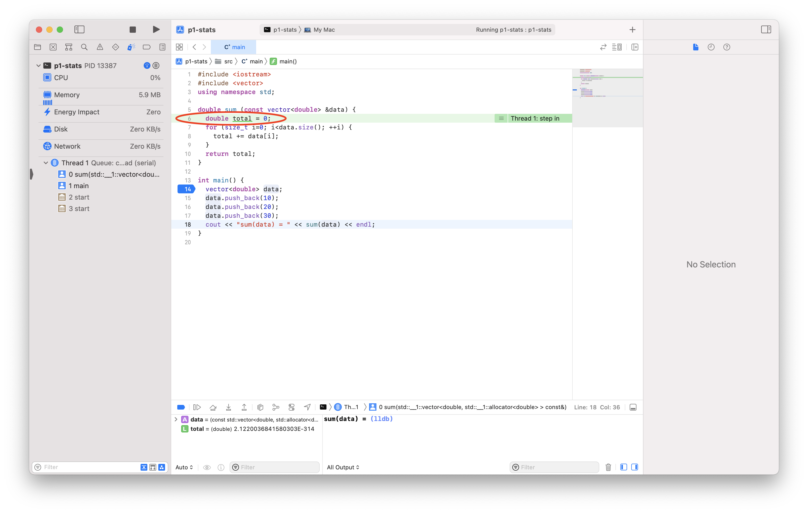

Setup Xcode (macOS)
===================
{: .primer-spec-toc-ignore }

[Xcode](https://developer.apple.com/xcode/) is a feature-rich integrated development environment (IDE) that runs on macOS.

<div class="primer-spec-callout info" markdown="1">
If you already have Xcode installed, skip to the [Create a project](#create-a-project) section.
</div>

## Prerequisites
Xcode runs on macOS only.  There are no other prerequisites for Xcode.

This tutorial recommends command line tools.  To install CLI tools, follow the [macOS command line tools tutorial](setup_macos.html).

Next, we recommend our [Command line interface (CLI)](cli.html) tutorial.

<div class="primer-spec-callout warning" markdown="1">
**Pitfall:** Make sure you have installed [CLI tools for macOS](setup_macos.html#install-cli-tools) before continuing.
</div>

## Install
Install Xcode using the App Store.  Your version might be different.



Start Xcode and agree to the license.  You may be prompted for your administrator password to complete the install.

For reference, the screenshots in this tutorial were created with Xcode version 13.2.1.  Yours might be different.

## Create a project
An Xcode project contains the files and information to build your software.  In EECS 280, you'll eventually create one Xcode project for each EECS 280 project.

Start Xcode.  Create a new Xcode project.


Under "macOS", select "Command Line Tool".  Click "Next".


Set a project name, we'll call our example project `stats`.  Ensure that that the Language is set to "C++".  Enter your uniqname in the "Organization Identifier" field. (It's used by the app store which we don't use, so you just need something there.)  Click "Next".


In the File Dialog, navigate to the directory where you store your projects. Your folder location might be different. Be sure to uncheck "Create Git repository".  Click "Create".


<div class="primer-spec-callout warning" markdown="1">
**Pitfall:** Avoid paths that contain spaces.  Spaces cause problems with some command line tools.

| Bad Example     | Good Example   |
|-----------------|----------------|
| `EECS 280/` | `eecs280/` |
| `EECS 280 Stats Project/` | `stats/` |

</div>

Drag-and-drop `main.cpp` out of the `stats` folder, then delete the `stats` folder.  We recommend this in EECS 280 so that everyone has a one-level structure (`stats/main.cpp`) instead of a two-level structure (`stats/stats/main.cpp`).  This step is optional.

|  |  |  |  |

You can see the files created by Xcode in the Finder.  Right-click `main` and select "Show in Finder".

|  |  |

You can also see the files created by Xcode from the command line.  Notice that Xcode created a folder with project metadata: `stats.xcodeproj`.

```console
$ tree
.
├── main.cpp
└── stats.xcodeproj
    ├── ...

```

### Add new files
<div class="primer-spec-callout info" markdown="1">
Xcode created `main.cpp` by default.  Skip this subsection your first time through the tutorial.  You can come back to it.
</div>

Open your project folder by selecting `File` > `Open` > navigate to the `stats` folder and open `stats.xcodeproj`.

<div class="primer-spec-callout info" markdown="1">
**Pro-tip:** Here's a quick way to open Xcode to a specific project folder from the command line.
```console
$ open stats.xcodeproj
```
{: data-variant="no-line-numbers" }
</div>

Right-click `stats` in the sidebar.  Select "New File".



Select "macOS", "C++ File", and click "Next".


Name your file, we'll use `stats.cpp` for this example.  Uncheck "Also create a header file".  There's nothing wrong with using "create a header file" if your project needs it.


Don't select any targets.  Click "Create".


You should see your new file in the sidebar.



### Add existing files
If you have starter files, add them to your project directory.  This example is from [EECS 280 Project 1](https://eecs280staff.github.io/stats/), but this tutorial doesn't require understanding the files.  Your URL or files might be different.

<div class="primer-spec-callout warning" markdown="1">
**Pitfall:** Make sure you're in the directory containing your source code.
```console
$ ls
main.cpp  stats.xcodeproj
```
</div>

We'll use the terminal to download, unpack, and move starter files into the directory that already contains `main.cpp`.

```console
$ wget https://eecs280staff.github.io/stats/starter-files.tar.gz
$ tar -xvzf starter-files.tar.gz
$ mv starter-files/* .
$ rm -rf starter-files starter-files.tar.gz
```

You should see your new files in your project directory.
```console
$ tree
.
├── Makefile
├── cats.csv
├── cats.out.correct
├── main.cpp
├── stats.xcodeproj
│   ├── ...
├── library.cpp
├── library.hpp
├── stats.hpp
├── stats_public_tests.cpp
├── stats_tests.cpp.starter
└── two_sample.cpp.starter
```

Start Xcode and open your project.

Right-click `stats` in the sidebar.  Select "Add Files".


Select all the starter files (<kbd>Command</kbd> + <kbd>a</kbd>). Your specific files may not match the image below. Do *not* select "Copy items if needed". Do *not* select any targets. Click "Add".


You will now see your files in the sidebar.


#### Rename files
If you need to rename any files, use Xcode, not the command line or Finder.  In EECS 280, you'll need to rename any files that end in `.starter`.

Select a file and press <kbd>Enter</kbd>.  Change the file name.  In EECS 280, you'll do this to any file that ends in `.starter`.

|  |  |

## Compile and Run
An Xcode target compiles (builds) one executable.

### Compile sources
{: .primer-spec-toc-ignore }

We need to avoid multiple `main()` functions by including the right files in our target.  Click "stats" in the side bar, then "stats" under TARGETS.  Click "Build Phases", the "Compile Sources".  Include the files needed to compile the main program.  Remove any other files by selecting them and clicking on the "–" button.



<div class="primer-spec-callout info" markdown="1">
**Pro-tip:** In future projects, you'll have to figure out which files to include in a build.  Never include header (`.h` or `.hpp`) files.

**Method 1:** Include `myfile.cpp` each time you see `#include "myfile.hpp"`.

**Method 2:** Include `.cpp` files used by your `Makefile`.  In this example, `main.cpp`, `stats.cpp`, and `library.cpp`.
```console
$ make clean
$ make main.exe
g++ -Wall -Werror -pedantic -g --std=c++17 main.cpp stats.cpp library.cpp -o main.exe
```
{: data-highlight="3" }
</div>

### Working directory
{: .primer-spec-toc-ignore }

Configure Xcode to run the executable in the directory containing the input files.

Select your scheme, then "Edit Scheme".  You can also use menu: Product > Scheme > Edit Scheme.

|  |  |

Select "Run", then "Options", then "Use custom working directory".  Use the folder icon to browse to the directory containing your project's files.  In this example, that's `/Users/awdeorio/src/eecs280/stats/src`.  Click "Close".


### Run
{: .primer-spec-toc-ignore }

Compile and run.


### Sanitizers
We recommend enabling the address sanitizer and undefined behavior sanitizer. These will help you find memory errors like going off the end of an array or vector.

Select your scheme, then "Edit Scheme".  You can also use menu: Product > Scheme > Edit Scheme.

|  |  |


### Command-Line Arguments and Options

<!-- Preserve links to old section heading "Arguments and Options" -->
<a id="arguments-and-options"></a>

<div class="primer-spec-callout info" markdown="1">
Skip this subsection your first time through the tutorial.  You can come back to it.
</div>

Inputs to a program may be provided when it is initially run via command-line arguments or options. Here's an example from EECS 280 Project 1:

```console
$ ./two_sample.exe HCMST_ver_3.04.tsv q24_met_online 1 0 ppage
```

- `./two_sample.exe` is used to run the program
- Each of `HCMST_ver_3.04.tsv`, `q24_met_online`, `1`, `0`, `ppage` are passed to it as arguments

The arguments above specify the name of a data file, coulumns, and filter values for the program to use.

Select your scheme, then "Edit Scheme".  You can also use menu: Product > Scheme > Edit Scheme.

|  |  |

Add each option or argument separately.


### Input redirection
<div class="primer-spec-callout info" markdown="1">
Skip this subsection for EECS 280 project 1.
</div>

If you're unfamiliar with input redirection, first read the CLI tutorial section on [input redirection](cli.html#input-redirection-).

Without input redirection, here's how to type input in the Xcode command line.


#### `main.cpp` changes
Xcode does not support input redirection.  We'll use a work-around that connects an input file to `cin`  ([source](https://gitlab.eecs.umich.edu/eecs281/wiki/wikis/xcode-file-redirection)).

Add these lines to the top of your `main` function.  Your input filename may be different.
```c++
// primer-spec-highlight-start
#include <cassert>
#include <cstdio>
// primer-spec-highlight-end
//...

int main() {
  // primer-spec-highlight-start
  #ifdef __APPLE__
  assert(freopen("main_test.in", "r", stdin));
  #endif
  // primer-spec-highlight-end
  //...
```

To stop input redirection, comment or delete these lines.

## Debug
In this section, we'll set a breakpoint, which pauses the debugger.  Then, we'll cover some of the options to continue execution.

 **Step Over**
Run one line of code, stepping _over_ any function calls by running the whole function in one step.

 **Step Into**
Run one line of code, stepping _into_ any function calls to execute them line-by-line.

 **Step Out**
Run the program until it returns from the current function (or until the next breakpoint).

 **Continue**
Run the program until the next breakpoint.

### Example code
{: .primer-spec-toc-ignore }

To get started, copy this example `main.cpp` into your editor.
```c++
#include <iostream>
#include <vector>
using namespace std;

double sum (const vector<double> &data) {
  double total = 0;
  for (size_t i=0; i<data.size(); ++i) {
    total += data[i];
  }
  return total;
}

int main() {
  vector<double> data;
  data.push_back(10);
  data.push_back(20);
  data.push_back(30);
  cout << "sum(data) = " << sum(data) << endl;
}
```
{: data-title="main.cpp" }

### Breakpoint
Select the file you want to debug.  Set a breakpoint by clicking to the left of a line number.  A breakpoint tells the program to pause.


### Run
Run the debugger.  The program pauses at the breakpoint.  The green indicator highlights the next line of code to be run.


### Step over
Click "Step Over" a few times until you reach the highlighted line of code


### Inspect
Hover over a variable to inspect its value.  You can also see values in the variables pane.


### Step into
Click "Step Into".  The cursor enters the `sum()` function.




### Step out
Click "Step Out".  The `sum()` function completes, and the program pauses again.


### Continue
Press "Continue" to run the program to the next breakpoint, or the end, whichever comes first.


## Troubleshooting
To reset Xcode project settings and starter files, first quit Xcode.  Make a backup copy of your files, and then delete your project directory.  Your project directory might be different.

```console
$ pwd
/Users/awdeorio/src/eecs280
$ cp -a stats stats.bak  # Backup
$ rm -rf stats              # Delete
```

Xcode has a *lot* of settings.  You can reset the entire user interface to the default settings using this command.  This is optional.
```console
$ defaults delete com.apple.dt.Xcode
```
{: data-variant="no-line-numbers" }

Then, return to the [Create a project](#create-a-project) section.


## Acknowledgments
Original document written by Andrew DeOrio awdeorio@umich.edu.

This document is licensed under a [Creative Commons Attribution-NonCommercial 4.0 License](https://creativecommons.org/licenses/by-nc/4.0/). You’re free to copy and share this document, but not to sell it. You may not share source code provided with this document.
