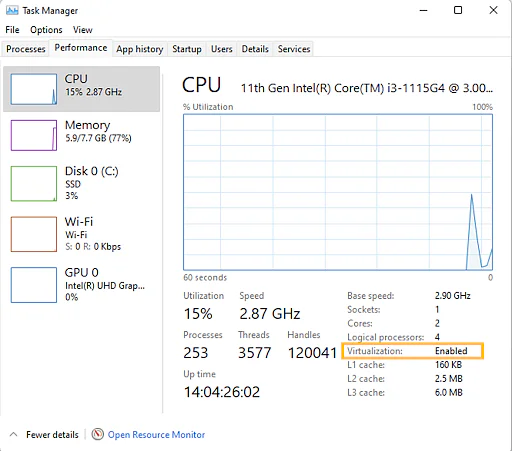

Upgrade WSL 1 To 2
================================
{: .primer-spec-toc-ignore }

To use the tools required in EECS 280, you must use WSL 2.

(Note: these instructions are based on the [instructions from Microsoft](https://learn.microsoft.com/en-us/windows/wsl/install-manual).)

## Prerequisites
Start PowerShell and run it as administrator.  Search for PowerShell in the start menu, then right-click and select "Run as administrator".  


Check your version of WSL.
```console
C:\WINDOWS\system32> wsl -l -v
  NAME      STATE       VERSION
* Ubuntu    Stopped     1
```
{: data-highlight="3"}

If the `VERSION` is set to 2, you do not need to complete this tutorial.

If you see the WSL help text, WSL is not installed. Follow the [WSL Setup tutorial](setup_wsl.html) to install it.
```console
C:\WINDOWS\system32> wsl -l -v
Copyright (c) Microsoft Corporation. All rights reserved.
Usage: wsl.exe [Argument]
...
```

## Upgrade Windows
We recommend Windows 11.  Windows 10 version 2004 build 19041 and higher will also work.  Here's how to [check your Windows version](https://support.microsoft.com/en-us/help/4027391/windows-10-see-which-version-you-have).

Free Windows upgrades are available for UM students via [OnTheHub](https://its.umich.edu/computing/computers-software/software-services/onthehub). If you have an older Windows machine and are not able to upgrade, please reach out to course instructors for assistance.

## Enable Virtualization
TODO(ohjun): instructions are taken from [some random online article](https://www.simplilearn.com/enable-virtualization-windows-10-article) but I am unable to test it (as I do not have a Windows machine)

First, check if virtualization is already enabled.

Open Task Manager by pressing <kbd>Control</kbd>+<kbd>Alt</kbd>+<kbd>Delete</kbd>, then clicking Task Manager.

Go to the Performance tab, and check if virtualization is enabled.



If virtualization is enabled, skip to the [next step](#enable-windows-virtual-machine-platform).

Else, follow the instructions below to enable it.

TODO(ohjun): instructions below are copied word-for-word from the [random online article](https://www.simplilearn.com/enable-virtualization-windows-10-article). Perhaps some screenshots from a Windows machine would be helpful.

Open Windows Settings.

Click on Update and Security.

Go to the Security tab and press <kbd>Enter</kbd> on CPU Setup.

Select Intel(R) Virtualization Technology and press <kbd>Enter</kbd>.

Choose Enable and press <kbd>Enter</kbd>.

Press F10.

Press <kbd>Enter</kbd> to select Yes to save the settings and Boot into Windows.

## Enable Windows Virtual Machine Platform
Start PowerShell as administrator and run:

```console
C:\WINDOWS\system32> dism.exe /online /enable-feature /featurename:VirtualMachinePlatform /all /norestart
```

Restart your computer.

## Download Linux Kernel Update Package
Start PowerShell as administrator.

Check if your computer is a x86 or ARM64 machine.

```console
C:\WINDOWS\system32> systeminfo | find "System Type"
```

If you are on a x86 machine, [click here](https://wslstorestorage.blob.core.windows.net/wslblob/wsl_update_x64.msi) to download the WSL2 Linux kernel update package.

If you are on an ARM64 machine, [click here](https://wslstorestorage.blob.core.windows.net/wslblob/wsl_update_arm64.msi) to download the WSL2 Linux kernel update package.

Double click the downloaded package. Select 'yes' if prompted for elevated permissions.

## Set WSL 2 As Default
Start PowerShell as administrator and run:

```console
C:\WINDOWS\system32> wsl --set-default-version 2
```

TODO(ohjun): Do they have to uninstall their previous WSL then reinstall it now? Or if they installed WSL 1 before, does running `wsl --set-default-version 2` automatically update their installed version?

## Acknowledgments
Original document written by Andrew DeOrio awdeorio@umich.edu and Oh Jun Kweon ohjun@umich.edu.

This document is licensed under a [Creative Commons Attribution-NonCommercial 4.0 License](https://creativecommons.org/licenses/by-nc/4.0/). You’re free to copy and share this document, but not to sell it. You may not share source code provided with this document.
